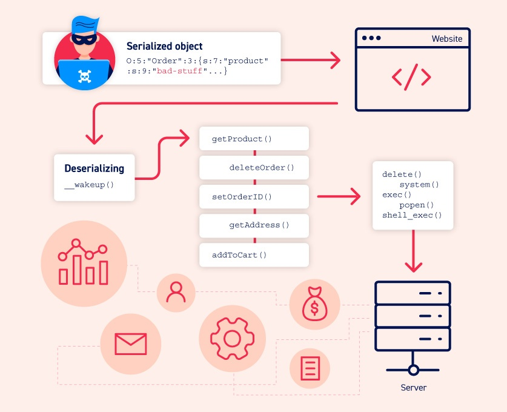
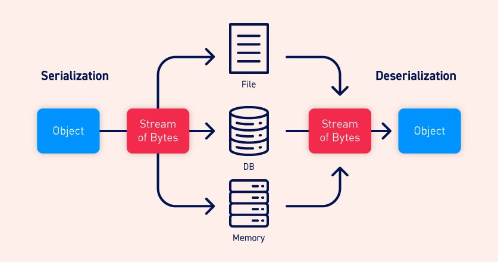
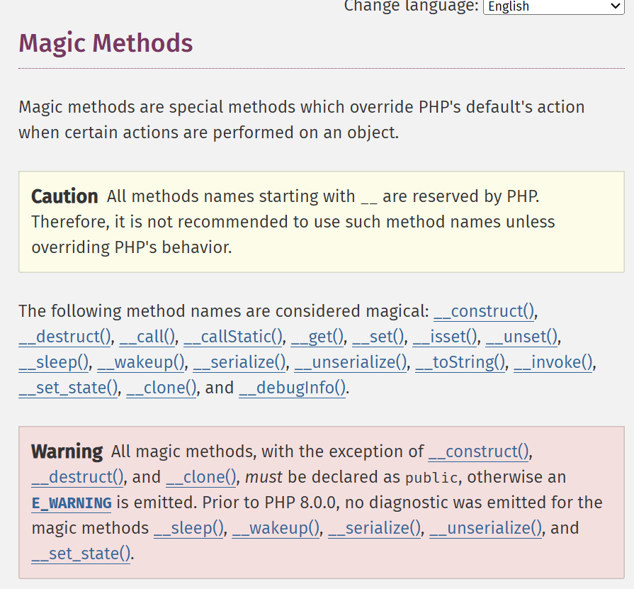

# Insecure Deserialization
Ở module này chúng ta sẽ tìm hiểu đến việc giải mã dữ liệu không an toàn và mô tả các trang web dễ bị tấn công nghiêm trọng. <br>
Cụ thể và giải mã dữ liệu trong PHP, Ruby và Java. 

## serialization là gì?
Tuần tự hóa là quá trình chuyển đổi các cấu trúc dữ liệu phức tạp chẳng hạn các đối tượng các trường của chúng thành định dạng phẳng hơn dưới một luồng byte. <br>
> Ghi dữ liệu phức tạp vào bộ nhớ giữa các tiến trình, tệp hoặc cơ sở dữ liệu <br>
> Gửi đữ liệu phức tạp <br>
| Lưu ý: <br>
KHi tuần tự hóa một đối tượng trạng thái của nó cũng được lưu giữ. Nói cách khác các thuộc tính của đối tượng được bảo toàn, cùng với các giá trị được gán cho chúng <br>
## Serialization vs deserialization
Chúng ta có thể được hiểu như sau tuần tự hóa là quá trinfhh chuyển đổi các đối tượng thành các luồng byte để lưu vào cơ sở dữ liệu và ngược lại giải mã dữ liệu là quá trình khôi phục luồng byte về trạng thái đối tượng ban đầu.

## Giải mã dữ liệu không an toàn là sao?
Là giải mã dữ liệu không an toàn xay ra khi dữ liệu do người dùng kiểm soát được giải mã bởi một trang web.<br>
Và điều này tiềm ẩn nguy cơ cho phép kẻ tấn công thao túng các đối tượng đã được mã hóa để truyền dữ liệu độc hại vào ứng dụng.
## Root-cause dẫn đến giải mã dữ liệu không an toàn hệ thống
Hệ thống luôn tin tưởng đầu vào của người dùng và nên được giải mã. Không xác thực hoặc làm sạch dữ liệu để xử lý mọi trường hợp có thể xảy ra. <br>
Các lỗ hổng cũng có thể phát sinh vì các đối tượng được giải mã thường được cho là đáng tin cậy. Đặc biệt khi sử dụng các ngôn ngữ có định dạng tuần tự hóa nhị phân.
## Tác động của việc giải mã dữ liệu không an toàn
Nó xảy ra rất nghiêm trọng nó tạo ra điểm yếu giúp mở rộng đáng kể bề mặt tấn công. Cho phép kẻ tấn công tái sử dụng mã ứng dụng hiện có dẫn đến thực thi mã từ xa RCE hoặc leo thang đặc quyền truy cập tệp tùy ý và các cuộc tấn công DDOS
## Cách khai thác các lỗ hổng giải mã dữ liệu không an toàn
### Cách nhận biết quá trình giải mã dữ liệu không an toàn
> Việc xác định lỗi giải mã dữ liệu không an toàn tương đối đơn giản bất kể bạn đang thực hiện kiểm thử hộp trắng hay hộp đen. <br>
> Trong quá trình kiểm toán, bạn nên xem xét tất cả dữ liệu được truyền vào trang web và cố gắng xác định bất kỳ dữ liệu nào trông giống như dữ liệu được tuần tự hóa. Dữ liệu được tuần tự hóa có thể được xác định tương đối dễ dàng nếu bạn biết định dạng mà các ngôn ngữ khác nhau sử dụng. Trong phần này, chúng ta sẽ trình bày các ví dụ về tuần tự hóa trong cả PHP và Java. Sau khi xác định được dữ liệu được tuần tự hóa, bạn có thể kiểm tra xem mình có thể kiểm soát nó hay không. <br>
## Định dạng tuần tự hóa PHP
PHP sử dụng định dạng chuỗi dễ đọc đối với con người trong đó các chữ cái đại điện cho từng kiểu dữ liệu và độ dài của mỗi phần tử. 
```php
$user->name = "carlos";
$user->isLoggin = true;
```
Khi được tuần tự hóa đối tượng sẽ như thế này
```php
O:4:"User":2:{s:4:"name":s:6:"carlos";s:10:"isLoggedIn":b:1;}
```
Điều này được hiểu như sau: <br>
> O:4:"User" -> Mỗi đối tượng có tên lớp gồm 4 ký tự "User" <br>
> 2 -> Đối tượng có 2 thuộc tính <br>
> s:4:"name":s:6:"carlos";s:10:"isLoggedIn" được hiểu là số lượng từng string <br>
> b: 1 -> Được hiểu như giá trị boolean true or false <br>
Các phương thức gốc của PHP để tuần tự hóa dữ liệu là `<string>` `serialize()` và `<string>` `unserialize()` <br>
## Định dạng tuần tự hóa Java
Định dạng Java sử dụng định dạng tuần tự hóa nhị phân và các đối tượng Java được tuần tự hóa luôn bắt đầu bằng cùng một nhóm byte được mã hóa `ac ed` dạng thập lục phân và `rO0 Base64` <br>
Hàm tuần tự hóa Java `java.io.Serializable` đều có thể tuần tự hóa và giải tuần tự hóa. `readObject()` phương thức này dùng để đọc và giải tuần tự hóa dữ liệu từ đối tượng `InputStream`.
### Sửa đổi kiểu dữ liệu
Logic dựa trên PHP đăc biệt dễ bị tổn thương bởi toán tử so sánh lỏng leo (`==`) khi so sánh các kiểu dữ liệu khác nhau. <br>
Giả sử so sánh giữa 1 số nguyên và chuỗi như sau: 
```
5 == "5"
```
Lúc này `PHP 7.x` trở xuống phiên bản cũ nó có lỗ hổng chuyển đổi chuỗi thành 1 số nguyên có nghĩa `5=5 -> true`
## Sử dụng chức năng của ứng dụng
Đôi khi kiểm tra giá trị thuộc tính, chức năng của trang web cũng cs thể thực hiện được thao tác nguy hiểm trên dữ liệu từ một đối tượng đã được giải mã.
Giả sử như chức năng xóa người dùng của trang web bằng cách truy cập đường dẫn tệp <br>
```php
$user->image_location
```
Nếu ảnh được tạo từ một đối tượng tuần tự hóa kẻ tấn công có thể khai thác lỗ hổng bằng cách truyền vào đối tượng sửa đổi và đặt đường dẫn `image_location` độc hại.
## Phương pháp ma thuật
Phương pháp ma thuật là một tập hợp con đặc biệt của các phương thức mà chúng ta không cần gọi rõ ràng <br>
Các nhà phát triển có thể thêm các phương thức ma thuật vào lớp để xác định được trước đoạn mã nào sẽ được thực thi khi sự kiện xảy ra. <br>
Theo tôi biết có tất cả `17 magic` và phổ biến PHP là `component()` `__constructor` được gọi bất cứ khi nào đối tượng của lớp được khởi tạo và `component()` của Python `__init__`. Thông thường các phương thức ma thuật như vậy sử dụng để khởi tạo các thuộc tính của đối tượng.

```text
Warning
If type declarations are used in the definition of a magic method, they must be identical to the signature described in this document. Otherwise, a fatal error is emitted. Prior to PHP 8.0.0, no diagnostic was emitted. However, __construct() and __destruct() must not declare a return type; otherwise a fatal error is emitted.
```
Quan trọng một số ngôn ngữ có các phương thức đặc biệt tự động trong quá trình giải mã dữ liệu. `unserialize()` phương thức của PHP tìm kiếm và gọi `__wakeup()` phương thức đặc biệt của một đối tượng. <br>
Trong quá trình giải mã dữ liệu java, điều tương tự áp dụng cho `ObjectInputStream.readObject()` phương thức được sử dụng để đọc dữ liệu luồng byte ban đầu và thực hiện như một hàm tạo để khởi tạo lại. <br>
Phương thức `Serializable` các lớp cũng có thể khai báo phương thức riêng của chúng `readObject()` <br>
```java
private void readObject(ObjectInputStream in) throws IOException, ClassNotFoundException
{
    // implementation
}
```
## Công cụ được xây dựng sẵn 
### ysoserial
Một công cụ để giải mã dữ liệu Java là `ysoserial` cho phép chúng ta chọn một trong các chuỗi gadget được cung cấp cho thư viện mà cho rằng mục tiêu đang sử dụng, sau đó truyền vào lệnh chúng ta muốn thực thi.
### Ghi chú quan trọng
```
Trong các phiên bản Java 16 trở lên, bạn cần thiết lập một loạt các đối số dòng lệnh để Java chạy ysoserial. Ví dụ:
```
```java
java -jar ysoserial-all.jar \
   --add-opens=java.xml/com.sun.org.apache.xalan.internal.xsltc.trax=ALL-UNNAMED \
   --add-opens=java.xml/com.sun.org.apache.xalan.internal.xsltc.runtime=ALL-UNNAMED \
   --add-opens=java.base/java.net=ALL-UNNAMED \
   --add-opens=java.base/java.util=ALL-UNNAMED \
   [payload] '[command]'
```
## Chuỗi tiện ích chung PHP
Đôi khi các lỗ hổng thường xuyên gặp phải các lỗ hổng bảo mật trong quá trình giải mã dữ liệu. <br>
Đối với các trang web dựa trên PHP, có thể sử dụng `PHPGCC (PHP Generic Gadget Chains)`.
## Giải mã tệp PHAR
Chúng ta chủ yêu xem xét việc khai thác các lỗ hổng giải mã dữ liệu (`Deserialization`) khi trang web thực hiện việc giải mã dữ liệu đầu vào của người dùng <br>
Và trong PHP chúng ta có thể khai thác lỗ hổng giải mã dữ liệu ngay cả khi không có cách sử dụng nào `unserialize()`  <br>
PHP cung cấp một số trình bao bọc kiểu URL mà chúng ta có thể sử dụng để xử lý các giao thức khác nhau và một trong số đó là tệp bao bọc `phar://` cung cấp giao diện để truy cập các tệp Archive (`.phar`). <br>
> Theo tài liệu PHP nói như sau tệp manifest `PHAR` chứa siêu dữ liệu được tuần tự hóa. Nếu thực hiện bất kỳ thao tác hệ thống tệp nào trên `phar://` luồng dữ liệu, siêu dữ liệu này nó cói như trình giải mã dữ liệu tuần tự hóa <br>
Các phương pháp hệ thống tệp tin rõ ràng là nguy hiểm như `include()` hay `fopen()` và tuy nhiên các phương pháp `file_exists()` không quá nguy hhiemer, có thể không được bảo vệ tốt. <br>
Miễn là lớp của đối tượng được trang web hỗ trợ, cả hai `__wakeup()` hay `__destruct()`
Giả sử: <br>
Sử dụng `phar://` trình bao bọc, người ta có thể kích hoạt quá trình giải mã dữ liệu trên tệp được chỉ định `file_get_contents("phar://./archives/app.phar")` <br>
Một PHAR hợp lệ bao gồm bốn yếu tố: <br>
> 1. Đoạn mã mẫu (Stub): Đoạn mã mẫu là một khối mã PHP được thực thi khi tệp được truy cập trong ngữ cảnh thực thi. Tối thiểu, đoạn mã mẫu phải chứa một phần tử `__HALT_COMPILER(); <Phar>` ở cuối. Ngoài ra, không có hạn chế nào về nội dung của một đoạn mã mẫu Phar. <br>
> 2. Manifest: Chứa siêu dữ liệu về kho lưu trữ và nội dung của nó. <br>
> 3. File Contents: Chứa các tệp thực tế trong kho lưu trữ. <br>
> 4. Signal: Để xác minh tính toàn vẹn của kho lưu trữ. <br>
<br>

Giả sử tạo Phar khai thác thủ thuật tùy chỉnh từ `PHPGenerate` <br>
<a href="./phar.php">Mã Nguồn Ở Đây</a>

## Ngăn ngừa lỗ hổng
Nhìn chung, nên tránh việc giải mã dữ liệu đầu vào của người dùng trừ khi thực sự cần thiết. Mức độ nghiêm trọng của các lỗ hổng bảo mật mà phương pháp này có thể tạo điều kiện và khó khăn trong việc phòng chống chúng thường lớn hơn lợi ích mang lại trong nhiều trường hợp. <br>
Nếu bạn cần giải mã dữ liệu từ các nguồn không đáng tin cậy, hãy áp dụng các biện pháp mạnh mẽ để đảm bảo dữ liệu không bị giả mạo. Ví dụ, bạn có thể triển khai chữ ký số để kiểm tra tính toàn vẹn của dữ liệu. Tuy nhiên, hãy nhớ rằng mọi kiểm tra phải được thực hiện trước khi bắt đầu quá trình giải mã. Nếu không, chúng sẽ không có nhiều tác dụng. <br>

