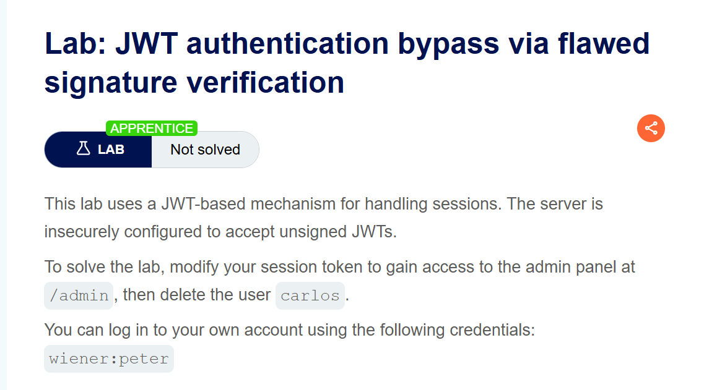
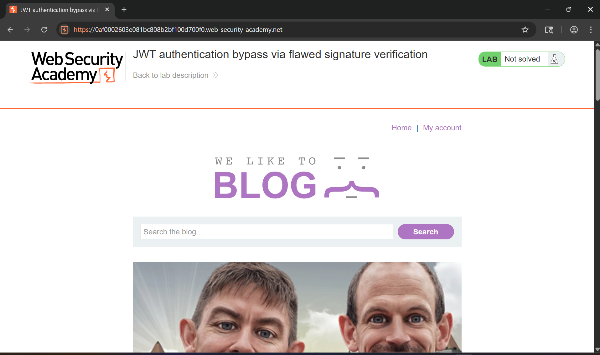
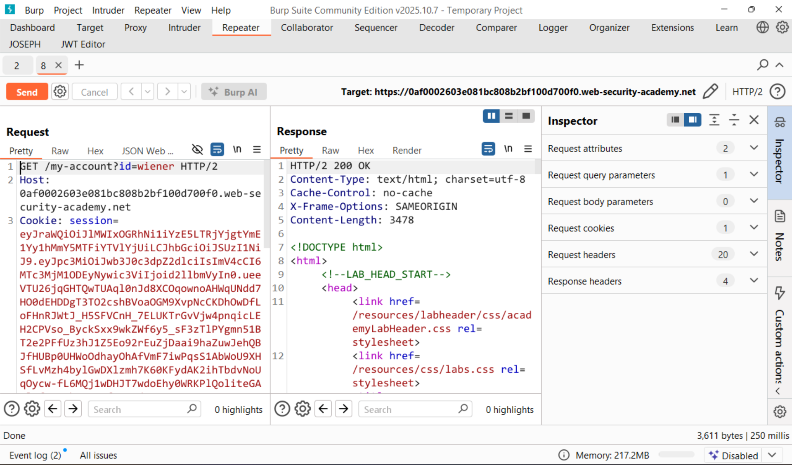
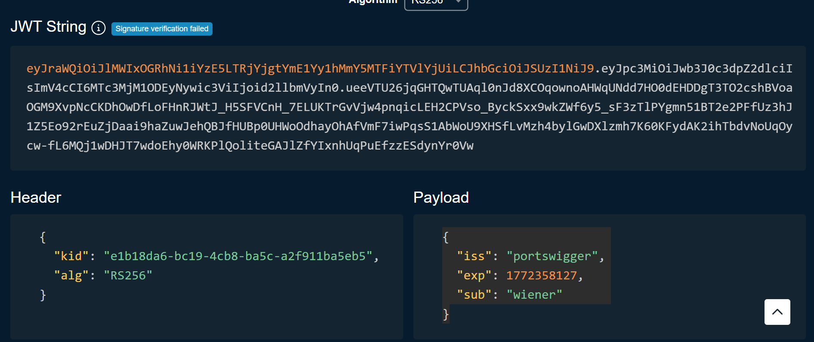
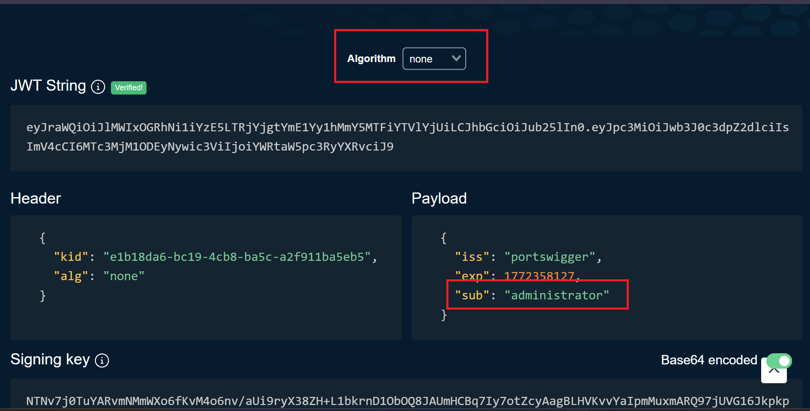
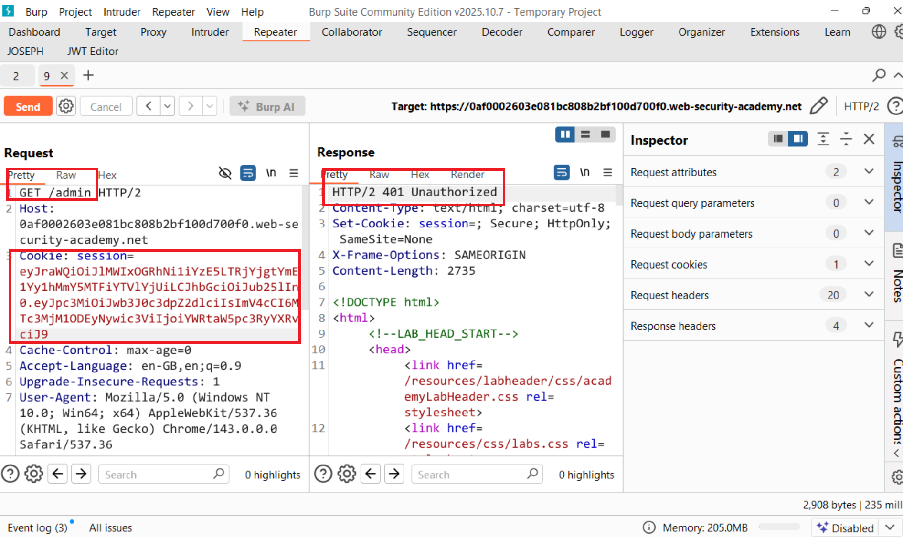
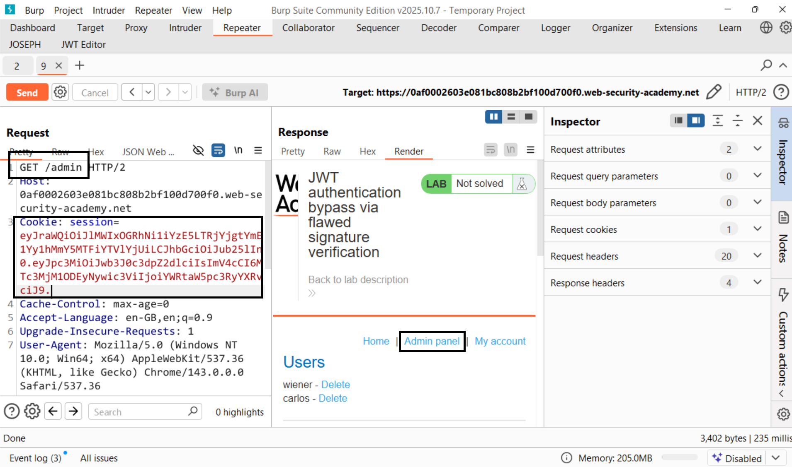
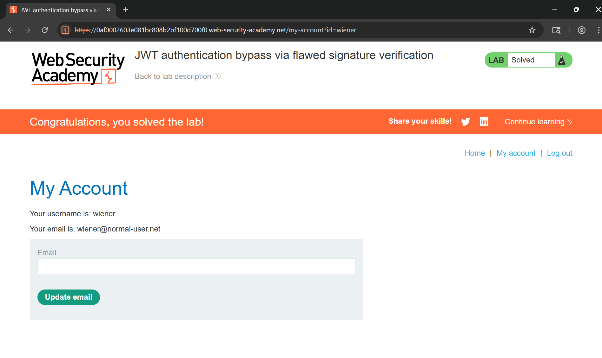

# Writeup LAB: JWT authentication bypass via flawed signature verification

## Goal
To solve the lab, modify your session token to gain access to the admin panel at /admin, then delete the user carlos.
## Khai thác
Trang chủ

Chúng ta cùng đăng nhập với tài khoản `wiener:peter`. Lịch sử HTTP Burp cho thấy

Ở đây chúng ta có được mã token giải mã token

Và với mục tiêu bài LAB này chúng ta cần truy cập vào admin xóa user calos chúng ta có thể làm cách nào vâng ở với token may mắn răng.
> JWT có thể được ký bằng nhiều thuật toán khác nhau, nhưng cũng có thể không được ký. Trong trường hợp này, tham số alg có thể được đặt thành none cùng thực hiện. <br>

Cùng thực hiện gửi token mới với quyền truy cập /admin như sau

Nhưng tại sao lại không xác thực chúng ta cùng lùi lại bước liệu token chúng ta không chuẩn quy tắc và đúng là token chúng ta thiếu bởi vì token chúng ta cần 3 tham số: header, payload, signal mỗi phần được phân tách thành dấu chấm vậy token hợp lệ chúng ta như sau:
```token
eyJraWQiOiJlMWIxOGRhNi1iYzE5LTRjYjgtYmE1Yy1hMmY5MTFiYTVlYjUiLCJhbGciOiJub25lIn0.eyJpc3MiOiJwb3J0c3dpZ2dlciIsImV4cCI6MTc3MjM1ODEyNywic3ViIjoiYWRtaW5pc3RyYXRvciJ9.
```
Cùng thực hiện gửi lại request với token hợp lệ và lúc này chúng ta đã vào được admin

Thực hiện xóa user và hoàn thành LAB
