# WRiteup LAB JWT authentication bypass via jku header injection
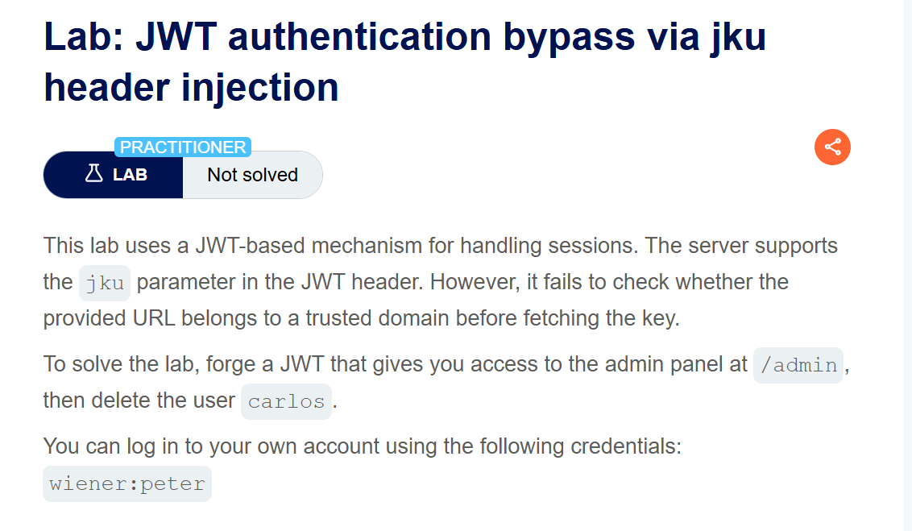
## Goal
To solve the lab, forge a JWT that gives you access to the admin panel at /admin, then delete the user carlos.
## Khai thác
Đăng nhập với user wiener
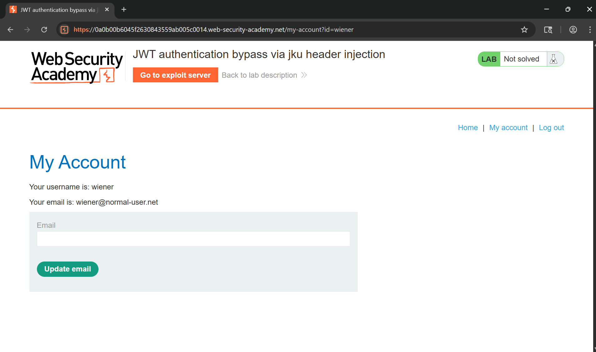
Lịch sử Burp Suite
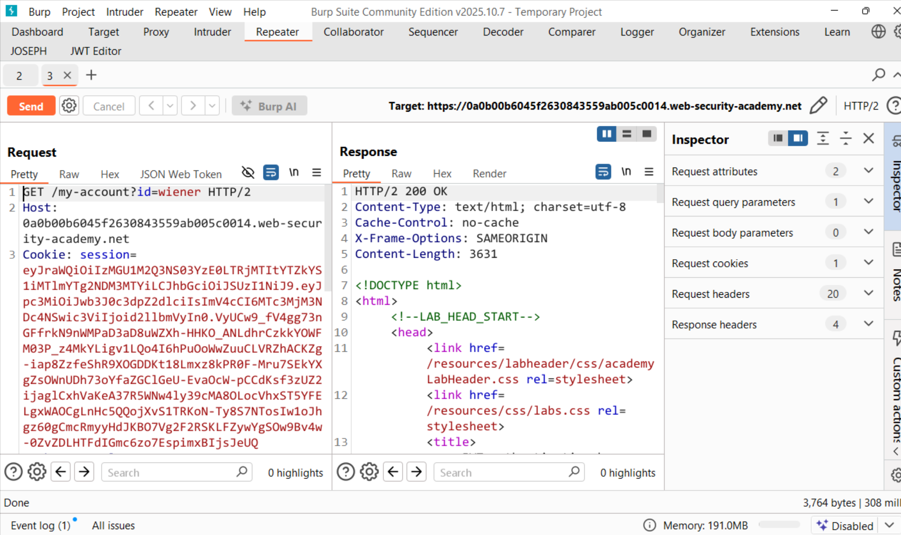
Trong các bài thực hành trước, chúng ta đã thấy rằng cookie phiên sử dụng JWT (JSON Web Token) để quản lý phiên. <br>
Thực hiện sao sao chép và dán chuỗi vào <a href="https://token.dev/">token.dev</a> một công cụ trực tuyển để giải mã token
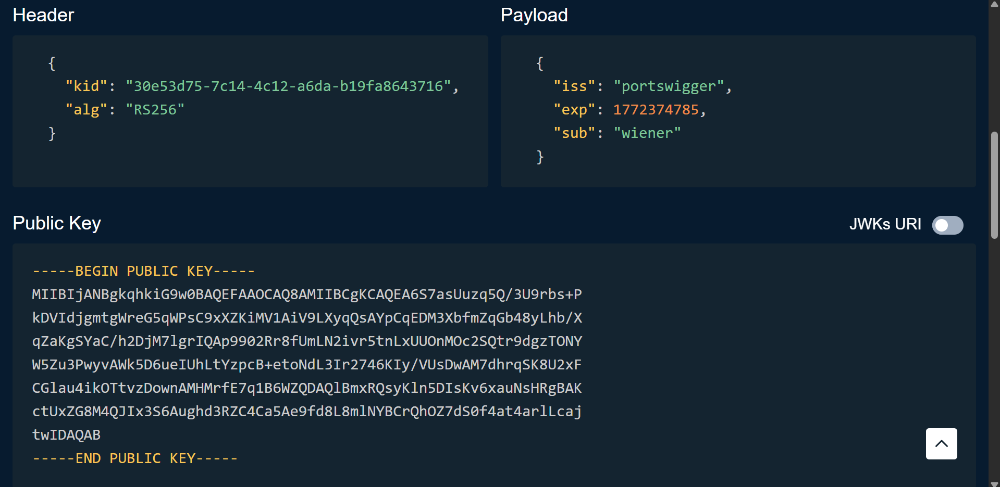
Như bạn thấy, trong phần tiêu đề `alg` nó cho chúng ta biết nó đang sử dụng thuật toán RS256 (RSA + SHA-256). <br>
Trong phần giới thiệu của PortSwigger có nói đến: <br>
> Thay vì nhúng trực tiếp khóa công khai bằng jwktham số tiêu đề, một số máy chủ cho phép bạn sử dụng jkutham số tiêu đề (URL Bộ JWK) để tham chiếu đến một Bộ JWK chứa khóa. Khi xác minh chữ ký, máy chủ sẽ lấy khóa liên quan từ URL này. <br>
Để tận dụng điều đó chúng ta cần làm 2 việc như sau:
> Tải lên JWK độc hại <br>
Tạo cặp khóa RSA mới như cũ:
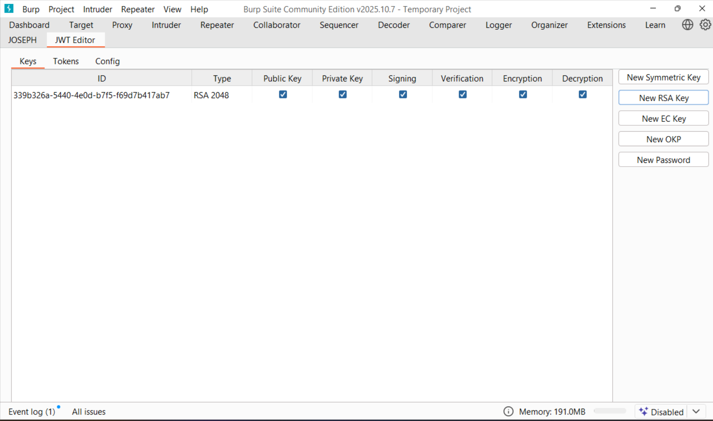
Tiếp theo truy cập máy chủ khai thác lỗ hổng và tạo một JWK trống:
```json
{
    "keys": [

    ]
}
```
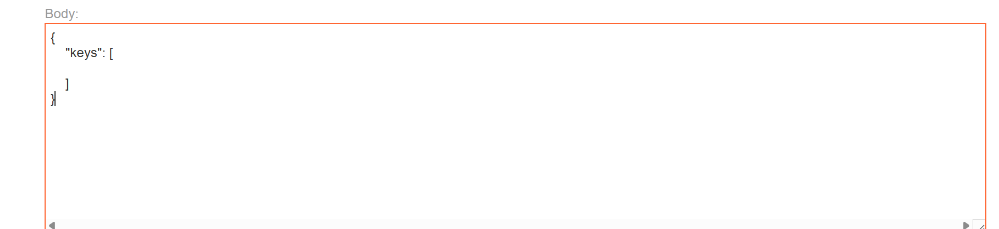
Sau đó sao chép giá trị công khai:
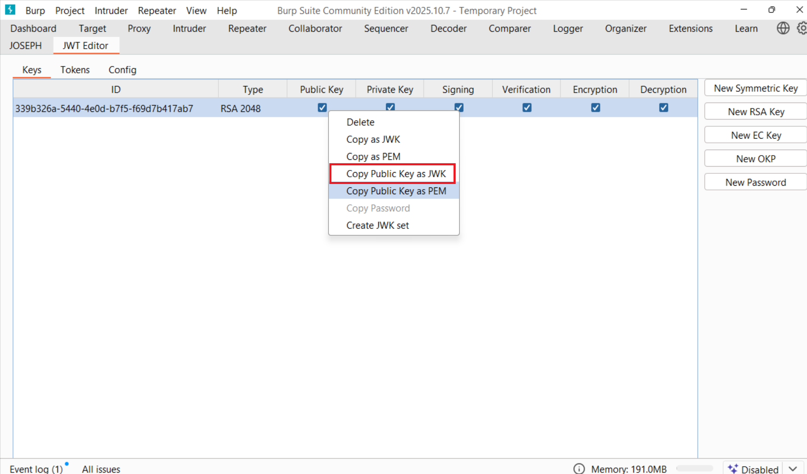
Thực hiện dán vào keys trên máy chủ khai thác, sau đó lưu trữ mã khai thác
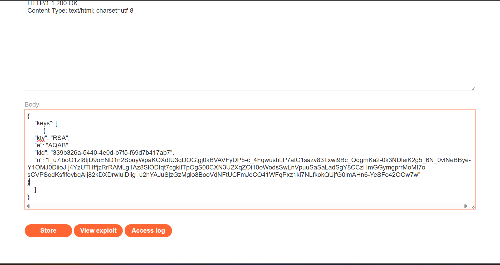
Quay lại Burp Repeater và chuyển sang tab trình chỉnh sửa tin nhắn JSON Web Token do tiện ích mở rộng tạo ra:
Trong phần tiêu đề của JWT, hãy thay thế giá trị hiện tại của kidtham số bằng giá trị kidcủa JWK mà bạn đã tải lên máy chủ khai thác:
```json
{
    "kid": "30e53d75-7c14-4c12-a6da-b19fa8643716",
    "alg": "RS256"
}
```
Thêm một jku tham số mới vào phần tiêu đề của JWT. Đặt giá trị của tham số đó thành URL của JWK của bạn. Thiết lập trên máy chủ khai thác:
```json
{
    "kid": "30e53d75-7c14-4c12-a6da-b19fa8643716",
    "alg": "RS256",
    "jku": "https://exploit-0a0100a3041d263b84b358ce01040079.exploit-server.net/exploit.json"
}
```
Tiếp theo thay sub thành giá trị `administrator`
Ở cuối tab, nhấp vào Ký, sau đó chọn khóa RSA mà bạn đã tạo ở phần trước:
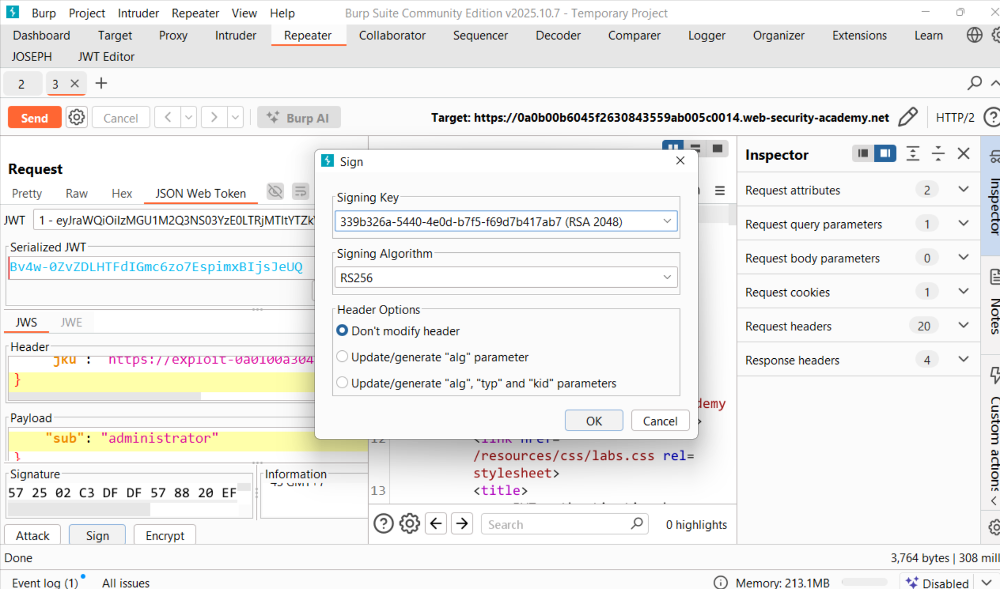
Và lúc này chúng ta đã vào được trang admin
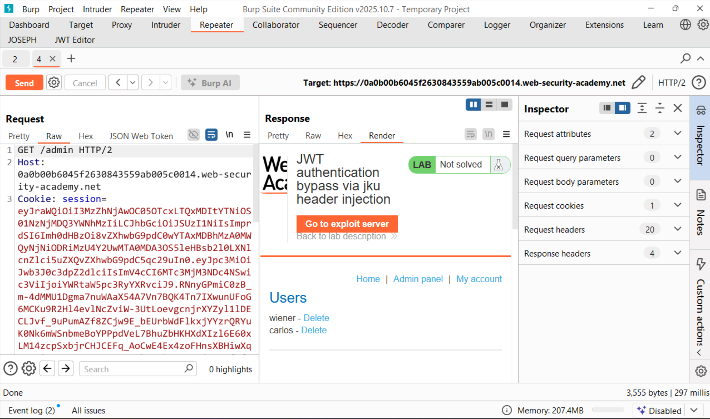
Thực hiện xóa user carlos và hoàn thành LAB
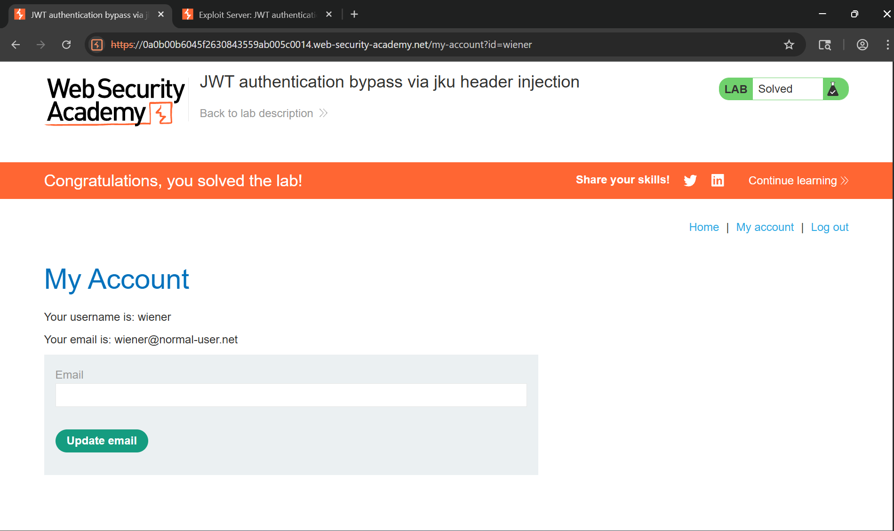