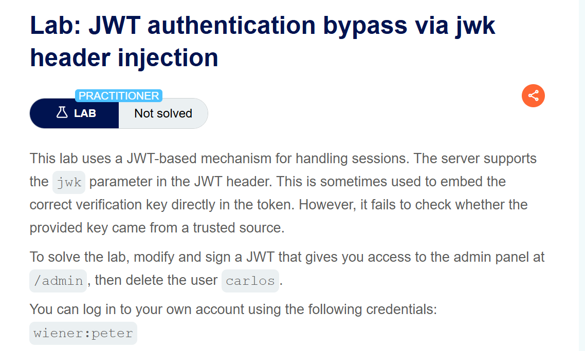
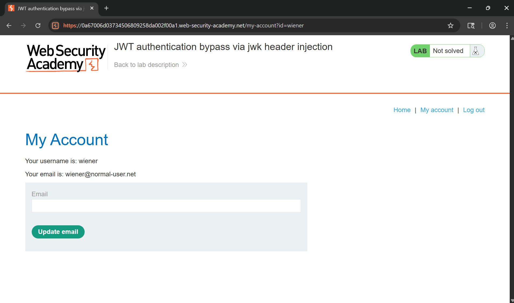
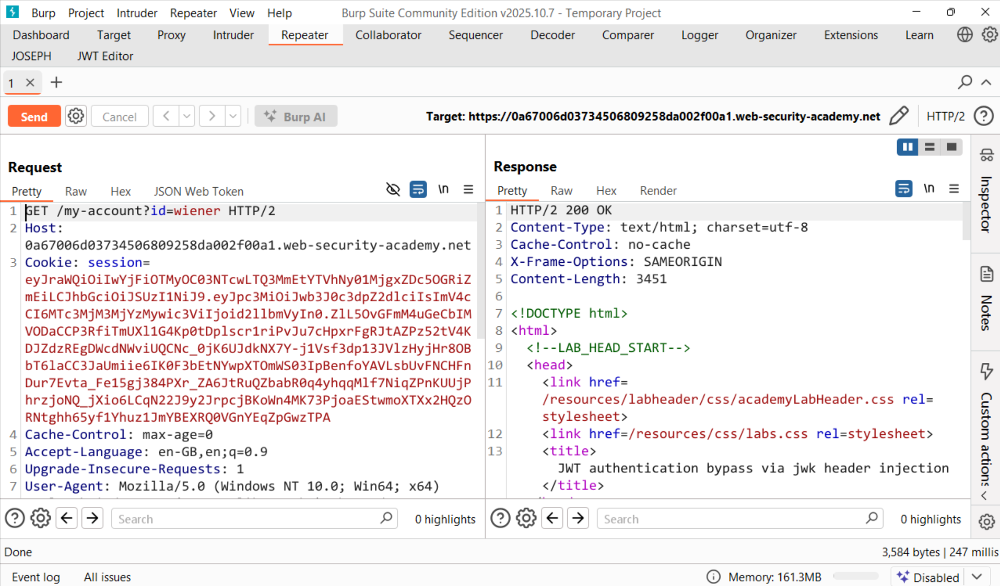
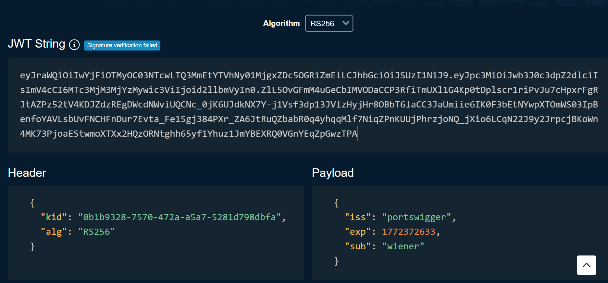
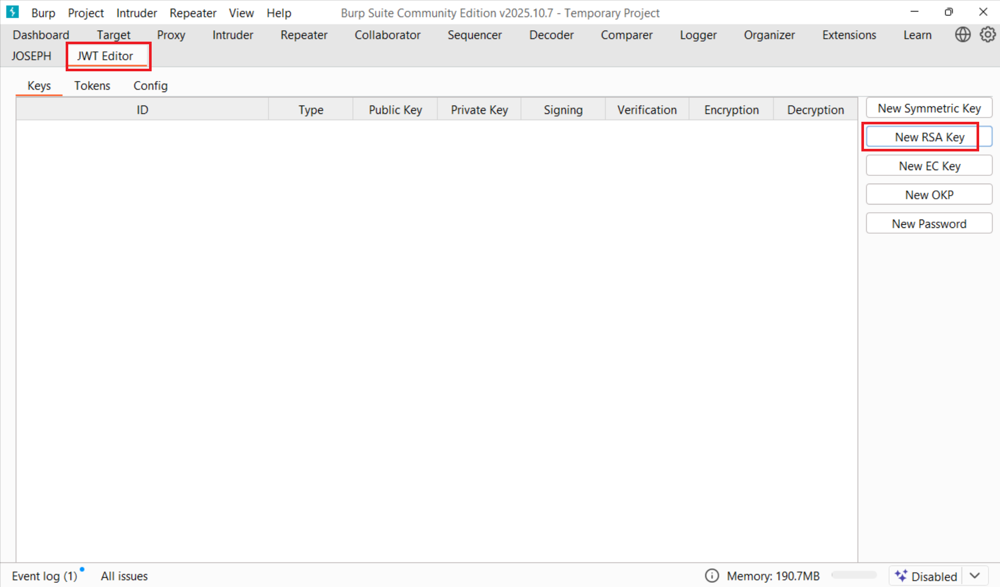
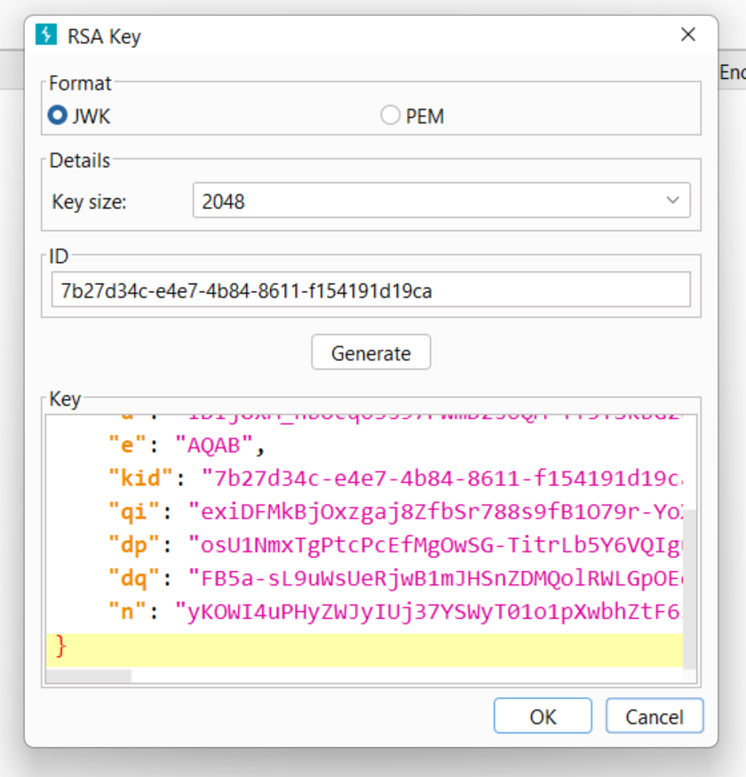
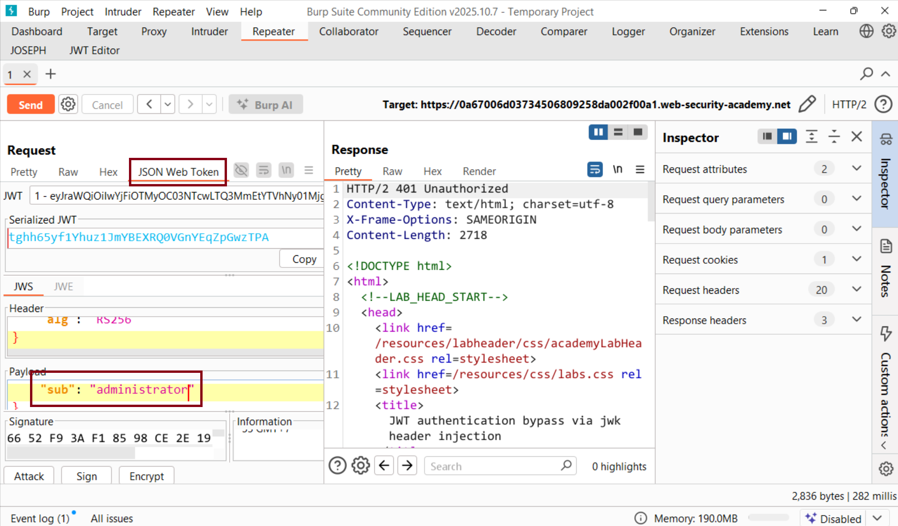
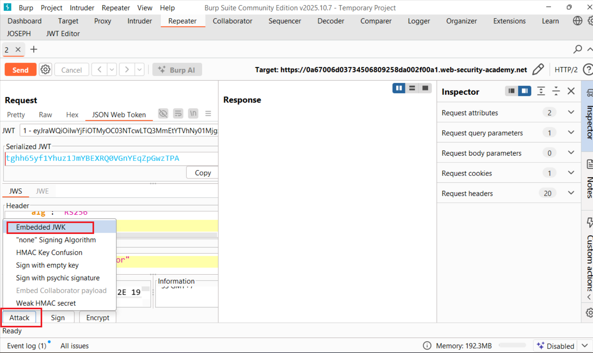
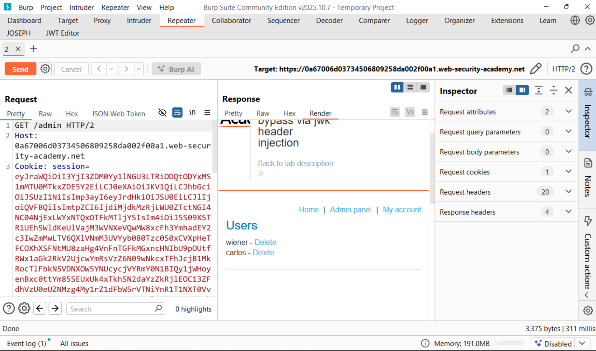
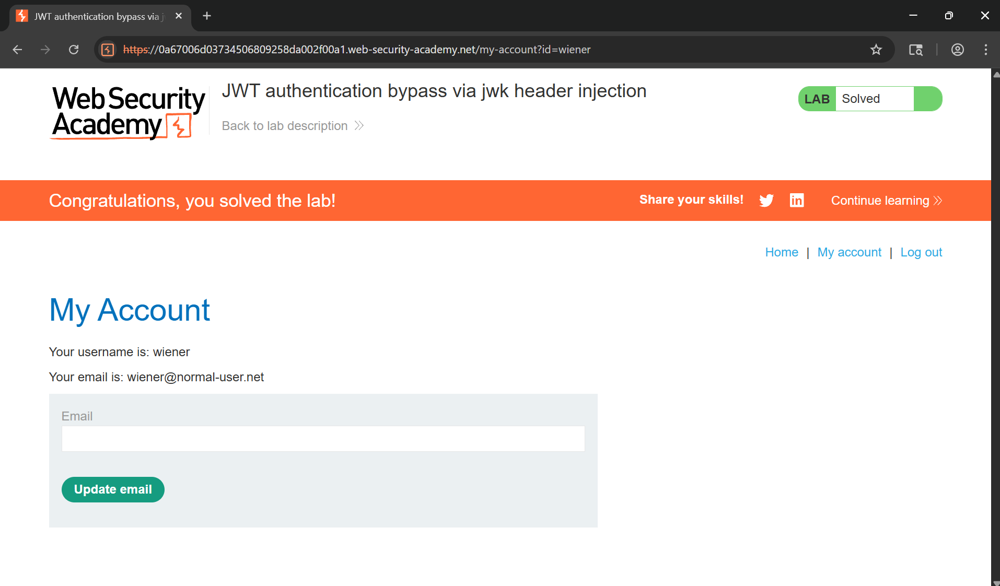

# Writeup LAB JWT authentication bypass via jwk header injection

## Goal
To solve the lab, modify and sign a JWT that gives you access to the admin panel at /admin, then delete the user carlos.
## Khai thác
Cùng đăng nhập vào tài khoản `wiener:peter`

Trong các bài thực hành trước, chúng ta đã thấy rằng cookie phiên sử dụng JWT (JSON Web Token) để quản lý phiên.

Thực hiện sao sao chép và dán chuỗi vào <a href="https://token.dev/">token.dev</a> một công cụ trực tuyển để giải mã token

Như bạn thấy, trong phần tiêu đề `alg` nó cho chúng ta biết nó đang sử dụng thuật toán RS256 (RSA + SHA-256).  
Trong phần giới thiệu của PortSwigger có nói đến:  
> Máy chủ hỗ trợ tham số `jwk` (JSON Web Key) trong tiêu đề JWT. Điều này đôi khi sử dụng để nhúng trực tiếp khóa xác minh chính xác vào mã thông báo. Tuy nhiên nó không kiểm tra xem khóa được cung cấp có đến từ nguồn đáng tin cậy hay không  
Để khai thác điều đó, chúng ta có thể ký một JWT đã được sửa đổi bằng khóa riêng RSA của bạn, sau đó nhúng khóa công khai tương ứng vào phần tiêu đề `jwk`
Tạo cặp khóa RSA mới

Thực hiện sửa đổi user thành admin

Và lúc này chúng ta có thể vào được trang quản trị

Thực hiện xóa user carlos hoàn thành LAB
