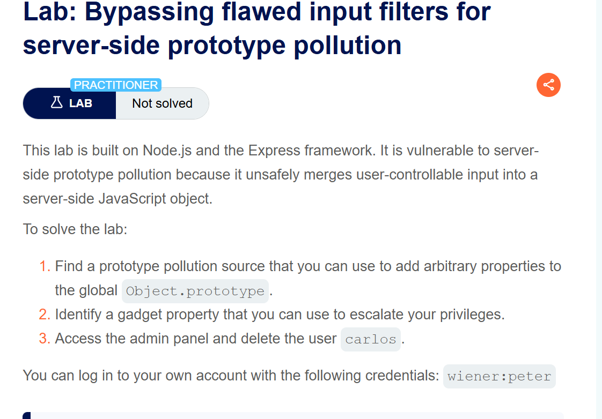
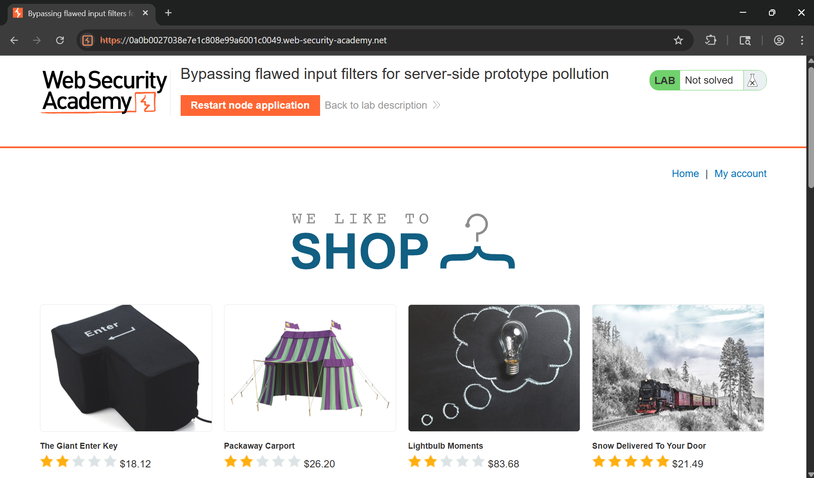
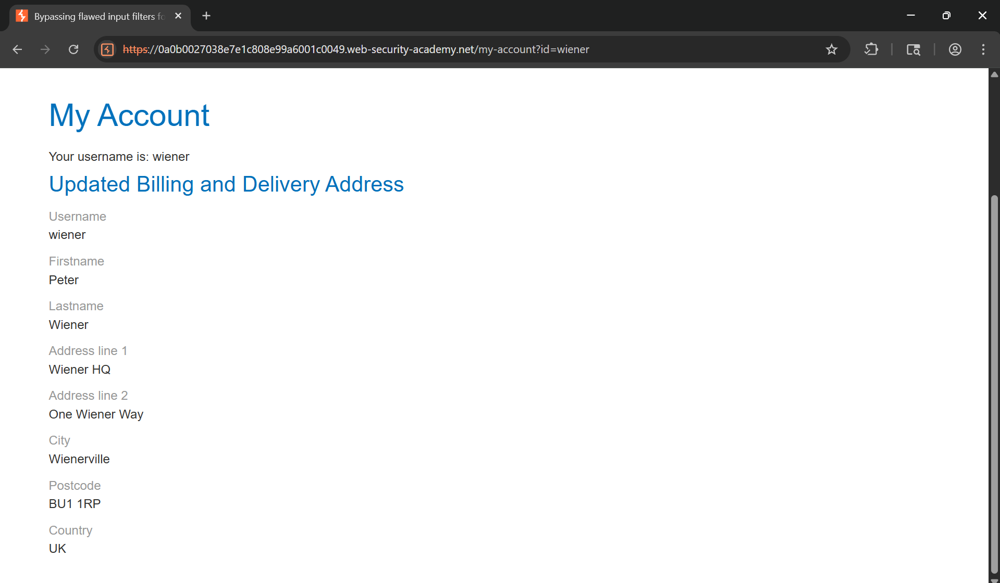
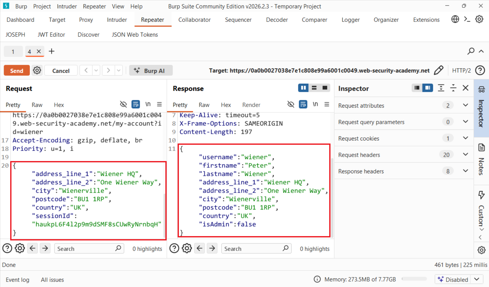
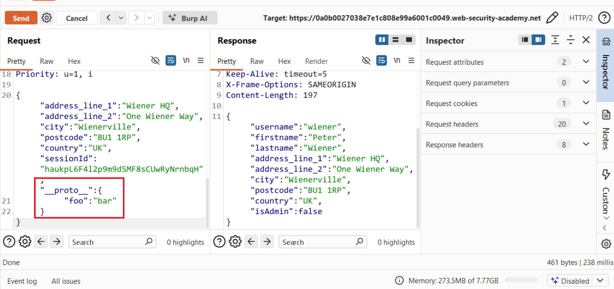
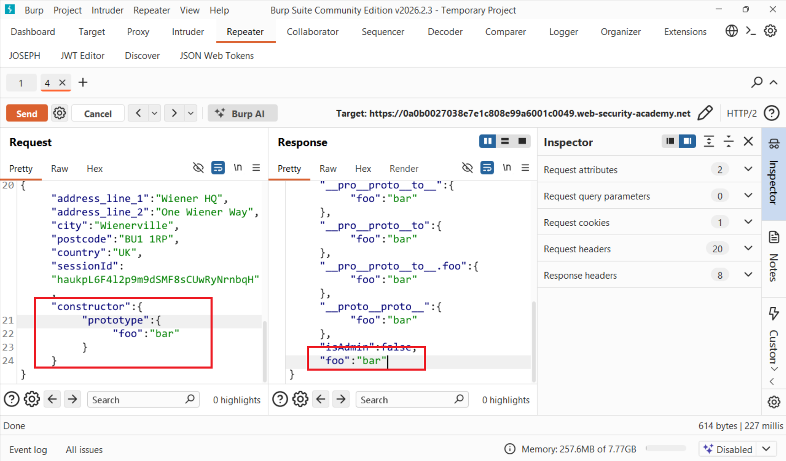
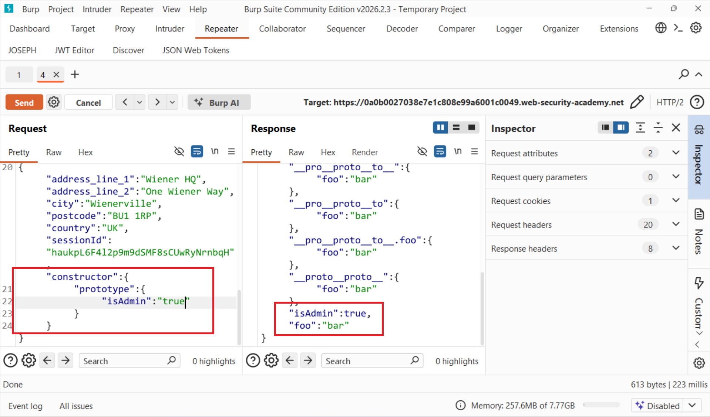
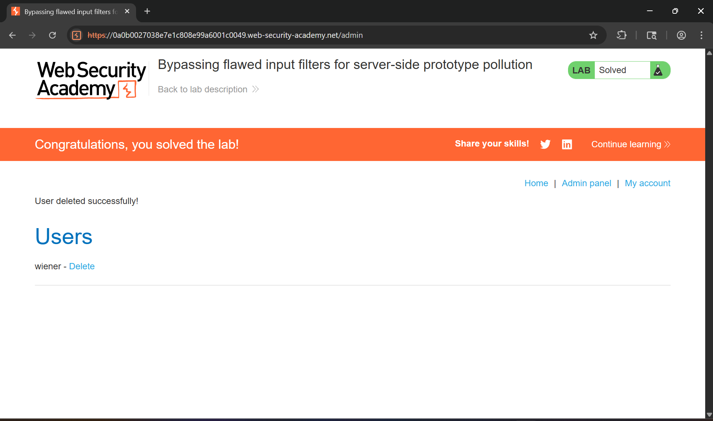

# Writeup LAB Bypassing flawed input filters for server-side prototype pollution

## Goal
Access the admin panel and delete the user `carlos`.
## Khai thác bỏ qua các bộ lọc đầu vào để ngăn chặn sự xâm phạm nguyên mẫu phía máy chủ.
Theo tài liệu PortSwigger cho biết: <br>
Các trang web thường cố gắng ngăn chặn lọc các từ khóa đáng ngờ như `__proto__` nhưng phương pháp này có thể dễ dàng bỏ qua. Các ứng dụng Node cũng có thể xóa hoặc vô hiệu hóa `__proto__` hoàn toàn bằng cách sử dụng các cơ dòng lệnh `--disable-proto=delete`. Và điều này cũng có thể bỏ qua bằng cách sử dụng hàm tạo.
Trang chủ

Thực hiện đăng nhập vào `wiener:peter` và ở đây có biểu mẫu chúng ta thực hiện submit biểu mẫu của wiener

Lịch sử HTTP Burp

Và ở đây chúng ta có thể thấy là có trường admin được set false vậy mục tiêu bây giờ chúng ta cần làm ô nhiễm nguyên mẫu để ghi đè thuộc tính set admin thành true để leo thang đặc quyền. <br>
Chúng ta cùng thử tải trọng:
```js
"__proto__":{
    "foo":"bar"
}
```

Chúng ta có thể mẫu chúng ta không được ghi đè có lẽ ứng dụng đã lọc qua từ khóa `__proto__` nguy hiểm nhưng chúng ta có thể bỏ qua bằng cách xây dựng hàm tạo như sau:
```json
"constructor":{
    "prototype":{
        "foo": "bar"
    }
}
```
Mọi đối tượng javascript đều có 1 con structor thuộc tính chứa tham chiếu đến hàm tạo được sử dụng tạo ra nó. Và hãy nhớ rằng hàm tạo đều có một đối tượng `prototype` thuộc tính, trỏ đến nguyên mẫu sẽ được gán bất kỳ đối tượng nào khởi tạo bởi hàm tạo đó. <br>
Và lúc này chúng ta đã ghi đè được mẫu ô nhiễm tham số thông qua `constructor`

Bây giờ chúng ta có thể set leo thang đặc quyền thành Admin bằng tải trọng cuối cùng: <br>
```json
"constructor":{
    "prototype":{
        "isAdmin": "true"
    }
}
```

Quay trở lại trang wiener reload chúng ta đã trở thành admin và thực hiện xóa người dùng `carlos`
