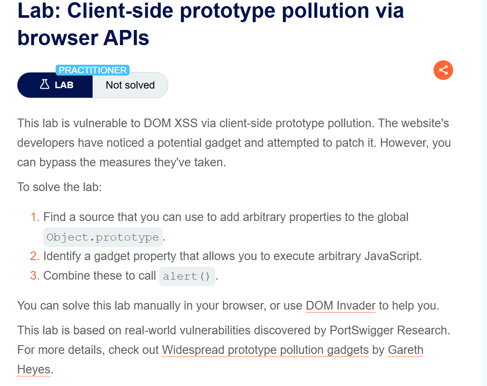
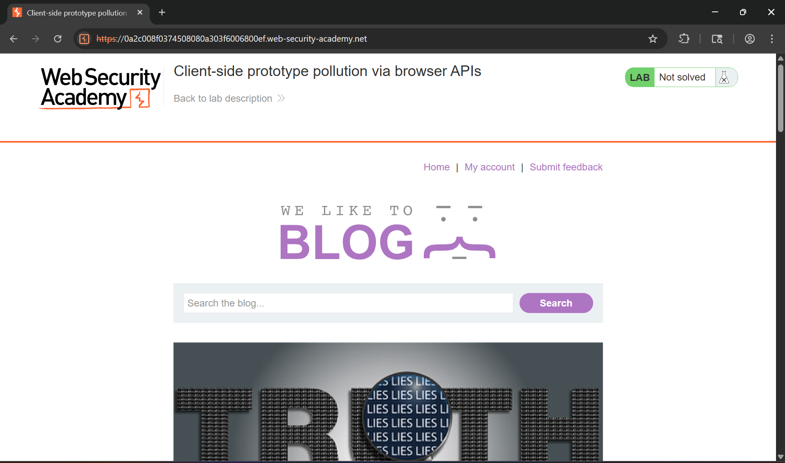
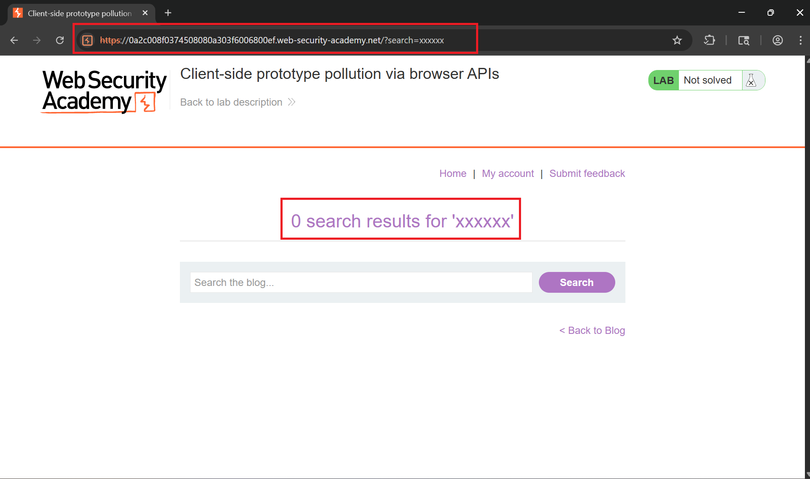
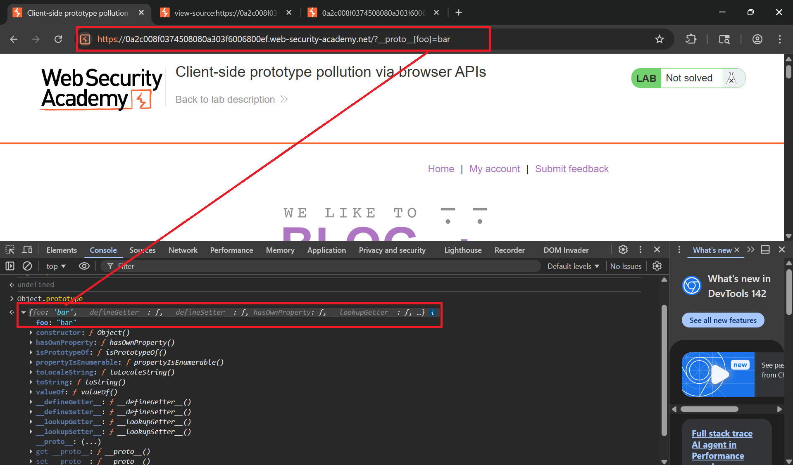
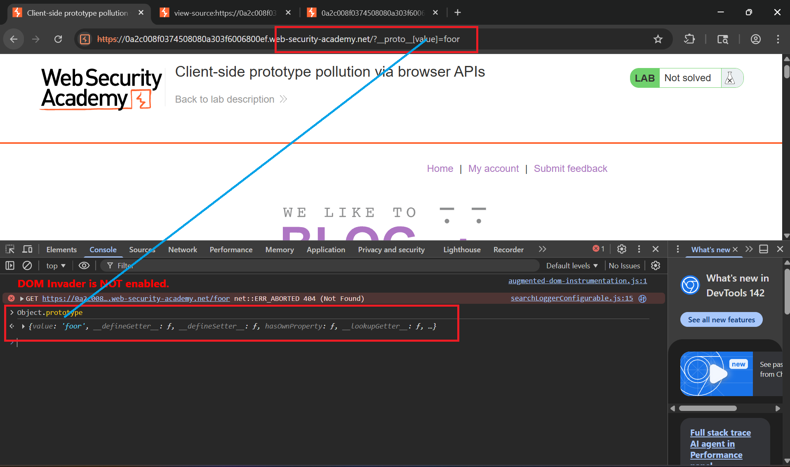
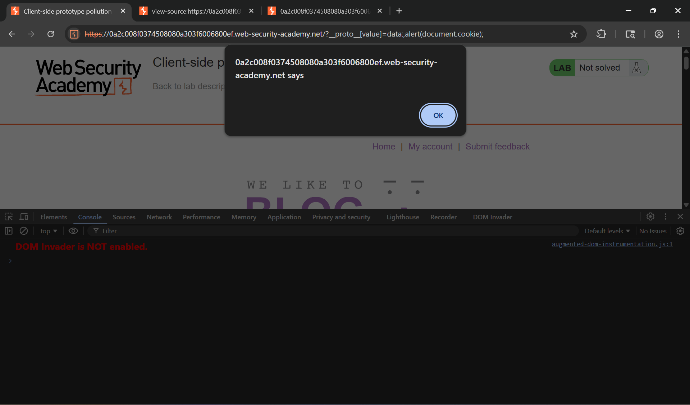
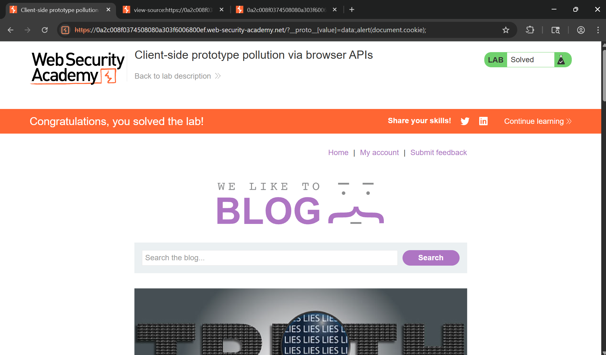

# Writeup LAB: Client-side prototype pollution via browser APIs

## Goal
To solve LAB you can find vuln call alert() in application
## Khai thác
Trang chủ

Ở đây chúng ta có thể thấy được chức năng search chúng ta thử nhập 1 giá trị bất kỳ xem như nào.

Để tìm nguồn chúng ta có thể thực hiện thủ công:
> 1. Thực hiện chèn một thuộc tính tùy ý thông qua chuỗi truy vấn, đoạn URL và bất kỳ dữ liệu thông báo web chẳng hạn như `http://attacker.com?__proto__[foo]=bar` <br>
> 2. Nếu trong bảng điều khiển trình duyệt, kiểm tra thông qua `Object.prototype` xem chúng đã được thành công hay chưa trong việc làm ô nhiễm tham số. <br>
> 3. Nếu thuộc tính đó chưa được thêm vào mẫu toàn cục, hãy thử sử dụng các kỹ thuật khác, chẳng hạn như thay đổi chuỗi [] sang dấu . `__proto__[] sang __proto.` <br>
Khi chúng ta nhấp vào nút tìm kiếm, nó sẽ gửi tham số GET `/` với yêu cầu tham số `search` với giá trị chúng ta nhập vào. 
Xem trang nguồn chúng ta thấy 2 tệp như này:
```js
<script src='/resources/js/deparam.js'></script>
<script src='/resources/js/searchLoggerConfigurable.js'></script>
```
Ở tệp `/js/searchLoggerConfigurable.js` chúng ta có thể thấy mã như sau:
```js
async function searchLogger() {
    let config = {params: deparam(new URL(location).searchParams.toString()), transport_url: false};
    Object.defineProperty(config, 'transport_url', {configurable: false, writable: false});
    if(config.transport_url) {
        let script = document.createElement('script');
        script.src = config.transport_url;
        document.body.appendChild(script);
    }
    if(config.params && config.params.search) {
        await logQuery('/logger', config.params);
    }
}
window.addEventListener("load", searchLogger);
```
Chúng ta thấy rằng hàm `searchLogger` sử dụng `Object.defindProperty` để định nghĩa phương thức:
```js
Object.defineProperty(config, 'transport_url', {configurable: false, writable: false});
```
Điều này cho phép nhà phát triển thiết lập một thuộc tính không thể cấu hình, không thể ghi trực tiếp trên đối tượng bị ảnh hưởng. Về cơ bản, nó ngăn đối tượng dễ bị tổn thương kế thừa phiên bản độc hại của thuộc tính gadget thông qua chuỗi nguyên mẫu. <br>
Chúng ta có thể bỏ qua biện pháp giảm thiểu đó <br>
Trong phương thức này `Object.defineProperty()`, nó chấp nhận một đối tượng tùy chọn, được gọi là "mô tả". Các nhà phát triển có thể sử dụng đối tượng mô tả này để đặt giá trị ban đầu cho thuộc tính đang được định nghĩa. Tuy nhiên, nếu lý do duy nhất họ định nghĩa thuộc tính này là để tránh ô nhiễm nguyên mẫu, họ có thể không cần đặt giá trị nào cả. <br>
Trong trường hợp này, kẻ tấn công có thể vượt qua lớp phòng thủ này bằng cách thêm vào `Object.prototype` một `value` thuộc tính độc hại. Nếu thuộc tính này được kế thừa bởi đối tượng mô tả được truyền cho `Object.defineProperty()`, thì giá trị do kẻ tấn công kiểm soát cuối cùng có thể được gán cho thuộc tính gadget. <br>
Do đó phương thức `Object.defindProperty()` là nguồn đầu vào để làm ô nhiễm tham số do chúng ta kiểm soát <br>
Tải trọng:
```
/?__proto__[foo]=bar
```

Lúc này chúng ta có thể thấy trường cặp key value chúng ta được làm ô nhiễm nguyên mẫu thành công.
Chúng ta có thể thấy 
```js
Object.defineProperty(config, 'transport_url', {configurable: false, writable: false});
    if(config.transport_url) {
        let script = document.createElement('script');
        script.src = config.transport_url;
        document.body.appendChild(script);
    }
```
Thuộc tính của đối tượng đang được phân tích cú pháp thuộc tính phần tử `script` điều này đặc biệt rất nguy hiểm nhưng nó đã đặt config thành false nên k thể khai thác được. <br>
May mắn thay, vì chúng ta có thể thêm một giá trị tùy ý vào phương thức Object.defineProperty(), nên chúng ta vẫn có thể kích hoạt lỗ hổng XSS dựa trên DOM!

Chúng ta có thể thấy được có thể ô nhiễm thuộc tính thông qua `value`
## Lợi dụng tham số thuộc tính value để kích hoạt DOM XSS
Tải trọng
```
?__proto__[value]=data:,alert(document.cookie);
```

