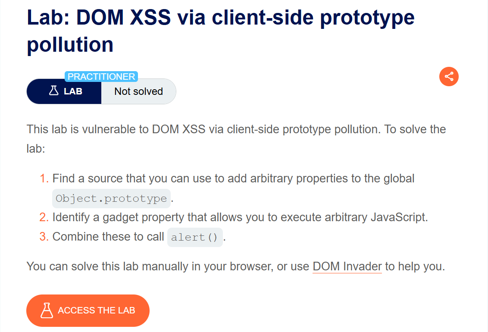
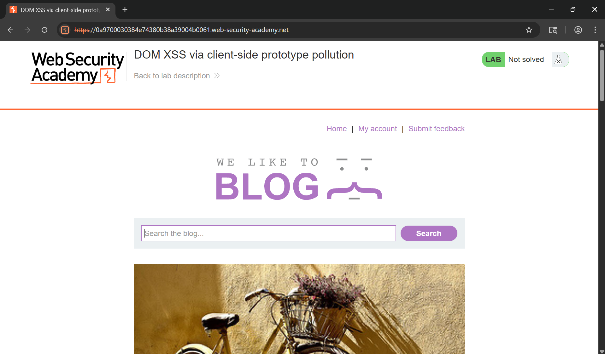
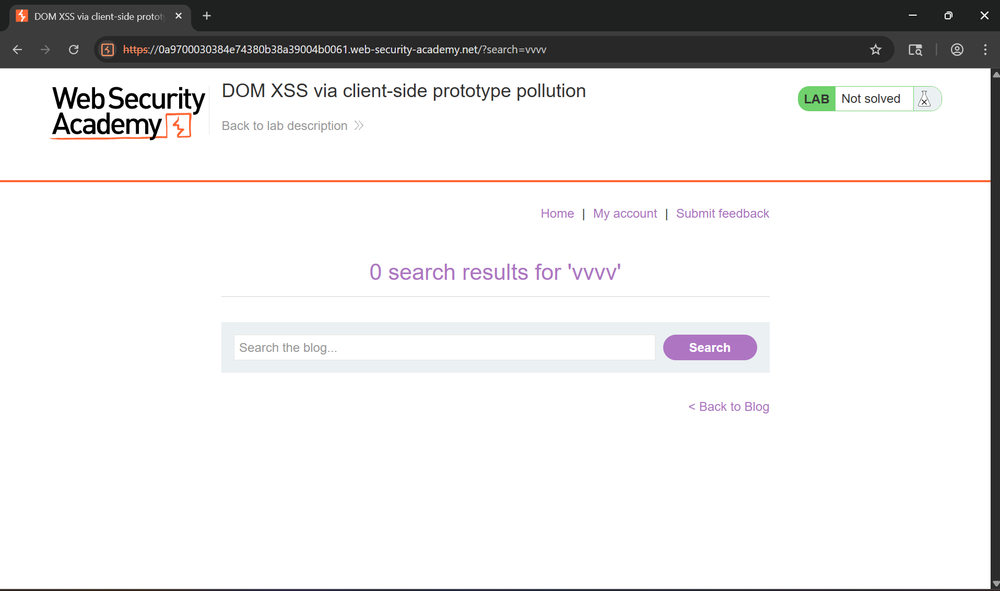
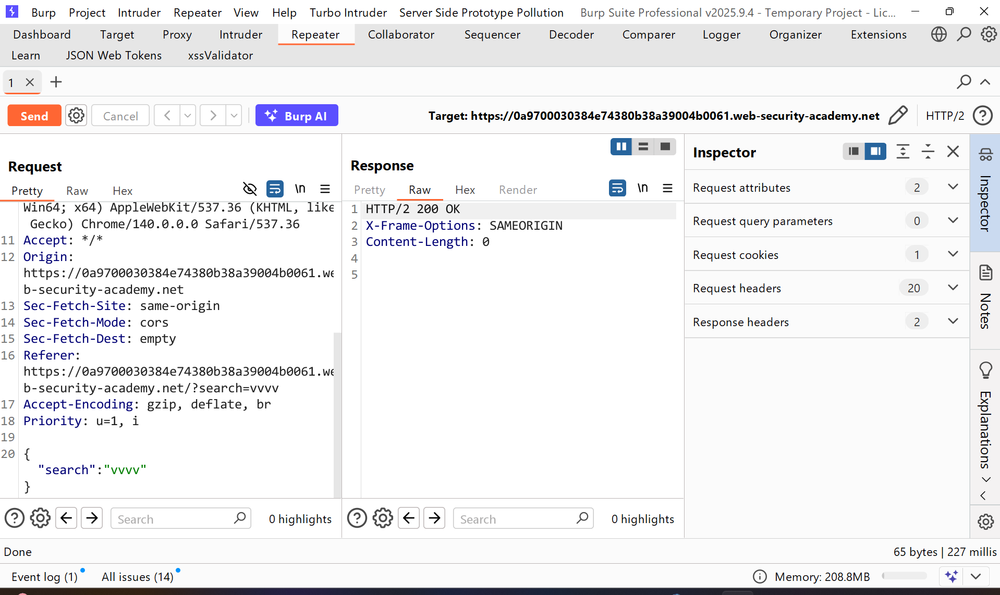
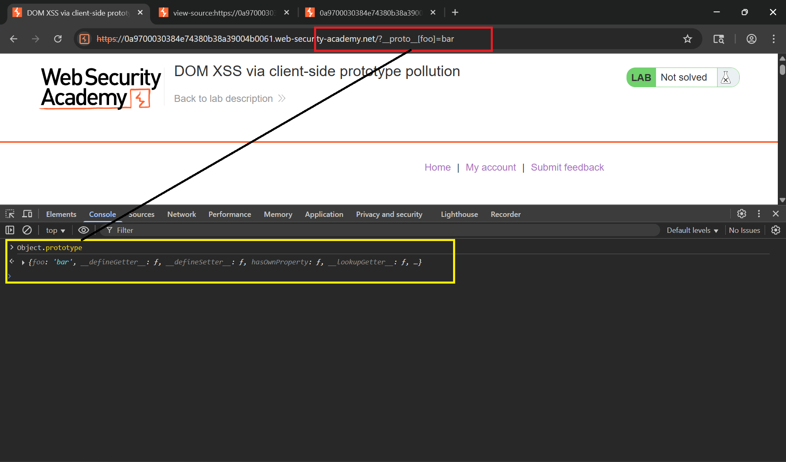
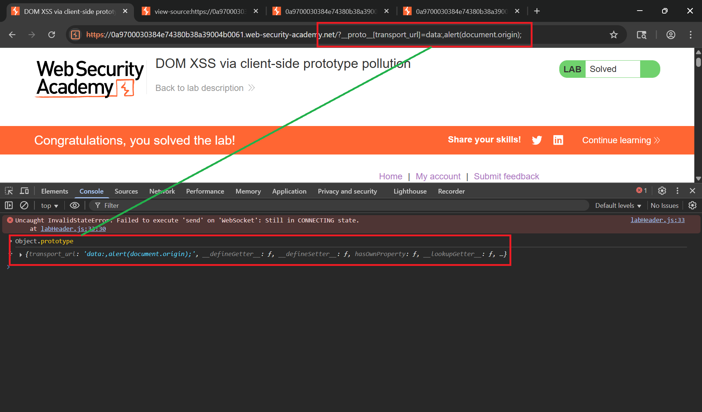

# Writeup LAB: DOM XSS via client-side prototype pollution

## Goal
```
Find a source that you can use to add arbitrary properties to the global Object.prototype.
Identify a gadget property that allows you to execute arbitrary JavaScript.
Combine these to call alert().
```
## Khai thác
Trang chủ

Ở trang chủ này chúng ta có thể thấy nó có chức năng search đáng chú ý chúng ta cùng thử nhập giá trị bất kỳ xem nó như nào cùng thực hiện:

Lịch sư HTTP Burp

Ở chức năng search này chúng ta có thể xem như lab trước nó hiển thị 2 đoạn mã js <br>
```js
<script src='/resources/js/deparam.js'></script>
<script src='/resources/js/searchLogger.js'></script>
```
Để tìm nguồn chúng ta có thể thực hiện thủ công:
> 1. Thực hiện chèn một thuộc tính tùy ý thông qua chuỗi truy vấn, đoạn URL và bất kỳ dữ liệu thông báo web chẳng hạn như `http://attacker.com?__proto__[foo]=bar` <br>
> 2. Nếu trong bảng điều khiển trình duyệt, kiểm tra thông qua `Object.prototype` xem chúng đã được thành công hay chưa trong việc làm ô nhiễm tham số. <br>
> 3. Nếu thuộc tính đó chưa được thêm vào mẫu toàn cục, hãy thử sử dụng các kỹ thuật khác, chẳng hạn như thay đổi chuỗi [] sang dấu . `__proto__[] sang __proto.` <br>
Chúng ta cùng khám phá `/resources/js/searchLogger.js` có đoạn mã js như sau:
```js
[....]
async function searchLogger() {
    let config = {params: deparam(new URL(location).searchParams.toString())};

    if(config.transport_url) {
        let script = document.createElement('script');
        script.src = config.transport_url;
        document.body.appendChild(script);
    }

    if(config.params && config.params.search) {
        await logQuery('/logger', config.params);
    }
}
[....]
```
Chúng ta có thể thấy hàm `searchLogger()` nó khởi tạo config để khhai báo và như LAB trước biến `transport_url` này nếu không được kiểm soát lọc an toàn thì chúng ta hoàn toàn có thể lợi dụng để gây ra ô nhiễm tham số do chúng ta kiểm soát và chúng ta cùng thực hiện <br>
Tải trọng:
```
/?__proto__[foo]=bar
```
Sau khi thực hiện chèn tải trọng chúng ta có thể kiểm tra bằng cách truy cập `Object.prototype` để kiểm tra xem đã gây ô nhiễm tham số của chúng chưa và với chúng ta đã xảy ra

Và tham số chúng ta có thể kiểm soát để gây ra ô nhiễm đó `transport_url` chúng ta có thể thực hiện để gây ô nhiễm và thực thi mã Javscript chúng ta bằng tải trọng
```
/?__proto__[transport_url]=data:,alert(document.origin);
```
Kết quả lúc này gây ra kích hoạt XSS và kiểm tra ô nhiễm đã được ghi.
