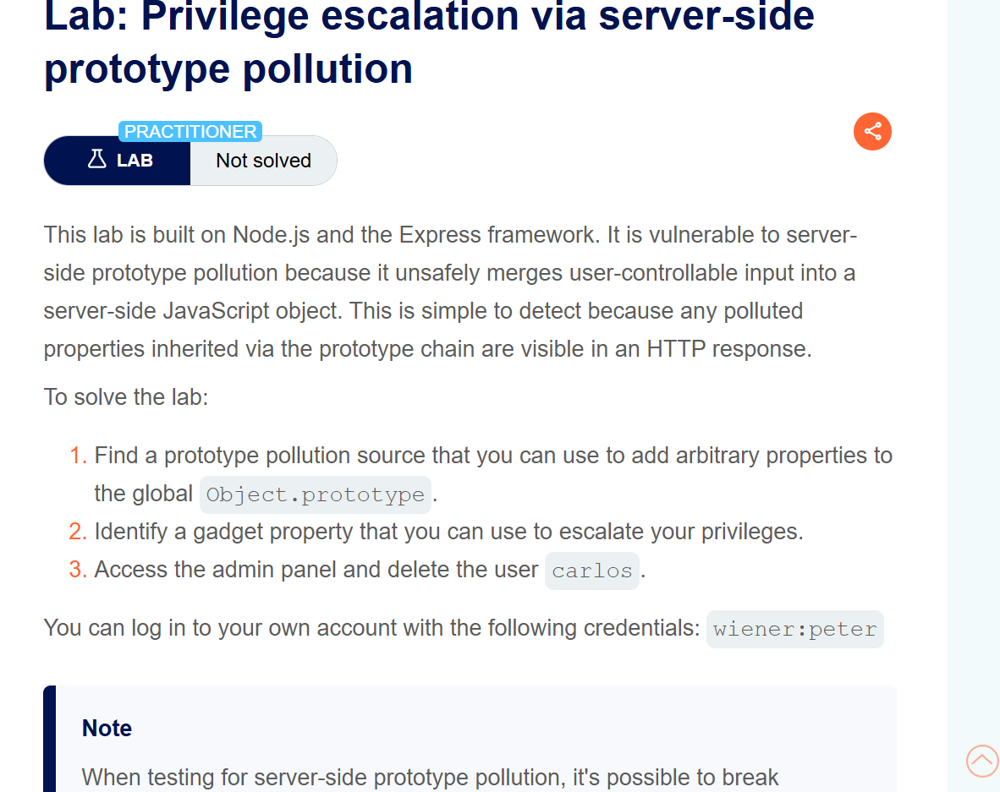
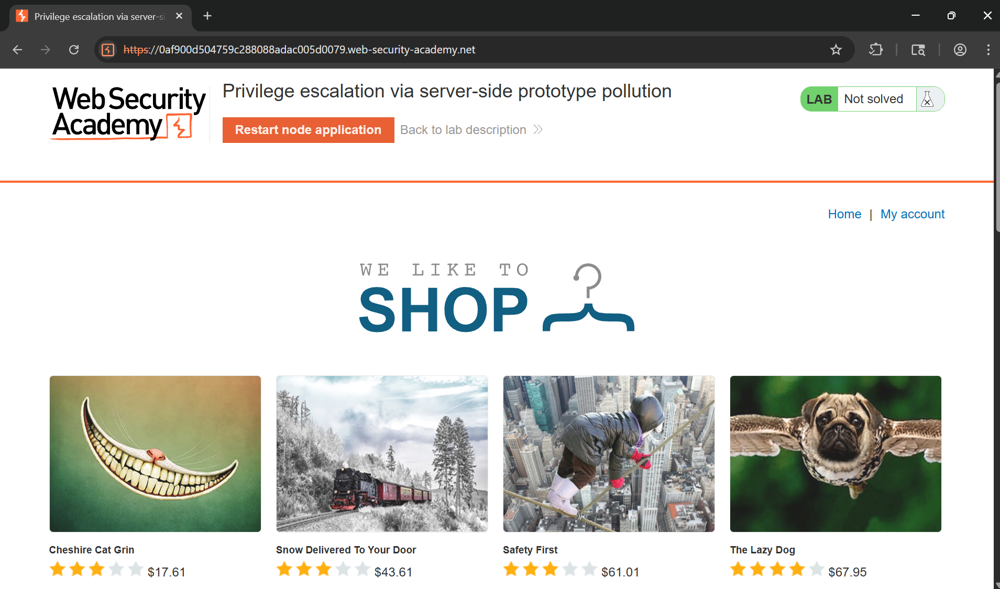
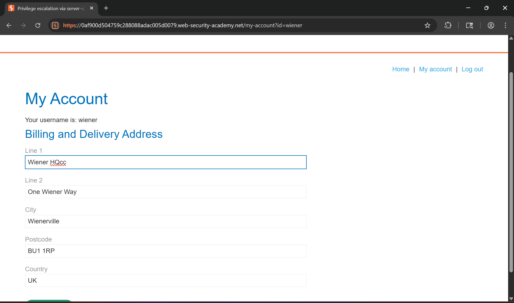
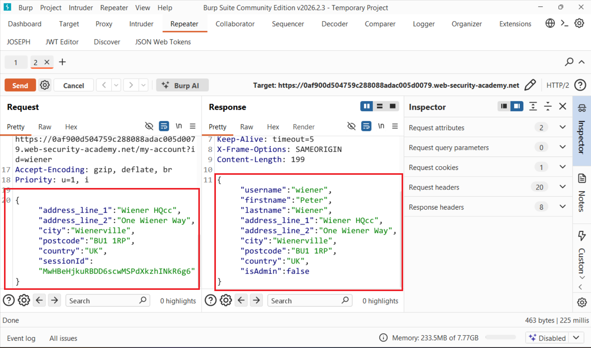
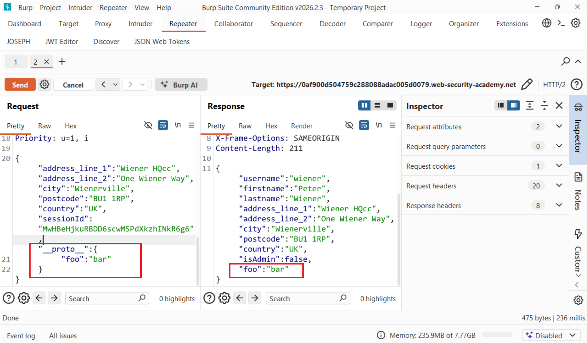
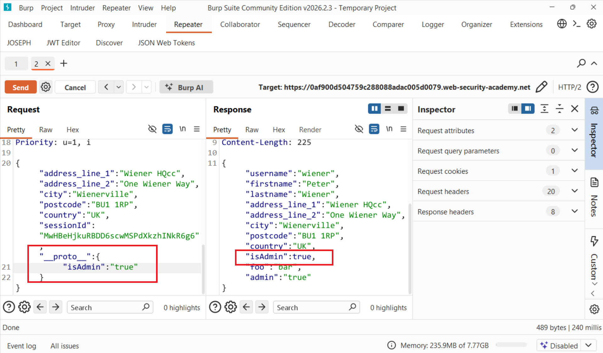
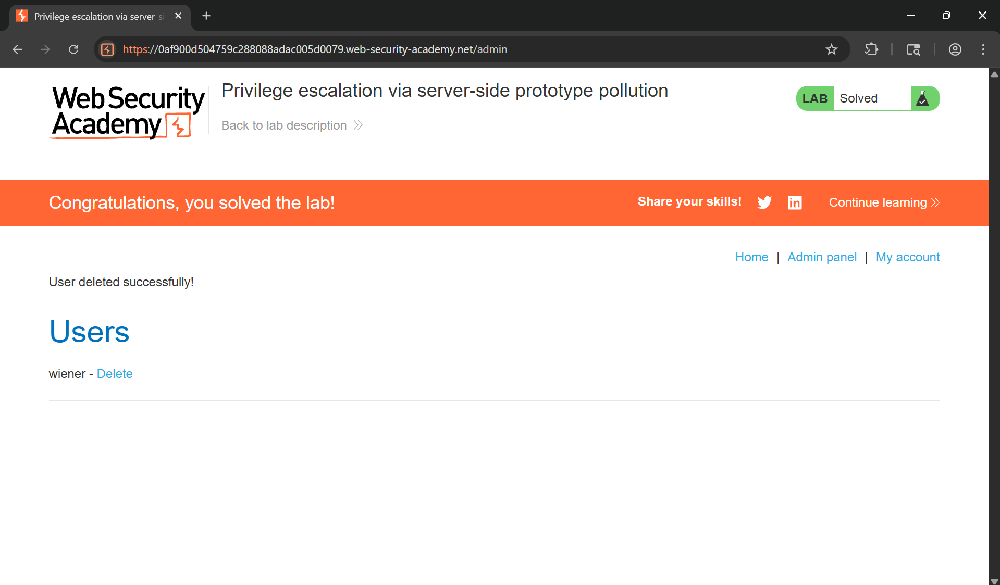

# WRiteup LAB Privilege escalation via server-side prototype pollution

## Goal
Access the admin panel and delete the user `carlos`.
## Khai thác
Để xác định lỗ hổng ô nhiễm tham số trong server này chúng ta cần biết <br>
> 1. Hãy tìm một nguồn ô nhiễm mẫu mà chúng ta có thể sử dụng để thêm các thuộc tính tùy ý hệ thống toàn cầu `Object.prototype` <br>
> 2. Hãy xác định một thuộc tính của thiết bị mà bạn có thể sử dụng để nâng cao quyền hạn của mình. <br>
> 3. Thực hiện làm ô nhiễm đưa vào tấn công làm tăng tính quyền hạn của mình <br>
Trang chủ

Thực hiện đăng nhập cred `wiener:peter`

Ở đây chúng ta có thể cập nhật biểu mẫu của mình và thực hiện và kết quả lịch sử burp suite cho thấy

Ở đây chúng ta thấy response trả về có trường `admin:false` liệu chúng ta có thể gây ô nhiễm nguyên mẫu để ghi đè thuộc tính thành true không chúng ta có thể truyền vào tải trọng bất kỳ xem: <br>
Tải trọng:
```json
"__proto__":{
    "foo":"bar"
}
```
Chúng ta có thể thấy chúng ta đã kiểm soát gây ra ô nhiễm nguyên mẫu bằng cách ghi đè thuộc tính và response trả về đã cập nhật dữ liệu như vậy

Vậy liệu bây giờ chúng ta sẽ ghi đè thuộc tính khiến trường admin thành true <br>
Tải trọng
```json
"__proto__":{
    "isAdmin": "true"
}
```
Và lúc này chúng ta đã khiến cho trường admin thành true vơi leo thang đặc quyền

Quay trở lại tài khoản `wiener` tiến hành reload trang và bây giờ chúng ta đã vào được tài khoản quản trị tiến hành xóa users `carlos`
