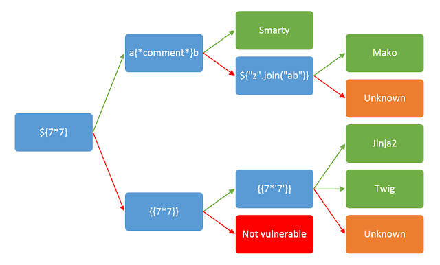

# SSTI (Server Side Template Injection)
Nó được gọi là lỗ hổng chèn mẫu phía máy chủ
## Chèn mẫu phía máy chủ là gì?
Tấn công chèn mã độc vào mẫu phía máy chủ là khi kẻ tấn coong có thể sử dụng cú pháp mẫu goosc để chèn mã độc voaof mẫu, sau đố mã độc này sẽ được thực thi máy chủ
## Tác động của việc chèn mẫu phía máy chủ là gì?
Lỗ hổng chèn mẫu phía máy chủ có thể khiến các trang web dễ bị tấn công bằng nhiều cách khác nhau tùy thuộc vào công cụ tạo mẫu được sử dụng và cách ứng dụng sử dụng nó. Trong một số trường hợp hiếm hoi, những lỗ hổng này không gây ra rủi ro bảo mật thực sự. Tuy nhiên, phần lớn thời gian, tác động của việc chèn mẫu phía máy chủ có thể rất nghiêm trọng.
Ở mức độ nghiêm trọng nhất, kẻ tấn công có thể thực hiện mã độc từ xa, giành quyền kiểm soát hoàn toàn máy chủ phụ trợ và sử dụng nó để thực hiện các cuộc tấn công khác vào cơ sở hạ tầng nội bộ.
## Các lỗ hổng chèn mẫu phía máy chủ phát sinh như thế nào?
Lỗ hổng tấn công chèn mẫu phía máy chủ phát sinh khi dữ liệu người dùng nhập vào được nối thành các mẫu thay vì được truyền trực tiếp dưới dạng dữ liệu.
```php
<?php
$output = $twig->render("Dear {first_name},", array("first_name" => $user.first_name) );
?>
```
Cũng như bất kỳ lỗ hổng nào khác, bước đầu tiên để khai thác là tìm ra nó. Có lẽ cách tiếp cận đơn giản nhất ban đầu là thử làm mờ mẫu bằng cách chèn một chuỗi các ký tự đặc biệt thường được sử dụng trong biểu thức mẫu, chẳng hạn như `<template>` ${{<%[%'"}}%\. Nếu một ngoại lệ được đưa ra, điều này cho thấy cú pháp mẫu được chèn có thể đang được máy chủ diễn giải theo một cách nào đó. Đây là một dấu hiệu cho thấy có thể tồn tại lỗ hổng chèn mẫu phía máy chủ.

## Cách ngăn chặn các lỗ hổng tấn công chèn mẫu phía máy chủ
Cách tốt nhất để ngăn chặn việc chèn mẫu phía máy chủ là không cho phép bất kỳ người dùng nào chỉnh sửa hoặc gửi mẫu mới. Tuy nhiên, điều này đôi khi là không thể tránh khỏi do yêu cầu kinh doanh.
Một trong những cách đơn giản nhất để tránh các lỗ hổng tấn công chèn mẫu phía máy chủ là luôn sử dụng công cụ tạo mẫu "không có logic", chẳng hạn như Mustache, trừ khi thực sự cần thiết. Việc tách biệt logic khỏi phần trình bày càng nhiều càng tốt có thể làm giảm đáng kể nguy cơ bị tấn công dựa trên mẫu nguy hiểm nhất.
Một biện pháp khác là chỉ thực thi mã của người dùng trong môi trường hộp cát, nơi các mô-đun và chức năng có khả năng gây nguy hiểm đã được loại bỏ hoàn toàn. Tuy nhiên, việc cách ly mã không đáng tin cậy vốn dĩ rất khó khăn và dễ bị vượt qua.
Cuối cùng, một cách tiếp cận bổ sung khác là chấp nhận rằng việc thực thi mã tùy ý là điều gần như không thể tránh khỏi và áp dụng cơ chế bảo mật riêng bằng cách triển khai môi trường mẫu của bạn trong một container Docker được khóa chặt, chẳng hạn.