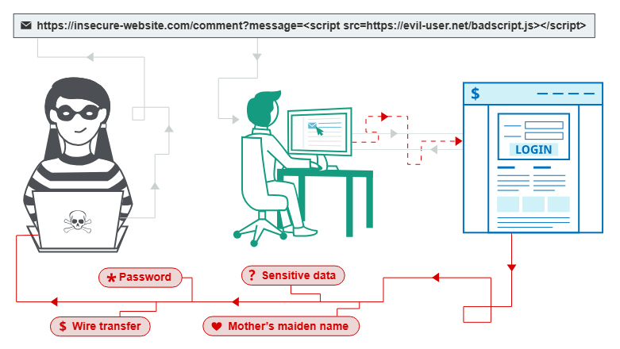
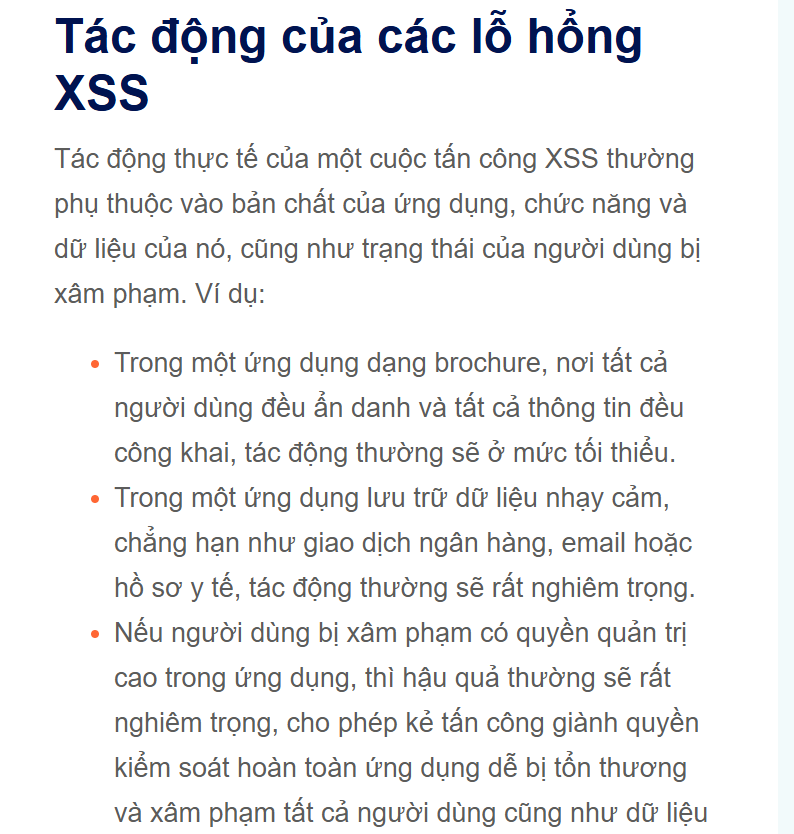

# Note XSS
Ở Module này sẽ giải thích kịch bản chéo trang web XSS
## Tấn công kịch bản chéo trang XSS?
Tấn công kịch bản chéo trang còn gọi là XSS là lỗ hổng bảo mật web cho phép kẻ tấn công xâm phạm tương tác của người dùng và ứng dụng. <br>
Lỗ hổng này thường cho phép kẻ tấn công giả mạo người dùng nạn nhân, thực hiện hành động truy cập bất kỳ dữ liệu nào của người dùng. <br>
Nếu người dùng nạn nhân có quyền truy cập thì có thể lợi dụng XSS chiếm quyền kiểm soát hoàn toàn tất cả các chức năng và dữ liệu người dùng. <br>
## XSS hoạt động như thế nào?
Nó hoạt động bằng cách thao túng một trang web dễ bị tổn thương để nó trả về mã Javascript độc hại cho người dùng. Khi mã kích hoạt thực thi trong người dùng  có thể hoàn toàn xâm phạm luôn tài khoản của người dùng. <br>

## CHứng mình khả năng tấn công XSS
Có thể xác nhận hầu hết các lỗ hhoonrg XSS bằng cách chèn một đoạn mã độc khiến trình duyệt thực thhi đoạn mã JS cơ bản đó là việc sử dụng `alert()` trở nên phổ biến hay sử dụng `print()` <br>
## Các loại tấn công XSS
Có 3 loại XSS chính đó là:
+ `Reflected XSS`: Hay còn được gọi là XSS phản chiếu trong đó mã độc xuất phát từ yêu cầu HTTP hiện tại <br>
+ `Stored XSS`: Trong dđó mã độc được lấy từ cơ sở dữ liệu trang web <br>
+ `DOM XSS`: Trong đó điểm yếu nằm ở mã phía máy khách chứ khong phải mã phía máy chủ <br>
## Reflected cross-site scripting
Lỗ hổng XSS phản chiếu đơn giản chỉ xảy ra từ yêu cầu HTTP và dưa dữ liệu đó vào và phản hồi ngay lập tức theo cách không an toàn.
```
http://attacker.com?status=xxxx
<p>xxxxx</p>
```
Lúc này ứng đụng không thực hiện bất kỳ quá trình xử lý dữ liệu nào khác kẻ tấn công có thể tạo 1 payload XSS đơn giản <br>
```
https://insecure-website.com/status?message=<script>/*+Bad+stuff+here...+*/</script>
<p>Status: <script>/* Bad stuff here... */</script></p>
```
Và lúc này người dùng truy cập vào URL do kẻ tấn công tạo ra, thì kịch bản sẽ được thực thi ra phía người dùng và tại thời điểm đó, kịch bản có thể thực hiện bất kỳ hành động nào và truy xuất bất kỳ dữ liệu nào mà người dùng có quyền truy cập.
## Stored Cross-Site Scripting
Stored XSS là lỗ hổng XSS được lưu trữ thay như được thi ngay như Reflect lỗ hổng này pát sinh khi ứng dụng nhận dữ liệu từ một nguồn gốc đáng tin cầy và đưa dữ liệu đó vào các phản hồi HTTP sau đó một cách không an toàn <br>
Dữ liệu được đề cập có thể được gửi đến ứng dụng thông qua các yêu cầu HTTP. Giả sử như sau tôi bình luận 1 trang mà trang đó có khả năng xảy ra XSS lúc này tôi đưua payload vào cmt nếu người sau vào trang đó sẽ khiến thực thi payload tôi.
## Tấn công kịch bản chéo trang dựa trên DOM (DOM XSS)
Lỗ hổng XSS dựa trên DOM phát sinh khi ứng dụng chứa một số mã Javascript phía máy khách xử lý dữ liệu từ một nguồn không đáng tin cậy. theo cách không an toàn và thường sẽ ghi dữ liệu trở lại DOM <br>
Ví dụ
```js
var search = document.getElementById('search').value;
var results = document.getElementById('results');
results.innerHTML = "You Are Search: " + search
```
Nếu kẻ tấn công có thể kiểm soát giá trị của trường nhập liệu, chúng có thể dễ dàng tạo ra một giá trị độc hại khiến kịch bản của chúng được thực thi:
You Are Search: 
## Mục đich XSS
Kẻ tấn công có thể khai thascc XSS
> Giả mạo hoặc mạo danh người dùng là nạn nhân. <br>
> Thực hiện bất kỳ hành động nào mà người dùng có khả năng thực hiện. <br>
> Thu thập thông tin người dùng <br>
> Thực hiện tấn coong làm biến dạng trang web ảo <br>
<br>


## Chính sách bảo mật nội dung
Được gọi là `CSP` là một cơ chế của trình duyệt nhằm giảm thiểu tác động của tấn công kịch bản XSS và một số lỗ hổng khác. <br>
Nếu ứng dụng chứa hành vi tương tự XSS thì CSP có thể cản trở hoặc ngăn chặn khai thác lỗ hổng tuy nhiên đôi khi vẫn vượt qua để khai thác lỗ hổng tiềm ẩn <br>
## Cách phòng chống tấn công XSS
> Lọc dữ liệu đầu vào ngay khi nhận được. Tại thời điểm nhận được dữ liệu đầu vào từ người dùng, hãy lọc càng kỹ càng tốt dựa trên những gì được mong đợi hoặc là dữ liệu đầu vào hợp lệ. <br>
> Mã hóa dữ liệu khi xuất ra. Tại thời điểm dữ liệu do người dùng kiểm soát được xuất ra trong phản hồi HTTP, hãy mã hóa dữ liệu đầu ra để ngăn nó bị hiểu nhầm là nội dung hoạt động. Tùy thuộc vào ngữ cảnh đầu ra, điều này có thể yêu cầu áp dụng kết hợp mã hóa HTML, URL, JavaScript và CSS. <br>
> Hãy sử dụng các tiêu đề phản hồi phù hợp. Để ngăn chặn XSS trong các phản hồi HTTP không nhằm mục đích chứa bất kỳ HTML hoặc JavaScript nào, bạn có thể sử dụng các tiêu đề `<head>` Content-Typevà ` X-Content-Type-Options<head>` để đảm bảo rằng trình duyệt diễn giải các phản hồi theo cách bạn mong muốn. <br>
> Chính sách bảo mật nội dung. Như một biện pháp phòng vệ cuối cùng, bạn có thể sử dụng Chính sách bảo mật nội dung (CSP) để giảm mức độ nghiêm trọng của bất kỳ lỗ hổng XSS nào vẫn còn xảy ra. <br>
<br>

## Các câu hỏi thường gặp về tấn công kịch bản chéo trang (cross-site scripting)
1. <b>Các lỗ hổng XSS phổ biến đến mức nào?</b>
- Lỗ hổng bảo mật XSS rất phổ biến và XSS là lỗ hỏng bảo mật web xuất hiện thường xuyên nhất <br>
2. <b>Tấn công XSS phổ biến như thế nào ?</b>
XSS là loại đặc thù phổ biến rất khó để có thể được dữ liệu đáng tin cầy về các cuộc tấn công XSS trong thực tế, có lẽ nó ít bị khai thác hơn so với các lỗ hổng khác <br>
3. <b>XSS và CSRF khác nhau như thế nào ?</b>
XSS liên quan đến việc khiến trang web trả về mã JavaScript độc hại, trong khi CSRF liên quan đến việc dụ dỗ người dùng nạn nhân thực hiện các hành động mà họ không có ý định thực hiện.
4. <b>XSS và SQL Injection khác nhau như thế nào?</b>
- Đối vs XSS về bản chất nó là nơi ở Client còn SQL Injection là phía back-end người dùng hay còn gọi XSS nhắm vào người dùng ứng dụng còn SQL Injection nhắm vào dữ liệu database bên trong
5. <b>Làm thế nào để ngăn chặn XSS trong PHP?</b>
Lọc đầu vào bằng danh sách trắng các ký tự được cho phép và sử dụng gợi ý kiểu hoặc ép kiểu. Mã hóa đầu ra bằng ` htmlentities<script>` ENT_QUOTEScho ngữ cảnh HTML hoặc mã hóa Unicode của JavaScript cho ngữ cảnh JavaScript.
6. <b>Làm thế nào để ngăn chặn XSS trong Java?</b>
Lọc đầu vào của bạn bằng danh sách trắng các ký tự được cho phép và sử dụng thư viện như Google Guava để mã hóa HTML đầu ra cho ngữ cảnh HTML, hoặc sử dụng các mã thoát Unicode của JavaScript cho ngữ cảnh JavaScript.

# Tác động gây ra của từng loại XSS
## Tác động của của cuộc tấn công Reflected XSS
Nếu kẻ tấn công có thể kiểm soát một đoạn mã được thực thi trong trình duyệt của nạn nhân, thì chúng thường có thể xâm phạm hoàn toàn người dùng đó. Trong số những việc khác, kẻ tấn công có thể:
> Thực hiện bất kỳ thao tascc nào trong ứng dụng mà người dùng có thể thực hiện <br>
> Xem mọi thông tin mà người dùng có thể xem. <br>
> Chỉnh sửa bất kỳ thông tin nào mà người dùng có thể chỉnh sửa. <br>
> Khởi tạo các tương tác với người dùng ứng dụng khác, bao gồm cả các cuộc tấn công độc hại, mà thoạt nhìn sẽ có vẻ như xuất phát từ người dùng nạn nhân ban đầu. <br>
## Các câu hỏi thường gặp về tấn công kịch bản chéo trang phản chiếu (reflected cross-site scripting)
1. <b>Sự khác biệt giữa Reflected XSS và Stored XSS là gì?</b>
- Reflect XSS xay ra khi một ứng dụng nhận một số dữ liệu thông qua các yêu cầu HTTP và nhúng dữ liệu đó và phản hồi ngay lập tức cho người dùng và không an toàn còn Stored XSS xảy ra khi ứng dụng thay vào đó lưu trữ dữ liệu đầu vào và nhúng nó vào phản hồi sau đó một cách không an toàn <br>
2. <b>Sự khác biệt giữa Reflect XSS và Self XSS</b>
- Self XSS liên quan đến hành vi ứng dụng tự như Reflect XSS thông thường, tuy nhiên nó không tự kích hoạt thẳng ngay thông qua URL được tạo sẵn hoặc yêu cầu liên miền. <br>
- Thay vào đó, lỗ hổng chỉ được kích hoạt nếu chính nạn nhân gửi mã độc XSS từ trình duyệt của họ. Việc thực hiện một cuộc tấn công XSS tự thân thường liên quan đến việc sử dụng kỹ thuật xã hội để dụ nạn nhân dán một số dữ liệu do kẻ tấn công cung cấp vào trình duyệt của họ. Do đó, nó thường được coi là một vấn đề nhỏ, ít ảnh hưởng.
## Tác động của cuộc tấn công XSS lưu trữ
Nếu kẻ tấn công có thể kiểm soát một đoạn mã được thực thi trong trình duyệt của nạn nhân, thì chúng thường có thể xâm phạm hoàn toàn người dùng đó. Kẻ tấn công có thể thực hiện bất kỳ hành động nào áp dụng cho tác động của lỗ hổng XSS phản xạ .
## XSS dựa trên DOM
Các lỗ ổng XSS dựa trên DOM thường phát sinh khi Javascript lấy dữ liệu từ một nguồn do kẻ tấn công kiểm soát chẳng hạn như URL và tiến hành chuyển nó đến một đích thực thi mã động như `eval()` hay `innerHTML`. Điều này cho phép ke tấn công thực thi javascript độc hại. <br>
Nguồn gốc phổ biến nhất của lỗ hổng DOM XSS là URL thường truy cập bằng `window.location`. Kẻ tấn công có thể tạo một liên kết để dẫn nạn nhân đến một trang dễ bị tổn thương với mã độc trong chuỗi truy vấn và các phần bị phân mảnh của URL.
### Kiểm tra các bộ lọc HTML
Để kiểm tra lỗ hổng DOM XSS trong mã HTML đích chèn một chuỗi ký tự chữ và số ngẫu nhiên vào `location.search`
### Khai thác lỗ hổng DOM XSS với nhiều nguồn và đích khác nhau
Bộ xử lý `document.write` hoạt động với phần tử `script`
```js
document.write('<script>alert(1)</script>');
```
Bồn `innerHTML` không chấp nhận `script` các phần tử trên bất kỳ trình duyệt hiện đại nào, cũng như không kích hoạt được `svg onlod`. Có thể thay thế như `img` hay `iframe`. Các trình sự kiện như `onload` hoặc `onerror` ó thể đượccc sử dụng kết hợp với các phần tử này. <br>
```js
element.innerHTML=''
```
## Nguồn và đích trong các phụ thuộc của bên thứ ba
### Lỗ hổng DOM XSS trong jQuery
Nếu sử dụng thư viện javasccript như JQuery cẩn thận với các hàm có thể thay đổi ccasc phẩn từ DOM trên trang. Hàm `attr()` của `jQuery` có thể thay đổi thuộc tính của các phần tử trên DOM. Nếu dữ liệu được truyền vào hàm `attr()` có thể thao túng giá trị được gửi dể gây ra lỗi XSS. <br>
Ví dụ, đây là một đoạn mã JavaScript thay đổi thuộc tính của phần tử liên kết `href` bằng cách sử dụng dữ liệu từ URL: <br>
```js
$(function() {
	$('#backLink').attr("href",(new URLSearchParams(window.location.search)).get('returnUrl'));
});
```
Kẻ tấn công có thể khai thác lỗ hổng này bằng cách sửa đổi URL sao cho `location.search` nguồn chứa URL Javascript độc hại. Sau khi Javascript đượcc load vào thuộc tính của liên kết quay lại `href` và nhấp vào liên kết đó sẽ thực thi. <br>
## Hàm Selector của jQuery
Có thể sử dụng để chèn các đối tượng độc hại vào DOM. `jQuery` cực kì nổi tiếng các trang web có thể xảy ra XSS do sử dụng bộ chọn kết hợp với mã `location.hash` cho tự động cuoojcn đến một phần tử cụ thể trên trang. <br>
Hành vi này thường được thực hiện bằng cách sử đụng `hashchange`
```js
$(window).on('hashchange', function() {
	var element = $(location.hash);
	element[0].scrollIntoView();
});
```
Để khai thác lỗ hổng này, cần tìm cách kích hoạt một `hashchange` sự kiện mà không cần tương tác với người dùng đó là thông qua `iframe`
```js
<iframe src="https://vulnerable-website.com#" onload="this.src+=''">
```
Trong ví dụ này, `src` thuộc tính trỏ đến trang dễ bị tổn thương với giá trị băm rỗng. Khi trang `iframe` được tải, một vectơ XSS được thêm vào giá trị băm, khiến sự `hashchange` kiện được kích hoạt.
## Một số loại sink có thể dẫn đến lỗ hổng DOM-XSS?
```js
document.write()
document.writeln()
document.domain
element.innerHTML
element.outerHTML
element.insertAdjaentHTML
element.onevent
```
Các hàm jQuery sau đây cũng là những điểm yếu có thể dẫn đến lỗ hổng DOM-XSS:
```js
add()
after()
append()
animate()
insertAfter()
insertBefore()
before()
html()
prepend()
replaceAll()
replaceWith()
wrap()
wrapInner()
wrapAll()
has()
constructor()
init()
index()
jQuery.parseHTML()
$.parseHTML()
```
Payload như sau về ngữ cảnh chặn dấu ngoặc kép
```js
" autofocus onfocus=alert(document.cookie) x="
```
Đoạn mã này tạo ra một sự kiện `onfocus` thực thi Javascript khi phần tử nhận được tiêu điểm, đồng thời thêm `autofocus` để tuộc tính cố gắng kích hoạt `onfocus` sự khiện mà không cần tương tác người dùng <br>
## Thoát khỏi chuỗi Javascript
Một số chuỗi
```js
'-alert(document.domain)-'
';alert(document.đomain)//
```
## Kỹ thuật BYPASS WAF
Một số trang web làm cho việc tấn công XSS được chặn bằng `WAF`. Trong trường hợp này có thể thử nghiệm các cách khác để gọi các hàm nhằm vượt qua các biện pháp bảo mật này. <br>
Một cách để làm điều này sử dụng lệnh `throw` với trình xử lý ngoại lệ. Điều này cho phép truyền các đối số cho một hàm mà không cần sử dụng dấu ngoặc đơn. <br>
Đoạn mã sau gán `alert()` hàm cho trình xử lý ngoại lệ toàn cục và `throw` câu lệnh truyền đối số cho `1` trình xử lý ngoại lệ (trong trường hợp này là alert). Kết quả cuối cùng là `alert()` hàm được gọi với `1` đối số là. <br>
```js
onerror=alert;throw 1
<script>onerror=alert;throw 1337</script>
<script>{onerror=alert}throw 1337</script>
```
## Sử dụng mã hóa HTML
Khi trình duyệt phân tích các thẻ HTML và thuộc tính trong phản hồi nó sẽ thực hiện giải mã HTML
```js
<a href="#" onclick="... var input='controllable data here'; ...">
```
Nếu ứng dụng chặn hoặc thoát các ký tự dấu ngoặc đơn, bạn có thể sử dụng đoạn mã sau để thoát khỏi chuỗi JavaScript và thực thi tập lệnh của riêng mình:
```js
&apos;-alert(document.domain)-&apos;
```
`&apos` là thực thể HTML đại diện cho dấu nháy đơn.


