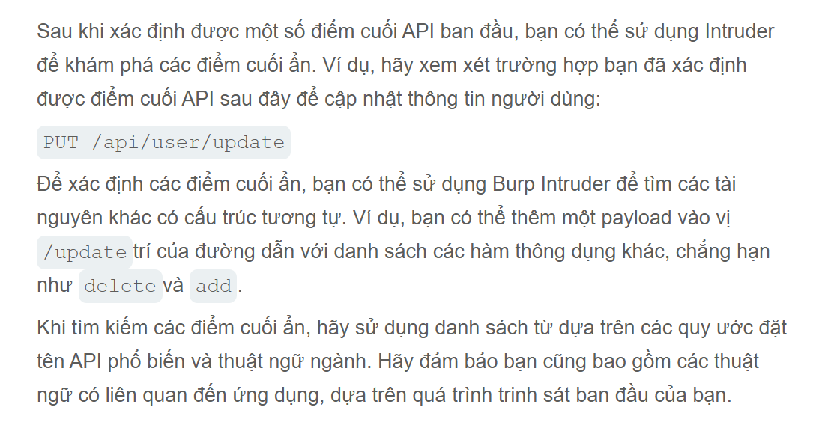

# API testing
API cho phép các hệ thống và ứng dụng phần mềm giao tiếp chia sẽ dữ liệu cho nhau. Kiểm thử API rất quan trọng vì các lỗ hổng trong API có thể làm suy yếu các khía cạnh cốt lõi về tính bảo mật, tính toàn vẹn và tính khả dụng
Tất cả các trang web động đều được cấu thành API , vì vậy các lỗ hổng bảo mật web kinh điển như tấn công SQL injection được xếp vào loại kiểm thử API. Tập trung vào các API RETSful và JSON.
## API Recon
Trước tiên phải xác định điểm cuối API. Đây là những điểm tất yếu để bước vào kiểm thử một API xác định tài nguyên cụ thể trên máy chủ của nó.
```http
GET /api/books HTTP/1.1
Host: example.com
```
Điểm cuối API yêu cầu này là `/api/books`. Điều này dẫn đến việc tương tác với API truy xuất danh sách từ thư viện. Một điểm cuối API khác có thể là `/api/books/mysyster`, sẽ truy xuất danh sách trình thám.
## Tài liệu API
Tài liệu API được viết định dạng có cấu trúc như `JSON` hay `XML`.
Tài liệu API thường được công khai, đặc biệt nếu API đó dành cho các nhà phát triển bên ngoài sử dụng.
### Tìm hiểu tài liệu API
Một số điểm cuối (endpoint) có thể tham chiếu đến tài liệu API như
> /api <br>
> /swagger/index.html <br>
> /openapi.json <br>
Nếu xác định được điểm cuối (endpoint) cho một tài nguyên, chúng ta có thể điều tra đường dẫn cơ sở. Giả sử xác định được điểm cuối tài nguyên `/api/swagger/v1/users/123` thì chúng ta có thể điều tra theo trình tự đường dẫn sau.
> /api/swagger/v1 <br>
> /api/swagger <br>
> /api <br>
## Xác định các phương thức HTTP được hỗ trợ
Phương thức HTTP chỉ định hành động cần thực hiện trên một tài nguyên chẳng hạn:
> `GET`: Truy xuất thông tin dữ liệu từ một nguồn <br>
> `PATCH`: Áp dụng thay đổi một phần cho tài nguyên <br>
> `OPTIONS`: Kiểm tra truy xuất thông tin các loại phương thức yêu cầu được cho phép <br>
Một điểm cuối API có thể hỗ trợ nhiều phương thức HTTP khác nhau. Do đó, điều quan trọng là phải kiểm tra tất cả các phương thức tiềm năng khi đang nghiên cứu một điểm cuối API. 
Chẳng hạn như điểm cuối `/api/tasks` có thể hỗ trợ nhiều phương thức khác nhau như:
> `GET /api/tasks` - Truy xuất danh sách các nhiệm vụ <br
> `POST /api/tasks` - Tạo một nhiệm vụ mới <br>
> `DELETE /api/tasks/1` - Xóa một tác vụ <br>
## Xác định loại nội dung được hỗ trợ
Các điểm cuối API thường yêu cầu dữ liệu ở định dnajg cụ thể. Chúng ta bằng cách này có thể thay đổi loại nội dung có thể cho phép bạn: 
> Lỗi kích hoạt có thể tiết lộ thông tin hữu ích <br>
> Vượt qua những điểm yếu trong hệ thống phòng thủ <br>
> Hãy tận dụng những khác biệt trong logic xử lý. Một API có thể an toàn khi xử lý dữ liệu JSON nhưng lại dễ bị tấn công chèn mã độc.
## Sử dụng intruder để tìm các điểm cuối ẩn.

## Các lỗ hổng phân bổ hàng loạt.
Việc gán hàng loạt còn được gọi (tự động liên kết) có thể vô hình tạo ra các tham số ẩn.
### Xác định các tham số ẩn
Vì việc gán hàng loạt tạo ra các tham số từ các trường đối tượng, chúng ta thường có thể xác định các tham số ẩn này bằng cách kiểm tra thủ công  các đối tượng API trả về
Giả sử: `PATCH /api/users/` yêu cầu cho phép người dùng cập nhật tên người dùng và email của chính họ bao gồm đối tượng JSON sau
```json
{
    "username":"wiener",
    "email": "wiener@example.com",
}
```
Một `GET /api/users/123` yêu cầu đồng thời trả về JSON sau:
```json
{
    "id": 123,
    "name": "John Doe",
    "email": "john@example.com",
    "isAdmin": "false"
}
```
ĐIều này có thể cho thấy rằng các tham số ẩn `id` được `isAdmin` liên kết với đối tượng người dùng nội bộ, cùng với các tham số tên người dùng và email đã được cập nhật
### Kiểm tra các lỗ hổng phân bổ khối lượng
Để kiểm tra chúng ta có thể sửa đổi `isAdmin` giá trị tham số này không chúng ta có thể thêm nó vào `PATCH`
```json
{
    "username": "wiener",
    "email": "wiener@example.com",
    "isAdmin": false,
}
```
Hoặc gửi `PATCH` yêu cầu với `isAdmin` giá trị tham số không hợp lệ:
```json
{
    "username": "wiener",
    "email": "wiener@example.com",
    "isAdmin": "foo",
}
```
Nếu ứng dụng hoạt động khác đi, điều này có thể cho thấy giá trị không hợp lệ ảnh hưởng đến logic truy vấn, nhưng giá trị hợp lệ thì không. Điều này có thể cho thấy người dùng có thể cập nhật tham số thành công.
Sau đó có thể gửi `PATCH` yêu cầu với `isAdmin` giá trị tham số được đặt thành `true`, để thử khai thác lỗ hổng.
```json
{
    "username": "wiener",
    "email": "wiener@example.com",
    "isAdmin": true,
}
```
## Ngăn ngừa các lỗ hổng bảo mật trong API
Khi thiết kế API, đảm bảo rằng bảo mật được xem xét ngay từ đầu.
> Hãy bảo mật tài liệu của bạn nếu bạn không có ý định công khai API của mình. <br>
> Hãy đảm bảo tài liệu của bạn luôn được cập nhật để những người kiểm thử hợp pháp có thể nắm rõ toàn bộ các lỗ hổng bảo mật của API. <br>
> Áp dụng danh sách các phương thức HTTP được cho phép. <br>
> Xác thực xem kiểu nội dung có phù hợp với yêu cầu hoặc phản hồi hay không. <br>
> Hãy sử dụng các thông báo lỗi chung chung để tránh tiết lộ thông tin có thể hữu ích cho kẻ tấn công. <br>
> Hãy áp dụng các biện pháp bảo vệ cho tất cả các phiên bản API của bạn, chứ không chỉ phiên bản đang được sử dụng hiện tại. <br>
## Ô nhiễm tham số phía máy chủ.
Một số hệ thống chứa các API nội bộ không thể truy cập trực tiếp từ Internet. Hiện tượng ô nhiễm tham số phía máy chủ xảy ra khi một trang web nhúng dữ liệu người dùng vào yêu cầu phía máy chủ gửi đến API nội bộ mà không mã hóa đầy đủ. Điều này kẻ tấn công có thể thao túng tham số ghi đè các thuộc tính.
> Ghi đè các tham số hiện có <br>
> Thay đổi hành vi của ứng dụng <br>
> Truy cập dữ liệu trái phép <br>
Các tham số truy vấn, trường biểu mẫu, tiêu đề và tham số đường dẫn URL đều có thể dễ bị tấn công.
## Kiểm tra hiện tượng nhiễu tham số phía máy chủ trong chuỗi truy vấn
Để kiểm tra hiện tượng nhiễu tham số phía máy chủ trong chuỗi truy vấn chúng ta đặt các kí tự cúp pháp truy vấn như `#`, `&`, `=` vào đầu vào và quan sát cách phản hồi.
Giả sử cho phép tìm kiếm người dùng khác 
```http
GET /userSearch?name=peter&back=/home
```
Để truy xuất thông tin người dùng, máy chủ sẽ truy vấn một API nội bộ với yêu cầu sau
```http
GET /users/search?name=peter&publicProfile=true
```
## Cắt ngắn chuỗi truy vấn
Có thể sử dụng ký tự được mã hóa URL `#` để cố gắng cắt bớt yêu cầu phía máy chủ.
Giả sử chúng ta có thể sửa đổi truy vấn thành
```http
GET /userSearch?name=peter%23foo&back=/home
```
Giao diện người dùng sẽ cố gắng truy cập URL sau:
```http
GET /users/search?name=peter#foo&publicProfile=true
```