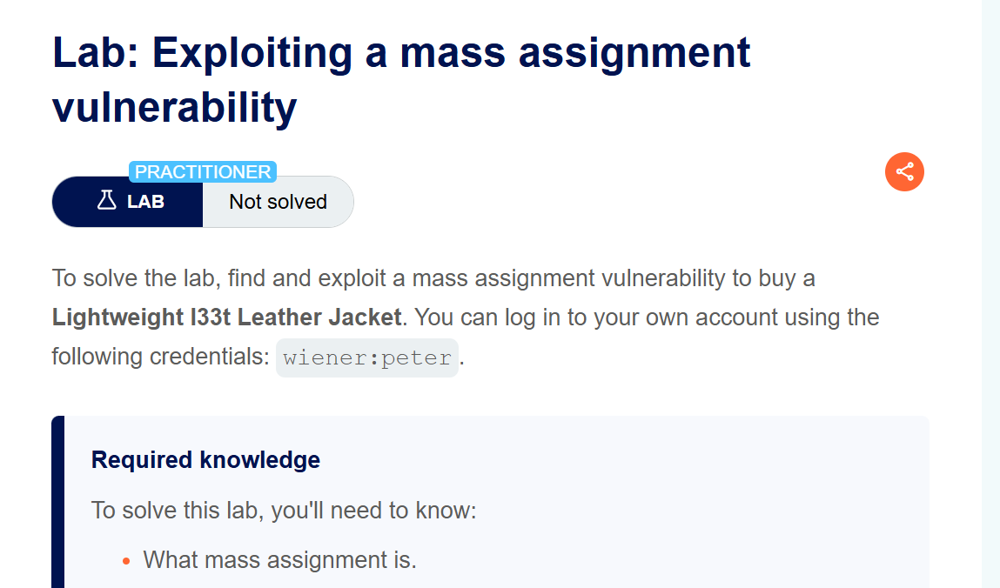
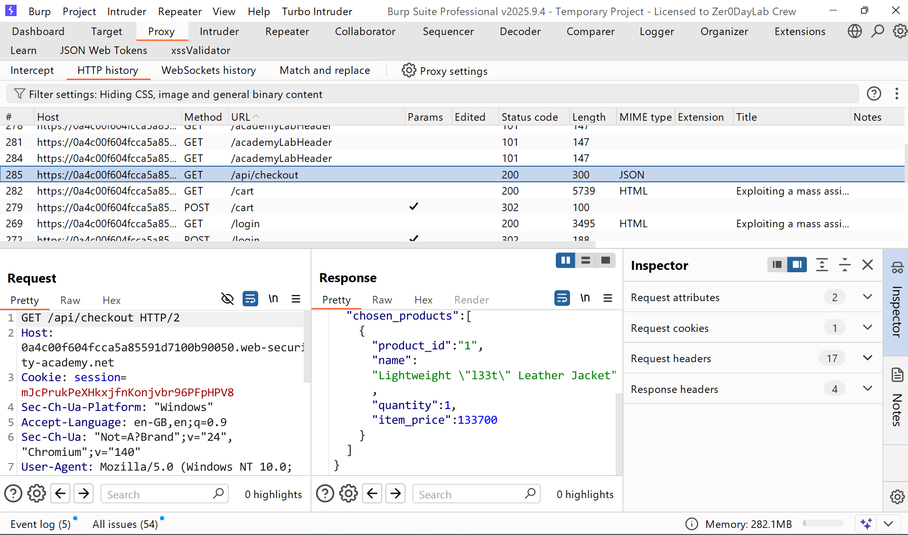
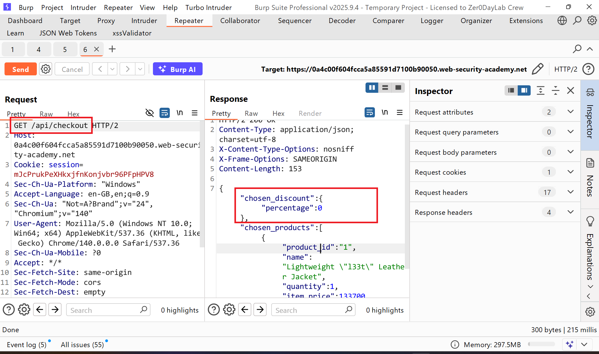
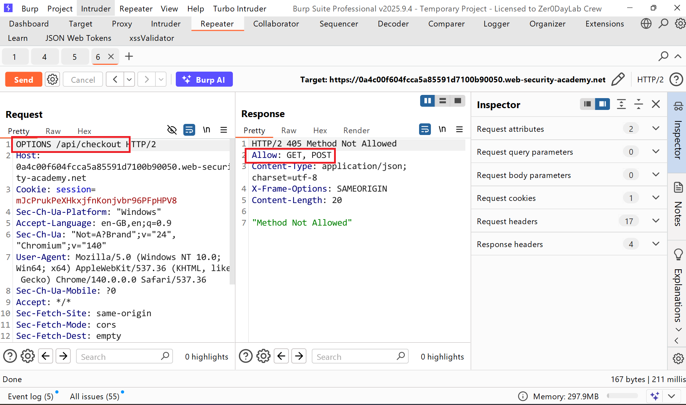
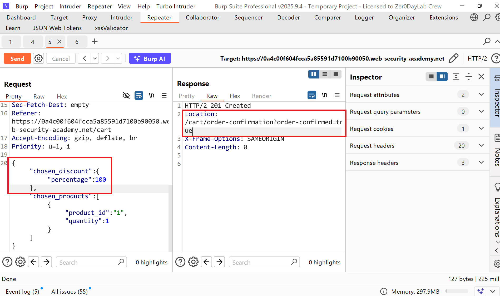
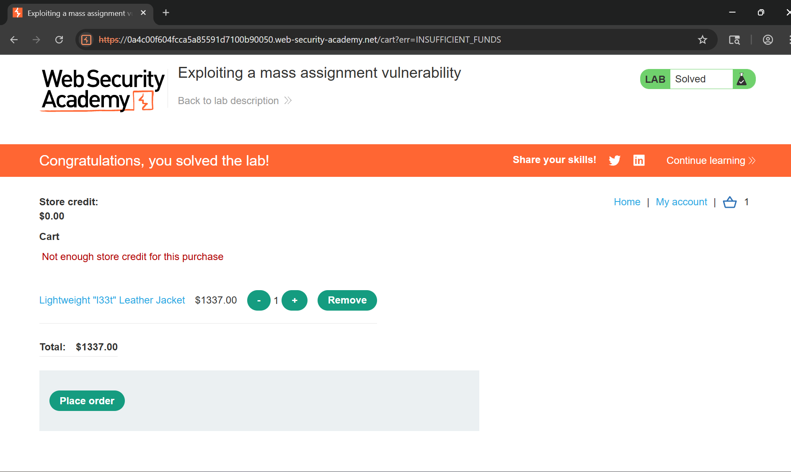

# Writeup LAB: Exploiting a mass assignment vulnerability

## Goal
Find and exploit a mass assignment vulnerability to buy a Lightweight l33t Leather Jacket.
## Khai thác
Trang chủ chúng ta cùng đăng nhập với `wiener:peter` và thực hiện order chiếc áo jacket và chúng ta có thể được 1 api `/api/checkout`

Ở api này có các trường tham số thú vị như `item_price` và `discount` với điều này sẽ ra sao nếu chúng ta khai thác phân bổ hàng loạt 

Xem xét các phương thức cho phép của ứng dụng chúng ta có thể thấy nó cho phép `GET` và `POST`

Vậy ở phương thức `POST` khi truyền nó lấy những giá trị tham số nào chúng ta có thể thấy như sau:
```json
{"chosen_products":[{"product_id":"1","quantity":1}]}
```
Vậy sẽ ra sao khi chúng ta gán phân công hàng loạt thêm trường discount giảm giá `100%` chiếc áo ở chức năng khi `POST` đi. và chúng ta có thể thấy khi khai thác phân công hàng loạt kết quả server nó order thành công và cái áo sẽ trwor thành giá free

Quay lại trang chỉnh khi khai thác thành công 
