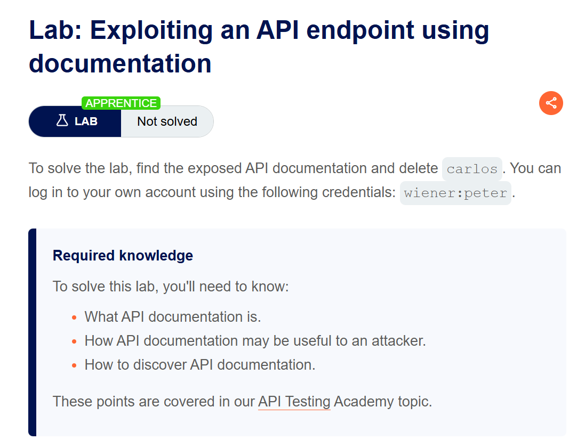
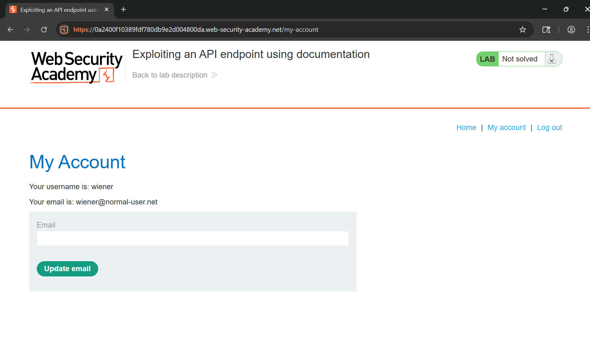
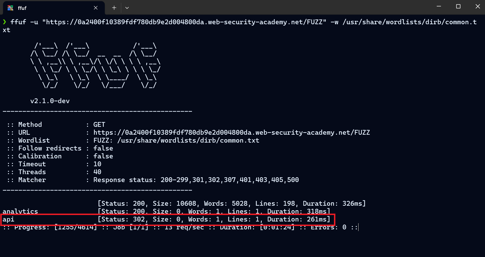
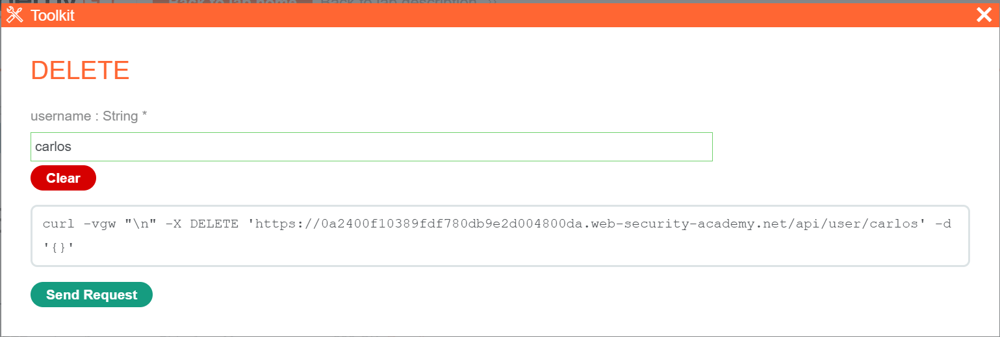
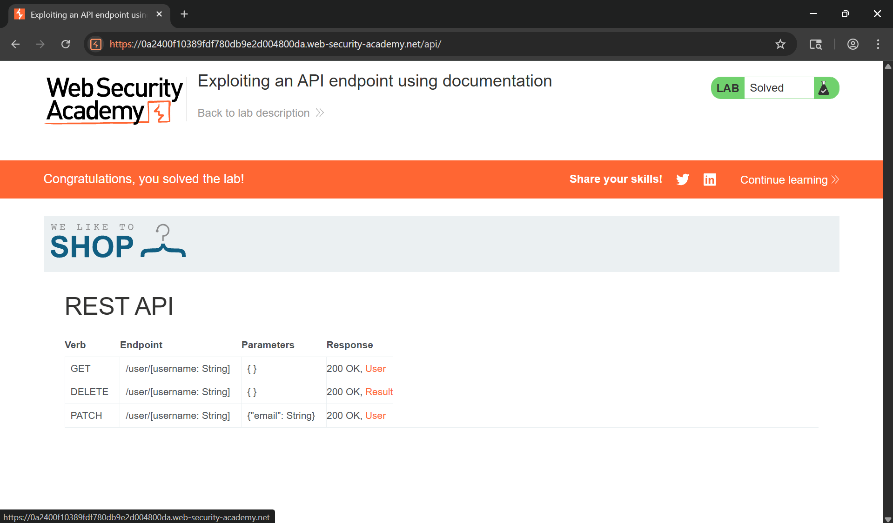

# Writeup LAB: Exploiting an API endpoint using documentation

## Goal
Mục tiêu tìm tài liệu API công khai và xóa người dùng `carlos` và có thể đăng nhập sau `wiener:peter`
## Khai thác
Trang chủ ứng dụng chúng ta tiếp theo đăng nhập với thông tin sau `wiener:peter`

Chúng ta thử tìm kiếm các thư mục ẩn với công cụ `ffuf` 
```txt
ffuf -u "https://0a2400f10389fdf780db9e2d004800da.web-security-academy.net/FUZZ" -w /usr/share/wordlists/dirb/common.txt
```
Chúng ta có thể thấy được 1 tuyến đường API có vẻ thú vị và có thể truy cập xem có gì đặc biệt

Khi truy cập chúng ta có thể thấy nó có các `REST API` đặc biệt với các phương thức `GET, DELETE, PATCH` với mục tiêu đề bài thì cần xóa người dùng carlos chúng ta có thể thấy phương thức `DELETE` là lý tưởng nhất

Thực hiện gửi request xóa người dùng
