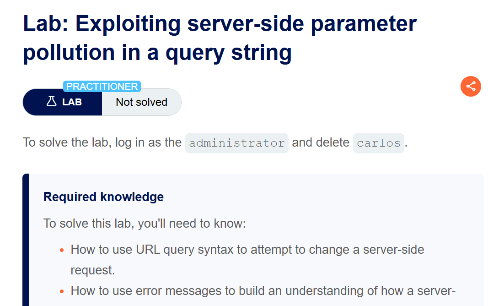
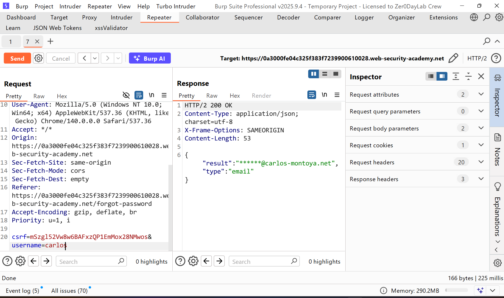
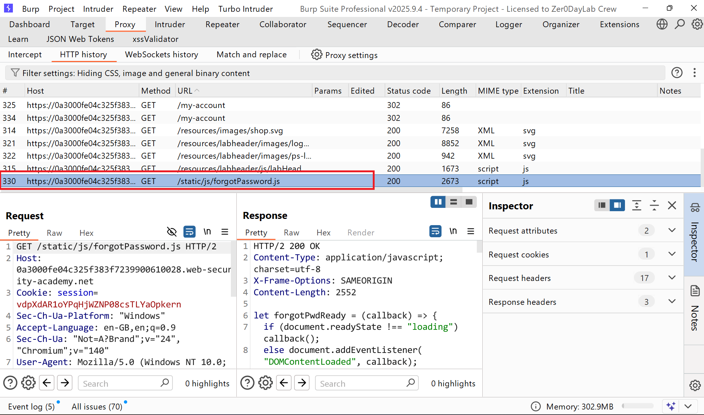
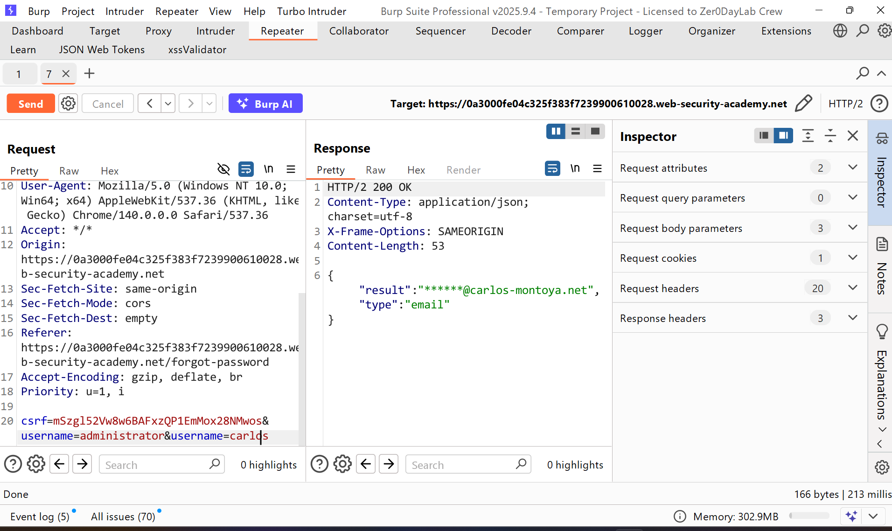
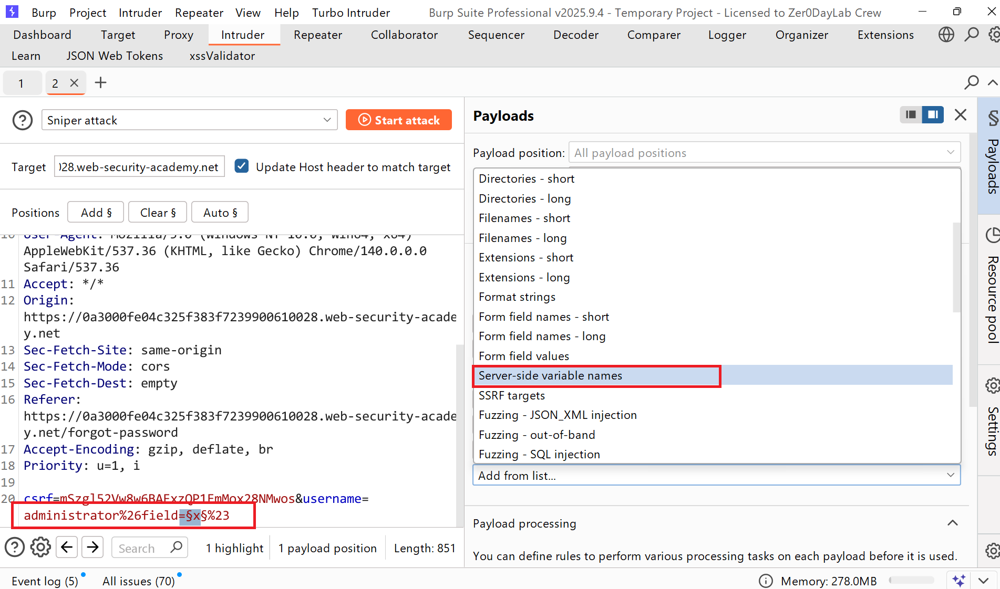
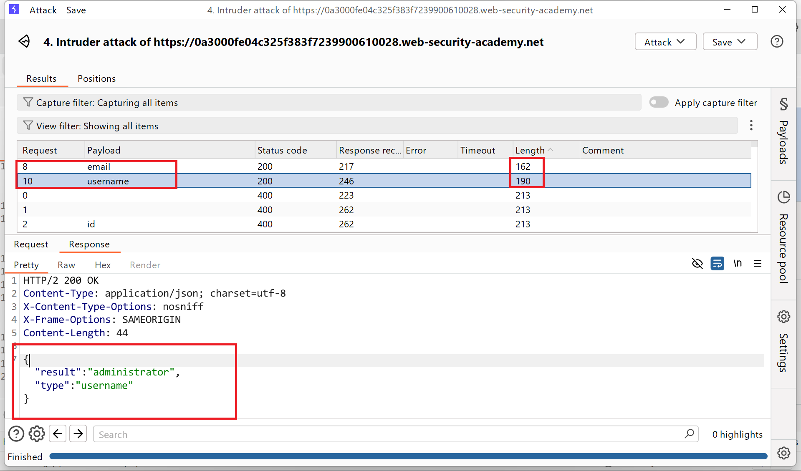
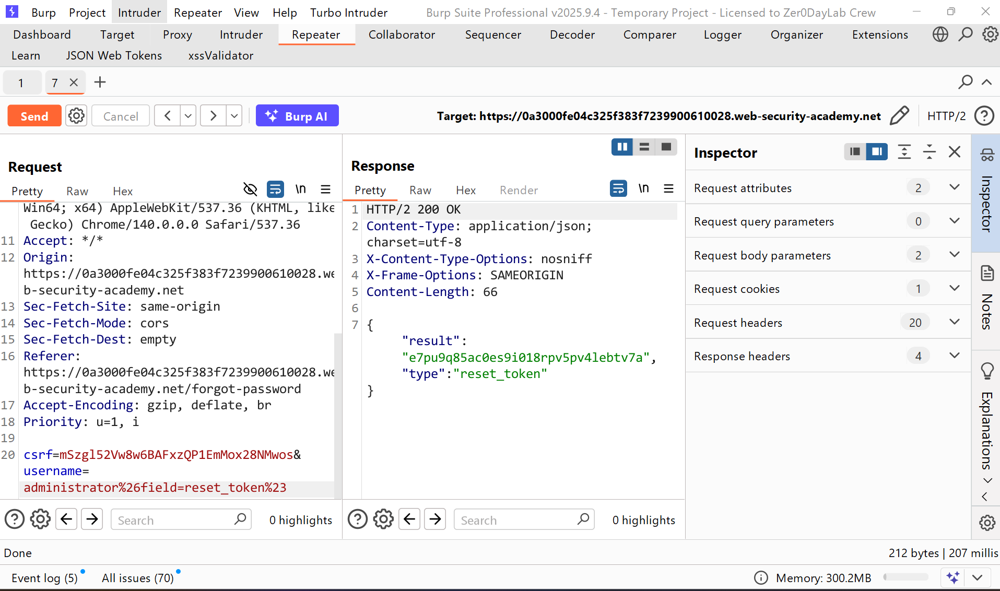
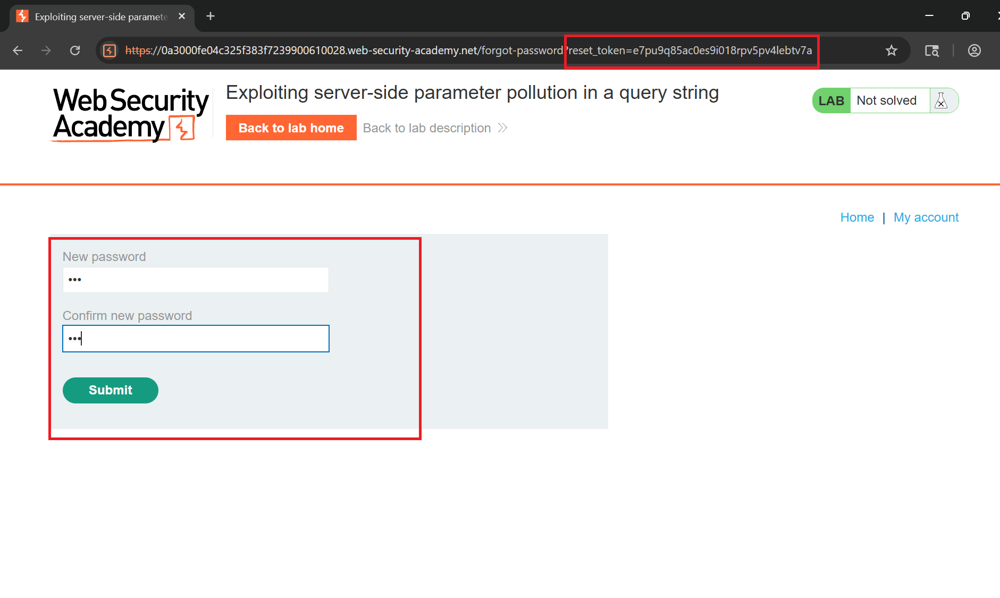
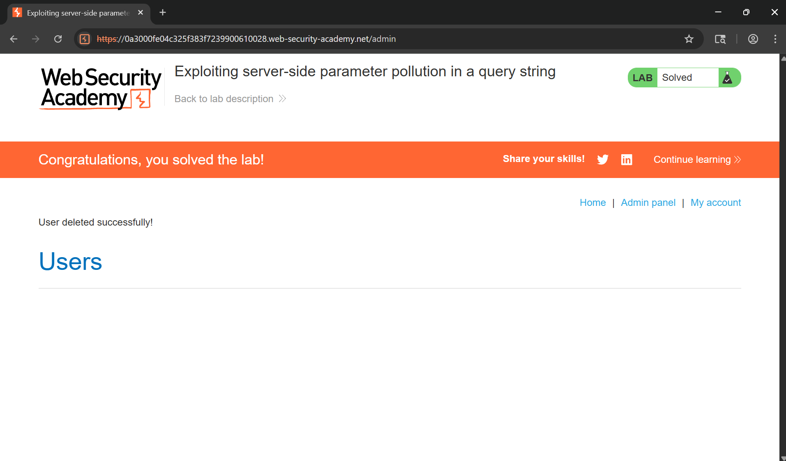

# Writeup LAB: Exploiting server-side parameter pollution in a query string

## Goal
To solve the lab, log in as the administrator and delete carlos.
## Khai thác
Chúng ta có thể truy cập chức năng `forgot_password` nhâp tên username carlos xem thử response trả về như sau

Và ở ứng dụng chúng ta có thể thấy 1 bản js logic về forgot chúng ta có thể tải xuống và phân tích mã nguồn

Ở đây có 1 tham số thú vị đó là `reset_token` bằng cách nào đó chúng ta leak được token của administrator chúng ta có thể đặt lại mật khẩu ở tuyến đường `/forgot-password?reset_token`
```js
forgotPwdReady(() => {
    const queryString = window.location.search;
    const urlParams = new URLSearchParams(queryString);
    const resetToken = urlParams.get('reset-token');
    if (resetToken)
    {
        window.location.href = `/forgot-password?reset_token=${resetToken}`;
    }
    else
    {
        const forgotPasswordBtn = document.getElementById("forgot-password-btn");
        forgotPasswordBtn.addEventListener("click", displayMsg);
    }
});
```
Bây giờ chúng ta có thể thấy khi tôi chèn thêm tham số `username=carlos` lúc này server nó sẽ nhận dạng phân tích username sau cùng 

Khi chúng ta nhập vào 
```txt
csrf=mSzgl52Vw8w6BAFxzQP1EmMox28NMwos&username=administrator%26x=y
```
repsonse trả về: 
```json
{"error": "Parameter is not supported."}
```
Thử cắt ngắn chuỗi `#` kết quả nhận được 
```json
{"error": "Field not specified."}
```
Điều này cho thấy truy vấn máy chủ có thể bao gồm các tham số bổ sung tên là `field` chúng ta có thể sửa đổi thành `administrator&field=x#` và kết quả trả về lỗi trường Invalid Field
```json
{"type":"ClientError","code":400,"error":"Invalid field."}
```
Tới đây sử dụng intruder bôi đen trường x và chọn `Payload config` chọn `Server side avarble`

Chúng ta có thể thấy được 2 trường hợp lệ là `username` và `email`

Vậy ở tệp js forgot_password chúng ta quay lại có thể thấy có trường `reset-token` chúng ta thử thay đổi `field=reset_token`

bây giờ chúng ta đã có token reset admin chúng ta truy cập điểm cuối đặt lại password của admin qua `/forgot-password?reset_token`

Bây giờ chúng ta cùng truy cập vào tài khoản quản trị và xóa người dùng `carlos`

