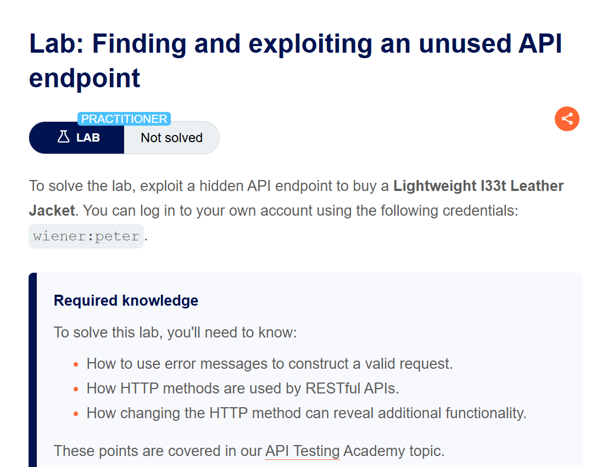
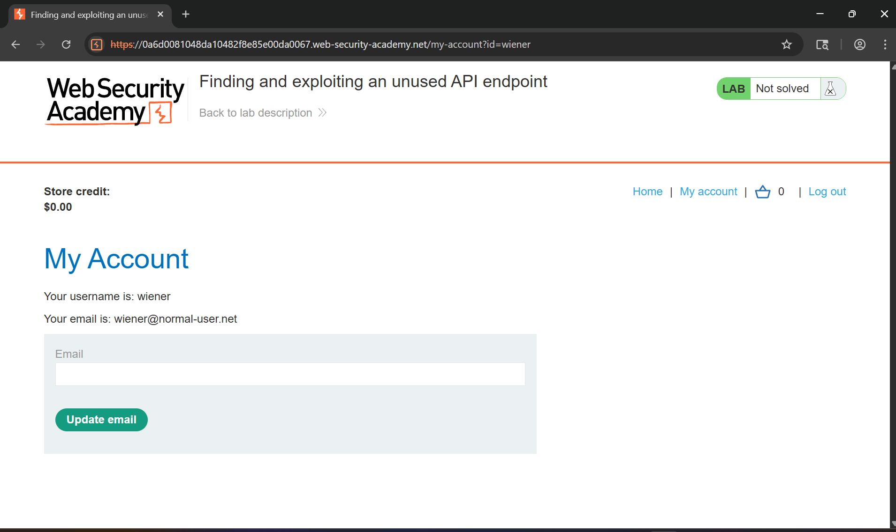
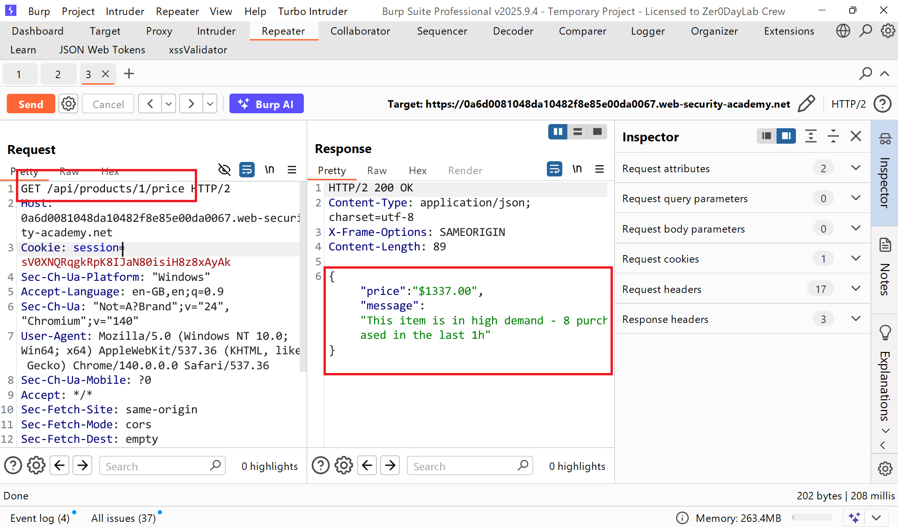
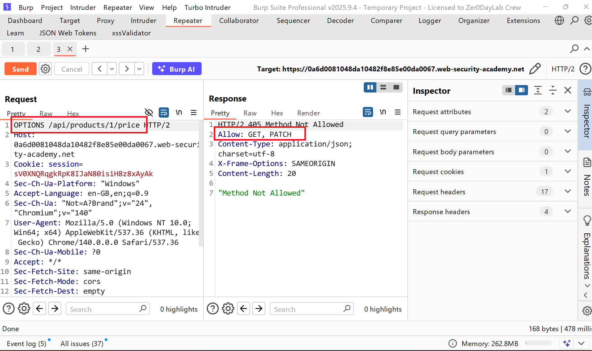
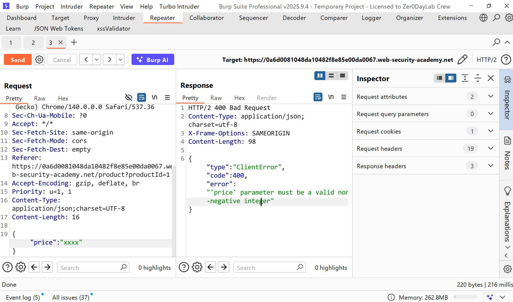
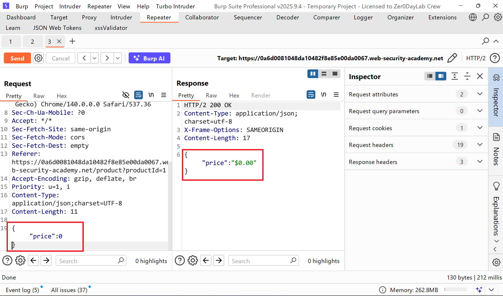
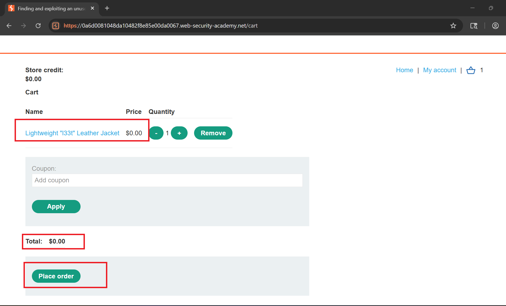
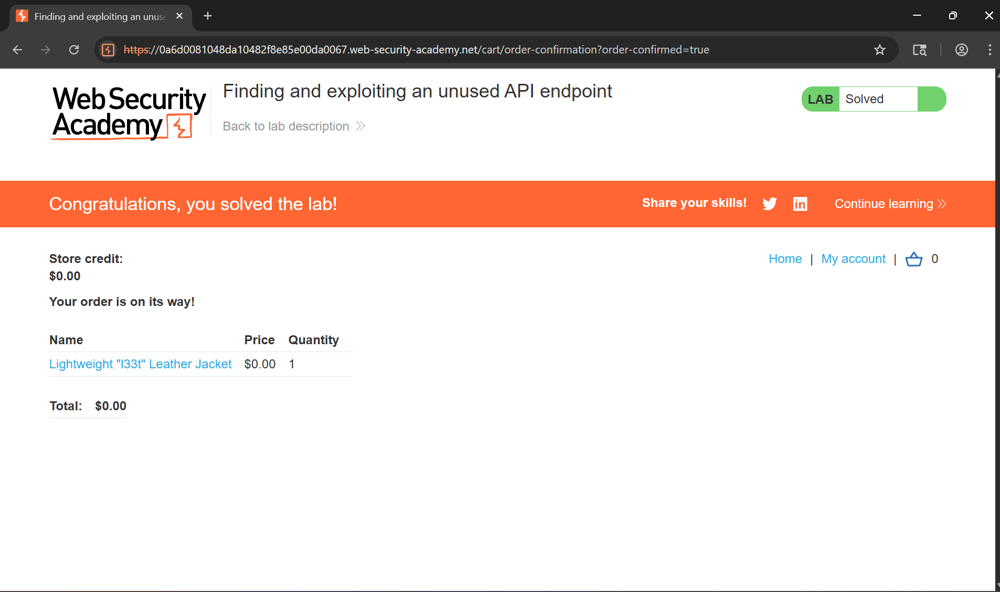

# Writeup LAB: Finding and exploiting an unused API endpoint

## Goal
Mục tiêu của LAB này khai thác điểm cuối ẩn API để mua  Lightweight l33t Leather Jacket
## Khai thác
Trang chủ của ứng dụng chúng ta cùng đăng nhập vào thông tin xác thực `wiener:peter`

Chúng ta thực hiện săn lùng với các API ẩn và khi đặt đơn hàng áo Jacket chúng ta có thể thấy được 1 API products như sau ở đây nó có 2 tham số cho api này là `price` và `message`

Tới đây tôi thực hiện thay đổi phương thức `GET` thành `OPTIONS` để xem api này cho phép những phương thức nào và chúng ta có thể thấy nó cho phép phương thức `PATCH`

Vậy sẽ ra sao nếu tôi sử dụng phươn thức `PATCH` để cập nhật `price` về giá 0đ chúng ta có thể kiểm chứng xem và chúng ta có thể thấy khi truyền tham số bất kì thì server response cần 1 giá trị interger chứng tỏ nó có ảnh hưởng đến logic ứng dụng

Khi đó tôi thay đổi giá trị mặt hàng này về 0đ kết quả server cập nhật giá trị mặt hàng này 0đ

Và quay trở lại trang chính chúng ta có thể thấy mặt hàng đã set 0đ tới đây chúng ta có thể mua mặt hàng free

Tiến hành place mặt hàng hoàn thành LAB
