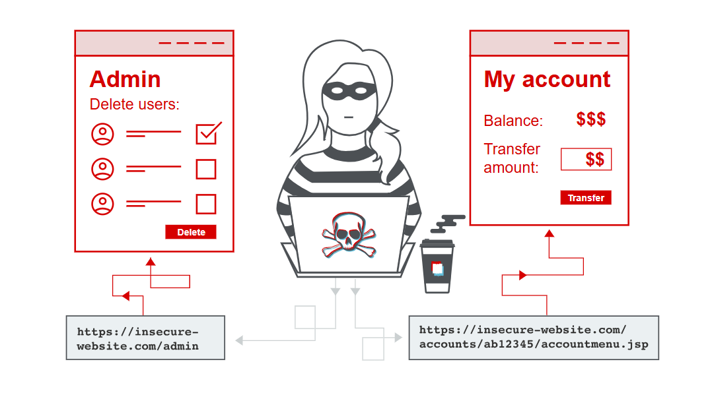

# Access control vulnerabilities and privilege escalation
Ở modul này sẽ nói đến các kĩ thuật
> Leo thang đặc quyền <br>
> Các loại lỗ hổng bảo mật có thể phát sinh liên quan đến kiểm soát truy cập <br>
> Làm thế nào để ngăn ngừa các lỗ hổng bảo mật trong kiểm soát truy cập <br>
## Kiểm soát truy cập là gì?
Kiểm soát truy cập là kiểu như áp đặt người dùng hoặc đối tượng được phép thực hiện hành động hoặc truy cập tài nguyên.
> Xác thực: GIúp người dùng nhận biết rằng họ chính là người mà họ tự xưng <br>
> Quản lý phiên: Xác định những yêu cầu HTTP tiếp theo nào đang được thực hiện bởi cùng một người  <br>
> Kiểm soát truy cập: Xác định xem người dùng có được phép cố gắng truy cập vào các tài nguyên trái phép hay không <br>
Lỗi kiểm soát truy cập rất phổ biến và thường gây ra lỗ hổng bảo mật nghiêm trọng.

## Kiểm soát truy cập theo chiều dọc
Kiểm soát truy cập theo chiều dọc là các cơ chế hạn chế quyền truy cập vào các chức năng nhạy cảm đối với các loài người cụ thể.
Với cơ chế kiểm soát truy cập theo chiều dọc, các loài người người dùng khác nhau sẽ có quyền truy cập vào các chức năng ứng dụng khác nhau.
## Kiểm soát truy cập theo chiều ngang
Kiểm soát truy cập theo chiều ngang là các cơ chế quyền hạn quyền truy cập vào tài nguyên cho những người dùng cụ thể.
Với cơ chế kiểm soát truy cập ngang, người dùng khác nhau có quyền  truy cập vào một tập hợp con tài nguyên cùng loại.
> Chẳng hạn như một ứng dụng ngân hàng sẽ cho phép người dùng xem giao dịch và thực hiện thanh toán của họ nhưng không cho phép truy cập vào tài nguyên của bất kỳ người dùng nào khác <br>
## Các lỗi kiểm soát truy cập
Lỗ hổng xảy ra người dùng có thể thực hiện truy cập trái phép thực hiện các hành động mà họ không được phép
### Leo thang đặc quyền theo chiều dọc
Nếu người dùng có thể truy cập vào các chức năng mà họ không được phép truy cập thì đó là leo thang đặc quyền theo chiều dọc
#### Chức năng không được bảo vệ
Leo thang đặc quyền theo chiều dọc phát sinh khi một ứng dụng không thực thi bất kỳ biện pháp bảo vệ nào cho các chức năng nhạy cảm
Một trang web có thể lưu trữ các chức năng nhạy cảm tại URL sau:
```http
https://example.com/admin
```
Thông tin có thể truy cập bởi tất cả người dùng nào.
Có thể lộ các enpoint như ở `robots.txt, sitemap.xml....` kẻ tấn công có thể sử dụng chức năng vét cạn 
Một ứng dụng lưu trữ:
```http
https://insecure-website.com/administrator-panel-yb556
```
Điều này đôi khi ứng dụng URL bị tiết lộ trong mã Javascript
```js
<script>
	var isAdmin = false;
	if (isAdmin) {
		...
		var adminPanelTag = document.createElement('a');
		adminPanelTag.setAttribute('href', 'https://insecure-website.com/administrator-panel-yb556');
		adminPanelTag.innerText = 'Admin panel';
		...
	}
</script>
```
## Phương pháp kiểm soát truy cập dựa trên tham số
> Một cánh đồng ẩn <br>
> Một chiếc bánh quy <br>
> Một tham số chuỗi truy vấn được thiết lập sẵn <br>
Ứng dụng đưa ra quyết định kiểm soát truy cập dựa trên giá trị được gửi vào. Ví dụ:
```http
https://insecure-website.com/login/home.jsp?admin=true <br>
https://insecure-website.com/login/home.jsp?role=1
```
## Lỗi kiểm soát truy cập do cấu hình nền tảng không chính xác.
Một ứng dụng thực thi kiểm soát truy cập ở lớp nền tảng. Chúng lafmd dược điều này bằng cách hạn chế quyền truy cập vào các URL và phương thức HTTP cụ thể dựa trên vai trò của người dùng.
Quy tắc cấu hình:
```txt
DENY: POST, /admin/deleteUser, managers
```
Nó chặn truy cập POST nhưng chúng ta có thể bỏ qua bằng cách hgi đè tiêu dề URL chẳng hạn như : `X-Original-URL, X-Rewrite-URL` ứng dụng cho phép ghi đề URL thì có thể vượt qua các biện pháp
```HTTP
POST / HTTP/1.1
X-Original-URL: /admin/deleteUser
...
```
## Lỗi kiểm soát truy cập do sự không khơp URL
Các trang web có thể khác nhau về mức độ nghiêm ngặt trong việc khớp đường dẫn của yêu cầu đến với một điểm cuối được xác định. Ví dụ, chúng có thể chấp nhận việc viết hoa không nhất quán, vì vậy yêu cầu tới `/ADMIN/DELETEUSER` vẫn có thể được ánh xạ đến `/admin/deleteUser` điểm cuối đó
Những sai lệch tương tự có thể phát sinh nếu các nhà phát triển sử dụng framework Spring đã bật `useSuffixPatterMathch` tùy chọn Điều này cho phép các đường dẫn có phần mở rộng tệp tùy ý được ánh xạ tới một điểm cuối tương đương không có phần mở rộng tệp. Nói cách khác, yêu cầu tới `/admin/deleteUser.anything` tới `/admin/deleterUser` Trước phiên bản Spring 5.3, tùy chọn này được bật theo mặc định.

Trên các hệ thống khác, bạn có thể gặp phải sự khác biệt trong việc liệu /admin/deleteUser và /admin/deleteUser/có được coi là các điểm cuối riêng biệt hay không. Trong trường hợp này, bạn có thể bỏ qua các kiểm soát truy cập bằng cách thêm dấu gạch chéo vào cuối đường dẫn.