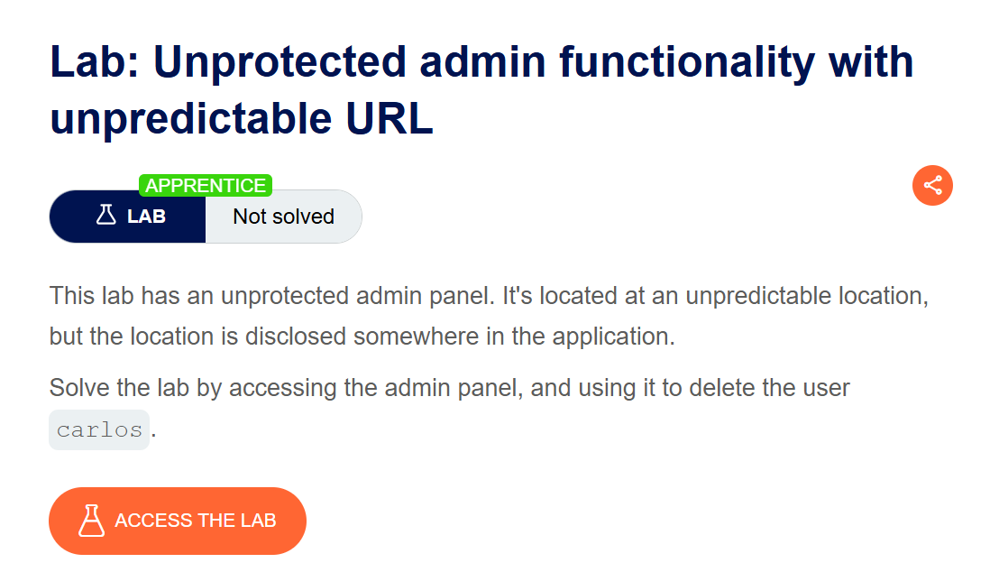
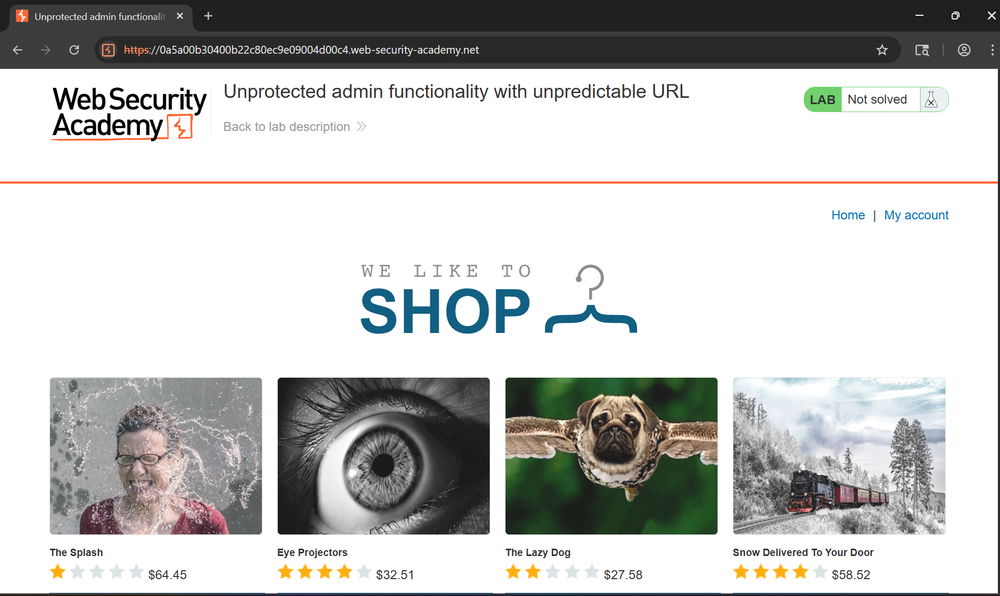
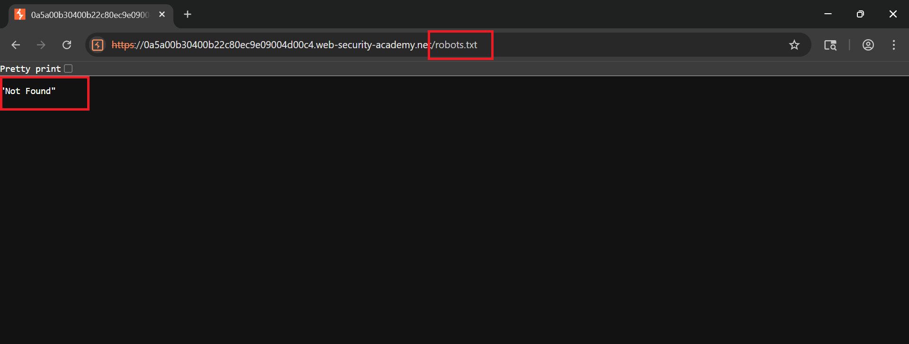
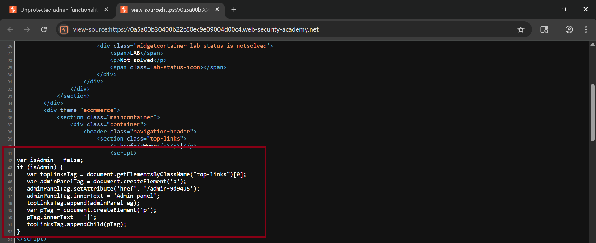
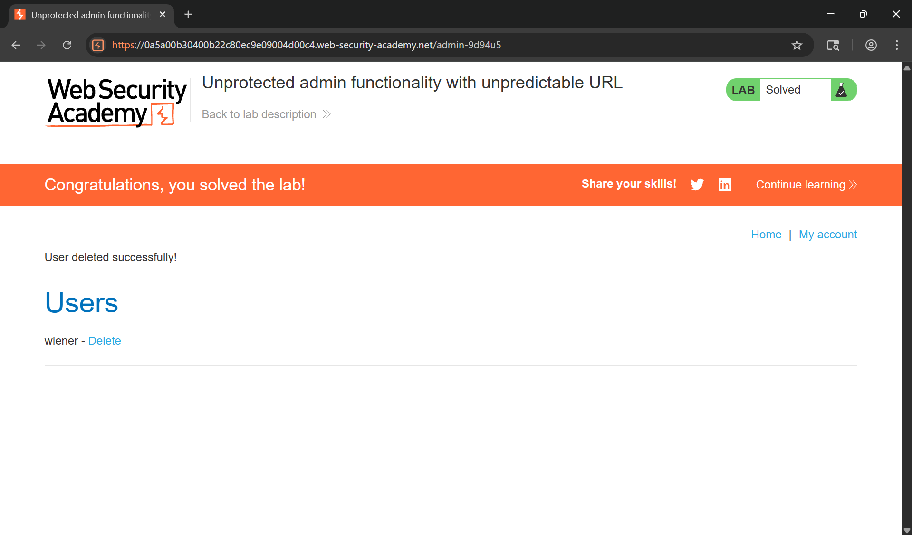

# Writeup LAB: Unprotected admin functionality with unpredictable URL

## Goal 
Mục tiêu LAB này chúng ta xử lí và truy cập vào admin kiểm soát truy cập không được xác thực và tiến hành xóa user `carlos` để hoàn thành LAB
## Khai thác
Trang chủ. Ở đây vẫn như các LAB chúng ta cùng truy cập vào các endpoint ẩn xem chứa thông tin nhạy cảm không bằng cách truy cập thẳng vào endpoint `/admin` hay `/robots.txt tìm endpoint ẩn`

Và ở đây chúng ta có thể thấy các endpoint này thực sự không tồn tại 

Vậy tôi tư hỏi răng liệu ứng dụng có để lộ thông tin chi tiết qua trong mã nguồn như file `HTML, CSS, JS` không sau khi tôi thử kiểm tra và thấy được đoạn js chứa thông tin đường dẫn admin như sau

Ở đoạn mã này nó tạo ra biến Element thuộc tính a với href nếu chúng ta truy cập endpoint `/admin-9d94u5` nó sẽ chuyển hướng chúng ta đến trang admin và cùng thực hiện và xóa user `carlos`
