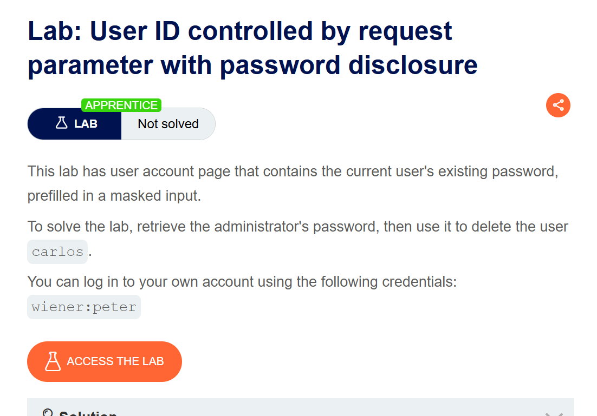
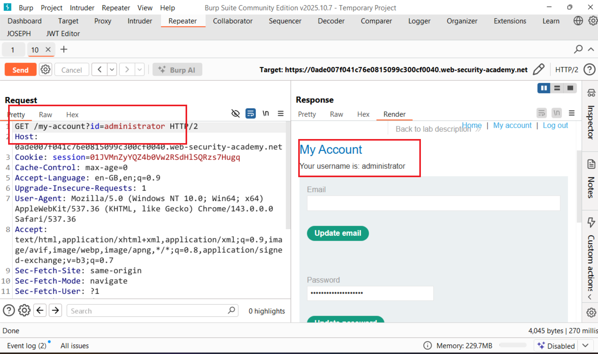
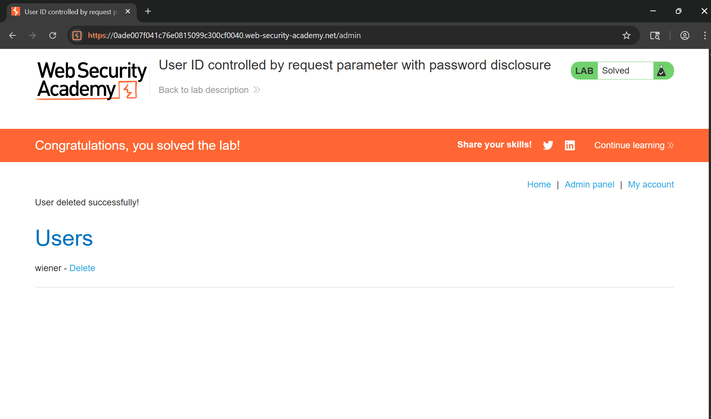

# Writeup LAB: User ID controlled by request parameter with password disclosure

## Goal
Mục tiêu LAB này chúng ta cần leo thang đặc quyền vào quản trị Update password quản trị và xóa tài khoản `carlos`
## Khai thác
Chúng ta cùng thực hiện đăng nhập với cred `wiener:peter` và ở ứng dụng này nó cho phép update password tôi tự hỏi răng nều chúng ta có thể thay đổi `id=administrator` thì điều gì sẽ xảy ra

Chúng ta có thể thấy chúng ta đã vào được administrator và tiến hành xóa tài khoản user `carlos`
