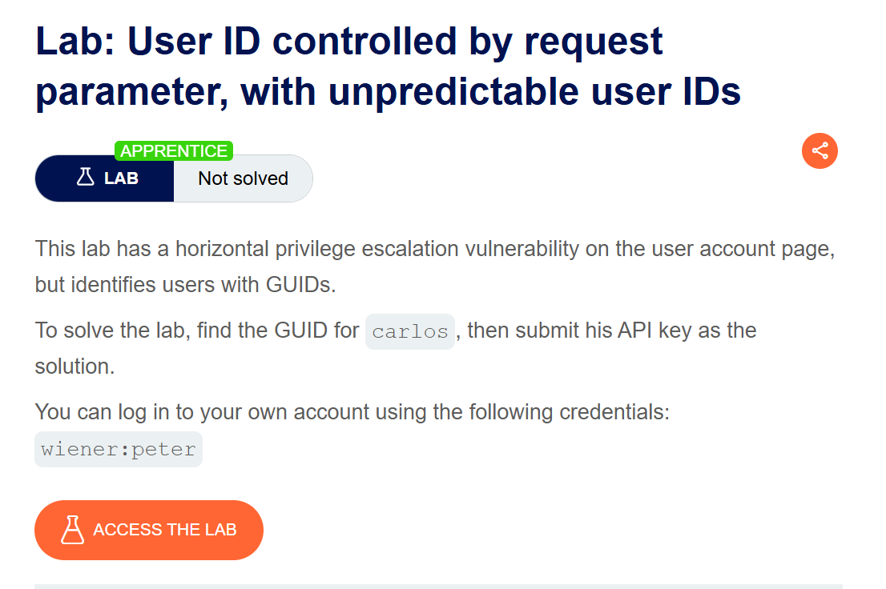
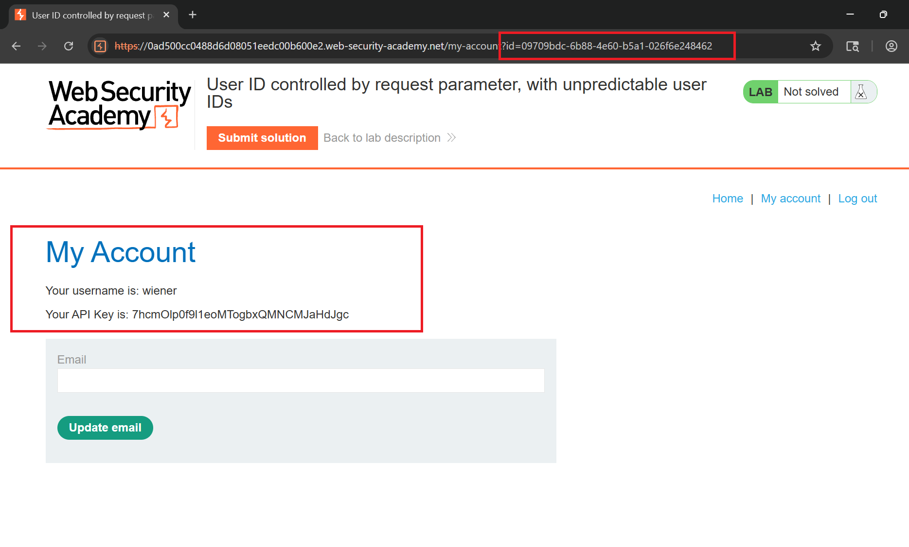
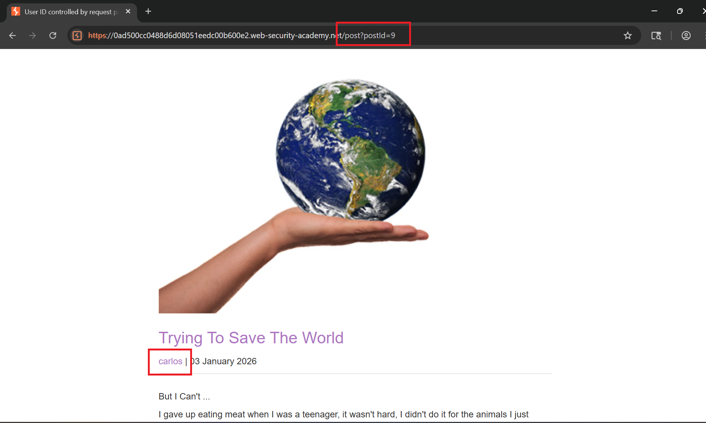
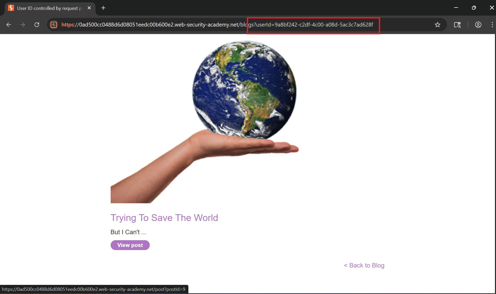
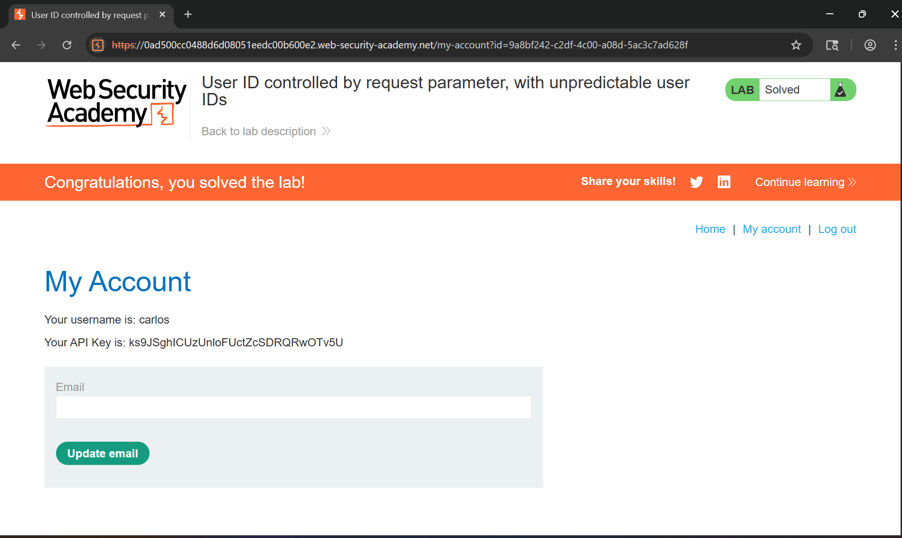

# Writeup Lab: User ID controlled by request parameter, with unpredictable user IDs

## Goal
Mục tiêu lab này chúng ta cần leo thang đặc quyền tìm kiếm GUID của `carlos`
## Khai thác
Ở lab nay nó xác định Id theo người dùng bằng GUID chúng ta cùng truy cập vào LAB với thông tin xác thực `wiener:peter` và chúng ta có thể thấy id chúng ta được xác định theo GUID thay vì tên wiener thông thường 

Bây giờ chúng ta có thể hỏi rằng có thể lộ user id của `carlos` chỗ nào đó không chúng ta đi vào truy cập các bài POST của người dùng và thấy rằng có một user `carlos` đã post một bài viết sau

Sau khi truy cập POST của carlos chúng ta có thể thấy rằng userid của carlos đã bị leak và chúng ta có thể thay đổi userid này vào wiener để có thể truy cập vào tài khoản carlos

Thực hiện thay đổi và truy cập tài khoản `carlos`
