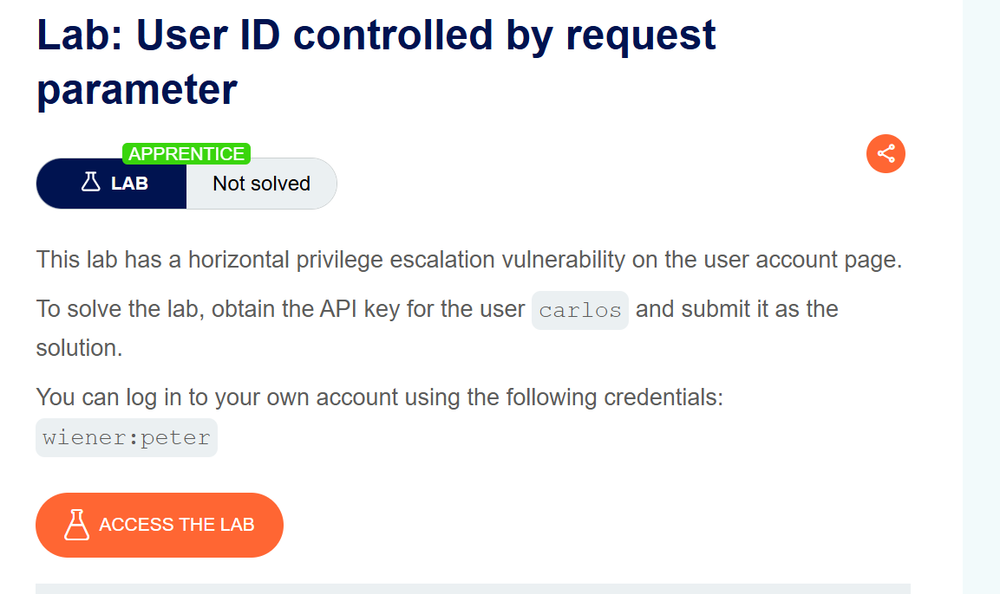
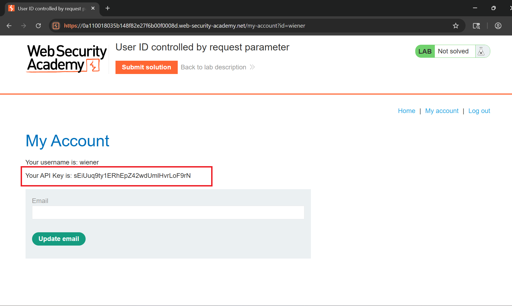
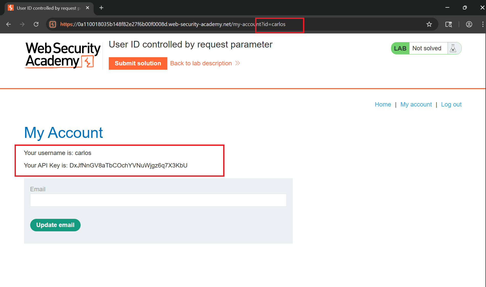
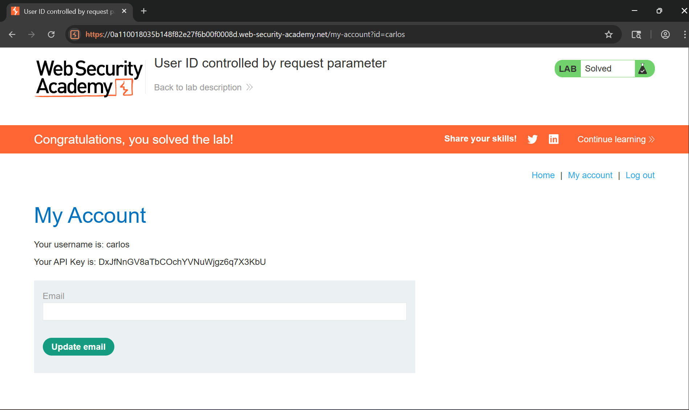

# Writeup LAB: User ID controlled by request parameter

## Goal
Mục tiêu LAB này bằng cách nào đó chúng ta cần leo thang đặc quyền vào tài khoản `carlos` lấy API KEY và nộp hoàn thành lab
## Khai thác
Ban đầu chúng ta có thể đăng nhập với tài khoản đã xác thực `wiener:peter` và chúng ta có thể thấy được API Key tương ứng với wiener

Vậy sẽ ra sao chúng ta có thể thay đổi `id=wiener` thành `id=carlos` và kết quả chúng ta có thể thấy đã co thể truy cập vào user `carlos` với `apikey lộ`

Tiến hành submit `api_key` và hoàn thành LAB
