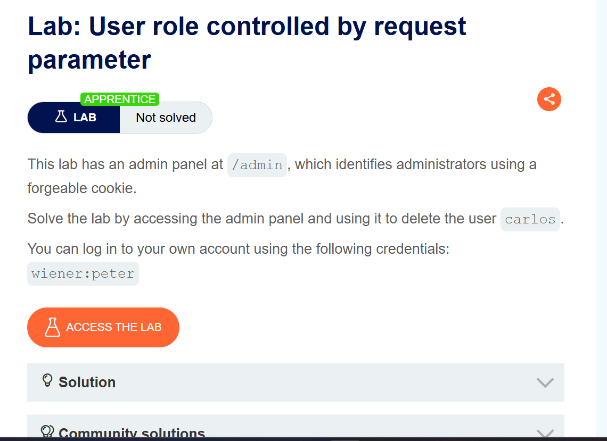
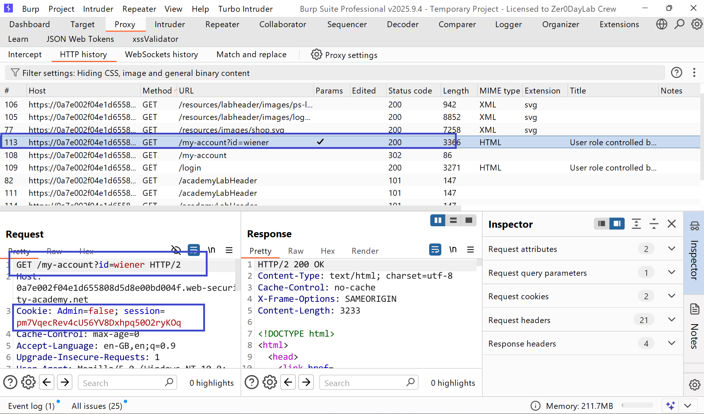
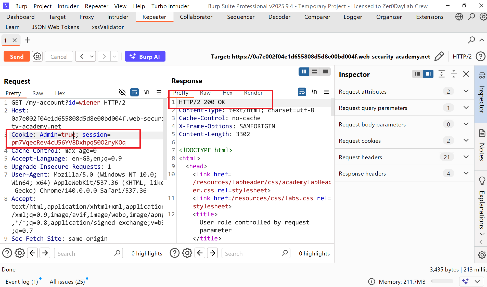
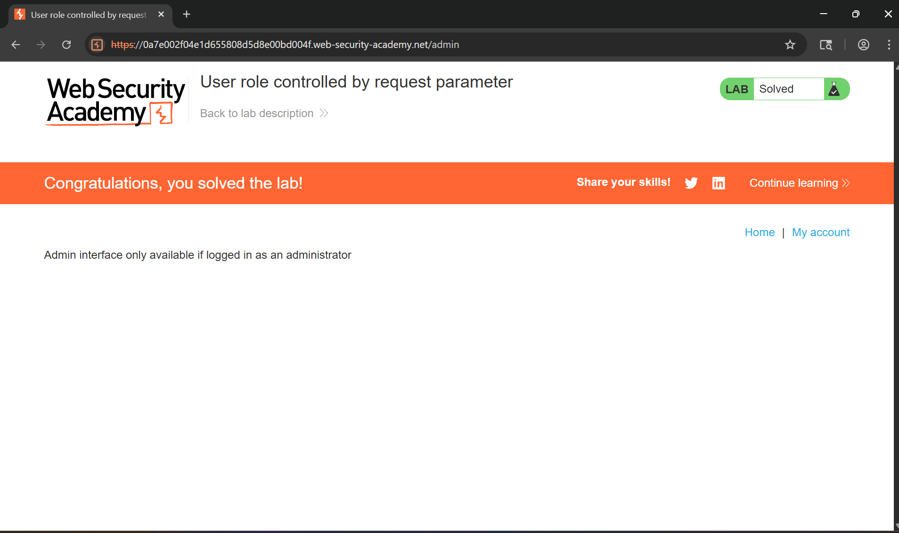

# Writeup LAB: User role controlled by request parameter

## Goal
Mục tiêu lab này người dùng giả định xác định cookie giả mạo để có thể truy cập vào admin có thể xóa người dùng `carlos` để hoàn thành LAB
## Khai thác
Đầu tiên chúng ta có thể đăng nhập tài khoản được cấp `wiener:peter` và sau khi đăng nhập lịch sử HTTP Burp cho thấy được những tham số đáng chú ý

Ở đây chúng ta có thể tham số `Admin được set thành False` bằng cách đó chúng ta có thể thay đổi set `Admin=True` và xem điều gì sẽ xảy ra và kết quả cho thấy response trrar về 200

Bây giờ chúng ta có thể truy cập bảng quản trị và xóa user `carlos`
