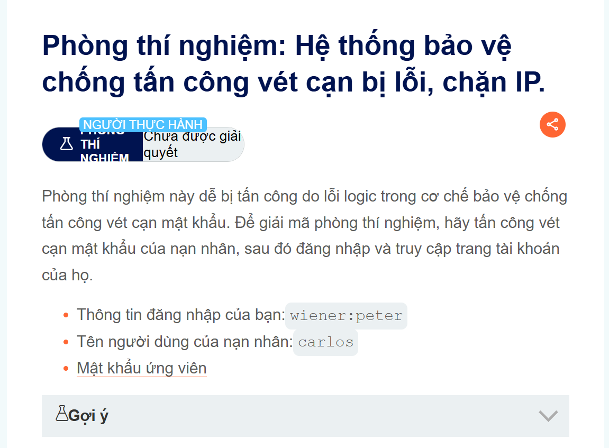
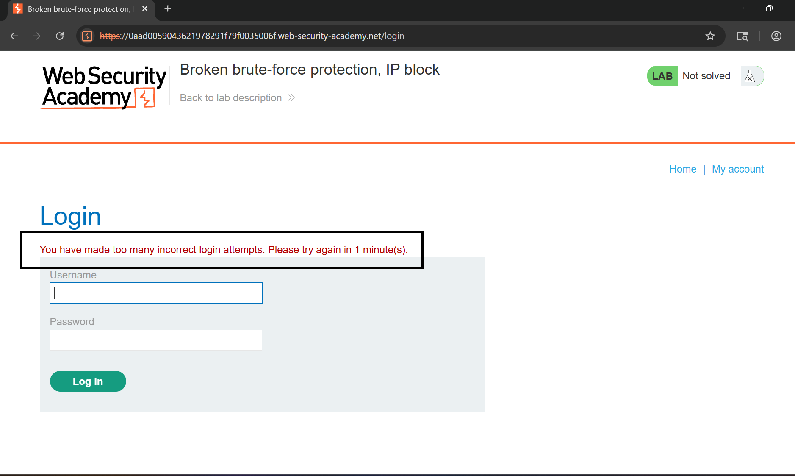
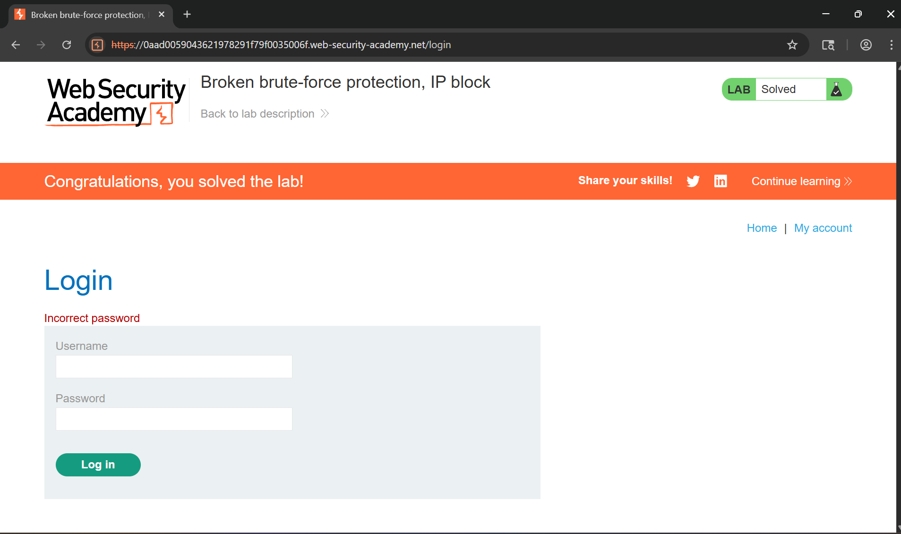

# Writeup LAB Hệ thống bảo vệ chống tấn công vét cạn bị lỗi, chặn IP.

# Goal 
Mục tiêu để hoàn thành LAB này bypass logic IP để tấn công vét cạn mật khẩu nạn nhân, sau đó đăng nhập và truy cập trang tài khoản của họ.
# Khai thác
Ở đay họ cung cấp một thông tin xác thực cho chúng tôi `wiener:peter` và tiến hành đăng nhập sau đó tôi logout và thử nhiều lần đăng nhập sai. Thì kết quả bị chặn

Và sau một phút tôi thử đăng nhập hợp lệ lại và logout thì kết quả nó đã đặt lại IP của chúng tôi.
Bằng cách này tôi sẽ viết script python tấn công vét cạn password với username `carlos` bằng cách nếu bị block IP tôi sẽ đăng nhập vào taifk hoản hợp lệ sau đó nó sẽ đặt lại IP của chúng tôi và có thể vượt qua rào cản này.
Thu được `[+] Found Password Of Carlos: qwerty` tiến hành đăng nhập với tài khoản này và hoàn thành LAB

