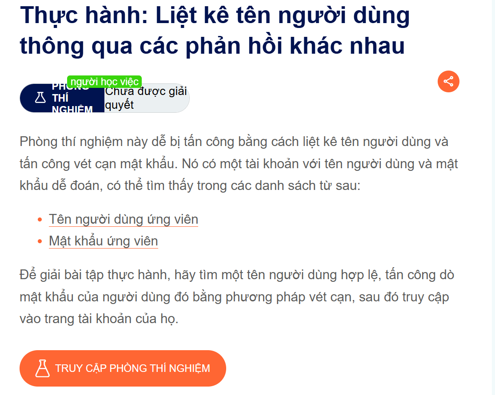
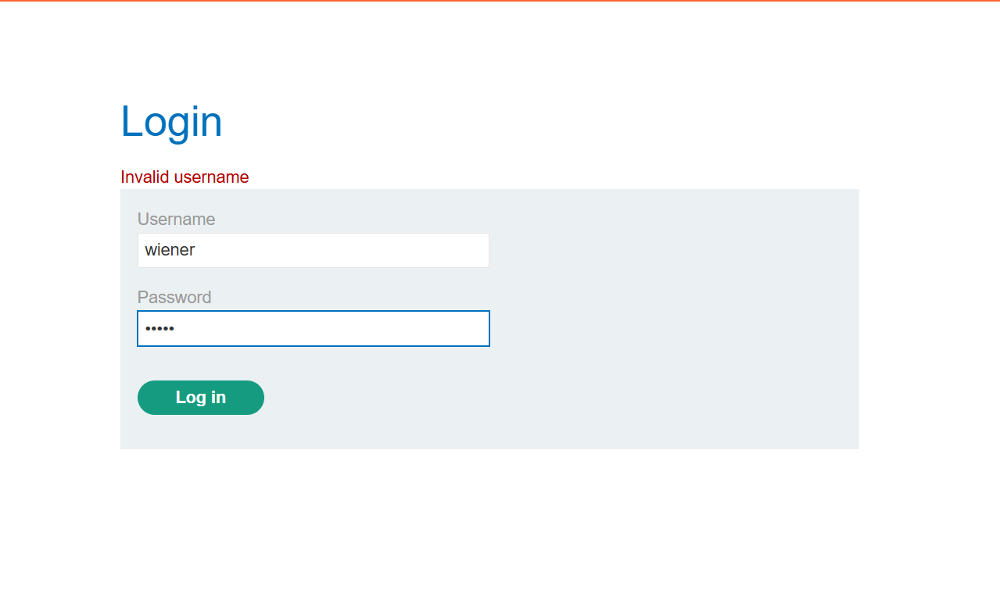
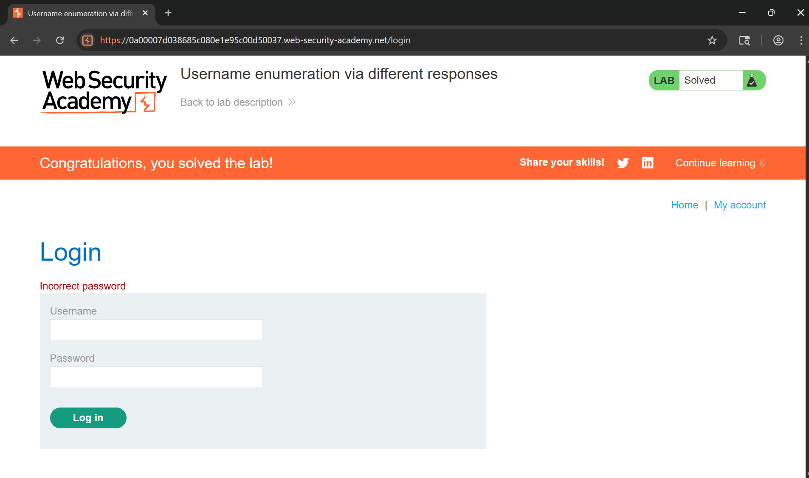

## Writeup LAB: Liệt kê tên người dùng thông qua các phản hồi khác nhau

## Goal
Để giải được bài lab này mục tiêu chúng ta phải tìm được tên người dùng hợp lệ, tấn công dò mật khẩu của người dùng đó bằng phương pháp vét cạn, sau đó truy cập vào tài khoản của họ.
## Khai thác

Chúng ta thực hiện đăng nhập với thông tin bất kì như sau
> username=wiener&password=peter

Như bạn đã thấy, khi chúng ta nhập sai tên người dùng, hệ thống sẽ báo lỗi: "`Invalid username`". Với thông tin đó, chúng tôi sẽ liệt kê tất cả tên người dùng thông qua một danh sách tên người dùng lab đã đề cập tới.
Để làm được điều đó, tôi sẽ viết một mã python sau để liệt kê username hợp lệ ở file: `solve_find_username.py` thu được [+] Found user: `arlington`
Tiếp theo thực hiện như vậy và tấn công vét cạn password khi đã biết user và tấn công liệt kê password hợp lệ ở file: `solve_find_password.py` thu được kết quả: [+] Found Password User arlington: `soccer` và tiến hành đăng nhập để hoàn thành lab

