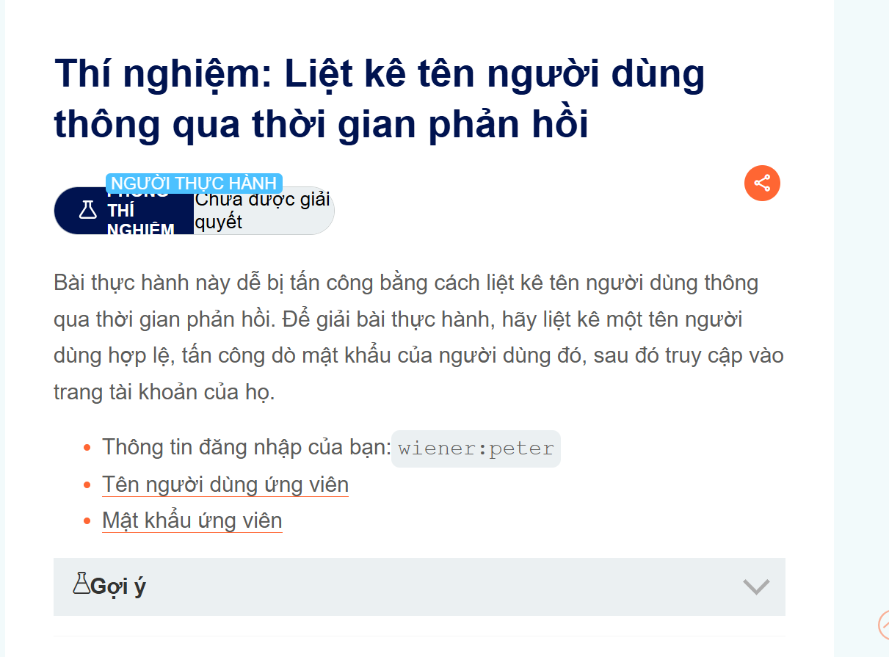
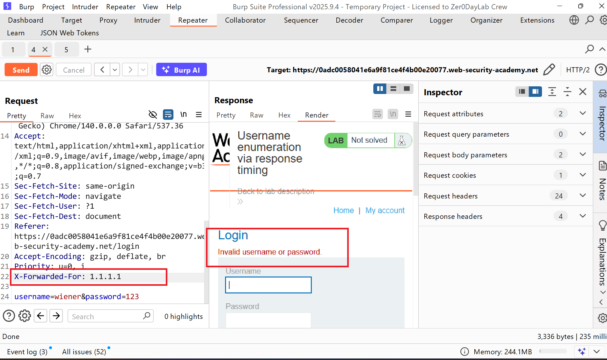
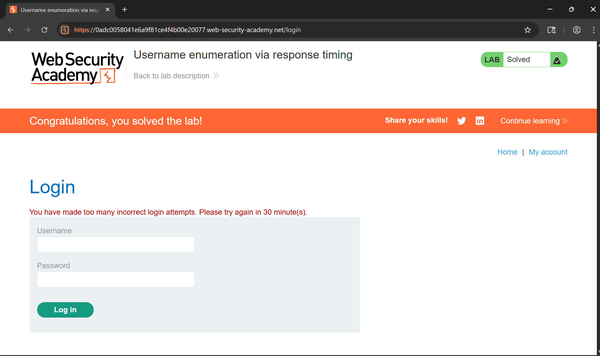

# Writeup Liệt kê tên người dùng thông qua thời gian phản hồi

# Goal
Lab này mục tiêu là liệt kê một tên người dùng hợp lệ, tấn công dò mật khẩu của người dùng đó, sau đó truy cập vào trang tài khoản của họ.
# Khai thác. 
Ở đây có 1 thông tin xác thực đã được cho sẵn với username, password: `wiener:peter`
Sau khi tôi đăng nhập với nhiêu giá trị sai thì kết quả nó trả về một thông báo lỗi: `You have made too many incorrect login attempts. Please try again in 30 minute(s).` nó chặn IP 
Nhưng để bỏ qua điều này tôi đã thực hiện một header đơn giản để bo qua xác thực IP bị chặn của tôi đó là `X-Forwarded-For: 1.1.1.1` sau khi thực hiện với header đó kết quả như sau đã quay trở lại bình thường.

Với những điều đã nói như thế chúng ta có thể tận dụng với header đó để thực hiện tấn công vét cạn tìm kiếm username hợp lệ đúng không.
Kết quả `solve_find_username.py` thu được `[+] Found user: antivirus` tiếp theo thực hiện tấn công vét cạn password khi thu được user ở file `solve_find_password.py` thu được `[+] Found password: daniel`
Tiến hành đăng nhập vào tài khoản này và hoàn thành LAB.
