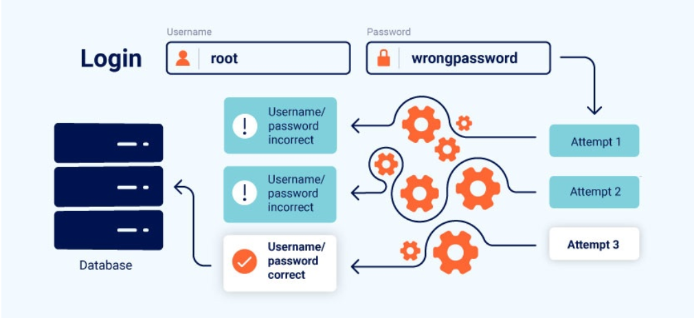

# Business logic vulnerabilities

## Các lỗ hổng logic là sao?
Là quá trình lỗi logic được thiết kế và triển khai ứng dụng cho phép kẻ tấn công gây ra các hành vi không mong muốn. Điều này có khả năng cho phép kẻ tấn công thao túng các chức năng hợp pháp để đạt được mục đích xấu
Những lỗ hổng cực kì nguy hiểm chẳng hạn như cho phép kẻ tấn công vượt qua các quy tắc có thể giao dịch mà không cần trải qua quy trình mua hàng dự định. Kẻ tấn công có thể khiến ứng dụng thực hiện điều gì đó mà nó không được phép làm.
## Các lỗ hổng logic nghiệp vụ phát sinh như thế nào
Thường sẽ đưa ra một giả định tương tác sai lầm về cách người dùng tương tác với ứng dụng.
> Ví dụ, nếu các nhà phát triển cho rằng người dùng sẽ chỉ truyền dữ liệu thông qua trình duyệt web, ứng dụng có thể hoàn toàn dựa vào các cơ chế kiểm soát phía máy khách yếu để xác thực dữ liệu đầu vào. Những cơ chế này dễ dàng bị kẻ tấn công vượt qua bằng cách sử dụng máy chủ proxy chặn.

## Các lỗ hổng logic nghiệp vụ gây ra những ảnh hưởng gì?
Về cơ bản, tác động của bất kỳ lỗi logic nào phụ thuộc vào chức năng mà nó liên quan. Nếu nó lỗi trong cơ chế xác thực, điều này có thể ảnh hưởng nghiêm trọng đến an ninh tổng thể.
Kẻ tấn công có thể leo thang đặc quyền hoặc bỏ qua hoàn toàn quá trình xác thực, từ đó truy cập vào dữ liệu và chức năng nhạy cảm.
## Cách phòng ngừa các lỗ hổng logic nghiệp vụ
> Hãy đảm bảo các nhà phát triển và người kiểm thử hiểu rõ lĩnh vực mà ứng dụng phục vụ.
> Tránh đưa ra những giả định ngầm về hành vi người dùng hoặc hành vi của các phần khác trong ứng dụng.

## Sự tin tưởng thái quá vào các cơ chế điều khiển phía máy khách
Giả định sai lầm cơ bản là người dùng chỉ tương tác với ứng dụng thông qua giao diện web được cung cấp. Tuy nhiên kẻ tấn công có thể dễ dàng sử dụng các công cụ chặn Proxy đặc biệt như: Burp Proxy để can thiệp vào dữ liệu trước khi truyền đi đến server. Điều này khiến cho các điều khiển phía máy khách trở nên vô dụng.
> Việc chấp nhận dữ liệu mù quáng, không thực hiện kiểm tra tính toàn vẹn và xác thực phía máy chủ đúng cách, có thể cho phép kẻ tấn công gây ra đủ loại thiệt hại với nỗ lực tương đối tối thiểu.

## Không xử lý được đầu vào không thông thường
Một mục tiêu của logic ứng dụng là hạn chế đầu vào của người dùng chỉ cho phép các giá trị tuân thủ các quy tắc nghiệp vụ.
Ví dụ, một kiểu dữ liệu số có thể chấp nhận giá trị âm. Tùy thuộc vào chức năng liên quan, logic nghiệp vụ có thể không cho phép điều này. Tuy nhiên, nếu ứng dụng không thực hiện xác thực phía máy chủ đầy đủ và từ chối đầu vào này, kẻ tấn công có thể truyền vào một giá trị âm hay hành động không mong muốn.
> Giả sử bài toán việc chuyển tiền giữa 2 tài khoản ngân hàng. Chức năng gần đây như chắc chắn sẽ kiểm tra người dùng người gửi có đủ tiền trong tài khoản trước khi hoàn tất giao dịch

```php
$transferAmount = $_POST['amount'];
$currentBalance = $user->getBlance();
if ($transferAmount <= $currentBalance>){
    // Complete
}else{
    // Block
}
```
Nếu hệ thống logic không đủ khả năng ngăn người dùng cung cấp giá trị âm trong amount tham số , kẻ tấn công có thể chuyên  -1000 đô la vào tài khoản của nạn nhân, điều này có thể dẫn đến việc chúng nhận được 1000 đô la từ nạn nhân. Hệ thống logic sẽ luôn đánh giá rằng -1000 nhỏ hơn số dư hiện tại và chấp thuận chuyển khoản.
## Đưa ra những giả định sai lầm về hành vi người dùng
### Người dùng đáng tin cậy không phải lúc nào cũng giữ được sự đáng tin cậy.
Nếu các quy tắc nghiệp vụ và biện pháp bảo mật không được áp dụng nhất quán trong toàn bộ ứng dụng, điều này có thể dẫn đến những lỗ hổng nguy hiểm mà kẻ tấn công có thể khai thác.
## Sự không nhất quán của trình phân tích địa chỉ email
Một số trang web phân tích địa chỉ email để trích xuất tên miền và xác định chủ sở hữu email thuộc tổ chưc nào. Tuần thủ địa chỉ hợp lệ chuẩn RFC
> Những sai sót trong cách phân tích địa chỉ email có thể làm suy yếu logic này. Những sai sót này phát sinh khi các thành phần khác nhau của ứng dụng xử lý địa chỉ email
> Kẻ tấn công có thể khai thác những điểm khác biệt này bằng cách sử dụng các kỹ thuật mã hóa để che giấu một phần địa chỉ email. Điều này cho phép kẻ tấn công tạo ra các địa chỉ email vượt qua các kiểm tra xác thực ban đầu nhưng lại được hệ thống phân tích cú pháp của máy chủ hiểu theo cách khác.
> Tác động chính của những sai sót trong trình phân tích địa chỉ email là việc truy cập trái phép. Kẻ tấn công có thể đăng ký tài khoản bằng các địa chỉ email có vẻ hợp lệ từ các miền bị hạn chế. Điều này cho phép chúng truy cập vào các khu vực nhạy cảm của ứng dụng, chẳng hạn như bảng quản trị hoặc các chức năng người dùng bị hạn chế

Để biết thêm thông tin chi tiết theo dõi BLOG
<a href="https://portswigger.net/research/splitting-the-email-atom">Phân tách cấu trúc email: khai thác trình phân tích cú pháp để vượt qua các biện pháp kiểm soát truy cập.</a>

