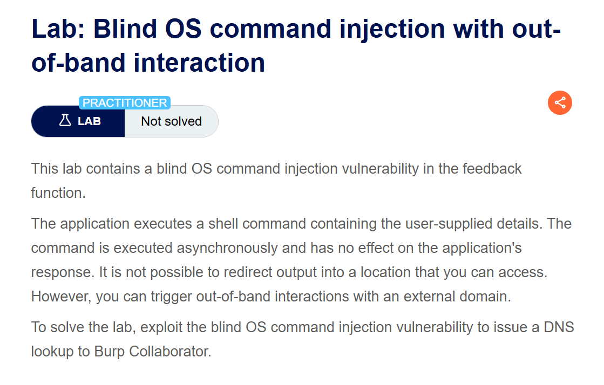
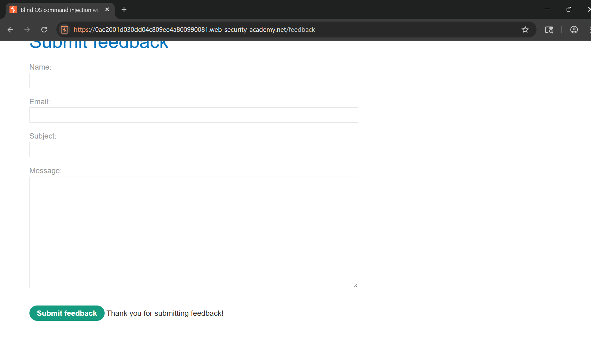
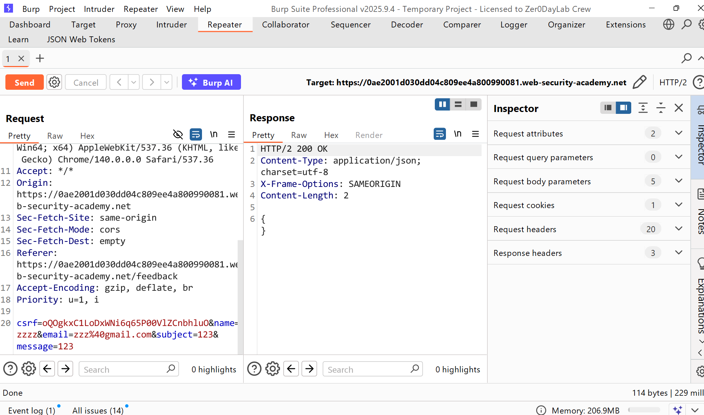
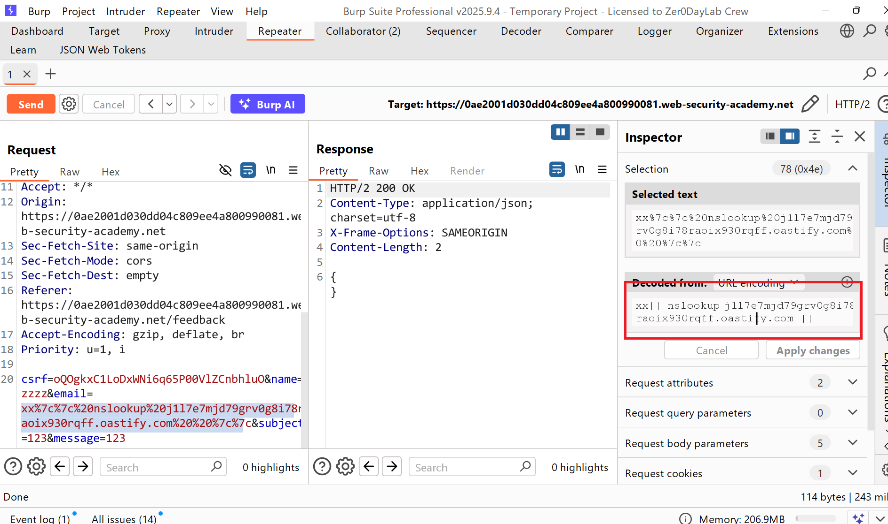
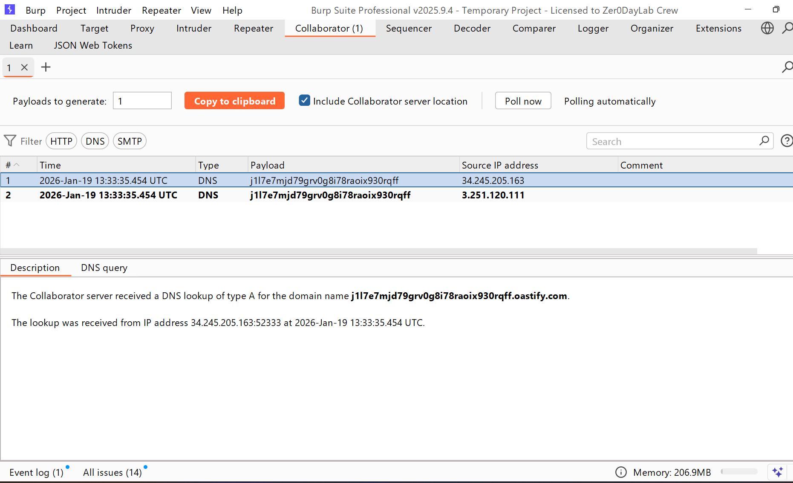
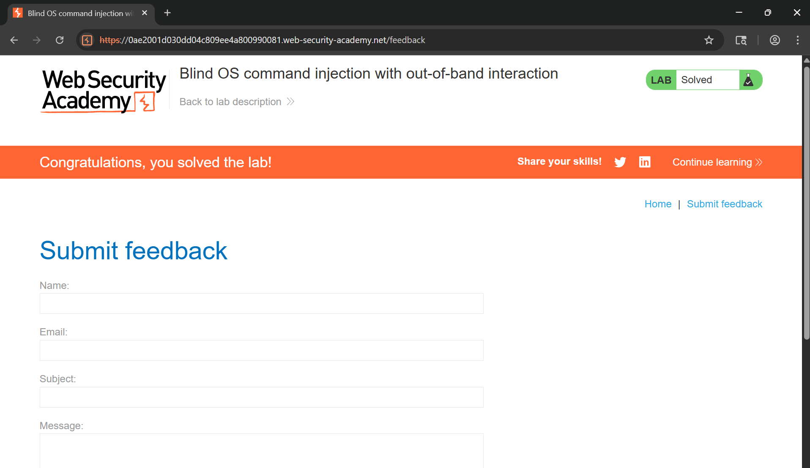

# Writeup Lab: Blind OS command injection with out-of-band interaction

## Goal
Mục tiêu của LAB này bằng cách chèn lệnh hệ điều hành kích hoạt tương tác ngoài băng tần  để tra cứu DNS tới Burp Collaborator.
## Khai thác
Đầu tiên vào trang chủ submit một feedback với form lên server

Lịch sử HTTP Burp Suite cho thấy response trả về rỗng

Bằng cách theo như mục tiêu để hoàn thành LAB chúng ta cần chèn lệnh hệ điều hành để nó kích hoạt DNS tới Burp Collaborator tôi sẽ sử dụng `nslookup` lệnh để thực hiện tra cứu DNS cho tên miền được chỉ định
## POC Khai thác

Kết quả Burp Collaborator cho thấy được nhận một HTTP được DNS từ phía attacker

Thực thi thành công và Solve LAB
