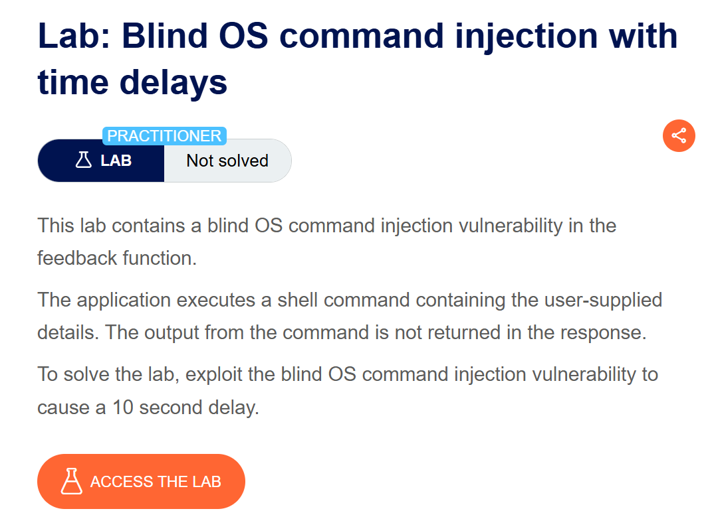
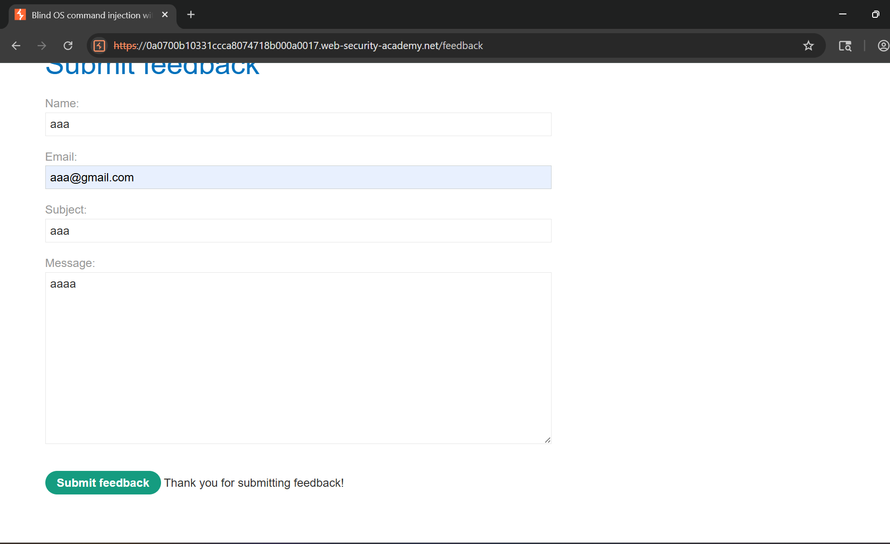
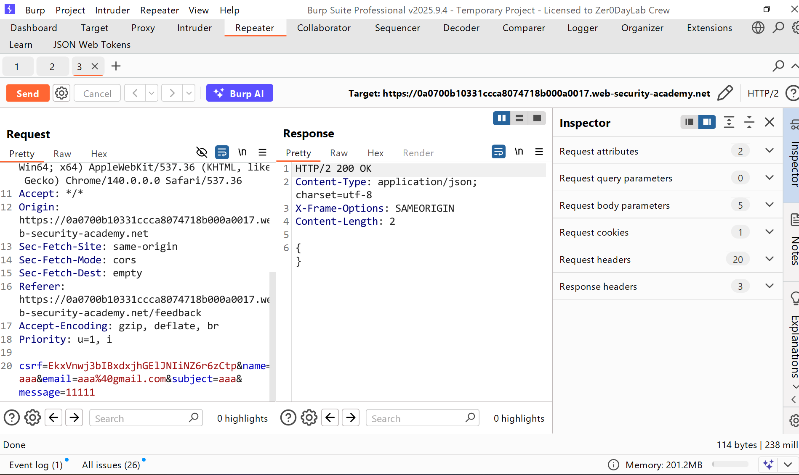
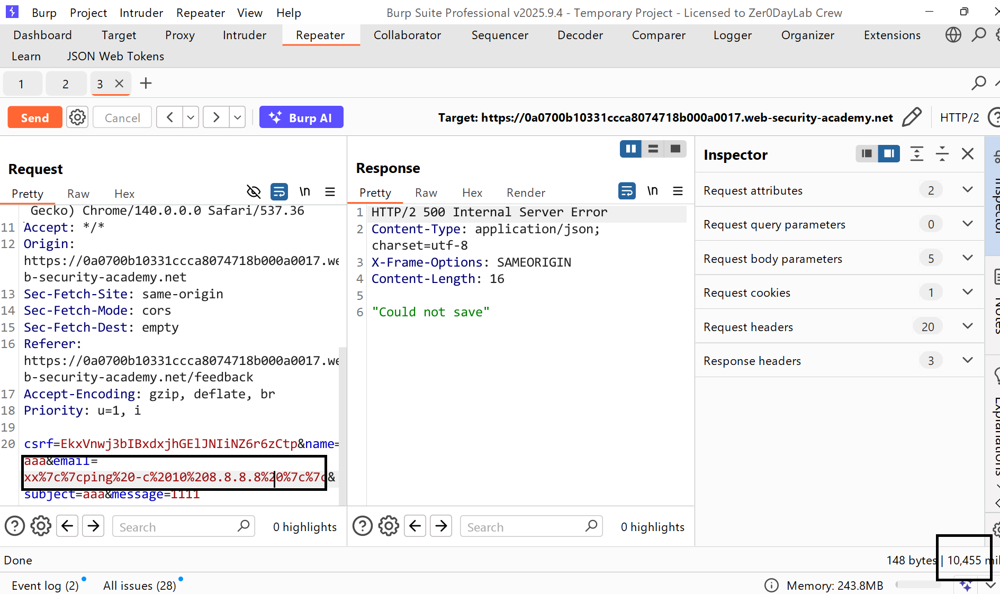
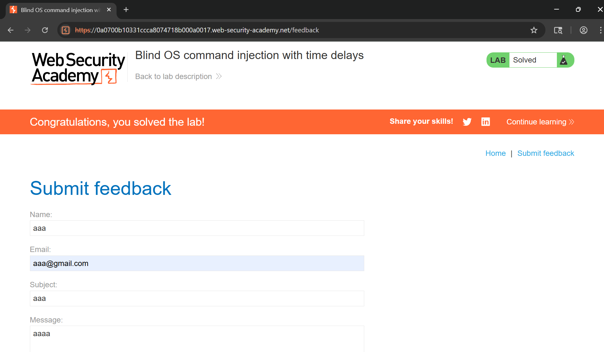

# Writeup Lab: Blind OS command injection with time delays

## Goal
Mục tiêu để hoàn thành LAB này chỉ cần thực thi tấn công chèn lệnh hệ điều hành khiến cho hệ điều hành ẩn gây ra độ trễ 10 giây
## Khai thác
Vào trang chủ chúng ta có thể đi tới form Submit feedback của LAB và tiến hành nhập các thông tin bất kì và tiến hành submit như sau:

Lịch sử HTTP Burp Suite khi chúng ta post feed back và kết quả trả về với chuỗi rỗng 

Bằng cách này chúng ta có thể thử chèn shell hệ điều hành bình thường xem có gì khả nghi nhưng không và cũng như mô tả của lab bài LAB này bằng cách sử dụng tấn công chèn lệnh để gây ra độ trễ bằng cách sử dụng BLIND OS
Bằng cách đó chúng ta có thể sủ dụng lệnh `ping` kích hoạt độ trễ time, lệnh này là cách tốt nhất để thực hiện việc này, vì nó cho phép chỉ định số lượng gói ICMP cần gửi.
POC: `x||ping+-c+10+127.0.0.1||` khi đó lệnh đầu tiên sai nó sẽ thực thi lệnh thứ 2 của chúng ta bằng cách chèn vào email thực thi và hoàn thành LAB

