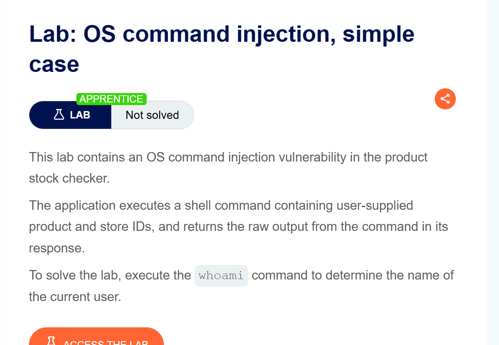
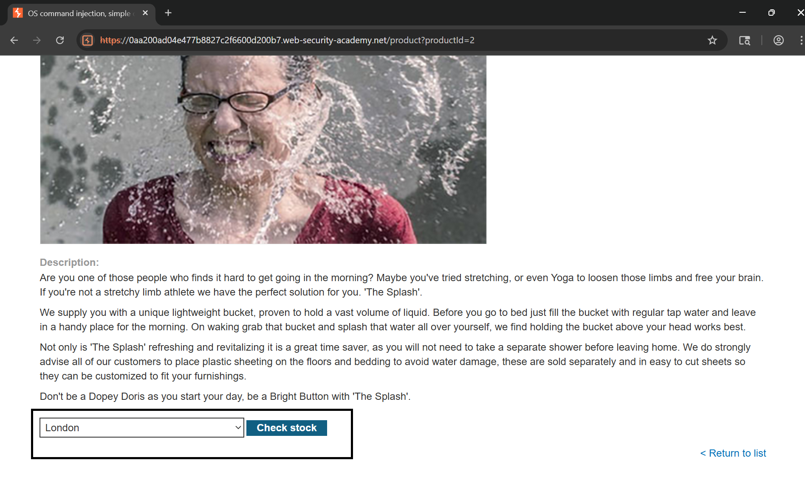
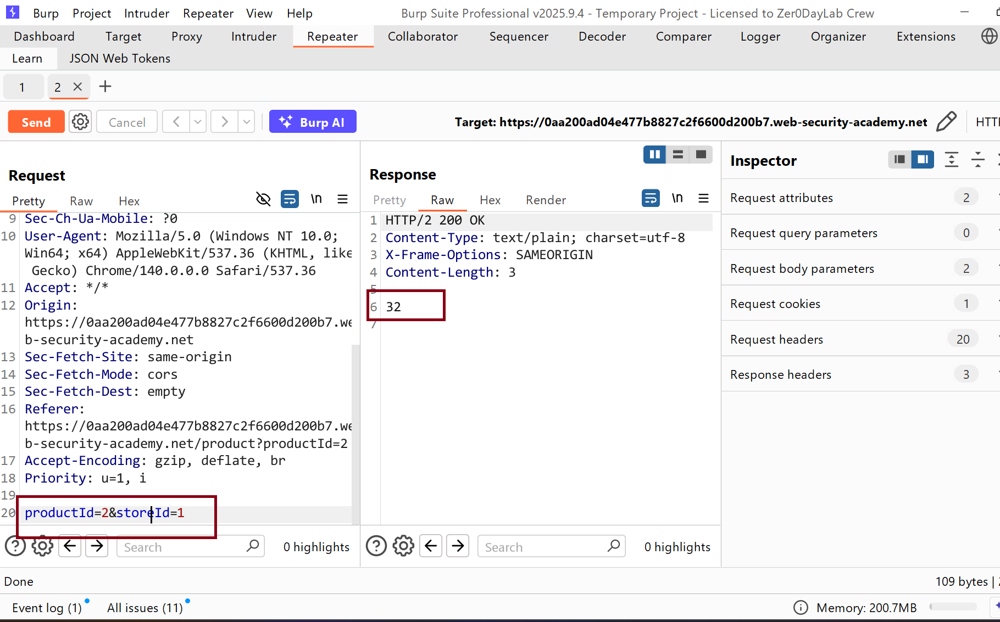
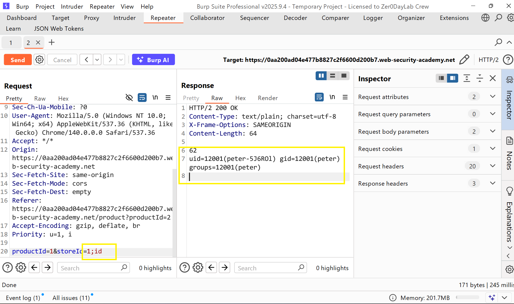
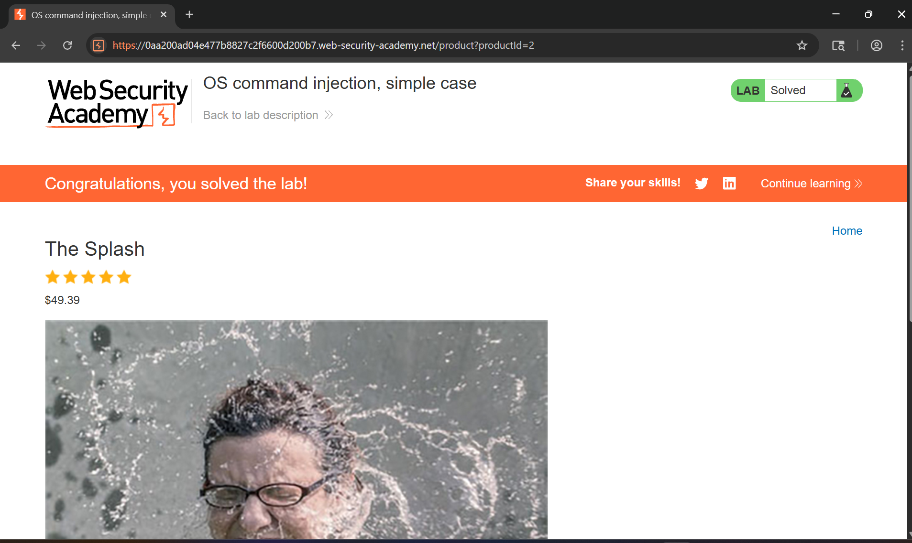

# Writeup Lab: OS command injection, simple case

## Goal
Mục tiêu để hoàn thành LAB này chỉ cần thực thi tấn công chèn lệnh hệ điều hành `whoami` để xác định tên người dùng hiện tại
## Khai thác
Đầu tiên vào trang chủ truy cập chi tiết bài viết và sử dụng `Check stock`

Kết quả khi post dữ liệu lên server trả về với số 32 như sau

Bằng cách này chúng ta có thể chèn lệnh hệ điều hành chạy nền xem kết quả xảy ra sao bằng cách chèn lệnh trực tiếp vào sau tham số của `storeId=1;id` lệnh này chèn shell `; để thực thi lệnh liên tiếp trong lệnh hệ điều hành` và kết quả xảy ra khi chèn lệnh 

Bằng cách đó chúng ta có thể thực thi với `whoami xác định người dùng hiện tại` và hoàn thành LAB
