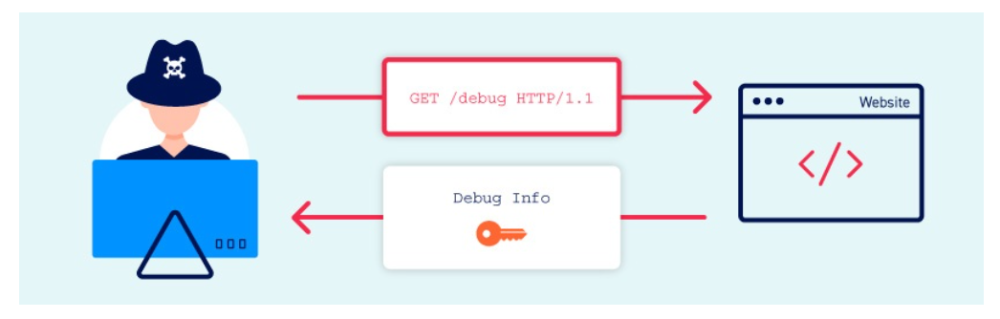
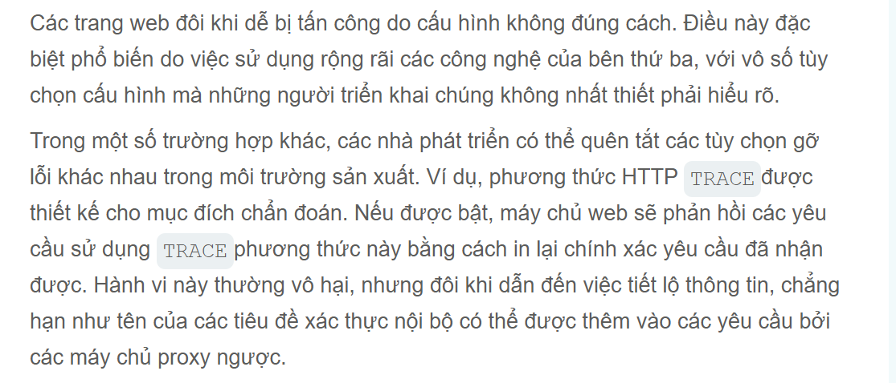

# Information disclosure vulnerabilities
Trong module này chúng ta có thể hiểu được các cách tiêt lộ thông tin và cách khai thác chúng

## Tiết lộ thông tin là gì?
Việc tiết lộ thông tin là quá trình rò rỉ dữ liệu, xảy ra khi một ứng dụng web vô tình để lộ thông tin nhạy cảm cho người dùng.
> Chẳng hạn như dữ liệu về những người dùng khác, chẳng hạn như tên người dùng hoặc thông tin tài chính <br>
> Dữ liệu thương mại hoặc kinh doanh nhạy cảm. <br>
> Thông tin kĩ thuật chi tiết về trang web và cơ sở hạ tầng của nó <br>
## Example về việc tiết lộ thông tin
Một số ví dụ tiết lộ thông tin:
> Tiết lộ các thư mục ẩn, cấu trúc và nội dung của chúng thông qua `robots.txt` danh sách tệp hoặc thư mục <br>
> Cung cấp quyền truy cập vào các tệp mã nguồn thông qua các bản sao lưu tạm thời <br>
> Nêu rõ tên bảng hoặc cột trong các thông báo lỗi <br>
> Tiết lộ thông tin nhạy cảm một cách không cần thiết, chẳng hạn như chi tiết thẻ tín dụng. <br>
> Mã hóa cứng các khóa API, địa chỉ IP, thông tin đăng nhập cơ sở dữ liệu, v..v, trong mã nguồn <br>
## Các lỗ hổng tiết lộ thông tin phát sinh sẽ như thế nào 
`Không loại bỏ nội dung nội bộ khỏi nội dung công khai`: Như các viết được leak thông tin các cmt 
`Cấu hình không an toàn của trang web và các công nghệ liên quan`
`Lỗi thiết kế và hoạt động của ứng dụng`: Nếu trang web trả về phản hồi khác nhau khi xảy ra các trạng thái lỗi khác nhau, điều này cũng có thể cho phép kẻ tấn công thu thập dữ liệu nhạy cảm.
## Cách kiểm tra tiết lộ thông tin
### Fuzzing
Xác nhận các tham số thú vị, có thể gửi các kiểu dữ liệu không mong đợi và các chuỗi lỗi được tạo riêng để xem hiệu quả của chúng.
Có thể tự động hóa bằng cách sử dụng Burp Intruder. Điều này mang lại một số lợi ích. Quan trọng nhất:
> Thêm vị trí tải trọng vào các tham số và sử dụng danh sách từ có sẵn của các chuỗi kiểm thử để kiểm tra một lượng lớn các đầu vào khác nhau một cách nhanh chóng. <br>
> Dễ dàng xác định sự khác biệt trong phản hồi bằng cách so sánh mã trạng thái HTTP, thời gian phản hồi, độ dài, v.v. <br>
> Sử dụng các quy tắc khớp của grep để nhanh chóng xác định sự xuất hiện của các từ khóa, chẳng hạn như error, invalid, SELECT, SQL, v.v. <br>
> Áp dụng các quy tắc trích xuất grep để trích xuất và so sánh nội dung của các mục thú vị trong phản hồi. <br>
## Các tập tin dành cho trình thu thập dữ liệu web
Nhiều trang web cung cấp các tập tin tại `/robots.txt` và `/sitemap.xml` để giúp trình thu thập thông tin điều hướng trang web của họ.
Vì các tệp này thường không được liên kết từ bên trọng trang web, chúng có thể không xuất hiện ngay lập tức trong sơ đồ trang web của Burp.
### Trong các thư mục
Bản thân các danh sách thư mục không nhất thiết là một lỗ hổng bảo mật. Tuy nhiên, nếu trang web cũng không thực hiện kiểm soát truy cập đúng cách, thì việc rò rỉ sự tồn tại và vị trí của các tài nguyên nhạy cảm theo cách này rõ ràng.
### Bình luận của nhà phát triển
Trong quá trình phát triển, đôi khi các chú thích HTML nội tuyến được thêm vòa mã đánh dấu.
### Thông báo lỗi
Một trong những nguyên nhân phổ biến nhất gây ra rò rỉ thông tin là các thông báo lỗi dài dòng.
### Gỡ lỗi dữ liệu
Các thông báo gỡ lỗi đôi khi có thể chứa thông tin quan trọng để phát triển một cuộc tấn công, bao gồm:
> Các giá trị cho các biến phiên quan trọng có thể được thao túng thông qua đầu vào của người dùng <br>
> Tên máy chủ và thông tin đăng nhập cho các thành phần phụ trợ <br>
> Tên tệp và thư mục trên máy chủ <br>
> Các khóa được sử dụng để mã hóa dữ liệu được truyền qua máy khách <br>
Thông tin gỡ lỗi đôi khi được ghi vào một tệp riêng biệt. Nếu kẻ tấn công có thể truy cập vào tệp này, nó có thể là tài liệu tham khảo hữu ích để hiểu trạng thái hoạt động của ứng dụng.
### Trang tài khoản của ứng dụng
Về trang người dùng hoặc trang tài khoản người dùng thường chứa thông tin nhạy cảm, chẳng hạn như email, API, ....
Vì người dùng thường chỉ có quyền truy cập vào trang tài khoản của riêng họ, nên điều này tự nó không phải là một lỗ hổng bảo mật. Tuy nhiên, một số trang web chứa các lỗi logic có khả năng cho phép kẻ tấn công lợi dụng các trang này để xem dữ liệu của người dùng khác.
Hãy xem xét một trang web xác định trang tài khoản của người dùng nào sẽ được tải dựa trên một `user` tham số
```http
GET /user/personal-info?user=carlos
```
Bằng cách này kẻ tấn công có thể thay đổi user thành user khác chẳng hạn như quản trị viên có thể hiểu như là bug IDOR
### Việc tiết lộ mã nguồn thông qua các tập tin sao lưu.
Đôi khi một số trang web tự lộ mã nguồn của nó. Khi lập sơ đồ trang web có thể thấy một số tệp mã nguồn được tham chiếu rõ ràng.
Khi máy chủ xử lý các tệp có phần mở rộng cụ thể, chẳng hạn như `.php`.php. Nó thường thực thi mã, thay vì chỉ gửi nó cho máy khách dưới dạng plain/text để trả về nội dung tệp.
Các trình soạn thảo văn bản thường tạo các tệp sao lưu tạm thời trong khi tệp gốc đang được chỉnh sửa. Các tệp tạm thời này thường được chỉ định bằng một số cách, chẳng hạn như thêm dấu `~ ~` vào tên tệp hoặc thêm phần mở rộng khác.
Yêu cầu một tệp mã bằng cách sử dụng phần mở rộng tệp sao lưu đôi khi có thể cho phép bạn đọc nội dung của tệp trong phản hồi.
### Thông tin bị lộ do cấu hình không an toàn

### Lịch sử kiểm soát phiên bản
Hầu hết các trang web đều được phát triển bằng một số hệ thống kiểm soát phiên bản, chẳng hạn như Git. Theo mặc định, một dự án Git lưu trữ tất cả dữ liệu kiểm soát phiên bản của nó trong một thư mục có tên là `.gitignore` `.git`
Mặc dù việc tự mình duyệt qua cấu trúc và nội dung tệp tin thô thường không thực tế, nhưng có nhiều phương pháp để tải xuống toàn bộ .git thư mục.