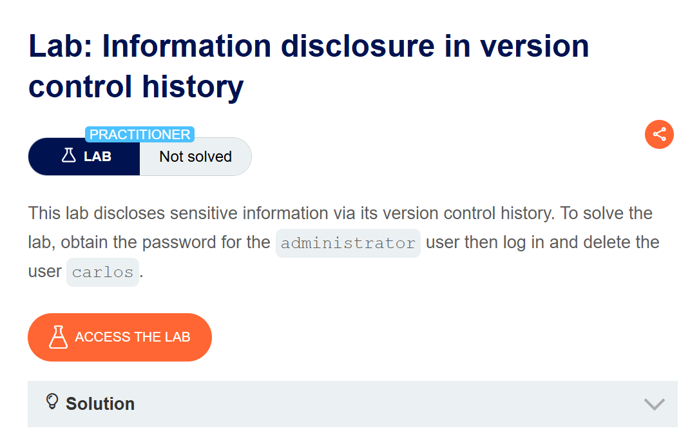
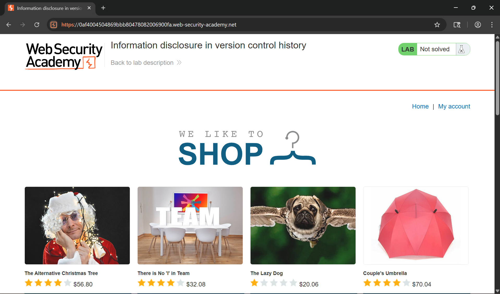
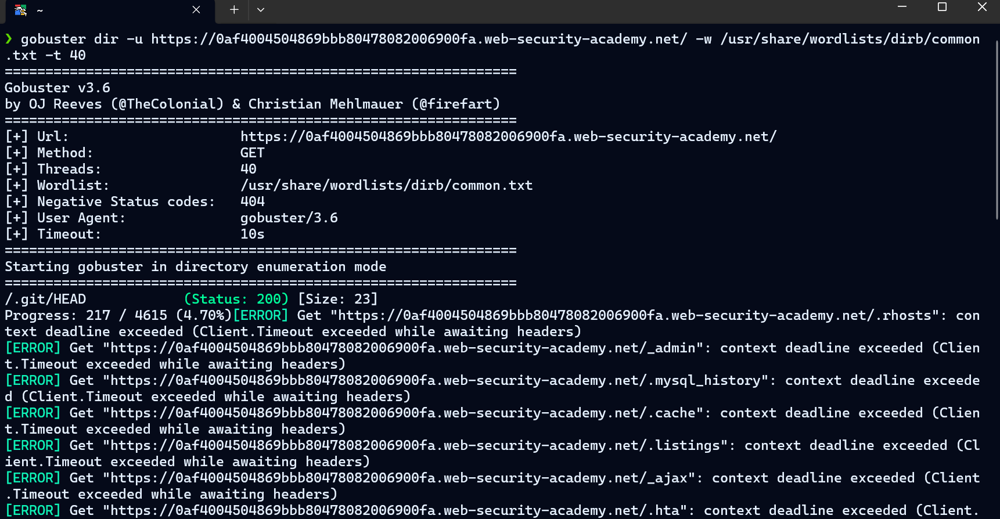
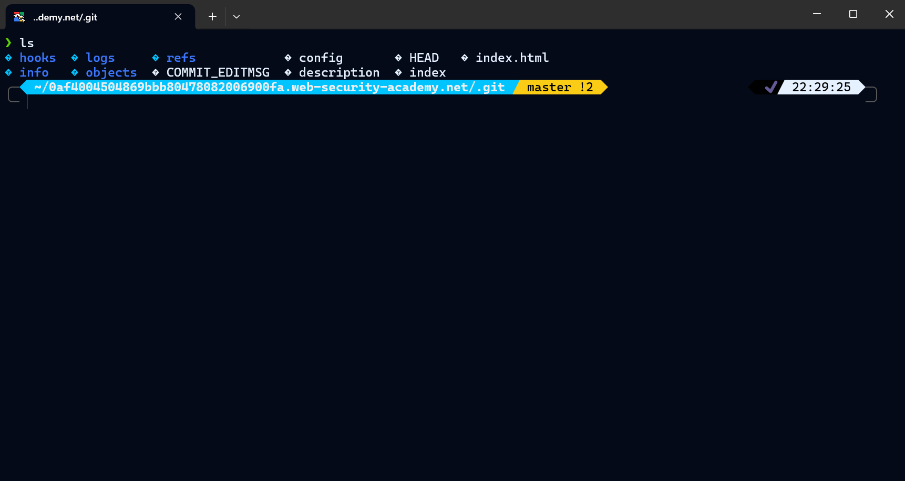
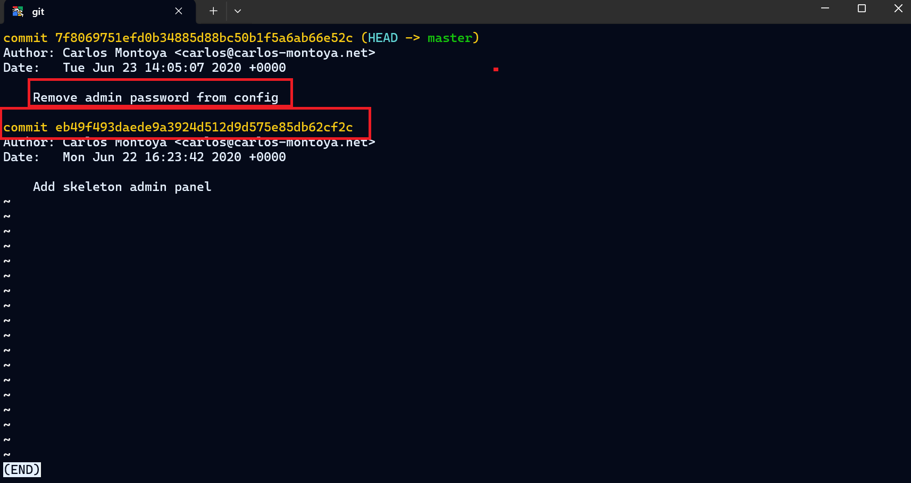
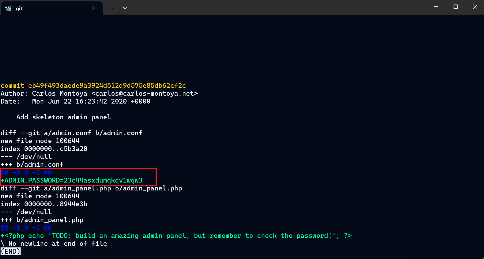
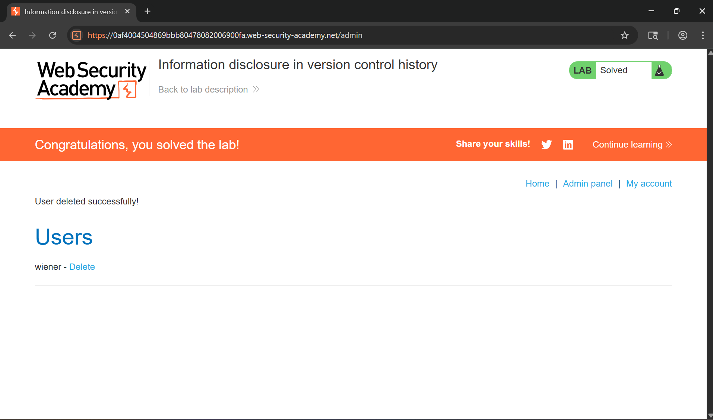

# WRiteup LAB Information disclosure in version control history

## Goal
Mục tiêu LAB này rò rỉ thông tin truy cập vào tài khoản quản trị để xóa tìa khoản người dùng carlos
## Khai thác
Trang chủ

Bây giờ chúng ta có thể liệt kê thư mục ẩn với `gobuster`
```txt
gobuster dir -u https://0af4004504869bbb80478082006900fa.web-security-academy.net/ -w /usr/share/wordlists/dirb/common.txt -t 40
```
Ở đây chúng ta thấy một tệp git kho lưu trữ của github

Chúng ta cùng tải xuống tệp `.git` này
```txt
wget -r https://0af4004504869bbb80478082006900fa.web-security-academy.net/.git
```

Giờ đây chúng ta có thể sử dụng `git` để kiểm tra nhật ký của tệp và chúng ta có thể thấy `Remove admin password from config` có vẻ thú vị

Bây giờ chúng ta có thể in commit của nó ra bằng cách sử dụng lệnh `git show` và chúng ta có thể được pass của quản trị

Bây giờ tiến hành đăng nhập `administrator:23c44asxdumqkqv1wqw3` và xóa tài khoản carlos

