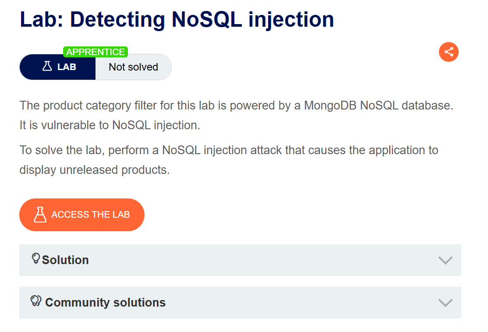
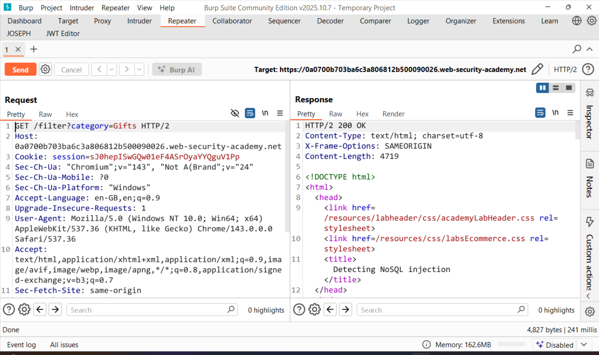
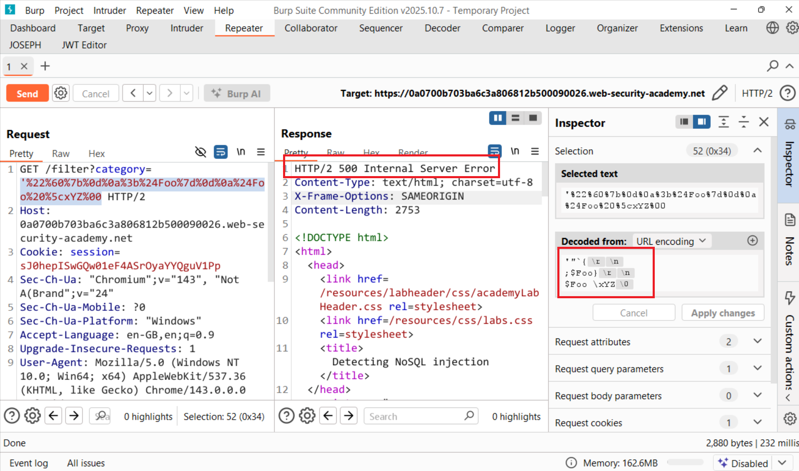
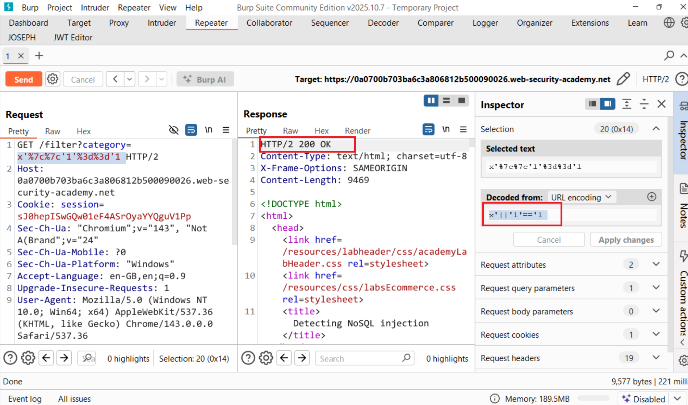
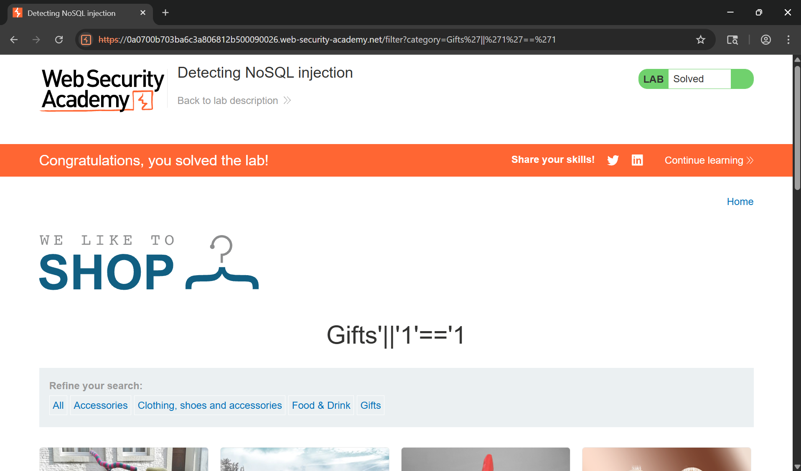

# Writeup Detecting NoSQL injection

## Goal
To solve the lab, perform a NoSQL injection attack that causes the application to display unreleased products.
## Khai thác
Trang chủ ứng dụng chúng ta có thể chọn mặt hàng tùy ý và xem lịch sử HTTP Burpsuite

Với ở chức năng category này chúng ta thử chèn các payload nhiễu vào tham số xem liệu có thể tấn công NoSQL không xem phản hồi của ứng dụng như thế nào và như chúng ta có thể thấy response xảy ra lỗi trả về 500 

Vậy chứng tỏ đã phá vỡ cú pháp trên server như mục tiêu đề bài đã nói cần trích xuất các sản phẩm chưa được phát hành vậy sẽ ra sao nếu chúng ta chèn toán tử boolean vào tham số liệu server trả về gì. `x'||'1'=='1 ` lúc này server trở về bình thường và kết quả trả về được các mặt hàng chưa được phát hành

