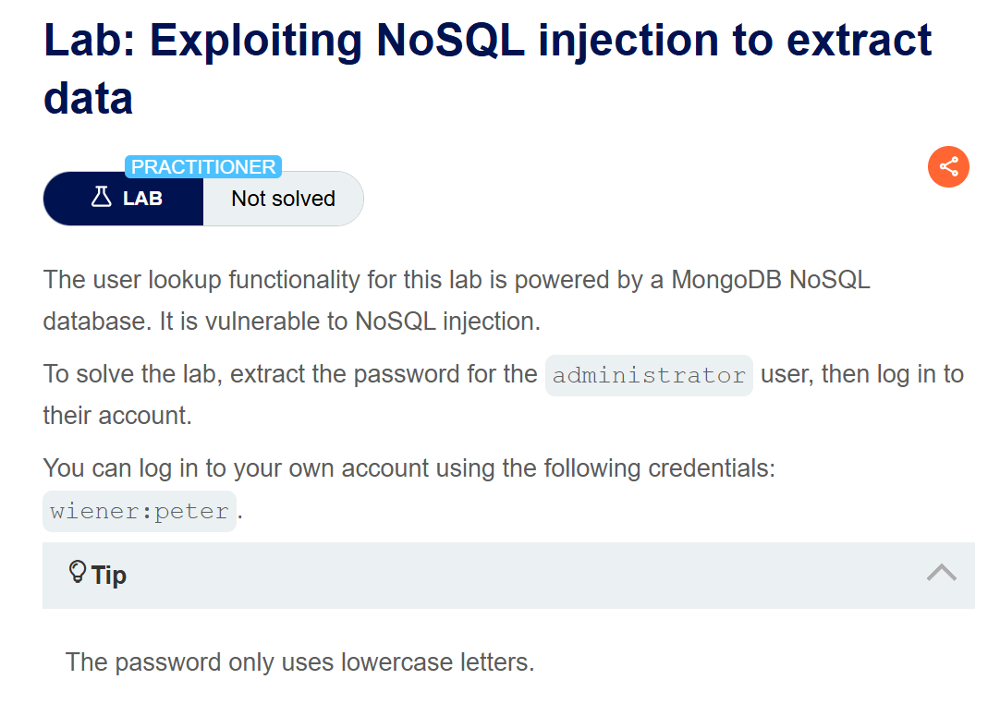
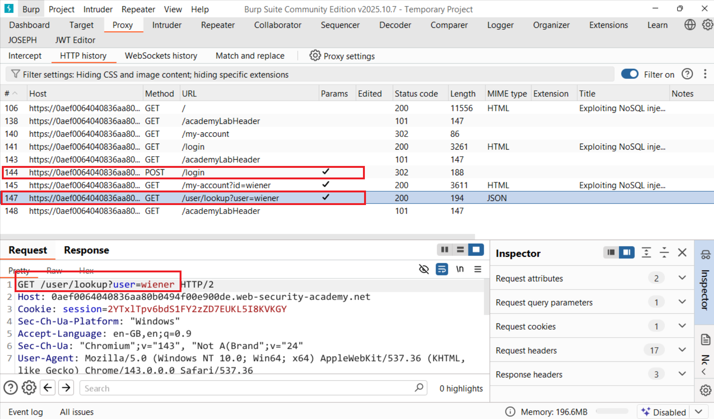
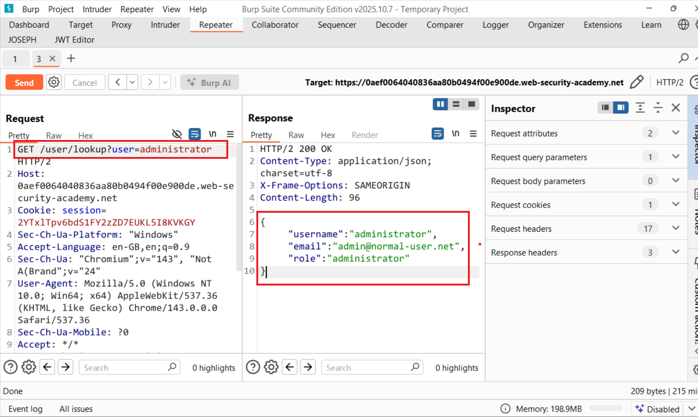
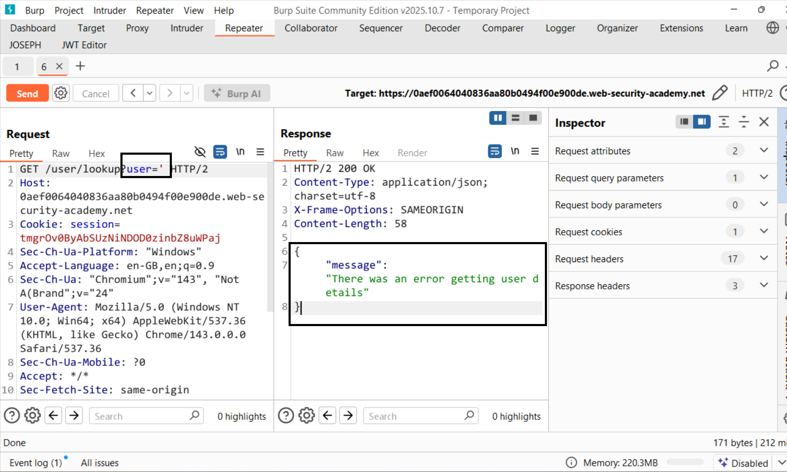
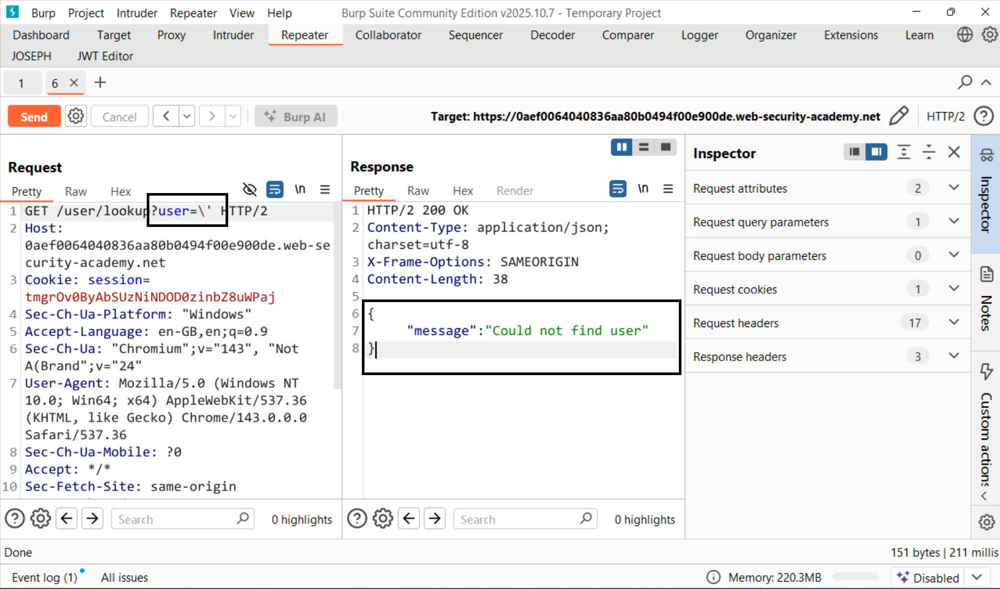
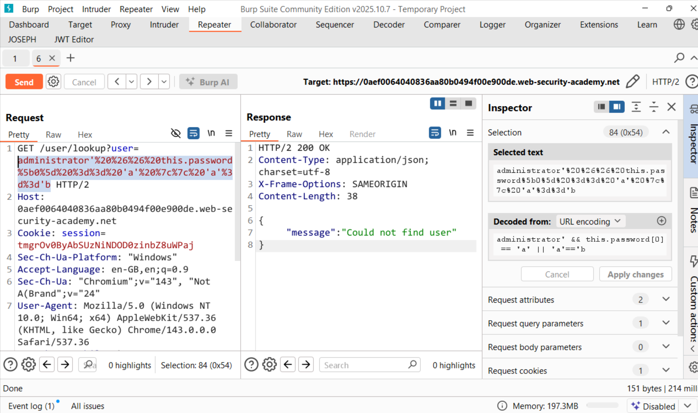
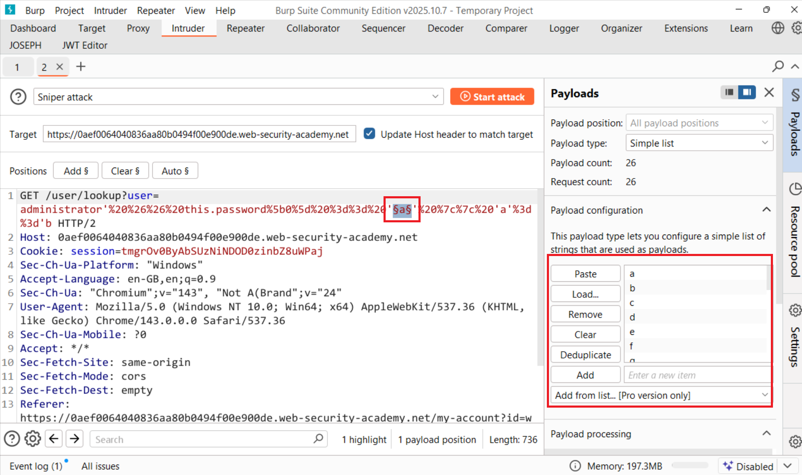
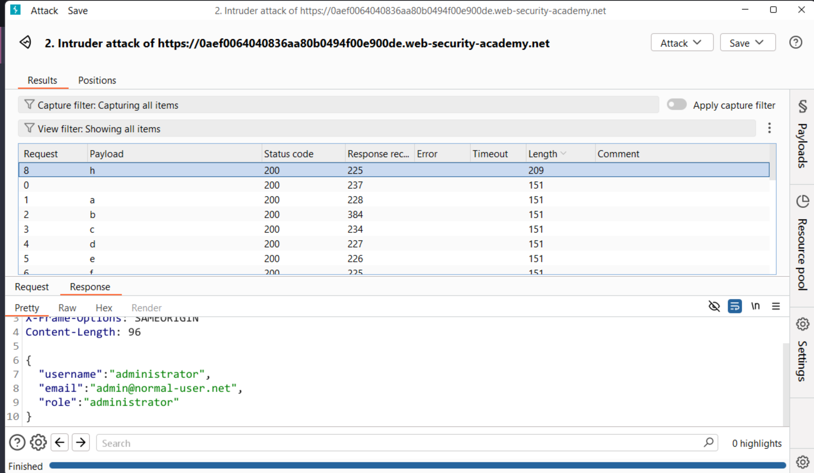
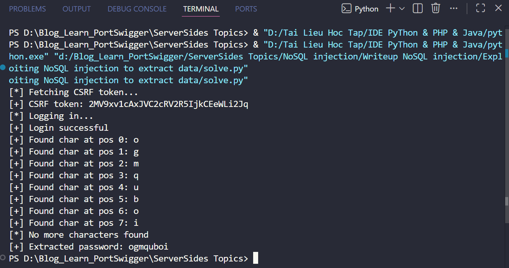
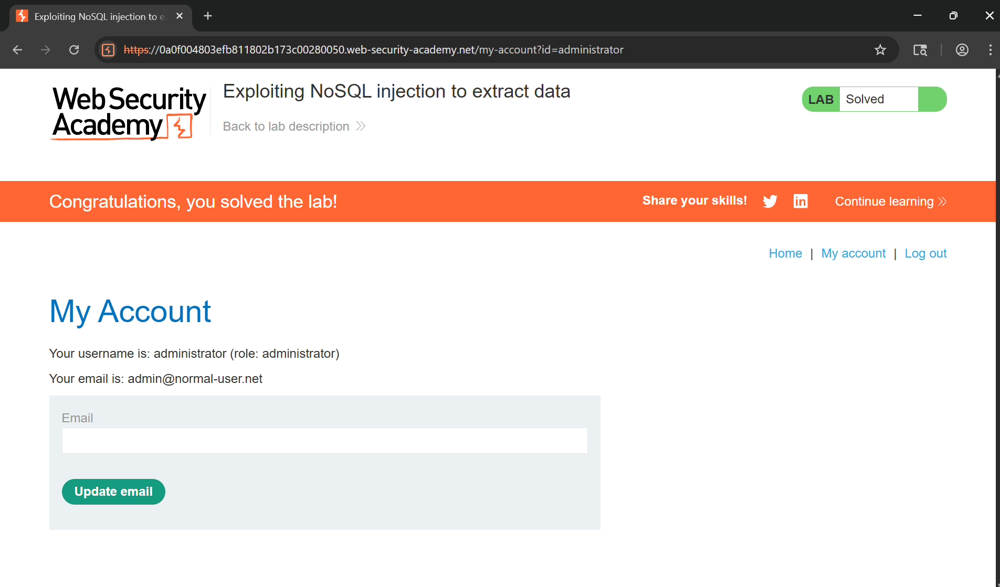

# Writeup LAB: Exploiting NoSQL injection to extract data

## Goal
To solve the lab, extract the password for the administrator user, then log in to their account.
## Khai thác
Sau khi chúng ta đăng nhập với tài khoản `wiener:peter` chúng ta có thể thấy có tuyền đường `/user/lookup?user=wiener` để truy vấn user 

Ở bài lab này mục tiêu chúng ta là trích xuất password của admin và ở tuyền đường `/user/lookup?user=wiener` giả sử chúng ta truy vấn với user = administrator xem có user hay không và chúng ta có thể thấy có user này

Ở đây chúng ta có thể thử truyền vào một toán từ dấu `'` xem ứng dụng có xảy ra lỗi để có thể thực hiện tấn công NoSQL không.

Vậy thử thoát dấu nháy kép hết lỗi nhưng báo sẽ không tìm thấy user vậy chúng ta có thể tấn công NoSQL

Và chúng ta có thể thử xác định xem cơ sở dữ liệu MOngoDB có chứa trường username không chúng ta có thể thử:
```txt
administrator' && this.username!='
```
Response trả về :
```json
{
  "username": "administrator",
  "email": "admin@normal-user.net",
  "role": "administrator"
}
```
Với những thông tin này chúng ta có thể truyền payload để trích xuất từng kí tự password của admin đúng không và với payload này chúng ta có thể trích xuất kí tự đầu tiên của password admin có phải bằng a không
```txt
administrator' && this.password[0] == 'a' || 'a'=='b
```
Và chúng ta có thể thấy server trả về thông báo `Could not find user`

Với cách này tôi sẽ sử dụng intruder để kiểm tra kí tự đầu tiên là kí tự `a-z` vì đề bài có hint chỉ những chữ cái thường. Chúng ta cùng bôi đen kí tự `a`

Kết quả chạy chúng ta có thể 1 response trả về độ dài khác các payload còn lại và nó trả về thông tin user `administrator`

Rồi bây giờ tôi sẽ viết một payload để tự động trích xuất password của admin và thu được password

Tiến hành đăng nhập vào tài khoản quản trị 
