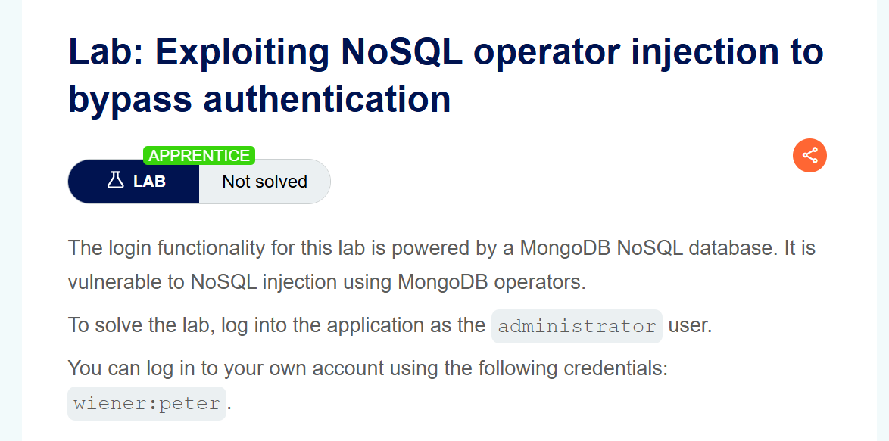
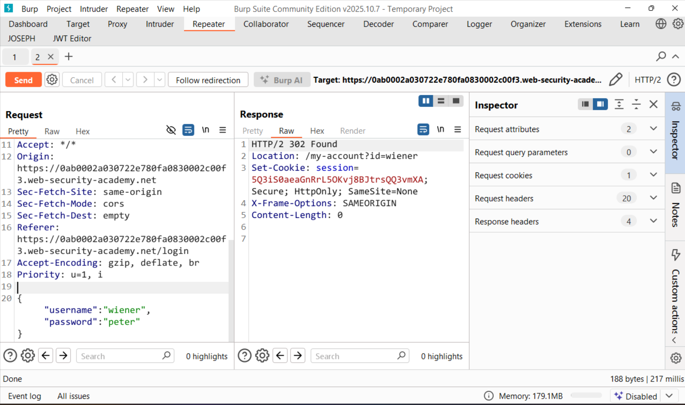
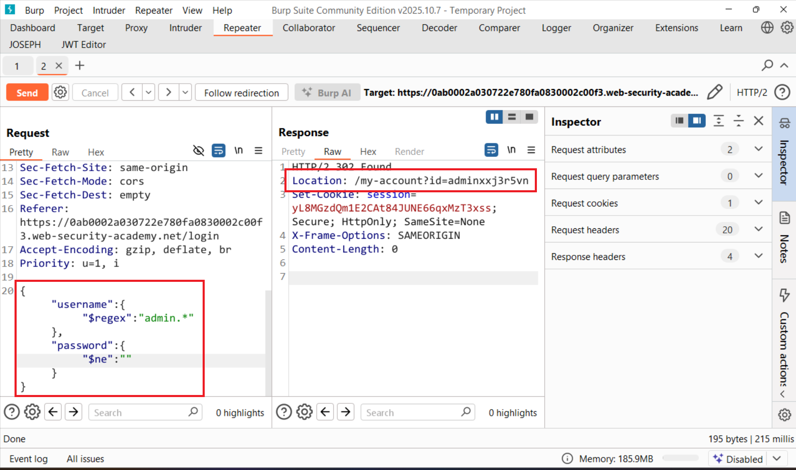
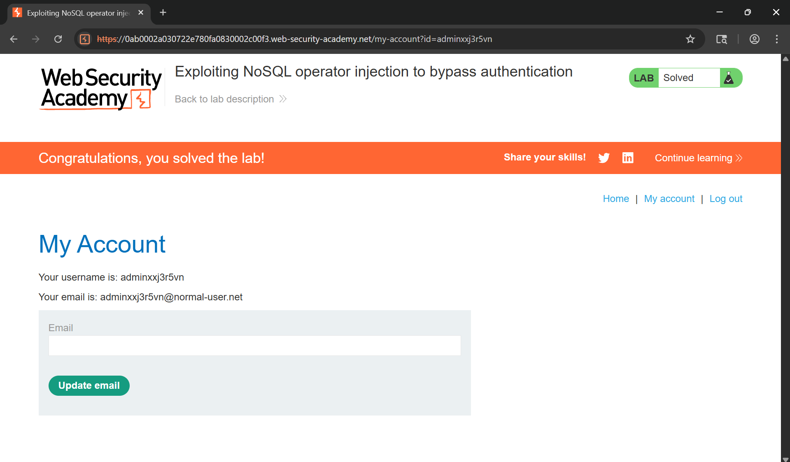

# Writeup LAB Exploiting NoSQL operator injection to bypass authentication

## Goal
To solve the lab, log into the application as the administrator user.
## Khai thác
Chúng ta tiến hành đăng nhập vào tài khoản `wiener:peter` và ở đây form login nhận dạng đối tượng JSON

Ở mục tiêu bài này chúng ta cần đăng nhập được vào tài khoản quản trị bằng cách đó chúng ta có thể khai thác bằng toán tử `$ne` xem điều gì sẽ xảy ra và khi tôi truyền
```json
{"username":{"$ne":"invalid"},"password":"peter"}
```
Kết quả response nó trả về `Location: /my-account?id=wiener` chứng tỏ toán tử được xử lý nó lấy tất cả username không bằng invalid và password peter để đăng nhập đúng không. Và ngược lại ở password cũng vậy . 
Và sẽ ra sao nếu ta truyền username với toán từ `$regex` toán nử này nó xác định các giá trị username có khớp với biểu thức không và toán tử `$ne` vào password
```json
{"username":{"$regex":"admin.*"},"password":{"$ne":""}}
```
Lúc này kết quả sẽ trả về username khớp với biểu thức chính quy và trả về giá trị khác rỗng và lúc này đã vào được admin



